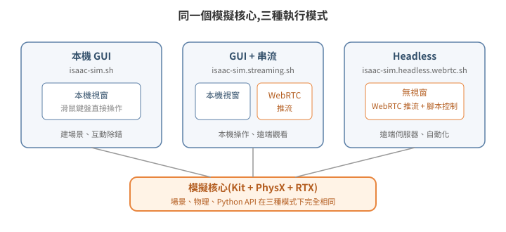

# 安裝與執行模式:GUI、Headless、Streaming

Isaac Sim 常被當成「一個要開視窗操作的 3D 軟體」,這個印象只對了三分之一。它的本體是 Omniverse Kit 應用程式——Kit 是 NVIDIA 的應用框架(一套引擎加上 extension 系統),Isaac Sim 是搭建在它上面的其中一個應用;視窗(GUI)只是其中一種前端;同一套模擬核心可以完全不開視窗跑在遠端伺服器上,畫面經串流送出、指令經腳本送入。要走到「純 Python 遠端操作」,第一步是弄清楚它有哪幾種執行模式、各自解決什麼問題。

<p align="center"></p>

## 1. 三種執行模式

Isaac Sim 安裝目錄內附三支啟動腳本,對應三種模式:

| 模式 | 啟動腳本 | 畫面 | 適用情境 |
|---|---|---|---|
| 本機 GUI | `isaac-sim.sh` | 本機視窗 | 接螢幕直接操作、建場景 |
| GUI + 串流 | `isaac-sim.streaming.sh` | 本機視窗 + WebRTC 推流 | 本機操作、遠端同步觀看 |
| Headless | `isaac-sim.headless.webrtc.sh` | 無視窗,只有 WebRTC 推流 | 遠端伺服器、自動化、省顯示資源 |

啟動腳本名稱隨版本與安裝方式而異——上表以 workstation 安裝包為準;官方容器內對應的 headless 腳本是 `./runheadless.sh`(見官方 Container Installation 文件)。實際檔名以安裝目錄下 `ls` 出來的為準,不要照抄文件。

三種模式跑的是同一個模擬核心,差別只在「要不要建本機視窗」與「要不要開串流伺服器」。因此同一份場景、同一套 Python 腳本,在三種模式下行為一致——這是「開發時用 GUI、部署時換 headless」得以成立的原因。

常用的共通啟動參數(`--/` 開頭是 Kit 的設定覆寫語法,把任意設定值從命令列帶入):

```bash
--/persistent/isaac/asset_root/default=<資產根目錄 URL>   # 官方雲端資產的來源
--/isaac/startup/ros_bridge_extension=isaacsim.ros2.bridge  # 啟動時載入 ROS2 橋接
--/isaac/startup/ros_sim_control_extension=True             # 啟用模擬狀態控制服務
```

## 2. 兩種安裝方式:workstation 安裝包 vs 官方容器

| 方式 | 取得 | 適合 |
|---|---|---|
| Workstation 安裝包 | NVIDIA 官網下載(約 17–25 GB) | 有實體 GPU 工作站、要用 GUI 建場景 |
| NGC 容器 | `nvcr.io/nvidia/isaac-sim:<版本>` | 雲端 GPU 機、headless 部署、環境可重建 |

容器方式的啟動範例(headless streaming):

```bash
docker run --name isaac-sim -d --runtime=nvidia --gpus all \
  --network host --ipc host \
  -e ACCEPT_EULA=Y -e NVIDIA_DRIVER_CAPABILITIES=all \
  -v /path/to/assets:/assets:ro \
  -v isaac-kit-cache:/isaac-sim/kit/cache \
  nvcr.io/nvidia/isaac-sim:6.0.1 \
  ./isaac-sim.streaming.sh --no-window \
  --exec /open_scene.py
```

兩個實務重點:

- **Shader cache 要放進 named volume**。首次啟動要冷編譯 shader(數分鐘),cache 掛 volume 之後暖啟動可以縮短到約一半。上面的範例只掛了最關鍵的 kit cache;官方文件另建議把 `ov`、`glcache`、`computecache`、pip cache 等多個目錄都各自掛成 volume,細節見官方 Container Installation 頁。
- **容器內以非 root 使用者執行**(官方 image 用固定 uid)。掛進去的資產目錄若沒有 world 可讀權限,會出現 `Permission denied` → `open_stage` 回傳 `False`。host 端先 `chmod -R a+rX <資產目錄>`。

## 3. 版本與 GPU 驅動的相依性(選版本前先看)

Isaac Sim 的 RTX 渲染層(OptiX,NVIDIA 的 RTX 光線追蹤引擎,外掛)是針對特定範圍的驅動 ABI 編譯的。**至少在下列實測組合中,版本與驅動不匹配的結果不是效能下降,而是直接 segfault**:

- Isaac Sim 5.1 + 較舊驅動(555 世代):穩定。
- Isaac Sim 5.1 + 新驅動(595 世代 / CUDA 13):場景 DB 外掛啟動時 segfault,約 65 秒必掛。
- Isaac Sim 6.0.1 + 新驅動 595:正常。

因此選版本的順序應該是:**先確認機器的驅動版本(尤其雲端 GPU instance 的 AMI 往往預裝最新驅動),再選相容的 Isaac Sim 版本**。降驅動(DKMS 重編 kernel module)風險高於換 Isaac Sim 版本(只是換 container tag),遇到不相容優先升 Isaac Sim。

**版本適用範圍**:本系列教學的 Python API 以 Isaac Sim 4.5–5.1.x 為準;6.0 起 `isaacsim.core.api` / `isaacsim.core.prims` / `isaacsim.core.utils` 整組移至 `isaacsim.core.experimental.*`(breaking change)。遇到 import 失敗,先確認手上的版本落在哪一側,再照對應 API 改。

另外兩個硬體層設定:

- **資料中心卡(L40S、A100 等)預設開 ECC(Error-Correcting Code,記憶體糾錯),是 RTX 渲染間歇 crash 的實戰觀察到的因子**。`sudo nvidia-smi -e 0` 關閉後重開機。
- **CPU / RAM 不能省**:首次 shader 編譯會吃滿所有核心,8 vCPU 的機器可能連 SSH 都餓死。實戰結論是 Isaac Sim 主機至少 16 vCPU / 64 GB RAM(以百 MB 級倉儲場景實測;需求隨場景複雜度上升)。

## 4. Python 環境隔離:為什麼啟動前要 unset

Isaac Sim 自帶一份 Python 直譯器(例如 5.1 帶 3.11),而系統上的 ROS 2(例如 Humble)用另一個版本(3.10)。Python 的 C 擴充模組(`.so`)ABI 綁定直譯器版本——py3.10 編譯的 `rclpy` 被 py3.11 載入,輕則 `ImportError`,重則行為不可預期。

問題出在環境變數:`source` 過 ROS 2 workspace 的 shell,`PYTHONPATH`、`AMENT_PREFIX_PATH`、`COLCON_PREFIX_PATH` 都指向 py3.10 的套件路徑,直接在這個 shell 啟動 Isaac Sim 就會把兩個世界混在一起。所以啟動腳本的標準前置動作是:

```bash
unset PYTHONPATH
unset AMENT_PREFIX_PATH
unset COLCON_PREFIX_PATH
```

同理,Isaac Sim 的 ROS 2 橋接 extension 內附一份針對 Humble 編譯的橋接函式庫,需要把它加進動態連結路徑:

```bash
export LD_LIBRARY_PATH="${LD_LIBRARY_PATH}:<isaac-sim>/exts/isaacsim.ros2.bridge/humble/lib"
```

原則:**Isaac Sim 進程用它自帶的 Python 與函式庫;ROS 2 節點跑在自己的環境;兩邊靠 topic / 網路協定溝通,不共享直譯器**。這條原則在 [05-ros2-bridge](../05-ros2-bridge/README.md) 會再次出現——違反它的每一種嘗試,實戰上都失敗了。

## 5. 延伸閱讀

- 官方文件:Isaac Sim Installation(Workstation / Container)、Livestream Clients
- 下一篇:[02 不碰 UI:用 Python 操作 Isaac Sim](../02-python-no-ui/README.md)
- 想直接動手:[07 最小可跑範例](../07-minimal-example/README.md)
