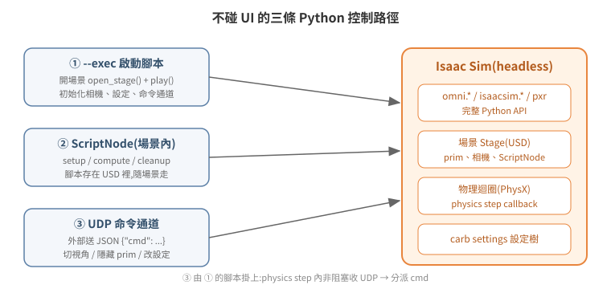

# 不碰 UI:用 Python 操作 Isaac Sim

GUI 操作(點選單、拖 prim、按 Play)本質上都是在呼叫同一套 Python API——Isaac Sim 的 UI 只是這些 API 的圖形前端。所以「不碰 UI」不是繞路,而是直接走正門:任何能在 GUI 做到的事,原則上都有對應的程式做法,而且可以在 headless 模式下執行、可以自動化、可以遠端觸發。

本篇整理三種由淺入深的做法:啟動時掛腳本(`--exec`)、場景內掛腳本(ScriptNode)、執行期遠端命令通道(UDP)。

<p align="center"></p>

## 1. `--exec`:啟動時執行腳本

Isaac Sim 啟動參數 `--exec /path/to/script.py` 會在 Kit 應用啟動後執行該腳本,腳本內可以使用完整的 `omni.*` / `isaacsim.*` / `pxr` API。最小可用的「開場景 + 開始模擬」:

```python
# open_scene.py — 由 isaac-sim.streaming.sh --exec /open_scene.py 執行
from isaacsim.core.utils.stage import open_stage
import omni.timeline

ok = open_stage("/assets/my_scene.usd")   # 回傳 bool,失敗常見原因:路徑錯、權限不足
print(f"[LAUNCH-OPEN] open_stage -> {ok}")

omni.timeline.get_timeline_interface().play()   # 等同 GUI 按下 Play
```

兩個關鍵事實:

- **開場景是動作,不是啟動的副作用**。Isaac Sim 啟動後是空 stage,不會自動載入任何場景;GUI 流程裡「開啟最近的檔案」這一步,headless 下就是 `open_stage()`。
- **模擬不會自己開始**。載入場景後 timeline 停在 STOPPED,物理不 tick、TF 不發布。`timeline.play()`(或 ROS2 的 `/set_simulation_state` 服務,見 [05-ros2-bridge](../05-ros2-bridge/README.md))是讓世界動起來的必要步驟。忘記這步是「headless 下什麼都不動」的第一大根因。

### 相機也能用程式控制

WebRTC 串流擷取的是 active viewport,而 viewport 相機是 stage 上的一個 prim——所以 headless 下切視角不需要 GUI:

```python
from isaacsim.core.utils.viewports import set_camera_view
# Z-up 場景:eye 的 Z 越大越高;eye 與 target 的差向量 = 視線方向
set_camera_view(eye=[16.0, -16.0, 16.0], target=[-1.0, 1.0, 0.0])
```

實戰踩過的兩個坑:

1. **啟動初期 viewport 可能尚未 ready**,設了會被之後的預設相機蓋掉。做法是啟動後一段時間內週期性重設(例如每 ~5 秒一次、持續 80 秒),之後就穩定。
2. **視線不要正好平行 up 向量**(eye 與 target 只差 Z),此時 yaw 無定義會退化(gimbal lock)。要俯視就給 eye 一點水平偏移。

### 隱藏 UI 與任意設定:carb settings

Kit 的所有執行期設定都掛在 carb settings 樹上,GUI 快捷鍵只是改設定值的入口。例如 F11 全螢幕的實體是:

```python
import carb.settings
carb.settings.get_settings().set("/app/window/hideUi", True)   # 串流畫面只剩 viewport
```

同一個值也可以啟動參數直接帶:`--/app/window/hideUi=true`。注意:**執行期改的設定與 prim 可見性都不持久**,重啟後歸零——要固化就寫進 `--exec` 腳本的初始化裡。

## 2. ScriptNode:掛在場景內的腳本

`--exec` 腳本屬於「這次啟動」;ScriptNode(OmniGraph 的 Script Node)則是**存在場景 USD 裡**的腳本,場景在哪台機器開啟都會跟著執行。它有三個生命週期回呼:`setup()`(初始化)、`compute()`(每個 graph tick)、`cleanup()`(關閉)。

典型應用:讓外部程式直接控制場景內物件的位姿。以下節錄自實際使用過的範例(完整檔:[`examples/scriptnode_udp_pose.py`](../../examples/scriptnode_udp_pose.py)):

```python
# setup():開一個非阻塞 UDP socket
sock = socket.socket(socket.AF_INET, socket.SOCK_DGRAM)
sock.setblocking(False)
sock.bind(("127.0.0.1", 15001))

# compute():每 tick 讀完 UDP buffer,只套用最後一筆
while True:
    try:
        data, addr = sock.recvfrom(65535)
    except BlockingIOError:
        break
    new_pose = parse_packet(data)   # {"x":..,"y":..,"yaw":..}

# 用 USD Xform API 直接改 prim 的 translate / orient
xform = UsdGeom.Xformable(stage.GetPrimAtPath("/World/MyRobot"))
translate_op.Set(Gf.Vec3d(x, y, z))
orient_op.Set(quat_from_rpy(roll, pitch, yaw))
```

設計上有兩個值得學的細節:

- **非阻塞 + 排空 buffer 只取最後一筆**:模擬 tick 頻率與外部送封包頻率不同步,若逐筆套用會累積延遲;只取最新 pose 是即時控制的正確語意。
- **這一 tick 沒收到新封包就什麼都不做**,而不是重複套用上一筆——避免與物理引擎或其他控制來源打架。

⚠ 但要注意:直接改寫 prim 的 xform 是「瞬移」,**與 articulation(物理關節)控制互斥**。同一台機器人若已由 PhysX articulation 驅動,再用 ScriptNode 直改 root xform 會讓 PhysX 的模擬 view 失效(報 `Simulation view object is invalidated`),之後的關節回饋都不可信。一個物件只能選一條控制路徑,細節見 [04-physics-world](../04-physics-world/README.md)。

## 3. 執行期遠端命令通道:UDP + JSON

`--exec` 腳本只在啟動時跑一次,但把它寫成「初始化後進入事件迴圈」就成了常駐控制端。實戰驗證過的簡單模式:**在 physics step callback 裡非阻塞收 UDP,封包用 JSON 帶 `cmd` 欄位分派**:

```python
# --exec 腳本內,每個 physics step 呼叫
def drain_rx():
    while True:
        try:
            data, _ = sock.recvfrom(65535)
        except BlockingIOError:
            return
        msg = json.loads(data)
        if   msg["cmd"] == "view": set_camera_view(eye=msg["eye"], target=msg["target"])
        elif msg["cmd"] == "find": find_prims(msg["pat"])        # 找 prim,印到 log
        elif msg["cmd"] == "vis":  set_visible(msg["path"], msg["show"])   # 顯示/隱藏 prim
        elif msg["cmd"] == "rtx":  carb.settings.get_settings().set(msg["key"], msg["val"])
        elif msg["cmd"] == "dump": dump_positions()              # 量測物件座標
```

外部這樣打(同機或經 SSH 通道):

```bash
python3 - <<'EOF'
import socket, json
socket.socket(socket.AF_INET, socket.SOCK_DGRAM).sendto(
    json.dumps({"cmd": "view", "eye": [16,-16,16], "target": [-1,1,0]}).encode(),
    ("127.0.0.1", 9901))
EOF
```

這個模式的價值在於**免重啟的即時除錯與操作**:切視角、隱藏擋住畫面的天花板、改渲染設定、量座標,都是一個 JSON 封包的事。往上再接一層 MQTT 或 HTTP 轉發器,就能讓網頁按鈕遠端控制 headless Isaac Sim——通道是通用的,加新功能只是多一個 `cmd` 分支。

一個實戰教訓順帶記在這裡:在函式內寫 `import carb.settings` 會讓 `carb` 變成該函式的區域變數,函式內其他先於該行執行的 `carb.log_warn` 全部拋 `UnboundLocalError`。**模組層級 import,函式內不要重複 import。**

## 4. 三種做法怎麼選

| 做法 | 生命週期 | 適合 |
|---|---|---|
| `--exec` 腳本 | 隨這次啟動 | 部署自動化:開場景、播放、設相機、初始化 |
| ScriptNode | 隨場景 USD | 場景自帶的行為,換機器也跟著走 |
| UDP 命令通道 | `--exec` 腳本內的常駐迴圈 | 執行期即時操作、遠端除錯、對外整合 |

三者可以疊加:`--exec` 負責初始化並掛上 UDP 通道,場景內的 ScriptNode 處理場景固有行為。

## 5. 延伸閱讀

- 官方文件:Isaac Sim Python Environment、OmniGraph Script Node
- 下一篇:[03 模型檔案格式與匯入](../03-model-import/README.md)
