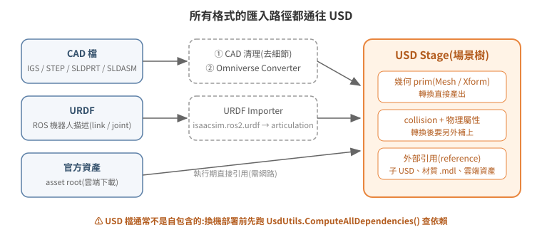

# 模型檔案格式與匯入:以 USD 為中心

Isaac Sim 不「支援很多格式」,它只真正認得一種:**USD**(Universal Scene Description,Pixar 開源的場景描述格式)。其他格式——CAD 檔、URDF、OBJ/FBX——進入 Isaac Sim 的路徑都是「先轉成 USD」。理解這一點,匯入問題就從「格式相容性」變成兩個明確的工程問題:怎麼轉、轉完怎麼補上物理屬性。

<p align="center"></p>

## 1. USD 的最小必要概念

| 概念 | 意義 |
|---|---|
| Stage | 一份開啟中的場景,整棵場景樹的容器 |
| Prim | 場景樹的節點:Mesh(幾何)、Xform(座標變換)、Light、Camera、Physics Scene 都是 prim |
| Layer / SubLayer | USD 檔可以引用(reference / sublayer)其他 USD 檔組合成場景——場景不是單一大檔,是一棵引用樹 |
| Xform op | prim 的位姿由 translate / orient / scale 等 op 組成,可用 API 讀寫 |

「引用樹」這個性質是實務上最容易吃虧的地方:**一個 `.usd` 檔往往不是自包含的**。它可能引用同目錄的子模型、別的目錄的材質庫(`.mdl`,NVIDIA Material Definition Language 材質格式)、甚至 NVIDIA 雲端資產(S3 URL)。只搬主檔換一台機器,場景會缺件。

## 2. 各格式的匯入路徑

### CAD(IGS / STEP / SLDPRT / SLDASM)→ USD

機構設計輸出的 CAD 檔要經 Omniverse CAD Converter 轉換。實戰驗證過的流程:

1. **CAD 清理**:先在 CAD 軟體移除細小特徵(螺絲牙、倒角細節)。CAD 的精度對模擬是負擔——面數影響渲染與碰撞計算,而模擬不需要製造級細節。
2. **轉 USD**:用 Omniverse Converter 轉出幾何。
3. **加 collision / physics**:轉出來的只有視覺幾何,碰撞體與物理屬性(質量、關節)要在 Isaac Sim 內另外加上(見 [04-physics-world](../04-physics-world/README.md))。
4. **分層**:拆成多個 sublayer/reference 子檔組合(即 §1 表中的 Layer/SubLayer 機制),把一台車、一個貨架拆成多個子 USD 再組合,方便替換與重用。

### URDF → USD

ROS 生態的機器人描述檔(URDF)有官方 importer:extension **`isaacsim.asset.importer.urdf`**,會把 link/joint 結構轉成 USD 的 articulation(關節樹)——GUI 的 File > Import 走的就是這條路,與 MJCF importer 同屬 asset importer 家族。

另有 `isaacsim.ros2.urdf` 是它的 ROS2 擴充:讓 importer 直接訂閱 ROS2 的 `robot_description` topic 匯入,而不是只吃本機檔案。兩者並存、用途不同——前者是「匯入本機 URDF 檔」的一般做法,後者是「從跑起來的 ROS2 系統即時抓 URDF」的特化做法,別混為一談。

### 官方資產:用下載的,不要自己搬運

NVIDIA 提供整套官方資產(範例機器人如 Carter、Nova Carter、倉庫環境如 Simple Warehouse、材質庫),來源是啟動參數指定的 asset root:

```
--/persistent/isaac/asset_root/default=https://omniverse-content-production.s3-us-west-2.amazonaws.com/Assets/Isaac/<版本>
```

場景引用官方資產時,執行期會從這個位址抓取——所以 **headless 主機也需要對外網路**(或預先架本地資產快取)。兩個授權面的提醒:

- 官方資產受 NVIDIA Omniverse 授權條款約束,**教學/專案 repo 不應把官方資產二進位檔複製進去轉散布**;正確做法是文件寫明「從 Isaac Sim asset browser / 官方 asset root 取得」。
- 同理,公司自製 CAD 轉出的 USD 屬公司資產,公開 repo 只描述結構與做法,不放原始檔。

## 3. 依賴解析:一個 USD 場景到底缺什麼

換機器部署前,先用 USD 內建工具做唯讀依賴解析:

```python
from pxr import UsdUtils
layers, assets, unresolved = UsdUtils.ComputeAllDependencies("/assets/my_scene.usd")
```

實戰上對一個 157 MB 的展示場景跑出來的結果,正好展示了依賴的三種類型:

| 類型 | 例子 | 部署含意 |
|---|---|---|
| 本地 USD 層 | 主場景 + 子模型 `main.usd` | 一起搬 |
| 本地材質庫 | 另一個目錄下的 `*.mdl` 材質包(24 GB) | **最容易漏**——不在模型目錄內,只搬模型目錄場景會缺貼圖 |
| 雲端資產 | 123 筆 NVIDIA S3 URL | 不用搬,但目標機需要能連外 |

注意 `unresolved` 清單要人工判讀:雲端 URL 在離線解析器眼中都是 unresolved,但執行期能抓到,不是真缺檔。

另一個輕量檢查:懷疑場景裡有沒有某類物件(例如天花板),不必開 Isaac Sim,`strings scene.usd | grep -i ceiling` 就能命中 prim 名稱——USD 二進位檔內的字串是可讀的。

## 4. 資產目錄的組織慣例

多人協作的資產庫,實戰演化出的慣例:

```
usd_model/
  <車型A>/            # 一個機型一個目錄:模型各版本 + 該機型的展示場景
  push_back/          # 一種機構一個目錄:完整 CAD(IGS/SLDASM)與轉出的 USD 並存
  warehouse_assets/   # 環境場景
  official/           # NVIDIA 官方範例(baseline 對照、ROS 整合測試用)
  1100pallet/         # 標準料件(棧板)
```

命名慣例:`*_full.usd` 完整版、`*_flatten.usd` 簡化版、帶 `test`/`copy`/`rebuild` 字樣的是實驗版本。**把 CAD 原始檔與轉出的 USD 放在同一目錄**是值得抄的做法——轉換參數要調整時,不用追問「這個 USD 當初是從哪個 CAD 轉的」。

## 5. 延伸閱讀

- 官方文件:USD 入門(Pixar OpenUSD)、Omniverse CAD Converter、URDF Importer
- 下一篇:[04 建立物理世界](../04-physics-world/README.md)
