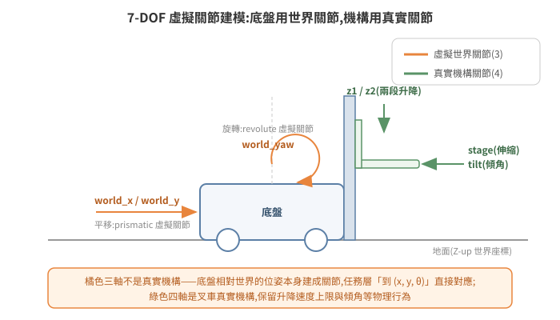

# 建立物理世界:Stage、模擬狀態與 Articulation

把模型放進場景只完成了一半——那是「佈景」,不是「世界」。要讓物體有重量、會碰撞、關節能受控,需要理解 Isaac Sim 的物理層(PhysX)怎麼跟場景層(USD)協作:什麼時候物理才真的在算、機器人的關節怎麼驅動、以及哪些操作會把物理引擎搞壞。

## 1. 物理世界的基本組成

一個能跑物理的場景,USD 裡至少要有:

- **Physics Scene**(一個 prim):定義重力方向與大小、solver 設定。習慣上重力 `-Z` 9.81 m/s²,場景 Z-up。
- **地面**:帶 collision 的靜態平面/幾何,否則物體會一路往下掉。
- **剛體(Rigid Body)**:要受物理影響的 prim 加上 rigid body + collision 屬性——沒有 collision 的 mesh 是「鬼魂」,會互相穿透。
- **Articulation**(關節樹):機器人本體——多個剛體用 joint 串起來,joint 可帶 drive(馬達)接受位置/速度目標。

GUI 裡這些都是右鍵選單的 Add → Physics;程式做法用 `pxr.UsdPhysics` API 或 `isaacsim.core` 的封裝。這些屬性都存在 USD 裡,隨場景檔走。

## 2. 模擬狀態:PLAYING 才有物理

**場景載入 ≠ 模擬開始。** timeline 有三態:STOPPED / PLAYING / PAUSED。只有 PLAYING 時 PhysX 才逐步積分、關節才會動、TF 與 joint states 才對外發布。這是 headless 部署「一切正常但什麼都不動」的第一大根因,值得反覆強調:

| 症狀 | 根因 |
|---|---|
| 外部拿不到 TF / joint states | 模擬停在 STOPPED |
| 機器人不理會關節命令 | 同上 |
| 橋接程式回報 pose 無效 | 同上 |

控制方式三選一:GUI 按 Play、Python `omni.timeline.get_timeline_interface().play()`、或 ROS2 標準服務(`simulation_interfaces/srv/SetSimulationState`,見 [05-ros2-bridge](../05-ros2-bridge/README.md))。自動化部署把 `play()` 寫進 `--exec` 腳本,不留手動步驟。

## 3. 用虛擬關節驅動移動機器人:一種務實的建模法

直覺上,模擬堆高機應該模擬四個輪子的轉速與轉向。實戰採用的是另一種建模:**給底盤三個「虛擬世界關節」`world_x`、`world_y`、`world_yaw`**——底盤相對世界的平移與旋轉本身作為 prismatic / revolute joint,再加上叉車機構的真實關節(`stage` 伸縮、`z1`/`z2` 兩段升降、`tilt` 傾角),整台車就是一棵 7-DOF 的 articulation。

<p align="center"></p>

為什麼這樣做?第一性原理:**上游系統(車隊排程)給的是「走到世界座標 (x, y, θ)」層級的任務,不是輪速指令**。如果模擬輪子,就得在中間自己實作一整套底盤運動學與輪速控制器,而這些對「驗證派工與物流流程」毫無貢獻。虛擬關節讓「位置命令 → 車到位」的鏈路最短,同時保留叉車機構的真實物理(舉升有速度上限、傾角影響棧板)。取捨也要誠實面對:這不是動力學擬真(不模擬輪胎打滑、慣性漂移),適合流程級模擬,不適合底盤控制器開發。

## 4. 關節控制 API:兩種語意,別混用

對 articulation 下命令有兩條路,語意完全不同:

```python
from isaacsim.core.prims import SingleArticulation
robot = SingleArticulation("/World/MyRobot")
robot.initialize()

robot.set_joint_positions(...)         # 瞬移(teleport):直接改狀態,不經 drive
robot.set_joint_position_targets(...)  # PD 目標:交給 joint drive 用剛度/阻尼追
```

- **`set_joint_position_targets` 需要 joint 有 drive 增益**(stiffness / damping)。對沒有 drive 的 joint 設目標,什麼都不會發生——不報錯,就是不動。這是「命令發了車不動」的常見暗坑。
- **`set_joint_positions` 是瞬移**,但上游若以高頻率(如每個物理步)送密集軌跡點,逐點瞬移在視覺上是平滑的——流程級模擬完全夠用。
- API 會隨版本變動(某版本後 `set_joint_position_targets` 介面有調整),升版時關節控制路徑要重新驗證,不能假設不動。

透過 ROS2 bridge 發 `JointState` 命令時,實測出兩條重要規則:

1. **只帶要控制的 joint**:曾嘗試「發完整 joint 清單、不控制的填 NaN 遮罩」,實測會被 bridge 整包忽略。
2. **position 命令不要帶 `velocity` 欄位**:`velocity=0.0` 不是「不指定」,會被當成明確的速度目標(hold),導致關節不動。位置與速度目標對同一 joint 混用還會讓 drive 抖動。

## 5. 兩條互斥的控制路徑:articulation vs 直改 xform

[02 篇](../02-python-no-ui/README.md)介紹過用 ScriptNode 直接改 prim 的 translate/orient——那是「非物理」的控制:繞過 PhysX 直接改場景樹。它與 articulation 控制**互斥**:

> 對一台由 PhysX articulation 管理的機器人直改 root xform,PhysX 的模擬 view 會失效,報 `Simulation view object is invalidated`,之後 joint states 回饋全部不可信,只能重載場景。

一個物件,一條控制路徑:要物理(碰撞、drive、joint 回饋)就走 articulation;要輕量位姿同步(例如把外部定位結果視覺化)就直改 xform、且該物件不掛 articulation。接手既有場景時,先弄清楚每個可動物件走哪條路,再動手加控制。

## 6. 物理互動不一定要擬真:幾何驅動吸附

叉車「叉起棧板」若走純物理(叉齒與棧板的摩擦與受力),對流程模擬是高成本低回報——PhysX 接觸求解對薄板穿插很敏感,失敗模式又難除錯。實戰的替代方案是**幾何判定 + attach**:

- 每個物理步檢查「叉架高度與棧板底面的距離」+「水平距離」,兩者都在門檻內 → 把棧板 attach 到叉架(隨叉架移動);
- 放下時(高度回落、位置在儲位內)→ detach,棧板落回世界。

這是「demo 級擬真」的誠實取捨:視覺與流程正確,物理細節簡化。文件與程式裡應明說這是吸附,不是真實叉取,避免後人誤以為可以拿來驗證叉取力學。

## 7. 除錯武器庫

| 症狀 | 檢查 |
|---|---|
| 什麼都不動 | 模擬是否 PLAYING(§2) |
| 命令發了、特定關節不動 | joint 有無 drive 增益;命令是否帶了 `velocity=0.0`;joint 名是否拼錯 |
| `Simulation view object is invalidated` | 有東西直改了 articulation 的 xform(§5);重載場景 |
| 物體穿透 | collision 屬性缺失;mesh 太薄(改用近似碰撞體) |
| 位置有殘差 | 命令流結束 ≠ 物理到位(命令是非同步的);drive 增益不足;旋轉中心不在預期點,轉彎帶出平移 |

最後一列展開說:**yaw 旋轉的中心不保證是你以為的參考點**(例如 `base_link`)。純旋轉時鎖住 x/y joint 值,參考點的世界座標仍可能漂移。對策不是鎖 joint,而是「hold 世界座標點、每個控制週期重新投影回 joint 目標」。

## 8. 延伸閱讀

- 官方文件:Isaac Sim Physics、Articulations、`isaacsim.core` API
- 下一篇:[05 ROS2 橋接](../05-ros2-bridge/README.md)
