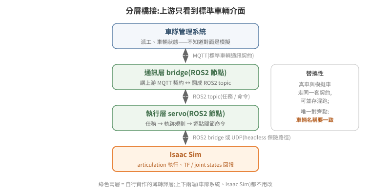

# ROS2 橋接:讓外部系統控制模擬

Isaac Sim 與 ROS2 的整合有官方路徑(bridge extension + OmniGraph 節點),也有官方路徑走不通時的務實繞法。本篇先講官方機制,再完整記錄一次「官方路徑在 headless 下失效 → 改用 UDP 解耦」的實戰案例——後者的架構思路比個案本身更有教學價值。

沒碰過 ROS2 的讀者,先建立四個最小概念:node 是一個獨立執行的程序;topic 是節點之間的具名資料流,採發布/訂閱模式;service 是一問一答式的呼叫;DDS(Data Distribution Service)是 ROS2 底層的訊息中介層,負責節點彼此發現與資料傳輸——本篇後面遇到的多個坑,根源都在這一層。

## 1. 官方機制:bridge extension

啟動時載入兩個 extension:

```
--/isaac/startup/ros_bridge_extension=isaacsim.ros2.bridge   # topic/TF 橋接
--/isaac/startup/ros_sim_control_extension=True              # 模擬狀態控制服務
```

(容器版等價寫法:`--enable isaacsim.ros2.bridge --enable isaacsim.ros2.sim_control`。)

`isaacsim.ros2.bridge` 本身不自動發布任何東西——實際的 pub/sub 由**場景內的 OmniGraph 節點**定義:`ROS2PublishTransformTree`(發 TF)、`ROS2PublishJointState` / `ROS2SubscribeJointState`(關節狀態/命令)、`ROS2PublishClock` 等。也就是說,「這個場景對 ROS2 長什麼樣」是場景 USD 的一部分。

`isaacsim.ros2.sim_control` 提供標準服務,外部節點可以查詢/控制模擬狀態——這是自動化部署裡「確保模擬在 PLAYING」的正規做法:

```bash
ros2 service call /get_simulation_state simulation_interfaces/srv/GetSimulationState '{}'
ros2 service call /set_simulation_state simulation_interfaces/srv/SetSimulationState '{state: {state: 1}}'  # 1 = PLAYING
```

`simulation_interfaces` 是標準 ROS 套件(`apt install ros-humble-simulation-interfaces`),不用自己 build。同一個 extension 還提供 `StepSimulation`、`ResetSimulation` 等服務;官方文件與實作偶有落差,實際能呼叫的服務與參數以實測為準,別照文件字面直接當保證。

**再強調一次 [04 篇](../04-physics-world/README.md)的鐵則**:模擬不在 PLAYING,TF 與 `/joint_states` 都不發布。外部系統看到的症狀是「pose 無效、topic 空的、機器人離線」,第一步永遠先查模擬狀態。

## 2. 典型整合架構:模擬車對上游透明

實戰驗證過的分層(把 Isaac Sim 接進一套既有的車隊管理系統,取代原本的假車模擬器):

<p align="center"></p>

```
車隊管理系統
   ↕ MQTT(車輛通訊契約:任務下發、pose 回報、狀態查詢)
通訊層 bridge(ROS2 節點):講上游的 MQTT 契約,翻成 ROS2 topic
   ↕ ROS2(/mission、/joint_command、/joint_states、/tf)
執行層 servo(ROS2 節點):任務 → 軌跡規劃 → 逐點關節命令
   ↕ ROS2 bridge / UDP
Isaac Sim:articulation 執行、TF 回報
```

核心設計原則:**上游只看到標準車輛介面**。車隊系統不知道(也不需要知道)對面是模擬——MQTT payload 格式、topic 命名、回報頻率與真車一致。這帶來兩個實際好處:上游零改動;模擬車與真車可以並存混跑。唯一的對齊點是**車輛名稱**:bridge 回報的名稱必須與上游註冊的一致,否則車輛永遠顯示離線——這類「兩邊各有一個名字要相等」的整合,建議名稱只在一處定義、另一邊參數化帶入。

## 3. 實戰案例:headless 下 OmniGraph 不 tick,改走 UDP 解耦

### 問題

場景內建的 ROS2 OmniGraph(5.x 時代建的)搬到新版 Isaac Sim + headless `--exec` 環境後全滅(以下實測於 Isaac Sim 6.0.1 headless `--exec` 環境):

1. **格式過期**:`ROS2PublishTransformTree` 用了 deprecated 的 `targetPrims` 屬性,新版要求改走 `IsaacComputeTransformTree` 的 parentFrames/childFrames——舊圖每秒刷數百條 `getObjectType eInvalid` 錯誤,TF 完全不發布。
2. **更根本:headless streaming/`--exec` 配置下,OmniGraph action graph 不被主迴圈 pump**。physics 與 render 各自在跑,但 `OnPlaybackTick` 不觸發、subscriber 節點註冊了 DDS 訂閱卻永遠不 compute。手動 `evaluate_sync()` 也救不回來。

### 排除掉的路(每一條都實測過,別再走)

| 嘗試 | 結果 |
|---|---|
| 在 Isaac Sim 的 Python 內自建 rclpy 節點 | `import rclpy` 成功,但 Isaac 自帶的 DDS 與系統 ROS2 的 DDS **discovery 不互通**,外部看不到這個節點 |
| 讀 OmniGraph subscriber 節點的輸出屬性 | graph 不 tick,輸出永遠是空 |
| 動態改圖(建新版 TF 節點 + 接線 + `evaluate_sync` pump) | 節點建立成功、錯誤洪水消失,但 TF 仍不發布 |
| 靠 `get_update_event_stream` 回呼 | 初始化後不再觸發 |

注意第一條的教訓與 [01 篇](../01-install-and-run-modes/README.md)的 Python 隔離原則同源:Isaac 內建 DDS 與系統 ROS2 的 discovery 實測未能互通,根因指向兩邊 DDS 實作版本與 discovery 設定的差異——理論上可以對齊,但實戰成本高且脆。「在 Isaac 裡面跑一個 ROS 節點」聽起來最直接,實際上是最不穩的一條路。

### 解法:Isaac Sim 只做物理,ROS I/O 全部外移

```
外部 ROS2 節點(系統原生 rclpy,與其他節點天然互通)
   訂 /joint_command ──JSON──▶ UDP :9901 ──▶ Isaac physics step callback
                                                  │  set_joint_positions()
   發 /tf ◀──────────────────  UDP :9902 ◀────────┘  get_world_pose()
```

- **Isaac 端**(`--exec` 腳本):在 physics step callback(`omni.physx` 的 `subscribe_physics_step_events`——實測**唯一可靠的每步鉤子**)內非阻塞收 UDP、驅動 articulation,並把 base 位姿送回另一個 UDP port。
- **ROS 端**(獨立進程,系統原生 rclpy):一支小橋接節點,訂 `/joint_command` 轉 UDP,收 UDP 轉 `TransformBroadcaster` 發 `/tf`。
- 兩個進程同機(或同 host network),localhost UDP 延遲可忽略。

這個架構的普遍教訓:**跨兩個「各自帶 runtime 的世界」整合時,與其在 A 的世界裡跑 B 的 runtime,不如兩邊各留原生 runtime、中間用最笨的協定(UDP + JSON)接**。笨協定的好處是沒有版本耦合——Isaac Sim 升版、ROS 換發行版,UDP 封包格式都不變。

## 4. 整合除錯速查

| 症狀 | 依序檢查 |
|---|---|
| 車輛在上游顯示離線 | 車名兩邊是否一致 → broker 位址(容器內 `127.0.0.1` 不等於 host)→ bridge 是否連上 |
| topic 有、資料空 | 模擬是否 PLAYING → graph 是否真的在 tick(headless 陷阱,§3) |
| 外部看不到 Isaac 內的節點 | DDS 不互通(§3),改解耦架構 |
| 命令送達但車不動 | joint drive 增益、teleport vs target 語意(見 [04 篇](../04-physics-world/README.md) §4) |
| 任務「秒完成」但車沒動 | 上游是否有 mock 模擬器搶先把任務結掉(整合期常見:兩個模擬器同時活著) |

## 5. 延伸閱讀

- **同章深入**:[關節命令送不到:把驅動鏈路切成四段來查](joint-command-chain-diagnosis.md)
  —— 上游印「已送出」、關節卻不動且無錯誤時,怎麼在控制器 / topic / ActionGraph / 關節
  之間定位斷點,以及為什麼開環控制器印的 `current` 不能當量測值
- 官方文件:Isaac Sim ROS2 Bridge、simulation_interfaces
- 下一篇:[06 WebRTC 串流與多 client](../06-webrtc-streaming/README.md)
