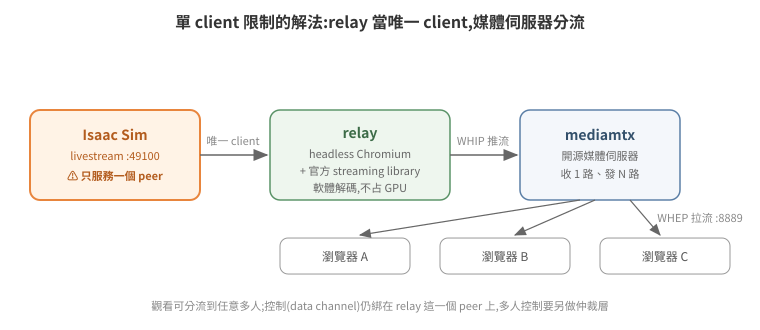

# WebRTC 串流與多 client 觀看

Headless Isaac Sim 的畫面要給人看,官方機制是 WebRTC livestream:Kit 內建串流伺服器,client(官方 AppImage、瀏覽器 web viewer)連上取得視訊。這條路單人用很順,但有一個結構性限制:**Isaac Sim 同時只服務一個 video client**。本篇講清楚這個限制的本質,以及用媒體伺服器分流突破它的架構。

## 1. 單一 client 限制的本質

Kit livestream 的訊令端(`:49100`)一次只把 video track 交給一個 peer;第二個連上的 client 只拿得到 audio。此外控制(滑鼠/鍵盤事件、高階命令)走的是 WebRTC data channel,綁在那個唯一的 peer 上。

所以「多人同時看」不能靠多開瀏覽器,要改變拓撲:**讓一個固定的中繼(relay)當 Isaac Sim 的唯一 client,再由媒體伺服器把畫面分發給任意多的觀看者**。

## 2. 分流架構:relay + mediamtx

<p align="center"></p>

```
Isaac Sim livestream(:49100,單一 peer)
   │  唯一 client = headless Chromium(relay,跑官方 streaming library)
   ▼
relay 取得 video track ──WHIP 推流──▶ mediamtx(媒體伺服器)
                                        │  WHEP 拉流(:8889)
                                        ▼
                              瀏覽器 A / B / C …(任意多個觀看者)
```

- **relay**:無頭瀏覽器(puppeteer + headless Chromium)載入一頁 HTML,用 NVIDIA 官方 streaming library 連 Isaac Sim 拿 video track,再以 WHIP(WebRTC 推流的標準 HTTP 協定)推給 mediamtx。軟體解碼即可,不占 GPU。
- **mediamtx**:開源媒體伺服器,收一路 WHIP、發任意多路 WHEP(WebRTC 拉流標準)。多 client 觀看在這一層解決。
- 觀看端只需要一個 `<video>` + WHEP 連線,或直接用 mediamtx 內建播放頁。

代價與限制要誠實列出:relay 是單點(掛了全體斷線);觀看是單向的,**控制權仍只有一份**——要做「多人看、一人控」,得在 relay 旁再加一層 WebSocket 仲裁(request/grant/release token),把控制事件轉譯後由 relay 代打給 Isaac Sim。

雲端部署還有一個網路細節:雲主機多半是 1:1 NAT(instance 看不到自己的公網 IP),mediamtx 要設定 `webrtcAdditionalHosts` 廣告公網 IP 當 ICE candidate,否則外部瀏覽器建不起連線;防火牆要放行 WHEP 的 TCP port 與 media 的 UDP port。

## 3. 解析度協商:server 遷就 client

實測踩過的坑:Isaac Sim 預設渲染 1440×900,而 client library 協商的上限固定 1280×720。Isaac Sim **拒絕送出超過 client max 的影格**——結果是只送出第一張 keyframe 就停,媒體伺服器等不到連續 track 而斷線重連,看起來像玄學故障。

改 client 設定無效(library 忽略),正解是啟動參數把渲染解析度對齊 client:

```
--/app/window/width=1280 --/app/window/height=720
--/app/renderer/resolution/width=1280 --/app/renderer/resolution/height=720
--/app/livestream/width=1280 --/app/livestream/height=720
```

## 4. 一次教科書等級的排錯:~58.6 秒週期掉線

這條值得完整記錄,因為它示範了「症狀指向哪裡」與「根因在哪裡」可以差多遠。

**症狀**:所有 client(自製 relay、真瀏覽器、官方 viewer)都在連線約 60 秒後掉線重連,永遠復現。

**看起來像**:server 端 idle timeout、client library 版本與 server 協議不匹配、甚至 Isaac Sim 端週期性報 `NVST_R_BUSY` 錯誤——三個方向都「合理」。

**逐一證偽**:

1. 換新版 client library → 掉線照舊。假設「版本不匹配」出局。
2. 查官方 CHANGELOG,`NVST_R_BUSY` 明載是「client 斷線過程的正常噪音」——它是掉線的**下游症狀**,不是原因。
3. 精確量測時間戳:每次連線建立到掉線**精確 58.6 秒,毫秒級一致**。固定得如此精準的間隔不會是網路或負載問題,只會是**某個計時器**。
4. 同時刻 server log 濾掉噪音後,沒有任何主動斷線事件 → server 沒關 session,是 client 自己走的。

**根因**:relay 的看門狗(watchdog)寫成了有限迴圈——`for (i < 40) { sleep(1500) }`,40 × 1.5 s = 60 秒上限。健康的串流從不觸發 dead 判定,迴圈自然跑完,程式接著重載頁面。所有「掉線」都是 watchdog 自己拆的。修法一行:改 `while(true)`,只在真正 dead(影格停滯逾 16 秒)才重載。修完連續觀察 2 小時零重連。

**教訓**:

- **毫秒級一致的週期 = 計時器,先找自己程式裡的計時器**,再懷疑對端。
- 錯誤訊息要查語意再定罪:`NVST_R_BUSY` 這種「聽起來像根因」的噪音最會誤導。
- watchdog 的活性判定要用**真實訊號**(實際收到的影格數 `requestVideoFrameCallback`),不能用間接屬性(`videoWidth` 之類)——前一版 watchdog 就是用間接屬性誤判,每 12 秒重連,把「relay 不支援多 client」的假象都製造出來了。

## 5. 附:另一個「症狀騙人」案例——俯視圖的「雜訊」

俯視視角畫面整片灰色條紋「雜訊」,直覺全指向渲染/編碼:GPU 異常?denoiser?NVENC?瀏覽器縮放?逐層檢查全部正常,最後抓原生影格一看——**相機飛到了倉庫屋頂上方,拍到的是天花板浪板**(灰底 + 兩條日光燈)。場景含完整天花板模組,相機 Z 超過屋頂高度就只拍得到屋頂。

修法也有取捨:把相機壓低會拍不全整個倉庫;正解是**隱藏天花板 prim**(遍歷場景、對屋頂結構 `MakeInvisible()`)。逐個猜 prim 名稱會漏,更穩的策略是反向的「保留清單」:除了地板與牆,上部結構全部隱藏。

教訓與 §4 同構:**先用最便宜的手段確認「看到的到底是什麼」**(這裡是抓一張原生影格),再開始懷疑複雜子系統。渲染管線很複雜,但「相機擺錯位置」永遠是更常見的原因。

## 6. 延伸閱讀

- 官方文件:Isaac Sim Livestream、WebRTC Browser Client
- mediamtx(開源媒體伺服器)、WHIP/WHEP 規格
- 回到索引:[README](../../README.md)
