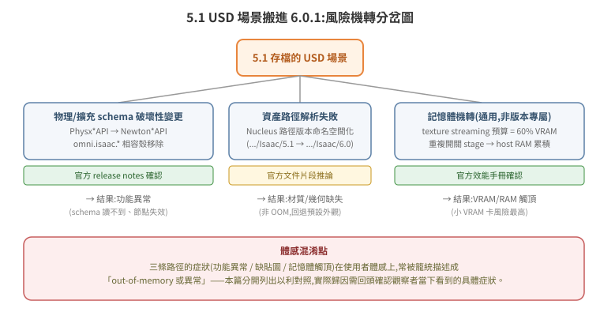

# 5.1 USD 場景搬進 6.0.1:OOM / 異常風險調查

> 起因:同事實測觀察到「Isaac Sim 5.1 建的 USD 場景,拿到 Isaac Sim 6.0.1 執行會 out-of-memory 或出現異常」。本篇是針對這個觀察的調查報告,不是教學——目的是找出**有官方出處的機轉**與**推測但尚未證實的機轉**,並用手上能拿到的一手證據(AWS 遷移紀錄、本機兩版場景比對)交叉檢查。
>
> **誠實定位**:同事的 OOM 觀察本次**尚未直接重現**(沒有拿到會重現問題的機器與確切 repro 步驟)。本篇是文獻查證 + 旁證分析,不是根因確認報告。「已確認」與「推測」在每一條都會標出來。

## 一句話結論

沒有查到 NVIDIA 官方文件把「5.1 USD 場景 → 6.0.1 崩潰/OOM」寫成已知 issue 明確條列;但 5.1→6.0(Kit 106→110)之間有數個**已由官方文件證實**的破壞性變更(物理 schema 從 PhysX 系列轉往 Newton 系列、`omni.isaac.*` 相容殼完全移除、Nucleus 資產路徑改版本命名空間),這些變更本身不直接等於「洩漏記憶體」,但足以造成**場景載入時的行為異常**(schema 找不到對應 API、資產路徑解析失敗、OmniGraph 節點失效)——這類異常在使用者體感上,很容易被籠統描述成「壞掉」或和「卡住/爆記憶體」混在一起報告。真正查到的、官方認證的記憶體機轉,是 texture streaming 預算(GPU VRAM)與重複開關 stage 的 host RAM 累積成長,兩者都與「檔案是不是 5.1 存的」無關,是通用行為——如果實際觀察到問題的機器 VRAM 較小(本機常見配置為 8GB 等級工作站卡),疊加場景本身變大或變複雜,更容易先觸頂。

## 1. 官方查證:5.1 → 6.0(Kit 106 → 110)相關變更點

| 變更點 | 內容 | 對 OOM/異常的可能影響 | 出處 |
|---|---|---|---|
| 物理 schema 從 PhysX 系列轉往 Newton 系列 | URDF 匯入的 articulation root **不再帶 `PhysxArticulationAPI`**,改用 `NewtonArticulationRootAPI` 表達 self-collision;mimic joint 全面改用 `NewtonMimicAPI`(不再用 `PhysxMimicJointAPI`) | 若場景/腳本仍依賴舊 schema 讀寫關節屬性,6.0.1 下讀不到對應 attribute → 邏輯錯誤,非記憶體問題,但體感是「行為異常」 | [Isaac Sim 6.0.0 Release Notes](https://docs.isaacsim.omniverse.nvidia.com/6.0.0/overview/release_notes.html)、[6.0.1 Release Notes](https://docs.isaacsim.omniverse.nvidia.com/6.0.1/overview/release_notes.html) |
| `PhysicsScene` 自動套用 `NewtonSceneAPI` | 6.0 的 Python `PhysicsScene` 類別建立時,自動把 `NewtonSceneAPI` 套到底層 physics scene prim,以支援 Newton 後端設定(gravity/dt/solver iteration) | 場景一旦被 6.0 工具存過,token 表會多出 `NewtonSceneAPI`(見第 3 節本機比對)——這是「檔案被 6.0 動過」的技術指紋,不代表記憶體異常 | [Newton Physics Backend 文件](https://docs.isaacsim.omniverse.nvidia.com/6.0.0/physics/newton_physics.html) |
| `omni.isaac.*` 相容殼**完全移除** | 舊版靠 `omni.isaac.*` 命名空間相容殼撐過渡期,6.0 正式拿掉,必須全面改用 `isaacsim.*` | 若場景內 OmniGraph 節點或延伸模組型別字串還是舊命名空間,節點載入失敗/靜默不生效 | 6.0.0 Release Notes |
| `isaacsim.core.*` 移至 `isaacsim.core.experimental.*` | Core API(PyTorch 底)整組移到新的 Warp 底 Experimental API | 影響 Python 控制腳本相容性,非場景 USD 本身,但常與「場景 6.0 打不開」的報告混在一起 | 同上;本 repo [01 篇](../01-install-and-run-modes/README.md) §3 已記錄 |
| Sensor API 遷移 | `isaacsim.sensors.camera`、`isaacsim.sensors.rtx` 皆標記 deprecated,遷往 `isaacsim.sensors.experimental.rtx` | 場景內相機/感測器 prim 若掛舊擴充的 schema 屬性,行為可能不一致 | 6.0.0 Release Notes |
| Nucleus 預設資產根目錄版本命名空間化 | 6.0 預設 Nucleus 路徑是 `omniverse://localhost/NVIDIA/Assets/Isaac/6.0`(6.0 之前是對應各版本的路徑,如 `.../Isaac/5.1`);同時 **Nucleus Cache 被 Hub Workstation Cache 取代** | 5.1 場景內若有絕對路徑引用舊版本資產根目錄,6.0 環境找不到對應資產 → 材質/幾何載入失敗或回退預設,**不是 OOM,但是「異常」的一種常見機轉** | [Download Isaac Sim(6.0.0)](https://docs.isaacsim.omniverse.nvidia.com/6.0.0/installation/download.html);GitHub Discussion [#576](https://github.com/isaac-sim/IsaacSim/discussions/576) |
| RTX Real-Time 2.0 成為新預設渲染模式 | 6.0 預設渲染器換代 | 官方文件未具體描述對舊場景材質/光源的相容性細節,**查無官方紀錄**,暫列推測 | [Performance Optimization Handbook](https://docs.isaacsim.omniverse.nvidia.com/6.0.0/reference_material/sim_performance_optimization_handbook.html) |
| 文件版本汰除時程 | 4.5 文件在 6.1 釋出時會下架;5.1、6.0 文件目前並存 | 說明 NVIDIA 並未把「5.1 場景在 6.0 打不開」當成獨立公告的已知 issue——至少截至查證時間點沒有找到 | [Isaac Sim 6.0 GA Discussion #655](https://github.com/isaac-sim/IsaacSim/discussions/655) |

> 沒查到的:NVIDIA 官方沒有發布單一的「5.1 → 6.0 USD 場景轉換工具」或明確標題為「5.1 場景在 6.0 上的已知 OOM/crash issue」的公告或文件段落。查證方法是官方 release notes(6.0.0/6.0.1)、GitHub `isaac-sim/IsaacSim` discussions、NVIDIA Developer Forums 關鍵字搜尋,均未命中——記「查無官方紀錄」,不腦補存在性。

## 2. OOM 具體 pattern:官方文件裡查得到的記憶體機轉

這些機轉都是**通用行為**,官方文件沒有把它們特別框成「5.1 場景的問題」,但和「換了新版本後這個場景就爆記憶體」的體感描述吻合,值得列入風險清單:

1. **GPU VRAM——texture streaming 預算**:Performance Optimization Handbook 明載預設值 `Texture Streaming Budget = 0.6`(GPU 記憶體容量的 60%),可調路徑 `/rtx-transient/resourcemanager/texturestreaming/memoryBudget`。手冊也明說「關掉 texture streaming 雖然可能有效能好處,但會增加 GPU 記憶體用量,記憶體吃緊時可能造成當機」。**如果場景材質量隨版本演進變大(見第 3 節,SHOWCASE_600.usd 比舊版 SHOWCASE.usd 大近一倍),在小 VRAM 卡上更容易先撞到這個預算上限。**
2. **Host RAM——重複開關 stage 的累積成長**:同一份手冊建議在「stage 反覆載入/卸載」的場景下,用 `GLIBC_TUNABLES=glibc.malloc.arena_max=1:glibc.malloc.mmap_max=0:glibc.malloc.mmap_threshold=2147483647` 調整 glibc 配置器行為——暗示官方已知反覆開關場景會有記憶體不會完全歸還作業系統的現象。若實際操作流程是在同一個 6.0.1 process 裡反覆開關/重載 5.1 場景做比對測試,這條路徑值得優先排查。
3. **大型/複雜 USD 匯入本身就有已知的規模上限**(與 5.1→6.0 無關,是 USD 匯入管線的既有限制):GitHub issue [`isaac-sim/IsaacSim#491`](https://github.com/isaac-sim/IsaacSim/issues/491) 回報 Isaac Sim 5.1 載入超大 USD(Disney *Moana Island* 場景)時,32 核心全滿、卡 10–20 分鐘後 segfault,即使當下還有 20GB+ VRAM、50GB+ RAM 可用——顯示匯入路徑本身在極端規模下有非記憶體不足導致的 crash 模式(CPU-bound 處理 + 某種資源上限),版本迭代之間都可能重現,不是 6.0 特有。
4. **SDF collision 重新 cook 的成本**:官方論壇與文件確認 SDF mesh collider 比 convex hull **慢約 20 倍**,且 convex decomposition 對高長寬比 mesh 可能觸發 GPU 不相容 → CPU fallback。若 5.1 場景的 collision 是用 5.1 當時的 cook 結果快取,搬到 6.0.1 若判定快取失效需要重新 cook,短時間 CPU/記憶體尖峰是合理推測(**推測,未找到官方文字明確描述「6.0 一定會重 cook 舊快取」**)。
5. **社群已知的 RAM 過度消耗 bug(非 5.1→6.0 遷移案例,但顯示 Isaac 生態圈本身有未解的記憶體問題)**:IsaacLab issue [`#5350`](https://github.com/isaac-sim/IsaacLab/issues/5350) 回報複雜場景 RAM:VRAM 比例達 16:1,46% 的已配置 RAM 事後被判定「冷」(配置但未實際使用),官方目標是壓到 4:1,截至查證時仍是 open、未定根因。這條說明「Isaac 生態圈記憶體使用效率本身就不穩定」,增加了「換版本後感覺更肥」這類體感報告出現的機率,即使跟場景是否為 5.1 格式無關。

## 3. 我們自己的證據(本地一手資料)

### 3.1 AWS 遷移紀錄(`70-aws-tokyo-isaac-601-runbook.md`):真實發生的「不相容」是功能性斷裂,不是 OOM

這份 runbook 記錄了 2026-07-18/19 把 本機 on-prem 環境的 5.1 場景資產搬到 AWS Tokyo、用 Isaac Sim 6.0.1 跑通的全程。兩個關鍵發現:

- **改用 6.0.1 的原因跟 OOM 無關,是 driver ABI 不相容**:本機 on-prem 環境(driver 555,舊)上 Isaac 5.1 穩定;AWS g6e 預裝 driver 595(新)配 5.1 會讓 RTX OptiX 外掛在啟動場景 DB 時 **segfault**(每次約 65 秒必掛,`make_fcontext` backtrace)。換成 6.0.1(相容新 driver 595)後同機測試 216 秒無 crash。**這是「Isaac Sim 執行檔版本 × GPU driver 版本」的相容性問題,不是「5.1 存的 USD 檔案在 6.0.1 裡讀出問題」——容易被混為一談,值得向觀察者追問時明確區分:實際看到的是啟動就崩潰(疑似 driver/ABI),還是場景載入到一半記憶體飆升(疑似本篇談的 VRAM/RAM 議題)。**
- **即使場景檔已經是「6.0 調整版」(`SHOWCASE_600.usd`),場景內建的 ROS2 OmniGraph 節點仍是 5.1 時代格式**,在 6.0.1 下出現兩層問題(§7.1):`ROS2PublishTransformTree` 用 deprecated 的 `targetPrims`(6.0 應改用 `IsaacComputeTransformTree` 的 `parentFrames`/`childFrames`)導致 `[PoseTree] getObjectType eInvalid` 洪水式報錯;更關鍵的是 **headless streaming/`--exec` 模式下,OmniGraph action graph 完全不會被主更新迴圈 tick**,訂閱節點註冊了但 compute 從不執行,`/joint_states` 永遠空。這是實測到的、確鑿的「5.1 格式內容在 6.0.1 執行環境下失效」案例——但症狀是**功能斷裂(拿不到資料、任務中止)**,run 過程中沒有記錄到 OOM 或記憶體異常。最終繞過方式是完全放棄場景內建 OmniGraph、改走 UDP bridge(§7.2)。
- **AWS 這次的硬體是 L40S 48GB VRAM / 16 vCPU / 124GB RAM**,遠高於一般工作站等級的 GPU。整份 runbook 沒有任何一行記到 VRAM/host RAM 用量數字或 OOM 錯誤——但這代表的是「在資源寬裕的機器上沒撞到」,不能反推「5.1 場景在 6.0.1 上不會 OOM」;VRAM 較小的機器風險仍未被這份紀錄排除。

> **註記**:調查前流傳的一則說法是「AWS 那次 runbook 有記到 HUD 讀數:GPU 2.1GiB used / Process Memory 7.9GiB,可當 6.0-native 場景的記憶體 baseline」。實際查證後**在 `70-aws-tokyo-isaac-601-runbook.md` 與 `86-topdown-noise-ceiling-rootcause.md` 全文、以及同目錄其他內部 isaac-ros 文件都沒有找到這組數字**(已用 `grep -i` 對 "GiB"/"memory"/"HUD"/"OOM" 全文搜尋確認)。這組數據可能來自其他未留存的 session 輸出,或是誤記——本報告不採用,如需要應向提供者確認出處後再補。

### 3.2 本機資產庫兩版場景比對:`SHOWCASE.usd`(5.1 時代)vs `SHOWCASE_600.usd`(6.0 用,今日更新)

路徑:本機資產備份目錄下 `.../isaac-assets-backup/usd_model/MR1533/`(內部路徑,詳細位置略)。

| | `SHOWCASE.usd` | `SHOWCASE_600.usd` |
|---|---|---|
| 檔案大小 | 84 MB(2026-07-01 存檔) | 158 MB(2026-07-20 存檔,約 1.9 倍) |
| USD crate 版本(`file` 指令判讀) | `USD crate, version 0.9.0` | `USD crate, version 0.9.0`(**相同**,binary crate 格式本身沒有升版) |
| Token 表含 `PhysxJointAxisAPI` | 否 | **是** |
| Token 表含 `NewtonSceneAPI` | 否 | **是**(與第 1 節「`PhysicsScene` 建立時自動套用 `NewtonSceneAPI`」的官方說明吻合,是「這檔案曾被 6.0 工具開過/存過」的技術指紋) |
| 資產絕對路徑引用 | 場景內硬編碼內部主機的絕對路徑(略,非官方 Nucleus 路徑) | 同左,兩檔一致 |

比對方法:`file` 判讀 crate 版本、`strings -n 6` 對兩檔輸出做 `sort -u` 後 `comm` 差集,鎖定 physics/schema 相關 token。**限制**:USD crate 是壓縮二進位格式,`strings` 只能撈到欄位名/token 字串表,撈不到幾何/材質實際內容,所以無法從這個方法判斷「1.9 倍檔案增量」具體是新增了多少張貼圖或多少三角面——只能確認「檔案變大了、schema token 表多了 Newton 相關項目」,**不能**直接證明「因為升級到 6.0 所以肥大」;7/1 到 7/20 之間場景內容本身也可能有其他迭代(新增棧板、新增細節)。這點在報告內誠實列為方法限制。

### 3.3 本機 RTX 工作站的硬體基線(`01-system-isaac.txt` 盤點):VRAM 是本地機器上最吃緊的資源

- GPU:**Quadro RTX 4000,8192 MiB VRAM**,driver 555.42.06;RAM 62 GiB。
- 該機器同時裝了 `isaac-sim-5.1.0`(17G)與 `isaac-sim-6.0.0`,`usd_model` 資產目錄 5.4G。
- 對照第 2 節「texture streaming 預算預設吃 GPU 記憶體 60%」:8GB 卡的 60% 預算約 4.8GB,再加上場景本身的 mesh/physics buffer、RTX 渲染管線常駐用量,**VRAM 餘裕本來就薄**——這是本次調查中最貼近「resource-constrained 環境更容易先觸頂」假說的具體數字,但**沒有實測數據佐證原始 OOM 觀察當下用的就是這台機器**,仍是推測。

## 4. 結論:風險清單(分兩級)

**有官方出處(已確認機轉,但沒有明確指名是 5.1→6.0 場景遷移專屬問題)**
- Texture streaming 預算固定吃 60% GPU VRAM,場景材質量越大、GPU VRAM 越小,越容易撞頂。
- 反覆在同一 process 開關/重載 stage,host RAM 有已知的累積不歸還現象(官方給出 glibc 調參建議)。
- 5.1→6.0 有多項物理 schema(Physx*→Newton*)、擴充命名空間(`omni.isaac.*` 移除)、Nucleus 資產路徑(版本命名空間化)的破壞性變更,會造成**功能異常**(schema 讀不到、資產解析失敗、OmniGraph 節點失效),體感上容易被籠統歸類成「壞掉」。
- 大型/複雜 USD 場景的匯入流程本身有既有的 CPU-bound 崩潰模式(與版本無關的既有限制)。

**推測(尚未找到官方文字或本次一手證據直接證實)**
- 5.1 場景的 collision cook 快取在 6.0.1 下失效需要重新 cook,造成短暫記憶體/CPU 尖峰。
- RTX Real-Time 2.0 新預設渲染器對舊場景材質/光源設定的相容性細節。
- 原始 OOM 觀察是否與本篇第 3.3 節「本機 8GB VRAM 工作站 + 場景變大」的假說直接對應——**這條需要向觀察者追問「在哪台機器、多大的場景、OOM 發生在載入哪個階段」才能收斂**。

## 5. 可執行建議

### 5.1 遷移 SOP(把一份 5.1 USD 場景搬進 6.0.1 之前)

1. **先確認硬體 VRAM 餘裕**:`nvidia-smi --query-gpu=memory.total,memory.used --format=csv`,估算場景材質總量是否逼近 60% 預設 texture streaming 預算;VRAM 8GB 級的機器建議先手動調低 `/rtx-transient/resourcemanager/texturestreaming/memoryBudget`。
2. **用 6.0.1 開一次場景並存成新檔(不覆蓋原檔)**,再用本篇 3.2 節的方法(`file` + `strings` 差集比對 physics/schema token)確認 6.0 工具鏈是否動過 schema(如新增 `NewtonSceneAPI`),藉此判斷這份場景是「原生 5.1」還是「已被 6.0 存過的過渡版」。
3. **檢查場景內是否有 OmniGraph ROS2 節點**,若有,對照本篇 3.1 節案例,優先確認是 `ROS2PublishTransformTree` 等節點是否用了 deprecated 的 `targetPrims`;headless/`--exec` 模式下額外驗證 OmniGraph 是否真的被 tick(觀察 `/tf`、`/joint_states` 是否有資料,而非只看 topic 存在)。
4. **檢查資產絕對路徑引用**:`strings <file>.usd | grep -oE "omniverse://[^\"]+"` 或 grep 檔案系統絕對路徑,確認是否指向版本命名空間化的 Nucleus 路徑(如 `.../Isaac/5.1/...`);若 6.0 環境的 Nucleus 只掛了 `.../Isaac/6.0`,這些引用會解析失敗。
5. **反覆開關測試前先量測 baseline**:若工作流程需要在同一 process 內多次載入/卸載場景,先套用官方建議的 `GLIBC_TUNABLES`,並在載入前後量測 RSS 是否隨次數線性成長。

### 5.2 驗證 checklist(載入後檢查什麼)

- [ ] `nvidia-smi --query-gpu=memory.used --format=csv -l 1` 連續觀察載入過程,記錄 VRAM 曲線是否單調爬升不回落(streaming budget 逼近上限的訊號)。
- [ ] host 端 `ps -o rss` 或 `/proc/<pid>/status` 的 `VmRSS`,同樣連續觀察,對照官方「重複載入累積不歸還」的已知模式。
- [ ] Isaac log 過濾 `getObjectType eInvalid`、`Failed to open`、`deprecated` 等關鍵字(對照本篇 3.1 節 doc 70 §7.1 的實際案例字串)。
- [ ] `omni.hydra` warning(尤其 mesh/primvar buffer 大小不符,doc 86 §「順帶發現」已記錄過一例,USD 資料本身有缺陷但非阻斷)。
- [ ] physics 相關 warning:collision cook 是否在載入時觸發重新計算(log 中找 `cooking`/`SDF`/`convex` 字樣)。
- [ ] `/rtx-transient/resourcemanager/texturestreaming` 相關 log 是否出現預算超限訊息。
- [ ] 若場景含 OmniGraph ROS2 節點:用 `ros2 topic echo` 實測資料是否真的持續進來,而非只看 `ros2 topic list` 存在就判定正常(doc 70 §7.1 的教訓)。

## 相關

- 本 repo [01 篇](../01-install-and-run-modes/README.md) §3 — 版本與 GPU 驅動相依性(driver ABI 不相容 segfault 案例,與本篇 3.1 節同源但角度不同)。
- 內部 runbook `70-aws-tokyo-isaac-601-runbook.md` §0、§7 — AWS 遷移實戰(本篇 3.1 節引用)。
- 內部 runbook `86-topdown-noise-ceiling-rootcause.md` — 6.0.1 場景渲染排錯案例,方法論(唯讀排查、證據鏈)可參考,但與 OOM 主題無直接關聯。

> 建立 2026-07-20。查證方法:官方 Isaac Sim release notes(6.0.0/6.0.1)+ NVIDIA 官方文件(Performance Optimization Handbook、Newton Physics Backend)+ `isaac-sim/IsaacSim`、`isaac-sim/IsaacLab` GitHub issues/discussions + 本機 USD 檔案二進位比對 + 內部 AWS 遷移 runbook。同事的 OOM 觀察本次未直接重現。
