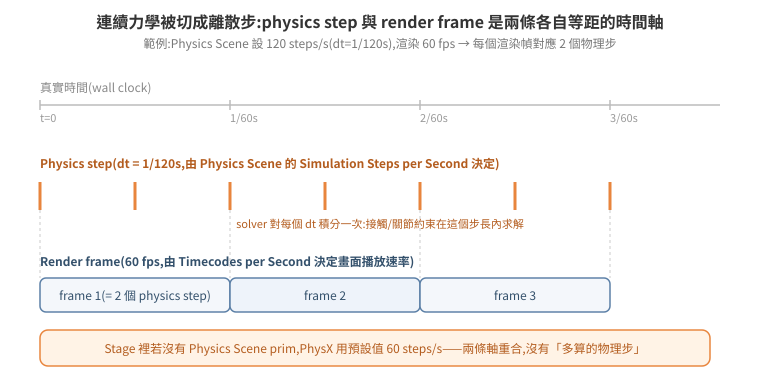
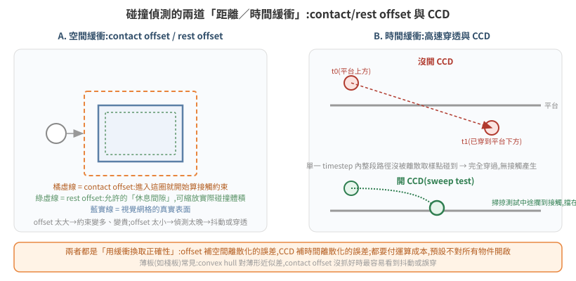
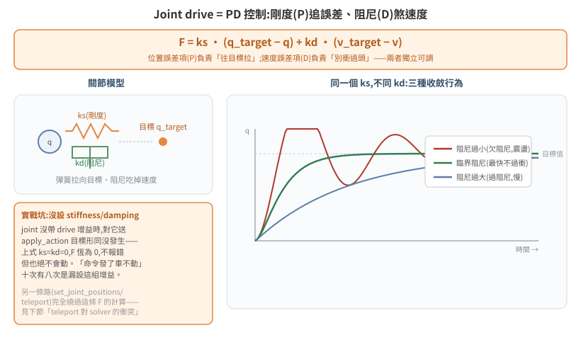
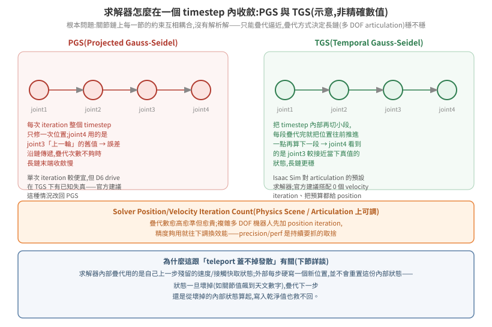
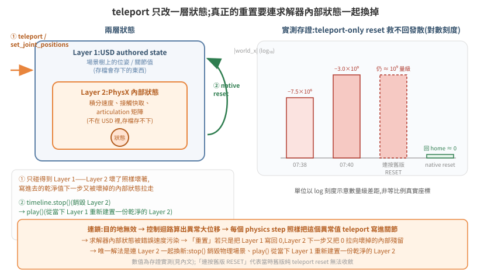

# 物理模擬基礎:timestep、solver、joint drive 與 reset 語意

[04 篇](../04-physics-world/README.md)講了「怎麼把場景變成能跑物理的世界」——加 Physics Scene、剛體、articulation。本篇往下一層,講**物理引擎內部怎麼算**:一步要花多少真實時間、碰撞怎麼判定、關節怎麼被馬達拉住、疊代求解器在解什麼、以及「重置」到底重置了什麼。這些機制平時不需要懂,但一旦系統出現「暴走」「穿模」「reset 按了沒用」這類症狀,答案幾乎都藏在這幾個機制裡——本篇把三個實戰事故接回對應章節,而不是憑空講理論。

官方文件:[Physics Simulation Fundamentals(4.5.0)](https://docs.isaacsim.omniverse.nvidia.com/4.5.0/physics/simulation_fundamentals.html);延伸:[Articulation and Robot Simulation Stability Guide](https://docs.omniverse.nvidia.com/kit/docs/omni_physics/latest/dev_guide/guides/articulation_stability_guide.html)、[Tuning Joint Drive Gains](https://docs.isaacsim.omniverse.nvidia.com/4.5.0/robot_setup/joint_tuning.html)、[PhysX Rigid Body Dynamics](https://nvidia-omniverse.github.io/PhysX/physx/5.4.1/docs/RigidBodyDynamics.html)、[PhysX Joints](https://nvidia-omniverse.github.io/PhysX/physx/5.4.1/docs/Joints.html)。API 版本以 Isaac Sim 4.5–5.1.x 為準(與本 repo 其他篇一致);6.0 起引入的 Newton 後端另行標註,不假設兩者行為相同。

## 1. 物理世界的節奏:Physics Scene、timestep 與 substep

**根本問題**:PhysX 求解的是連續時間的力學方程,但電腦只能離散地一步一步算。「一步該對應多少真實時間」這個切法,直接決定模擬的穩定度與成本。

Isaac Sim 用一個 Physics Scene prim 定義這個切法:**Simulation Steps per Second**(每秒模擬幾步,即 dt = 1/N 秒)。Stage 裡若沒有明確建立 Physics Scene,PhysX 用**預設 60 steps/s**——這也是為什麼很多最小範例「看起來沒設定物理參數卻能跑」:預設值早已生效,不是沒有 timestep,是沒去改它。

渲染幀率是另一件事,由 Stage metadata 的 **Timecodes per Second** 決定,官方文件把它跟 Simulation Steps per Second 分開描述——物理步與畫面幀是**兩條各自等距、但可以不同步的時間軸**。當物理步進速率比渲染幀率高(例如 120 steps/s 對 60 fps),一個畫面之間 solver 其實積分了不只一次;這對應下圖的「substep」概念:並非官方另開一個叫 substep 的參數,而是「physics step 與 render frame 密度不同」這件事本身。

<p align="center"></p>

**取捨**:steps/s 調高,solver 對每個瞬間的力學積分更準(高速碰撞、細關節鏈更穩),但每渲染幀要算的物理步變多,成本線性增加。**待查證**:官方文件未在本頁給出「調整 steps/s 對即時性(real-time factor)」的具體換算公式,只提到有限制模擬速度貼近真實時間的機制;細節見 [Isaac Sim 4.5.0 documentation](https://docs.isaacsim.omniverse.nvidia.com/4.5.0/physics/simulation_fundamentals.html)。

## 2. 剛體與碰撞:collision 不是免費的,offset 是它的緩衝

**根本問題**:視覺網格是任意多邊形,精確碰撞檢測代價很高;PhysX 用「近似碰撞體」換取效能,但近似必然跟視覺網格有落差——contact/rest offset 就是官方拿來管理這個落差的旋鈕。

先決條件:一個 prim 要參與物理,需要 **Rigid Body**(讓它感知重力與外力)+ **Collider**(讓它能被碰撞偵測到)。官方列出的碰撞近似依精度/成本排列:convex hull(預設,單一凸包近似)→ convex decomposition(多凸包組合,較準但較貴)→ SDF mesh(triangle mesh 專用)→ sphere approximation → bounding cube/sphere(最便宜)。**沒有 collider 的 mesh 是「鬼魂」**——rigid body 屬性只管重力與外力響應,不等於能被碰到;物體會互相穿透,這是新手最常踩的第一個坑。

官方定義(逐字):

- **rest offset**:「可以拿來膨脹或縮小碰撞幾何體;視覺網格比碰撞幾何大或小時用得上」——實質是碰撞體積的縮放旋鈕。
- **contact offset**:「不管 rest offset 設多少,決定模擬引擎從多遠開始產生接觸約束」——offset 太大,約束算得早但變貴;太小,偵測太晚,輕則抖動,重則穿透。

<p align="center"></p>

薄板類物件(棧板、隔板)是這裡的常見痛點:convex hull 對扁平形狀的近似誤差比例上更大,contact offset 沒抓好時最容易看到「明明疊在一起卻在抖」或「輕輕一碰就掉過去」。

## 3. 高速穿透與 CCD:offset 補不了的另一種誤差

**根本問題**:contact offset 假設「物體在接近的路徑上會被取樣點抓到」;但一個 timestep 內若物體移動距離大於自身厚度,兩次取樣之間整段路徑都可能沒被抓到——物體從 A 直接「跳」到 B,中間的碰撞完全沒發生。這是**時間離散化**的誤差,跟 contact offset 補的**空間離散化**誤差是兩回事,見上圖 B 區對照。

Isaac Sim 的解法是 **CCD(Continuous Collision Detection,連續碰撞偵測)**:對 Physics Scene 與個別 rigid body 都要打開 **Enable CCD**,PhysX 才會在該物體身上做「掃掠測試」(sweep test)——不是只看起點跟終點兩個瞬間,而是檢查整條路徑有沒有中途碰到東西。代價是每步多一次幾何掃掠運算,所以預設不對所有物件開啟,只在「快速移動 + 容易被穿透」的物件上開。

**跟本 repo 案例的關係(重要邊界)**:CCD 只對「有速度的連續運動」生效——它處理的是「移動太快、取樣點漏抓」。它**不處理**「每個 physics step 直接把 authored 位姿蓋成新值」這種情況,因為對 solver 而言那根本不是一段連續路徑,而是位置被外部直接覆寫,沒有速度可供掃掠。見 §7 [95 篇穿模案例]的根因分析。

## 4. Articulation 與 joint drive:PD 控制把關節拉向目標

**根本問題**:機器人的關節不能瞬間到達目標角度/位置(那是瞬移,見 §7),要嘛不驅動就靠慣性亂晃,要嘛需要一個「持續往目標修正」的控制律——joint drive 就是這個控制律,本質是比例-微分(PD)控制器。

PhysX 官方文件(Joints)給出的公式(逐字):

```
force = stiffness * (targetPosition - position) + damping * (targetVelocity - velocity)
```

<p align="center"></p>

- **stiffness(剛度,即 P 項)**:誤差(目標位置 − 目前位置)乘上這個係數,決定「往目標拉」的力道。
- **damping(阻尼,即 D 項)**:誤差(目標速度 − 目前速度)乘上這個係數,決定「抵抗速度」的力道,吃掉震盪。
- 兩者獨立可調,標準做法(官方 [Tuning Joint Drive Gains](https://docs.isaacsim.omniverse.nvidia.com/4.5.0/robot_setup/joint_tuning.html) 教程):先把 damping 設 0、拉高 stiffness 到收斂,再退一個數量級,damping 抓比 stiffness 低一個數量級當基準,細調兩者。**位置控制**(stiffness > 0)與**速度控制**(stiffness = 0,只用 damping)是兩種模式,不要混用同一顆關節。
- 進一步的穩定性分析用自然頻率與阻尼比(官方 Articulation Stability Guide):`naturalFrequency = sqrt(stiffness / inertia)`、`dampingRatio = damping / (2·sqrt(stiffness·inertia))`——阻尼比決定關節是欠阻尼(震盪逼近)、臨界阻尼(最快不過衝)還是過阻尼(慢慢逼近),三種收斂行為見下圖右側。

**實戰坑(對應公式直接推出來,不是巧合)**:一個 joint 若沒設 stiffness/damping(兩者皆 0),上式恆為 0——對它送 `apply_action` 位置目標形同沒發生,**不報錯,但也絕不會動**。這是「命令發了、車不動」最常見的暗坑,10 次有 8 次是漏設這組增益([04 篇](../04-physics-world/README.md#4-關節控制-api兩種語意別混用)已從 API 層面提過,這裡補上它背後的公式解釋:不是 bug,是 F=0 的必然結果)。

## 5. Solver:PGS 與 TGS,疊代次數決定「鏈」有多穩

**根本問題**:一個 articulation 的所有關節約束互相耦合——移動 joint1 會牽動 joint2、joint2 又牽動 joint3……這組方程沒有解析解,只能疊代逼近。**疊代的順序與方式**決定長鏈(多自由度機器人)收斂快不快、穩不穩。

PhysX 提供兩種求解器(官方 [PhysX Rigid Body Dynamics](https://nvidia-omniverse.github.io/PhysX/physx/5.4.1/docs/RigidBodyDynamics.html)、[Articulations](https://nvidia-omniverse.github.io/PhysX/physx/5.5.0/docs/Articulations.html)):

- **PGS(Projected Gauss-Seidel)**:每次疊代對整個 timestep 只修一次位置;鏈上後面的關節用的是前面關節「上一輪」的舊值,誤差沿鏈傳遞,疊代數不夠時長鏈末端收斂慢。
- **TGS(Temporal Gauss-Seidel)**:概念上相當於把 timestep 切更小段、每段只疊代一次 PGS,疊代完就把位置往前推進一點再算下一段——鏈上後面的關節看到的是前面關節「較接近當下真值」的狀態,長鏈更穩。TGS 是 PhysX 5.1 起導入、目前建議且預設的求解器類型。

<p align="center"></p>

疊代次數(**Solver Position/Velocity Iteration Count**,Physics Scene 與個別 actor/articulation 上皆可設,PhysX 取所有相關 actor 要求的最大值再夾進場景允許範圍)是 precision/perf 的直接旋鈕:數字愈高愈準但愈貴。官方 Articulation Stability Guide 的建議是**優先加 position iteration**、velocity iteration 通常維持低值甚至 0——把預算集中在位置收斂上。**待查證**:官方文件說明了取捨方向,但本頁未給出 Isaac Sim 內建 Physics Scene 的 position/velocity iteration 預設數值,不同版本可能不同,實際數字請以當前版本 Physics Scene prim 的屬性面板為準。

**這跟本 repo 案例的關係**:疊代求解器內部維護的是自己的「殘留」狀態——上一步算出的速度、接觸快取、articulation 內部矩陣。這份狀態**不在 USD 裡**,存檔存不下,外部也碰不到。§7 講的「reset 為什麼有時候救不回」,根源就在這裡:teleport 只能覆寫 USD 記錄的位姿,solver 這份內部殘留狀態原封不動。

## 6. 兩種「跳過物理」的方式,語意完全不同:kinematic target 與 teleport

**根本問題**:有時候需要用程式直接控制一個物體的位置,而不想(或不能)靠 joint drive 慢慢追。PhysX 提供了官方支援的做法,也存在一個「看起來能用但語意完全不同」的旁路——分不清兩者是 [95 篇穿模案例](#7-案例一穿模真根因teleport-掛載-vs-pd-物理叉取)的根本原因。

PhysX 官方文件(Rigid Body Dynamics)區分兩種操作:

- **`setKinematicTarget()`(每步設定目標姿態,官方建議做法)**:PhysX 把 actor **正確地**移到目標位置——「不管外力、重力、碰撞」,但這個移動**會跟其他物體正常互動**:kinematic actor 對 PhysX 而言等同無限質量,會把擋在路上的 dynamic 物體推開。
- **`setGlobalPose()` / 直接改 world pose(teleport)**:立即把 actor 搬到新位置,但**不會讓它跟其他物體正常互動**——官方原文:kinematic 若改用這個方式移動,「不會把 dynamic actor 推開,而是直接穿過去」(would go right through them)。

這正是「teleport 掛載」與「PD 物理叉取」兩種驅動方式,在碰撞層面的根本差異——不是版本、不是碰撞設定,是**驅動方式本身決定了物體有沒有機會跟其他物體互動**。teleport 每步直接覆寫 authored 位姿,對 solver 而言不是一段連續路徑,沒有速度、沒有接觸過程,自然「直接穿過去」;`setKinematicTarget()` 或走 joint drive(§4)才是官方認可、會真正觸發碰撞響應的路徑。

## 7. 案例一:穿模真根因(teleport 掛載 vs PD 物理叉取)

2026-07-23 對照兩套環境找出的根因(詳見 [logistical-expo 95 篇](../../../2026-logistical-expo/docs/circ-ai-isaac-ros/95-circai-newhost-clipping-rootcause.md)):同一族 AMR 與棧板資產,一邊叉取正常、一邊視覺穿模,兩邊 Physics Scene 設定同構(都開 CCD),棧板都有 RigidBodyAPI + SDF collider——**碰撞設定不是差異來源**。真正的差異是驅動方式:

| | 不穿模的一邊 | 穿模的一邊 |
|---|---|---|
| AMR 驅動 | `/joint_command` → OmniGraph → **PD 目標,PhysX 積分**(§4) | headless 下 OmniGraph 不 tick → 每個 physics step **`set_joint_positions()` 直接 teleport** |
| 棧板搬運 | 叉齒物理接觸解算(無程式介入) | 到位後每步 `set_world_pose()` **人工釘住**棧板位置(「掛載」) |

對照 §3 與 §6 的機制:CCD 只對連續運動的掃掠測試有效,對「每步直接覆寫 authored 位姿」無效;`set_world_pose`/`set_joint_positions` 等同官方文件裡「teleport 型的 setGlobalPose」,solver 沒有機會產生分離衝量,兩個互穿的物體會維持互穿。這解釋了三個具體視覺症狀:棧板插進桅杆(pick 偏移在端點外提早觸發,把棧板往車身裡拉)、放貨穿過貨架結構(drop 是一次性 snap,路徑上沒有碰撞判定)、車體本身穿過幾何(大 delta teleport 同樣可以穿過薄壁)。

**誠實分級的修法**(由小到大,均未在 headless 部署端實作,方向見 95 篇):(a) 視覺止血——carry 期間關掉被搬棧板的 collider 或切 kinematic,drop 落位後恢復;(b) 半物理——pick 時建 FixedJoint 把棧板掛在叉架上、drop 時拆 joint 讓它自由落下;(c) 正解——把驅動路徑換成真正的 joint drive(§4),讓 headless 下也有會 tick 的 PD 迴路,但需要先解決 headless 下 OmniGraph 不 tick 的架構限制(代價與可行性見 95 篇 §2.3)。

## 8. 案例二:目的地無效 → NaN → AMR 暴走

2026-07-19 實測(詳見 [logistical-expo 88 篇](../../../2026-logistical-expo/docs/circ-ai-isaac-ros/88-milestone-20260719-physical-ai-safe-endpoints.md)):派工目的地若不在系統已知的座標表裡,驅動/伺服計算出 NaN 或極巨值,而**驅動路徑走的正是 §6 的 teleport(`set_joint_positions` 每步覆寫)**——沒有一層「合理範圍檢查」擋在 teleport 前面,壞值直接被寫進關節狀態,AMR 與棧板瞬間出現在座標 `[-4806, 12908]` 這種顯然不合理的位置。這不是一個獨立的「隨機 bug」,是 §6 機制的直接後果:teleport 本身就不做合理性檢查,寫什麼就是什麼。

事故收斂成一組**應用層的安全邊界**(而非物理層修正):目的端點必須在已知座標表內、來源棧板必須是地面儲位(而非貨架高處,見 [95 篇]對貨架取貨發散的補充分析)。物理層的「壞值被無條件寫入」機制沒有改變,是在其上游擋住壞值進入的可能性。

## 9. 案例三:reset 為什麼有時候救不回(teleport-only vs 物理世界原生重置)

**根本問題**:§5 提到 solver 維護一份不在 USD 裡的內部殘留狀態(速度、接觸快取、articulation 矩陣)。「reset」如果只是把 USD 記錄的位姿寫回原點(即 §6 的 teleport),solver 這份內部狀態完全沒被動到——下一個 physics step,壞掉的內部狀態繼續拿舊的（已經發散的）殘留值去算,乾淨的位置寫進去也馬上又被拉走。

<p align="center"></p>

2026-07-20 實測(詳見 [logistical-expo 91 篇](../../../2026-logistical-expo/docs/circ-ai-isaac-ros/91-native-timeline-reset.md)):在 §8 暴走事故之後,AMR 的 `world_x` 關節值曾發散到 `-3,003,834,112`;當時 reset 只做「棧板/關節 teleport 回零」,連按多次 **RESET 仍停在天文數字量級**,正是上面這個機制的直接證據。

修法對齊官方的物理世界重置語意——`omni.timeline` 的 **STOPPED → PLAYING** 狀態轉換(對應 [04 篇](../04-physics-world/README.md#2-模擬狀態playing-才有物理)提過的「timeline 三態」,以及 ROS2 `simulation_interfaces/srv/SetSimulationState` 標準服務的等價操作):

1. **`timeline.stop()`**:銷毀當下的 PhysX 物理場景(這一步才是關鍵——不只是把位姿寫回,是把 §5 那份 solver 內部狀態整個丟棄)。
2. 在 stopped 狀態下,把需要復原的 USD authored 位姿寫回(棧板等被程式 `set_world_pose` 蓋過的物件,timeline stop 只還原「物理」狀態、不會回滾這類 USD 編輯,需要額外手動復原)。
3. **`timeline.play()`**:PhysX 依照當下的 USD authored 狀態,重新建置一份全新、乾淨的物理場景——solver 內部狀態從零開始,不再受舊的發散殘留污染。

代價與後續:stop/play 後 **articulation 的 handle 會失效**,官方文件確認「timeline 走過 stop+play 這種 hard reset 之後,要重新呼叫初始化」——程式必須偵測到這個狀態轉換並重建 `SingleArticulation` 之類的 handle,否則後續讀寫全部失敗或讀到舊資料。實測 stop→play 總耗時約 4–5 秒,期間 WebRTC 串流不斷流,相機/UI 相關的 carb 設定不受 timeline 影響(不需要重套),但 articulation 一定要重建。

**與 §6 的呼應**:teleport(①)只碰得到 USD authored 這層;native reset(②)是唯一能連 solver 內部狀態一起換新的做法——這也是為什麼「重置」在物理模擬語境下,語意上不等於「把數字寫回某個值」,而是「把物理場景銷毀重建」。

## 10. 除錯武器庫

| 症狀 | 對應章節 | 檢查 |
|---|---|---|
| 物體互相穿透(靜止時就會) | §2 | collider 是否缺失;convex hull 對薄形近似太粗,換 convex decomposition/SDF |
| 快速移動的物體「跳過」障礙物 | §3 | 該物體與 Physics Scene 是否都開 Enable CCD |
| 命令發了、關節不動,不報錯 | §4 | joint 有無設 stiffness/damping;是否 stiffness=damping=0 → F 恆為 0 |
| 多自由度機器人鏈末端抖動/不收斂 | §5 | solver 類型(是否用 TGS)、position iteration count 是否足夠;先加 position iteration 再考慮 velocity iteration |
| 搬運物穿過機構本身(視覺穿模但物理設定看似正常) | §6、§7 | 驅動路徑是否為 teleport(`set_world_pose`/`set_joint_positions`);teleport 天生不觸發碰撞響應,不是碰撞設定能修的 |
| 目的地/命令值一異常,物體瞬間出現在誇張座標 | §8 | teleport 路徑前有沒有合理性檢查;壞值是應用層擋,不是物理層能防 |
| 連按 RESET,物體仍停在天文數字座標 | §9 | reset 是否只做 teleport;是否需要 `timeline.stop()`→`play()` 的物理世界原生重置 |
| stop/play 後 articulation 讀寫失敗 / 報 handle 失效 | §9 | 是否已對 hard reset 重新呼叫 articulation 初始化 |

## 11. 延伸閱讀

- 官方:[Physics Simulation Fundamentals](https://docs.isaacsim.omniverse.nvidia.com/4.5.0/physics/simulation_fundamentals.html)、[Articulation and Robot Simulation Stability Guide](https://docs.omniverse.nvidia.com/kit/docs/omni_physics/latest/dev_guide/guides/articulation_stability_guide.html)、[Tuning Joint Drive Gains](https://docs.isaacsim.omniverse.nvidia.com/4.5.0/robot_setup/joint_tuning.html)、[PhysX Rigid Body Dynamics](https://nvidia-omniverse.github.io/PhysX/physx/5.4.1/docs/RigidBodyDynamics.html)、[PhysX Joints](https://nvidia-omniverse.github.io/PhysX/physx/5.4.1/docs/Joints.html)、[PhysX Articulations](https://nvidia-omniverse.github.io/PhysX/physx/5.5.0/docs/Articulations.html)
- 前篇:[04 建立物理世界](../04-physics-world/README.md)(Stage/物理場景/虛擬關節建模法)
- 內部案例全文(本機唯讀,含更多現場細節與 log):[logistical-expo 88](../../../2026-logistical-expo/docs/circ-ai-isaac-ros/88-milestone-20260719-physical-ai-safe-endpoints.md)、[91](../../../2026-logistical-expo/docs/circ-ai-isaac-ros/91-native-timeline-reset.md)、[95](../../../2026-logistical-expo/docs/circ-ai-isaac-ros/95-circai-newhost-clipping-rootcause.md)
