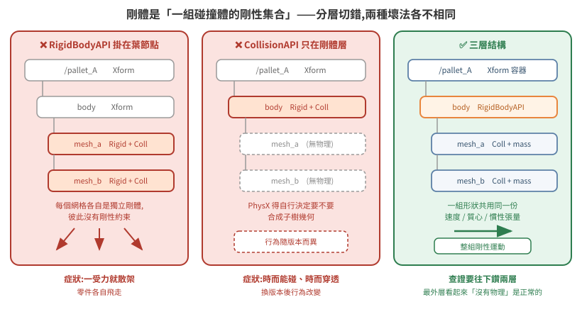

# 場景資產的物理結構:剛體分層、質量配置與材質綁定

[04 篇](../04-physics-world/README.md)講怎麼把場景變成能跑物理的世界,[09 篇](../09-physics-simulation-fundamentals/README.md)講物理引擎內部怎麼算。本篇處理兩者之間那一層:**同樣是「加了 RigidBody 和 Collider」的場景,為什麼有的能穩定夾持搬運,有的一轉彎就滑掉、一叉就散架**。

差別幾乎全在 prim 階層怎麼切、質量怎麼配、以及物理材質有沒有真的綁上去。這三件事的共同特徵是:**設錯不會報錯**,只會在動力學行為上表現成一堆看似無關的症狀。

官方文件:[OpenUSD UsdShadeMaterialBindingAPI](https://openusd.org/dev/api/class_usd_shade_material_binding_a_p_i.html)、[UsdShade Material Assignment 白皮書](https://openusd.org/release/wp_usdshade.html)、[UsdPhysics schema](https://openusd.org/dev/api/usd_physics_page_front.html)、[Rigid Body Physics in USD 提案](https://openusd.org/release/wp_rigid_body_physics.html)。API 版本以 Isaac Sim 4.5–5.1.x 為準。

## 1. 根本問題:剛體不是「一個物件」,是「一組碰撞體的剛性集合」

新手直覺是「一個物件 = 一個 prim = 加 RigidBody + Collider」。這個直覺在單一方塊上成立,一旦物件由多個網格組成就立刻崩潰。

從第一性原理看:PhysX 求解的對象是**剛體**——一個有質量、質心、慣性張量、單一速度與角速度的動力學單位。碰撞偵測的對象是**碰撞形狀**(convex hull、SDF mesh…),而一個剛體允許掛多個碰撞形狀。這兩件事在數學上就是分開的:速度積分作用在剛體上,接觸約束作用在形狀上。

USD 於是把它表達成階層:**RigidBodyAPI 掛在父節點,CollisionAPI 掛在子網格**。父子關係在這裡不是組織上的方便,而是**「這些形狀共用同一組動力學狀態」的宣告**。

由此可以直接推出兩個錯誤各自會怎麼壞:

| 錯法 | 為什麼壞 | 症狀 |
|---|---|---|
| RigidBodyAPI 掛在**每個葉網格**上 | 每個網格變成獨立剛體,彼此沒有剛性約束 | 一被外力作用就**散架**,零件各自飛走 |
| CollisionAPI **只**掛在剛體那層 | PhysX 得自行決定要不要合成子樹幾何,行為隨版本而異 | 有時能碰、有時穿透,換版本後行為改變 |

所以可搬運物件的標準結構是三層:

<p align="center"></p>

```
/pallet_A                          Rigid=False Coll=False   ← 純 Xform,只放位姿
└── /pallet_A/body                 Rigid=True  Coll=False   ← RigidBodyAPI 在這層
    ├── pallet_mesh                Rigid=False Coll=True  mass=20.0
    ├── cargo_box                  Rigid=False Coll=True  mass=20.0
    └── Looks                      Rigid=False Coll=False   ← 外觀材質
```

三層各自的職責:

1. **最外層 Xform** —— 場景組裝用的容器,只有 transform。外部程式(重置、擺位腳本)動的是這層。
2. **中間層 RigidBodyAPI** —— PhysX 眼中的一個剛體。動力學積分、質心、速度掛在這層。
3. **葉層 CollisionAPI + MassAPI** —— 實際參與碰撞偵測的幾何,各自帶質量,PhysX 合成出總質量與慣性張量。

### 這對「查證」的直接含意

查一個物件「有沒有物理」時,**只看你在 Stage 樹上點到的那一個 prim 一定會誤判**。上面範例的 `/pallet_A` 是 `Rigid=False Coll=False`,看起來像完全沒設物理,真正的設定在下面兩層。

**至少往下鑽兩層**,而且最好寫成一支 dump 指令,一次印出整棵子樹的 `Rigid` / `Coll` / `mass`。這件事值得自動化的原因不是省時間,是**人工逐層點選時很容易在第一層就下結論**。

### 同一場景可能兩種寫法並存

```
/World/forklift                    Rigid=False Coll=False
└── main/
    ├── fork_lift                  Rigid=True  Coll=True  mass=50.0   ← 剛體與碰撞同層
    └── fork_tilt                  Rigid=True  Coll=False mass=100.0  ← 分層
        ├── fork_tilt_geom         Rigid=False Coll=True
        └── camera_link            Rigid=False Coll=False             ← 無物理
```

承重的叉齒是剛體與碰撞同層(單一網格,合法),傾斜架則是分層。同一台機構上兩種寫法並存,通常是模型從 CAD 分批轉檔留下的差異。這不是錯誤,但**查設定時不能假設整個場景風格一致**。

至於感測器掛載點沒有任何物理 API——這是正確的。感測器 frame 是座標參考,不該參與碰撞。

## 2. 質量比:叉取穩定性的隱藏參數

實測值:

| Prim | mass |
|---|---|
| 叉齒 | 50.0 kg |
| 傾斜架 | 100.0 kg |
| 被搬物本體 | 20.0 kg |
| 被搬物上方貨物 | 20.0 kg |

為什麼質量比重要,可以從接觸求解的角度看:solver 是疊代的(見 [09 篇 §5](../09-physics-simulation-fundamentals/README.md)),每次疊代都在修正約束違反量。當兩個接觸物體的質量同量級時,一方的修正會顯著推動另一方,下一次疊代又要反過來修正——**在有限疊代次數內收斂得慢,表現為互推震盪**。質量差距拉開後,重的一方近似不動,輕的一方單向收斂,穩定得多。

實測配置是叉齒 50 kg 對被搬物 20 kg(2.5:1),配合高摩擦材質可穩定夾持。

**症狀對照**:被搬物質量調到與機構同量級以上、摩擦又沒跟著提高,典型表現是「叉起來了,但一轉彎就滑掉」。這時候去調 solver 疊代次數通常只能緩解,調質量比與摩擦才是治本。

## 3. 物理材質:USD 的 purpose 機制,以及它為什麼會騙你

### 根本問題:一個 prim 上會綁不只一種材質

USD 的材質綁定不是單一插槽。同一個 prim 可以同時綁「渲染用的外觀材質」與「物理用的摩擦/彈性材質」,兩者透過 **material purpose** 區分。這個設計是必要的:視覺與物理是兩套完全獨立的屬性,一個橡膠外觀的物件在物理上可能被刻意設成無摩擦。

UsdShade 白皮書把 `full`(最高保真的最終算圖)與 `preview`(服務於操作、建模、即時播放)訂為 canonical 值,加上 fallback 的 `allPurpose`(空 token),並明文「We see no reason to limit the possible purposes」——**purpose 是可擴充的**。UsdPhysics 正是用了這個擴充點(逐字):

> USD Physics materials are bound in the same way as graphics materials using UsdShadeMaterialBindingAPI, **either wih no material purpose or with a specific "physics" purpose.**

(原文的 `wih` typo 保留。)對應到 usda 就是 `rel material:binding:physics = </World/Looks/RegularMaterial>`。

`UsdShade.MaterialBindingAPI(prim).ComputeBoundMaterial(purpose)` 是「解析出這個 purpose 下實際生效的材質」的官方入口。**Python 版與 C++ 版的回傳不同**,官方明文:

> The python version of this method returns a tuple containing the bound material and the "winning" binding relationship.

> ⚠ `MaterialBindingAPI.GetMaterialPurposes()` 官方只寫「Returns a vector of the possible values for the 'material purpose'」,**沒有逐字列舉內容**。要知道當前 USD 版本認哪些值,呼叫它印出來,不要憑印象寫死一份清單。

### 陷阱:它幾乎不會回 None

這裡是最容易誤判的地方,而且它是**官方解析規則的直接後果**,不是實作 bug。官方對材質解析的第 3 條規則寫得很清楚(逐字):

> The purpose of the resolved material binding must either match the requested special (i.e. restricted) purpose **or be an all-purpose binding**. The restricted purpose binding, if available is preferred over an all-purpose binding.

也就是:查詢 `physics` purpose 時,若該 prim 上**沒有**綁物理材質,解析會合法地退回 **`allPurpose` 的那個渲染材質**——你拿到一個非 `None` 的結果,程式看起來一切正常,但 PhysX 用的是預設摩擦值。

**判準不能是「有沒有回傳東西」,必須是「回傳的東西是不是 PhysicsMaterial」:**

```python
from pxr import UsdShade, UsdPhysics

mat, _rel = UsdShade.MaterialBindingAPI(prim).ComputeBoundMaterial("physics")
bound = bool(mat) and mat.GetPrim().HasAPI(UsdPhysics.MaterialAPI)
#                     ^^^^^^^^^^^^^^^^^^^^^^^^^^^^^^^^^^^^^^^^^^^^^^^
#                     這一段才是真正的判準
```

### 第二個陷阱:綁在 Xform 上完全無效,且不報錯

物理材質只對**碰撞形狀**有意義——摩擦係數描述的是接觸面的行為,沒有碰撞形狀就沒有接觸面。把材質綁在中間的 Xform 或剛體層上,USD 會老實記錄這個綁定關係,PhysX 則完全不理會。

所以補綁時的篩選條件必須包含 `HasAPI(UsdPhysics.CollisionAPI)`:

```python
for p in stage.Traverse():
    if not p.HasAPI(UsdPhysics.CollisionAPI):
        continue                              # 沒有碰撞形狀,綁了也沒用
    UsdShade.MaterialBindingAPI(p).Bind(
        phys_material,
        bindingStrength=UsdShade.Tokens.weakerThanDescendants,
        materialPurpose="physics",
    )
```

`weakerThanDescendants` 的用意:子層若有刻意設定的材質(例如某個面故意設成低摩擦),不要被這次批次補綁壓掉。**批次操作預設應該是弱綁定**——你在補一個缺失,不是在宣告權威。

## 4. 執行期補綁是診斷工具,不是交付方式

執行期(startup 腳本裡)補綁物理材質很方便,而且在診斷階段極有價值:改一行、重啟、看行為變化,不必動模型檔、不必等建模者。實測上把承載面補綁高摩擦材質後,被搬物的側向偏移從 9.3 cm 降到 1 cm 以內。

但它有三個必須寫下來的邊界:

1. **場景重載會清掉它**。任何 `open_stage()` 重載後必須重新套用,所以重置流程的結尾要包含「重新套用執行期物理設定」這一步——這是很容易漏的一步,因為重置後的第一輪通常看起來正常,問題要幾輪後才浮現。
2. **它會蓋掉建模者的意圖**。若場景物理由建模者負責,執行期覆寫就是在繞過分工。合理做法是**預設關閉、以開關啟用**,驗證有效後把結果回饋給建模者寫進模型檔。
3. **它讓「場景檔」不再是完整事實**。之後任何人拿同一份 USD 在別的環境開,行為會不一樣。

摩擦值本身怎麼選,沒有普適答案,但有一條硬約束:`staticFriction ≥ dynamicFriction`(靜摩擦不小於動摩擦,這是物理事實,反過來設會讓物體「一動就更好動」而震盪)。若數值明顯偏高是為了補償剛體模型缺少的機制(例如沒有建模叉齒表面的凸起防滑結構),**把這個理由寫在旁邊**——否則下一個人會覺得這個值不合理而「修正」它。

## 5. 素材、版本與跨機搬運

USD 的外部參照是路徑導向的。跨機搬場景只複製 `.usd` 主檔一定破圖:

- Collect 產生的整個素材目錄要一起搬,並**保持相對位置不變**(素材目錄與主檔同層);
- Collect 的 mapping 檔含每個素材的 source/target hash,是現成的完整性驗證工具,不必自建清單。

素材缺失的典型症狀是**模型變成單一顏色(通常是紅色)、貼圖全無**。判別方式是在啟動 log 中 grep MDL 材質模組缺失訊息(`could not find module`),不要靠肉眼看畫面猜。

至於版本管理,失控的典型形態長這樣:

```
scene_600.usd                 160 MB
scene_600 (copy).usd          157 MB
scene_600 (another copy).usd  157 MB   ← 與上一個位元組數完全相同
scene_full.usd                148 MB
```

`(copy)` 是檔案管理器的自動命名,不帶版本語意;相同大小的兩個檔無從判斷新舊,mtime 在複製時已失真。

紀律很簡單:**場景檔驗過就凍結,備份以 md5 + 時間戳命名,線上只留一份現行檔**。

還有一條值得單獨記:**機構行為異常時,第一步驗場景檔 md5,而不是調物理參數**。載到舊場景檔會產生所有症狀,而且每個症狀都有看似合理的其他解釋——這種錯誤的診斷成本極高,而驗 md5 只要三秒。

## 6. 一個路徑陷阱與一個診斷紀律

USD prim 路徑**大小寫敏感**。曾遇過實際 prim 名為 `/ZoneA`,而外部對映表與診斷腳本都寫成 `/zoneA`,查詢一律得到「找不到」,被誤讀成「這個區域的物件不見了」。

對策不是「小心一點」,而是**讓診斷指令在找不到時明確印出 `NOT FOUND`,而不是安靜跳過**。沉默的診斷輸出讓你分不清「不存在」與「這段程式碼根本沒跑到」——這兩者的排查方向完全相反。

同理,場景幾何與上層系統(路網、倉儲管理)的儲位是兩套獨立事實,必須有一份明寫的對映表,而且**要記錄允許誤差與理由**。沒有那行說明,下一個人看到座標差異會誤判成 bug 並開始「修正」一個本來就正確的設定。判定一個既有設定多餘之前,先重建它當初為什麼存在——這條在讀別人的場景檔時特別值得守。

## 7. 檢查清單

**剛體、碰撞與質量**

- [ ] 每個可搬物件是「Xform 容器 → RigidBodyAPI → CollisionAPI 葉節點」三層
- [ ] RigidBodyAPI **不**掛在葉節點,CollisionAPI **不**只掛在剛體層
- [ ] 質量掛在碰撞體層,並確認不是預設值
- [ ] 搬運機構與被搬物質量比拉開(範例 2.5:1)
- [ ] 感測器掛載點沒有任何物理 API
- [ ] 碰撞近似:一般件 convex hull,只有承重面才用 mesh

**物理材質(最容易漏)**

- [ ] `PhysicsMaterial` prim 集中放在固定路徑
- [ ] `staticFriction ≥ dynamicFriction`;數值偏高的理由寫下來
- [ ] 對**每一個承重接觸面**跑 `ComputeBoundMaterial("physics")`
- [ ] 判準是「回傳的是不是 `PhysicsMaterial`」,不是「有沒有回傳」
- [ ] 補綁篩選含 `HasAPI(UsdPhysics.CollisionAPI)`
- [ ] 補綁用 `weakerThanDescendants`
- [ ] 重置流程結尾**重新套用**執行期物理設定
- [ ] 驗證通過後回寫模型檔,不長期依賴執行期補綁

**素材與版本**

- [ ] 素材目錄與主檔同層,整組一起搬
- [ ] 場景檔記錄 md5,備份命名帶 md5 + 時間戳
- [ ] 行為異常時**先驗 md5** 再調參數
