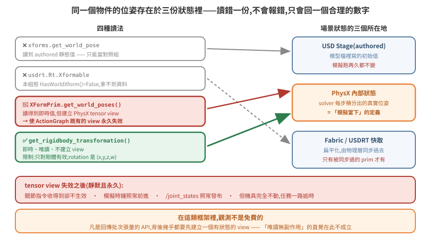
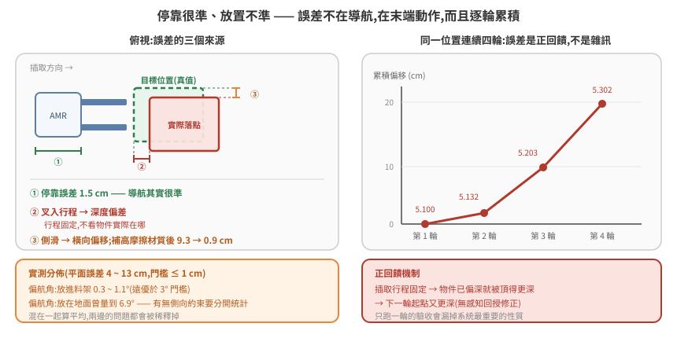

# 讀取即時位姿與放置精度驗收

「機器人有沒有在動」「東西有沒有被搬走」「放得準不準」——這三個問題都要先能讀到**模擬當下**的物體位姿。聽起來是最基本的操作,實際上是本 repo 記錄過代價最高的一個坑:同一個問題在一天內造成兩次誤判,還有一次讓整台機具永久癱瘓。

核心只有一句話:**「讀得到座標」不等於「讀到的是模擬當下的座標」。**

本篇分兩半。前半講怎麼正確讀即時位姿(以及三種不該用的讀法各自怎麼騙人);後半講有了可靠位姿之後,怎麼把「放得準不準」變成可量測、可驗收的東西。

官方文件:[omni.physx Python API(107.3)](https://docs.omniverse.nvidia.com/kit/docs/omni_physics/107.3/extensions/runtime/source/omni.physx/docs/api/python.html)、[omni.physics.tensors Python API(107.3)](https://docs.omniverse.nvidia.com/kit/docs/omni_physics/107.3/extensions/runtime/source/omni.physics.tensors/docs/api/python.html)、[isaacsim.core.prims(5.1.0)](https://docs.isaacsim.omniverse.nvidia.com/5.1.0/py/source/extensions/isaacsim.core.prims/docs/index.html)、[usdrt::RtXformable(7.5.0)](https://docs.omniverse.nvidia.com/kit/docs/usdrt.scenegraph/7.5.0/api/classusdrt_1_1_rt_xformable.html)。

本篇延伸閱讀:[04 篇](../04-physics-world/README.md)(teleport vs drive 兩條互斥控制路徑)、[09 篇](../09-physics-simulation-fundamentals/README.md)(reset 語意)、[10 篇](../10-scene-physics-authoring/README.md)(剛體分層——決定你該讀哪一層)。

## 1. 根本問題:場景狀態有不只一份

要理解為什麼「讀座標」會失敗,得先接受一件事:**Isaac Sim 執行中,同一個物件的位姿同時存在於好幾個地方**。

<p align="center"></p>

- **USD Stage(authored)** —— 模型檔裡寫的初始值。除非有人明確寫回去,否則**模擬跑再久它都不變**。
- **PhysX 內部狀態** —— solver 每步積分出來的真實位姿。這是「模擬當下」的定義。
- **Fabric / USDRT** —— 為了讓渲染與下游元件不必每幀走 USD 而設的扁平化快取。官方對 `RtXformable::HasWorldXform()` 的定義是「**Check if the Fabric prim has any world transform attributes**」——它問的是「這個 prim 在 Fabric 上有沒有被寫入 world transform 屬性」,來源可以是明確建立、`SetWorldXformFromUsd()`,或模擬端寫入,**不是**一個「有沒有被同步過」的旗標。同一頁也明寫 Fabric 是 USD 之上的 transient store,寫進 Fabric 的值不會自動推回 USD stage。

讀 authored 值不會報錯,因為那是一個合法且存在的數字。它只是回答了另一個問題:「這個物件當初被擺在哪」。

於是會得到這種結論:「任務派下去了、狀態機在跑,但機具完全沒動」——實際上它跑得好好的,只是你在問模型檔而不是問物理引擎。

## 2. 四種讀法的實測結果

| 方法 | 即時? | 副作用 | 判定 |
|---|---|---|---|
| `isaacsim.core.utils.xforms.get_world_pose` | ❌ authored 靜態值 | 無 | 只能當對照組 |
| `usdrt`(Fabric)`Rt.Xformable` | ❌ 本組態 `HasWorldXform()=False` | 無 | 視 app 組態而定,不可預設可用 |
| `isaacsim.core.prims.XFormPrim.get_world_poses()` | ✅ 即時 | 🔴 我們的組態下觀察到 simulation view 失效(機制未定,見 §3) | **長駐腳本避用** |
| `omni.physx` 的 `get_rigidbody_transformation(path)` | ✅ 即時 | 無(唯讀查詢) | ✅ **正解** |

正解的用法:

```python
from omni.physx import get_physx_interface

r = get_physx_interface().get_rigidbody_transformation(prim_path)
# {'ret_val': True,
#  'position': carb.Float3(x, y, z),
#  'rotation': carb.Float4(x, y, z, w)}
```

官方對這支 API 的說明(Omni PhysX 107.3 Python API,逐字):

> Gets rigid body current transformation in a global space. […] `'ret_val'` : bool - whether transformation was found;
> `'position'` : float3 - rigid body position; `'rotation'` : float4 - rigid body rotation (**quat - x, y, z, w**)

### ⚠ `ret_val=True` 不代表值可用

官方寫 `ret_val` 是「whether transformation was found」,直覺會把它當成成功旗標。**實測不是。**

對一個**非剛體**的 prim(articulation 的根 Xform)呼叫,實測得到:

```python
{'ret_val': True,
 'position': carb.Float3(4.0356e-41, -3.806e+09, 3.20449e-41),
 'rotation': carb.Float4(2.52234e-44, 0, -1.4203e-21, 4.59135e-41)}
```

旗標是 `True`,位置卻是 `-3.8e+09`(場景只有幾十公尺),四元數范數約等於 0——這是**未初始化
記憶體**。同一支 API 對真剛體回傳的值完全正常。

所以呼叫端必須自己驗數值:

```python
def _pose_is_sane(pos, rot):
    vals = [float(pos[0]), float(pos[1]), float(pos[2])]
    q = [float(rot[i]) for i in range(4)]
    if not all(math.isfinite(v) for v in vals + q):
        return False
    if max(abs(v) for v in vals) > 500.0:      # 遠超場景尺度
        return False
    n = math.sqrt(sum(v * v for v in q))
    return 0.5 < n < 2.0                        # 垃圾四元數范數 ≈ 0
```

### 這個 bug 怎麼被掩蓋的(比 bug 本身更值得記)

垃圾座標餵給跟隨鏡頭之後,畫面**沒有**飛到宇宙深處——因為鏡頭位置外面包了一層保護性的
`clamp()`,把 x/y 夾回場景範圍。實際看到的是:鏡頭固定在場景邊界的某個角落,角度一直很奇怪。

於是診斷結論變成「跟隨鏡頭參數沒調好」,往調參數的方向走了很久,真正的問題卻是**位姿來源
根本是垃圾**。

> **保護性 clamp 會把「壞掉」偽裝成「沒調好」。** 排查一個「輸出不太對但也不離譜」的元件時,
> 先確認中間有沒有 clamp / 預設值 / fallback 把異常吸收掉了;必要時暫時關掉,或把夾之前的原始值
> 印出來。防禦性程式碼保護了系統,同時也銷毀了證據。

### 其他限制

- **只對剛體有效**。非剛體要靠上面的數值檢查擋下來——這正是 §4 的陷阱;
- 場景重載後、物理物件尚未註冊完成時呼叫,log 會印
  `SimulationInterface function could not locate any objects at the specified path`。屬時序問題(無害),但**真值擷取要延後到物理就緒之後**。

> **版本邊界**:上述條目在 omni.physx 107.x 的官方 Python API 文件中可查到;110.1 的索引已查不到 `omni.physx.bindings._physx.PhysX` 這個 class 的條目,而官方**沒有**發出廢止或改名聲明。引用時請標死版本,不要寫成「已移除」。

### 四元數順序在同一個技術棧裡是分裂的

這一點兩邊都有官方明文,而且**方向相反**:

| API | 官方寫的順序 |
|---|---|
| `omni.physx` `get_rigidbody_transformation` | `quat - x, y, z, w`(scalar-last) |
| `isaacsim.core.prims.*.get_world_poses()` | `quaternion is scalar-first (w, x, y, z)` |

所以不能記成「Isaac Sim 的四元數是某種順序」——**要記成「這支 API 的四元數是什麼順序」**。轉換時漏了重排,會得到一個看起來合理、但旋轉錯誤的結果;而這種錯誤在 yaw 接近 0 時完全看不出來,通常要等到轉彎才炸。

## 3. simulation view 失效:一次事故,以及它的官方邊界

### 事故本身

在長駐的 exec 腳本裡加入 `isaacsim.core.prims.XFormPrim(path).get_world_poses()` 來取位姿之後,log 開始出現:

```
[omni.physx.tensors.plugin] Simulation view object is invalidated and cannot be used again
                            to call getDofPositions
[Ros2JointStateMessage] Failed to get dof positions
ArticulationController: Failed to get DOF position targets from backend
```

**後果是永久且靜默的**:此後關節指令收得到卻不會生效。最惡毒的地方是——模擬時鐘照常前進、`/joint_states` 照常發布(還讀得到真實 DOF 值)、log 除了上面那幾行之外一切正常,但機具完全不動,任務一路逾時中止。單純重啟模擬器不一定能救,實測要走完整場景重載流程才恢復。移除這段呼叫後不再復發。

### 但「XFormPrim 建立了 tensor view」這個因果,官方文件不支持

這是本篇最需要誠實標註的一段。查證官方 5.1.0 API 文件後:

- `XFormPrim.get_world_poses()` 的參數 `usd` 官方寫的是「True to query from usd. Otherwise False to query from **Fabric** data」——**沒有提到 tensor API**;
- `XFormPrim.initialize()` 的說明是「Create a physics simulation view […] using the PhysX tensor API」,但緊接著一句 **「Note: For this particular class, calling this method will do nothing」**;
- 對照組:子類 `RigidPrim.initialize()` 就**沒有**那句「do nothing」,並額外警告每次 hard reset(Stop + Play)之後必須重新呼叫才能再互動。

也就是說,**官方文件上明文與 tensor API 綁定的是 `RigidPrim` / `Articulation` 這類子類,不是 `XFormPrim`**。

官方對「view 何時失效」的記載(`omni.physics.tensors`,逐字):

> The simulation view can become invalid under certain conditions such as when a physX object participating in tensorization is **removed from the backend**. […]
> `invalidate()` […] This is needed when **the topology of the stage changes** and the existing views of the physics objects cannot be used anymore.

另外值得標註的是:`Simulation view object is invalidated…` 這個確切字串**只出現在 runtime 錯誤訊息、開發者論壇與 GitHub issue**,查不到官方文件出處——它是實際訊息,不是文件用語。

**所以正確的結論是比較弱的一條**:在我們這個組態下,引入該呼叫與 view 失效之間有可重現的相關性,但確切機制未確認(可能經由 stage topology 變動,也可能經由其他路徑)。**不要把「XFormPrim 讀位姿 → 建立 tensor view → 弄壞 ActionGraph」當成已證實的機制傳下去。**

### 可以安全帶走的規則

即使機制未定,下面這條在官方文件上是站得住的,而且已足夠指導實作:

**長駐的 exec 腳本裡,取位姿優先用 `omni.physx` 的唯讀查詢,避免 `isaacsim.core.prims.*`、`SimulationContext`、`ArticulationView` 這類明文與 PhysX tensor API 綁定的類別——即使「只是想讀個座標」。**

以及一條更通用的直覺修正:

> **在這類框架裡,觀測未必是免費的。** 回傳批次張量的 API 背後常常需要一個有狀態的 view,而 view 會因 stage 變動而互相作廢。「唯讀操作應該無副作用」這個來自一般軟體的直覺,在模擬框架裡不能預設成立——它可能成立,但要驗過。

## 4. 雙胞胎陷阱:讀對 API,讀錯層

在**關節驅動(articulation)**的場景裡,機具是靠 `world_x` / `world_y` / `world_yaw` 這類關節移動的——**根 Xform 永遠停在 authored 位置**。這是關節驅動的定義使然,不是 bug。

被搬物同理,而且更隱蔽(見 [10 篇 §1](../10-scene-physics-authoring/README.md)):

```
/target_object                     ← Xform,無物理 API(讀它永遠不動)
└── /target_object/target_object   ← RigidBodyAPI  ← 要讀這層
    ├── /mesh_a                    ← CollisionAPI + mass
    └── /mesh_b                    ← CollisionAPI + mass
```

**這個錯誤和 §1 讀到 authored 值的症狀一模一樣(數字不變),原因卻完全不同。** 量測前先確認「哪一層才是會動的那個」:查 `RigidBodyAPI` 落在哪層,或直接對照 ROS TF 的 `base_link`。

同一個陷阱會咬第二次,而且咬在意想不到的地方:**跟隨鏡頭**。把鏡頭綁在機具根 Xform 上,查詢靜默失敗、退回 authored 值,鏡頭就永遠定在初始位置。畫面上看起來像「鏡頭壞了」或「鏡頭參數沒調好」,實際上是位姿來源錯了——會讓人往完全錯誤的方向調參數。跟隨目標一定要指向剛體層。

## 5. 從「能讀」到「能驗收」

有了可靠的即時位姿,才談得上精度驗收。驗收門檻由使用端決定(此處範例:平面誤差 ≤ 1 cm、偏航角 ≤ 3°,100 次要成功 99 次)。要對這個門檻負責,量測管線得先自證可信:

```
場景載入 → 擷取每個物件的真值姿態(authored,建模者擺好的位置)
         → 每次放置後讀即時姿態(§2 的正解)
         → 算 dxy / dyaw,dyaw 對 180° 取模(方形物件對稱)
         → 靜置時應全為 0  ← 校正步驟,不可省
```

**最後一步是整條管線的地基。** 量測工具自己有 bug 的機率,不會低於被量測系統有 bug 的機率;量到 0 才代表你後續量到的非 0 是真的。

實作上把這三個動作做成模擬器內的指令(掛在一個 UDP 監聽埠上即可,見 [02 篇](../02-python-no-ui/README.md)),就能在不重啟、不開 GUI 的情況下隨時取樣,也能塞進自動化迴圈。

## 6. 實測數據:誤差在哪裡,不在哪裡

| 指標 | 實測 | 門檻 | 讀法 |
|---|---|---|---|
| 偏航角誤差 | 0.3 ~ 1.1°(放進料架) | ≤ 3° | 遠優於門檻 |
| 偏航角誤差 | 曾量到 6.9°(放在地面暫存位) | ≤ 3° | ⚠ 情境不同要分開統計 |
| 平面誤差 | 4 ~ 13 cm | ≤ 1 cm | 差一個數量級 |
| 機具停靠誤差 | 1.5 cm | — | **導航其實很準** |

<p align="center"></p>

最後一列是整張表的關鍵:**停靠準、放置不準,代表誤差不在導航,而在末端動作**——插取行程的深度,加上被搬物在承載面上的側滑。往導航參數去調,方向就錯了。

分情境統計也不是形式主義,而且它給出了一個機制上的解釋。同一套動作的兩種情境實測:

| 情境 | 平面誤差 | 偏航角誤差 |
|---|---|---|
| 放進料架(有側向約束) | 4 ~ 13 cm | 0.3 ~ 1.1° |
| 放在地面暫存位(無約束) | 4.7 cm | **4.6°**(另一次量到 6.9°) |

平面誤差同量級,偏航角差了近一個數量級。原因不難推:**料架的槽位幾何本身會把被搬物擺正**
——放進去的過程中,側板與導軌構成被動約束,機具的航向誤差被吸收掉了。地面沒有任何東西做這件事,
**機具停靠時的航向誤差就原封不動轉移到被搬物上**。

這個推論還有一個佐證:地面那次的誤差分解是 x 差 0.6 cm、y 差 4.6 cm、yaw 差 4.6°——
橫向幾乎沒差,誤差集中在「沿著走道方向 + 轉角」,正是航向偏差的特徵,不是插取行程的特徵。

**含意**:兩種情境要往不同方向修。料架放置修插取行程(見 §7),地面放置修**停靠航向**——
改插取參數對它幾乎沒有幫助。這是分情境統計唯一能告訴你的事,合併算平均就看不到了。

## 7. 誤差會累積,而且是正回饋

連續四輪同一個位置的平面座標:

```
5.100 → 5.132 → 5.203 → 5.302     (每輪往深處推 5 ~ 10 cm)
```

機制很簡單:**插取行程是固定的**,不看被搬物實際在哪。物件若已經偏深,這一輪就被頂得更深,下一輪起點又更深——沒有任何感知回授去修正它。

這對驗收方式有直接影響:**單次量測會給出過於樂觀的結果**,要看連續 N 次的漂移曲線。一個只跑一輪就宣稱「誤差 5 cm」的驗收,漏掉了系統最重要的性質。

## 8. 兩個失敗的修法(都值得記下來)

### ❌ 收緊控制容差 —— 反而惡化

直覺是「容差設小一點就會停得更準」。實測從 5.7 cm **惡化到 18.2 cm**。

原因是控制器有個 soft-pass 退路:主要容差達不到時,退到一個寬鬆得多的次要容差(此例 8 cm)放行。把主要容差設得太緊 → 幾乎每次都達不到 → 每次都走退路 → **實際精度由退路決定**,比原本更差。

> **通則:調一個閾值之前,先確認它失敗時系統會做什麼。** 很多控制器的「更嚴格」實際上是「更常觸發退路」,而退路的參數往往沒人在調。

### ⚠ 補綁高摩擦材質 —— 只治一半

把承載面補綁高摩擦物理材質後,**側向偏移從 9.3 cm 降到 1 cm 以內**,深度累積則完全沒改善。這個結果是合理的:摩擦治的是滑動,治不了「行程固定所以一直往前頂」。

它同時也是一個提醒——修法有效不代表你找對了根因,只代表你消掉了其中一個分量。詳見 [10 篇 §4](../10-scene-physics-authoring/README.md) 關於執行期補綁的邊界。

## 9. 止血門檻的反直覺之處

治本方向是明確的:**讓插入深度依被搬物實際位置修正**(有了 §2 的即時位姿就做得到),或讓放下動作收尾時不推擠。

在治本之前需要止血:量測最大漂移,超過門檻就自動跑一次完整場景重置。

門檻怎麼訂有個反直覺的細節——**不能設在理想值**。單次放置誤差本身就有 5 ~ 7 cm,連重置流程自己的自測搬運也會製造同量級誤差。門檻設在 8 cm 會變成每輪都觸發,而一次重置要好幾分鐘;實測到 20 cm 漂移時仍能正常插取,所以取 15 cm 留邊際。

> **止血門檻要訂在「還能正常運作的上緣」,不是訂在「理想值」。** 訂在理想值的結果是止血機制本身變成故障源——它會比它要防的問題更常打斷你。

## 10. 可以照抄的驗收清單

- [ ] 即時位姿讀法通過**靜置全 0** 校正
- [ ] 讀的是掛 `RigidBodyAPI` 的那一層,不是根 Xform
- [ ] 四元數分量順序確認過(`get_rigidbody_transformation` 回 x,y,z,w)
- [ ] 真值來源明確,且場景重載後會重新擷取
- [ ] 對稱物件的角度誤差取模
- [ ] 不同放置情境(有側向約束 / 無)分開統計
- [ ] 看連續 N 次的漂移曲線,不看單次
- [ ] 每個調參假設都有前後對照數據,**失敗的假設也記錄**
- [ ] 止血門檻訂在「還能運作的上緣」並實測驗證過
- [ ] 長駐腳本取位姿走 `omni.physx` 唯讀查詢,未使用與 PhysX tensor API 綁定的類別
