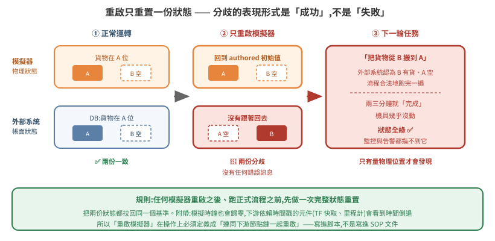
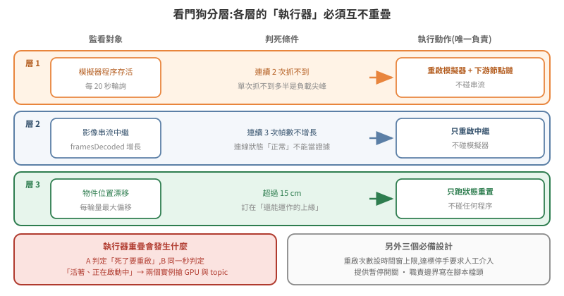

# 長跑維運:狀態分歧、看門狗分層與靜默失敗

把模擬跑起來,和讓它連續跑一整天不出事,是兩件不同的工程。前者的失敗是明顯的(崩潰、錯誤訊息、畫面全黑),後者的失敗多半是**靜默的**——系統看起來一切正常,只是做的事情不對。

本篇記錄的都是「第二次遇到才發現自己第一次就該記下來」的東西:重啟造成的兩份狀態分歧、看門狗互相打架、串流凍在最後一幀,以及三個吃掉最多時間的環境陷阱。

延伸閱讀:[06 篇](../06-webrtc-streaming/README.md)(WebRTC 單 client 限制與 relay 分流)、[09 篇 §7](../09-physics-simulation-fundamentals/README.md)(reset 到底重置了什麼)、[11 篇](../11-live-pose-and-accuracy/README.md)(漂移量測)。

## 1. 根本問題:狀態不只存在於模擬器裡

一個接進外部系統的模擬,至少有兩份狀態:

- **模擬器持有的物理狀態** —— 東西實際在哪;
- **外部系統持有的帳面狀態** —— 資料庫認為東西在哪。

正常運轉時兩者靠事件同步。但**重啟只會重置其中一份**。

模擬器重啟後,場景回到 authored 初始狀態:所有被搬物回原位。外部系統的帳面沒有跟著回去——它還記著「這個位置是空的、那個位置有貨」。

<p align="center"></p>

**症狀非常有欺騙性**:下一輪任務兩三分鐘就「完成」了,機具幾乎沒動。因為外部系統認為要搬的東西已經在目的地,整條流程合法地空轉一遍,狀態全綠、沒有任何錯誤。

> 這種失敗難抓的原因是:**分歧的表現形式是「成功」,不是「失敗」。** 監控、告警、狀態碼全都指不到它,只有實際看畫面或量物理位置才會發現。

**規則:任何模擬器重啟之後、跑正式流程之前,先做一次完整狀態重置(把兩邊都拉回同一個基準)。** 不要只重啟模擬器就接著跑。

### 附帶效應:模擬時鐘歸零

重啟模擬器後,模擬時鐘從 0 開始。下游任何依賴時間戳的元件(TF 快取、里程計、狀態機)都會看到時間倒退,典型症狀是 `TF_OLD_DATA` 洗版,而下游節點本身沒有崩潰、看起來還活著。

**所以「重啟模擬器」在操作上必須定義成「連同下游節點鏈一起重啟」**,不能只重啟模擬器本身。把這件事寫進重啟腳本,而不是寫進 SOP 文件——寫進文件的步驟遲早會被跳過。

## 2. 看門狗:分層,而且職責邊界要寫在檔頭

系統跑久了會不知不覺長出好幾隻看門狗:一隻盯模擬器、一隻盯串流、一隻盯資料。它們互相打架的方式很難查——A 判定服務死了要重啟,B 在同一秒判定它活著且正在啟動中,於是兩個實例同時搶 GPU 和同一組 ROS topic。

可行的做法是分層,**每層的執行器不重疊**:

<p align="center"></p>

| 層 | 監看對象 | 執行動作 | **不做** |
|---|---|---|---|
| 1 | 模擬器程序存活 | 重啟模擬器 + 下游節點鏈 | 不碰串流 |
| 2 | 影像串流中繼 | 只重啟中繼 | 不碰模擬器 |
| 3 | 狀態漂移(見 [11 篇 §9](../11-live-pose-and-accuracy/README.md)) | 只跑狀態重置 | 不碰任何程序 |

四個必備設計,每一個都對應一次實際踩過的坑:

1. **判死用連續 N 次抓不到,不是單次** —— 單次抓不到多半是負載尖峰,不是死亡。
2. **重啟次數設時間窗上限**,達上限停手要求人工介入。無限重啟會把「一次可修的故障」變成「整夜的 GPU 空轉」。
3. **提供暫停開關**(一個檔案就夠),手動維護前先按 —— 否則你在手動重啟時,看門狗也在重啟,兩個實例搶資源。
4. **職責邊界寫在腳本檔頭** —— 三個月後回來看的人包括你自己。

上限值要留餘裕。我們一開始設「每小時 3 次」,結果做 A/B 測試時被自己的看門狗鎖住,還誤以為是別的問題。**調試期的重啟頻率本來就會高於正常運轉**,把上限訂在正常運轉的經驗值會反過來妨礙你除錯。

## 3. 靜默失敗:串流凍在最後一幀

WebRTC 連線中斷後,瀏覽器端的畫面會**凍在最後一幀**,而連線狀態可能還顯示正常。觀眾看到的是一張靜止的圖,不是錯誤訊息——展示現場最糟的失敗模式,因為沒有人會發現。

不能等它報錯,要主動偵測。可用的活性訊號是 `getStats()` 裡的 `framesDecoded`:**連續 N 次沒有增長就判定卡住**,主動重建連線。

```js
// 3 秒輪詢一次,連續 3 次 framesDecoded 沒增長 → 重建連線
// 實測:12 秒偵測 + 40 秒恢復
const stats = await conn.getStats()
let frames = 0
stats.forEach(r => { if (r.type === 'inbound-rtp' && r.kind === 'video') frames = r.framesDecoded })
if (frames === lastFrames) { stalled += 1 } else { stalled = 0; lastFrames = frames }
if (stalled >= 3) restart()
```

> **通則:凡是「靜默降級」比「明確失敗」更常見的元件,都要自己造一個活性訊號。**
> 連線狀態正常、程序還活著、日誌沒有 ERROR —— 這三個都不足以證明它在工作。

同一個原則適用於串流品質退化:長跑幾小時後畫面幀率可能悄悄從 60 fps 掉到個位數,而所有狀態指標仍然正常。定期重啟中繼比事後排查便宜得多。

## 4. 三個重複踩到的環境陷阱

這一節不談模擬,談的是圍繞它的殼層腳本。這些錯誤的共同點是**錯誤訊息完全指不到真正的原因**。

### 對著舊 log 下判斷(踩了五次)

同一個服務可能由手動、看門狗、自癒腳本三個來源啟動,各自寫不同檔名的 log。你啟動時指定的那個檔案,常常早就被別人取代,內容停在幾分鐘前——而你正對著它推理當下的行為。

**解法是不要猜檔名,從程序反查它的 stdout 實際寫到哪:**

```bash
pid=$(pgrep -f '<pattern>' | head -1)
readlink -f /proc/$pid/fd/1      # 這個程序的 stdout 真正指向哪個檔案
```

把它包成一支 `logs.sh`,規定所有人(包括自動化腳本)只透過它看 log。這比「記得檢查檔案時間戳」可靠,因為前者是機制,後者是紀律。

### `pkill -f` 匹配到自己(踩了六次,每次都斷線)

`pkill -f isaac` 會匹配到**你自己這行 ssh 指令**,於是把自己殺掉(exit 255)。

常見的規避寫法是括號 `pkill -f '[i]saac'`——但它只在**指令列裡沒有出現該字串**時才有效。如果同一行還寫了 `/path/to/isaac_watchdog.sh`,照樣自匹配,而且看起來像是「括號寫法失效了」。

**解法:把 kill 動作和含有該路徑的動作拆到不同次執行。** 這比想一個更聰明的正規表示式可靠——你對抗的是「指令列本身也是被搜尋的文本」這個事實,不是某個特定字串。

### zsh 不對未加引號的變數斷詞

這是 zsh 與 bash 最容易踩到的核心差異:

```bash
ARGS="--param-a 1 --param-b 2"
some_command $ARGS          # bash:展開成四個參數
                            # zsh :整串當成「一個」參數
```

在 zsh 下,下游程式會收到一個內含空白的巨大參數值,以型別錯誤啟動失敗——而錯誤訊息指向參數解析,完全指不到這裡。

需要斷詞就用 `eval`,或改用陣列 `ARGS=(--param-a 1)` 搭配 `"${ARGS[@]}"`(後者更安全)。若專案裡的啟動腳本混用 bash 與 zsh,這個差異遲早會咬人。

## 5. 一條方法論教訓

**做 A/B 測試之前,先確認自己沒有在同一時間改動別的東西。**

我們曾在「自己的診斷腳本已經把模擬弄壞了」的狀態下(就是 [11 篇 §3](../11-live-pose-and-accuracy/README.md) 那個 tensor view 陷阱),去測兩個啟動旗標對機構動作的影響。結論是「這兩個旗標會讓機構失效」——冤枉了寫那段程式的同事。重測四種組合才平反:四種組合全部正常。

> **症狀相同不代表原因相同。** 尤其當你手上同時有好幾個變因,而其中一個是你自己剛加上去的。

單變因、可重跑、有對照組——這三件事在模擬環境裡比在一般軟體裡更重要,因為模擬器的失敗大多是靜默的:沒有 stack trace 指給你看,你只能靠實驗設計把可能性一個一個排掉。而只要實驗設計裡混進了未知變因,排掉的就不是可能性,是你自己的時間。

## 6. 長跑檢查清單

**重啟**

- [ ] 重啟模擬器 = 連同下游節點鏈一起重啟(寫進腳本,不是寫進文件)
- [ ] 重啟後、跑正式流程前,先做一次完整狀態重置
- [ ] 重置流程結尾重新套用執行期物理設定(見 [10 篇 §4](../10-scene-physics-authoring/README.md))

**看門狗**

- [ ] 判死用連續 N 次
- [ ] 重啟次數有時間窗上限,達標停手
- [ ] 有暫停開關,手動維護前先按
- [ ] 同一個資源只由一層負責重啟,邊界寫在檔頭
- [ ] 上限值對調試期也夠用

**靜默失敗**

- [ ] 串流有基於 `framesDecoded` 的卡死偵測
- [ ] 每個關鍵元件都有一個「真的在工作」的活性訊號,而不只是「還活著」
- [ ] 診斷指令找不到目標時明確印出,不安靜跳過

**殼層**

- [ ] 看 log 一律從 `/proc/<pid>/fd/1` 反查,不猜檔名
- [ ] kill 動作與含目標路徑的動作分開執行
- [ ] 確認腳本實際由哪個 shell 執行,變數斷詞行為已驗證
