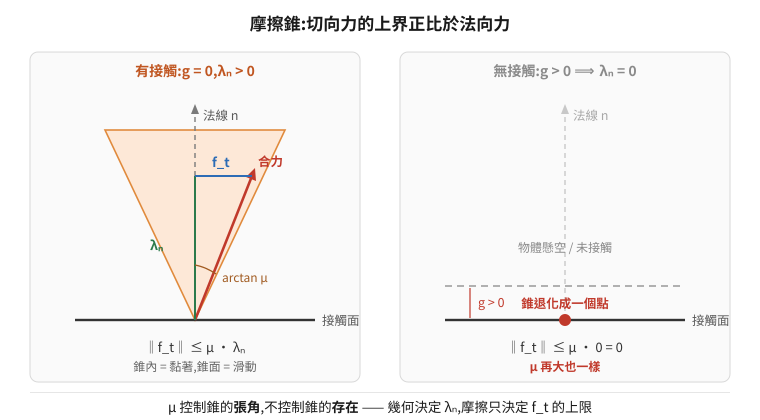
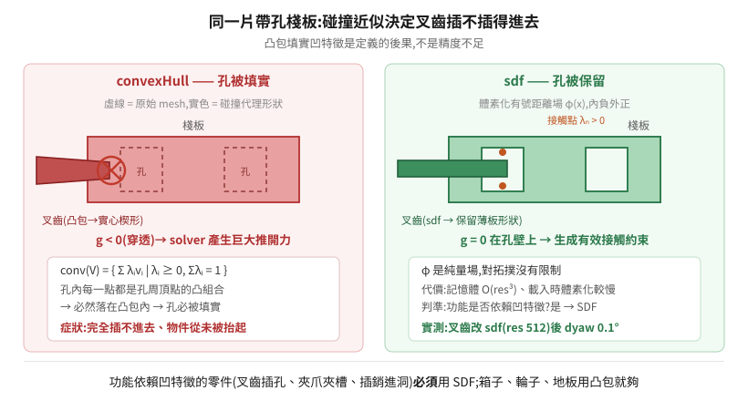

# 13 · 接觸與抓握的第一性原理:為什麼調摩擦之前必須先看幾何

夾爪夾不住、叉齒叉不起來、物件在載具上滑掉——這類問題最常見的處理順序是「調摩擦係數」。本篇要說明的是:**這個順序在相當多的情況下從一開始就錯了**,而且錯得可以從接觸力學的定義直接推出來,不必靠試誤。

推導的終點是一條很短的結論:

> **摩擦係數 μ 是一個乘數,乘在一個可能為零的量上。**

底下把這句話逼出來,然後說明它在工程上的三個後果。

延伸閱讀:[09 物理模擬基礎](../09-physics-simulation-fundamentals/README.md)(timestep、CCD、solver、PD)、[10 場景資產的物理結構](../10-scene-physics-authoring/README.md)(材質綁定、質量比)。

---

## 1. 不穿透這件事,數學上怎麼表達

兩個剛體不能互相穿透。這句話要變成數值方法能求解的東西,得先寫成約束。

定義 **gap function** `g(q)`:兩個物體最近點之間的**有號距離**(signed distance)。分開時 `g > 0`,恰好接觸時 `g = 0`,穿透時 `g < 0`。

再定義**法向接觸力大小** `λₙ`:接觸點上沿著法線方向的力。

單邊接觸(unilateral contact)必須同時滿足三個條件,合稱 **Signorini 條件**:

```
g  ≥ 0        (不穿透)
λₙ ≥ 0        (接觸力只能推、不能拉 —— 這是「單邊」的意思)
g · λₙ = 0    (互補條件)
```

第三條是關鍵。它說 `g` 和 `λₙ` **不能同時非零**:

- 物體分開(`g > 0`)→ 必然 `λₙ = 0`;
- 有接觸力(`λₙ > 0`)→ 必然 `g = 0`。

這種「兩個非負量的乘積為零」的結構叫**線性互補問題**(Linear Complementarity Problem, LCP),是所有剛體接觸求解器的骨架。PhysX、Bullet、MuJoCo 求的都是它的某種變形。

> 為什麼是互補而不是彈簧?也可以用罰函數法(penalty method):穿透多少就給多少反彈力,`λₙ = k·max(0, −g)`。這樣好寫,但 `k` 要很大才不會明顯穿透,而大 `k` 讓系統變**剛性**(stiff),需要極小的 timestep 才穩定。互補條件是**硬約束**,不需要調 `k`,代價是要解 LCP。兩條路線各有引擎採用,理解 Signorini 就理解了主流那一條。

---

## 2. 摩擦錐:切向力的上界

法向有了,切向呢?**庫倫摩擦定律**(Coulomb friction)把切向力 `f_t` 限制在一個錐體內:

**黏著(stick)**,相對切向速度 `v_t = 0`:

```
‖f_t‖ ≤ μ_s · λₙ
```

**滑動(slip)**,`v_t ≠ 0`:

```
f_t = −μ_d · λₙ · (v_t / ‖v_t‖)
```

把 `(f_t, λₙ)` 畫在空間裡,可行域是一個以法線為軸、半頂角 `arctan(μ)` 的圓錐——**摩擦錐**。力落在錐內是黏著,落在錐面上是滑動,錐外不可能。

<p align="center"></p>

### 核心推論

把 Signorini 的互補條件代進摩擦錐:

```
g > 0  ⟹  λₙ = 0  ⟹  ‖f_t‖ ≤ μ · 0 = 0
```

**沒有接觸點,摩擦力恆為零,無論 μ 設多大。**

幾何上,`λₙ = 0` 時摩擦錐退化成原點的一個點——可行域只剩下零向量。μ 控制的是錐的**張角**,不是錐的**存在**。

所以接觸問題的責任是分層的,而且順序不可交換:

| 層 | 決定什麼 | 由誰決定 |
|---|---|---|
| **幾何** | `λₙ` 存不存在(有沒有接觸點、在哪裡、法線朝哪) | 碰撞近似 + 位姿 |
| **摩擦** | `f_t` 的上界(咬住之後會不會滑) | 材質 μ + 綁定 |
| **求解** | 兩者的數值精度(殘差、抖動) | solver 迭代、質量比、timestep |

**症狀對應**:

| 症狀 | 幾乎必然是哪一層 |
|---|---|
| 完全咬不進去、物件從未被抬起 | **幾何**(`λₙ` 根本沒生成,或生成在錯的地方) |
| 抬得起來,但移動中滑掉、放下時歪 | **摩擦**(`f_t` 上界不足) |
| 抖動、下陷、接觸處嗡嗡震盪 | **求解**(迭代不足 / 質量比懸殊) |

第一列的情況下調 μ 完全沒有意義。這不是「通常沒用」,是**數學上不可能有用**。

---

## 3. `g` 是從哪裡算出來的:碰撞近似是有損編碼

上一節說「沒有接觸點就沒有摩擦」。那接觸點怎麼判定的?關鍵在於:**`g` 不是從原始 mesh 算的**。

原始 mesh 動輒數萬個三角形,每個 timestep 對每一對物體做三角形-三角形相交測試,代價不可接受。所以引擎先把 mesh **編碼成一個便於求 `g` 的代理形狀**,之後所有接觸判定都在代理形狀上做。

**這個編碼是有損的。** 損掉什麼,決定了哪些任務做不成。

| 碰撞近似 | 代理形狀是什麼 | 能表達凹陷/孔洞? | `g` 怎麼求 | 代價 |
|---|---|---|---|---|
| `convexHull` | 含所有頂點的最小凸集 | ❌ **定義上不能** | GJK / EPA,很快 | 低 |
| `convexDecomposition` | 拆成 N 個凸塊的聯集 | 部分(取決於 N) | N 次凸-凸判定 | 中 |
| `sdf` | 體素化的有號距離場 `φ(x)` | ✅ | 查表 + 三線性插值 | 記憶體 `O(res³)` |
| `boundingCube` / `boundingSphere` | 外接盒 / 球 | ❌ | 極快 | 極低 |
| `meshSimplification` | 簡化後的三角網格 | ✅ | 較慢 | 中高 |
| `none`(原始三角網) | 原始三角形 | ✅ | 慢,且**只能當靜態碰撞體** | 高 |

### 凸包為什麼對「帶孔薄板」必死

凸包的定義:

```
conv(V) = { Σ λᵢ vᵢ | λᵢ ≥ 0, Σ λᵢ = 1, vᵢ ∈ V }
```

也就是頂點集合 `V` 所有**凸組合**的集合。

現在考慮一片有叉孔的棧板。孔洞內部的任何一點,都可以寫成孔周圍那些頂點的凸組合——所以它**必然落在 `conv(V)` 內**。這不是近似誤差,是定義的直接後果:**凸包會把每一個凹特徵填實**。

於是:

- 棧板的叉孔被填成實心 → 叉齒想插入時 `g < 0`(穿透)→ solver 產生巨大的推開力;
- 叉齒本身若也是薄板 + 凸包,會被補成一個**實心楔形**,插入時同樣是「兩個實心體互相擠壓」。

結果不是「夾不緊」,是**插不進去**。而這正好落在第 2 節症狀表的第一列。

<p align="center"></p>

### SDF 為什麼能救,以及它的代價

**Signed Distance Field**:把空間切成體素,每個體素存「該點到物體表面的有號距離」`φ(x)`(內部為負、外部為正)。

它是一個**純量場**,不是一個凸集,所以對拓撲沒有任何限制——孔洞、凹槽、薄殼都能表達。`g` 直接由 `φ` 查值加三線性插值得到,不需要凸性假設。

代價:

- **記憶體** `O(res³)`。解析度 `res` 是每軸的體素數,512 對一個叉齒等級的零件是合理的;整台車或整個場景用 512 會爆。
- **建構時間**:載入時要體素化,大物件明顯變慢。
- **只對動態剛體必要**:靜態環境用 `triangleMesh` 就好,不需要付 SDF 的代價。

實務上的判準很簡單:**這個零件的功能是否依賴某個凹特徵?** 叉齒插叉孔、夾爪夾凹槽、插銷進孔——是,就要 SDF 或至少足夠細的凸分解。單純的箱子、輪子、地板——不是,凸包就夠。

---

## 4. `contactOffset` / `restOffset`:為什麼「剛好接觸」在數值上不存在

離散時間積分下,`g` 精確等於 0 幾乎不可能命中——上一步還在 `g = 0.3 mm`,下一步已經 `g = −0.5 mm`。所以引擎在物體外面包兩層殼:

- **`contactOffset`(`d_c`)**:`g < d_c` 就開始生成接觸約束。提早介入,讓 solver 有時間反應。
- **`restOffset`(`d_r`)**:靜止平衡時 `g` 收斂到 `d_r`,而不是 0。

必須 `d_c > d_r`。

- `d_c` 太小 → 高速接近時,兩步之間就跨過了整個殼層,約束根本沒被生成 → **穿模**。
- `d_c` 太大 → 物體看起來浮在空中(靜止間隙就是 `d_r`,但接觸提早生效會讓行為變軟)。

這解釋了一個常見的無效修法:**穿模不是靠加大 solver 迭代次數解決的**。迭代求解的是**已經建立**的約束;約束沒被建立時,迭代一萬次也是零。穿模要調的是 `contactOffset`、timestep,或開 CCD(見 [09 篇 §3](../09-physics-simulation-fundamentals/README.md))。

---

## 5. 質量比:被忽略的隱藏參數

接觸約束最後交給迭代式 solver(PGS / TGS)求解。它把所有約束組成一個大系統,**逐個投影、迭代 N 次**——這不是精確解,是收斂中的近似解。

兩個接觸物體的**質量比**直接影響這個系統的條件數。比值越懸殊,收斂越慢,同樣迭代次數下的殘差越大。

實測參考(堆高機叉取):叉齒 50 kg 對棧板 20 kg(2.5:1)可穩定夾持。若把被搬物調到 100 kg 以上而迭代次數不變,症狀是「叉起來但一轉彎就滑掉」——那是殘差被甩出來的,不是摩擦不夠。

所以「物件太重會滑」的正確處理不一定是加摩擦,而是先問:**質量比是多少?迭代夠嗎?** 這是第 2 節症狀表第三列的情況。

---

## 6. 實案:叉齒從 `convexHull` 改成 `sdf`

一台堆高機 AMR 在模擬裡叉不起棧板。表面症狀是「棧板在整個裝載窗口內完全沒被抬起」(z 變化 0.00007 m),AMR 空車駛離。

當時的處置順序是先調摩擦——把物理材質的 `staticFriction` 從 0.8 一路加到 5.0(木對鋼的真實值是 0.3~0.5,5.0 高了一個數量級)。結果:

| 組態 | 放置誤差 dxy | 偏航誤差 dyaw |
|---|---|---|
| μ=0.8 + convexHull | 127.6 cm | 66.3° |
| μ=5.0 + convexHull | 4~13 cm | 0.3~1.1° |

看起來「摩擦有效」,於是結論被歸給摩擦。但用 `dump_collider` 逐個查碰撞近似後發現:場景裡棧板本體、傾斜架都已經是 `sdf`,**只有承重的那根叉齒 `fork_liftA1` 是 `convexHull`**。

改成 `sdf`(resolution 512)之後:

| 組態 | dxy | dyaw |
|---|---|---|
| **μ=5.0 + sdf** | 9.7 cm | **0.1°** |

後續實測更說明問題:把高摩擦材質的**綁定**關掉(接觸面回到 PhysX 預設 μ≈0.5,那是木對鋼的合理值),**抓握依然成立**——因為幾何已經對了。μ=5.0 那個非物理值當初是在補償一個幾何錯誤。

摩擦真正的貢獻在另一個地方。同一條路線的 A/B:

| 條件 | 深度誤差(逐輪) | 橫向誤差 |
|---|---|---|
| 高摩擦材質**未綁**到承重面 | 3.2 → 10.3 → 20.2 cm | 2.1 / 1.5 / 1.4 / **9.3** cm |
| 高摩擦材質**已綁** | 7.8 → 12.9 cm | **0.0 / 0.9** cm |

**摩擦治側滑,不治深度。** 這與第 2 節的分層完全一致:`f_t` 上界提高,抑制了切向滑移;而深度誤差來自別的機制(見 §7)。

### 兩個可帶走的教訓

1. **調參順序**:幾何(碰撞近似)→ 質量與慣量 → 接觸參數(offset)→ 摩擦。順序錯了會得到一堆「有效但說不出為什麼」的魔數。
2. **「參數有值」≠「參數作用在你以為的那個面上」**。上面那個高摩擦材質確實存在、確實有 5.0/4.0,但 `ComputeBoundMaterial("physics")` 查下去,承重叉齒與棧板的綁定都指向**外觀材質**——它只綁在不接觸的傾斜架上。查生效要看綁定的解算結果,不是看材質存不存在(見 [10 篇](../10-scene-physics-authoring/README.md))。

---

## 7. 第三種誤差:開環致動對上可移動目標

上一節留了一個未解的:**深度誤差為什麼會逐輪累積**(3.2 → 10.3 → 20.2 cm),而且摩擦治不了。

機制:叉齒以**固定行程**插入。若目標已經比標稱位置偏深 `δ`,叉齒接觸到它之後仍會走完剩餘行程,把它再往裡推。下一輪的初始偏差就變大。

寫成離散動態系統:

```
x_{k+1} = x_k + Δ(x_k),   其中 Δ > 0
```

只要 `Δ` 恆正,序列**單調發散**。沒有任何摩擦或碰撞參數能改變這一點,因為問題不在接觸,在**控制迴路裡沒有負回饋項**。

三種修法,對應三種不同的工程決策:

| 修法 | 做什麼 | 性質 |
|---|---|---|
| 加感知回授 | 先量測目標實際位置,再決定插入行程 | 治本,但要有感測器/量測管線 |
| 週期性重置 | 偏差超過門檻就把場景拉回真值 | 止血,適合展示與長跑 |
| 讓目標不可移動 | 固定夾具、限位擋塊 | 改變問題本身 |

值得注意的是:**這個發散在真實世界也會發生**。真堆高機也會把棧板越推越深。模擬忠實地重現了它,這是模擬對的地方,不是模擬的缺陷。把它當 bug 去調物理參數,會白費很多時間。

---

## 8. 為什麼模擬器不會告訴你哪裡錯了

上面所有失效模式有一個共同點:**全程沒有任何錯誤訊息**。

原因是結構性的。編譯器有「合法程式」這個規格,所以能指出你違反了它。**物理求解器沒有「非法狀態」這個概念**——它的契約是「給定 `t` 的狀態,回傳 `t+Δt` 的狀態」,而 `NaN` 是一個合法的 float,`10⁶` 公尺是一個合法的座標,`λₙ = 0` 是一個合法的解。

**推論:在物理模擬裡,「沒有報錯」攜帶零資訊。**

所以除錯只能靠**主動量測**,而且要量對層:

| 要回答 | 量什麼 |
|---|---|
| 有沒有接觸 | 碰撞近似型別、接觸點數、`λₙ` |
| 咬住後有沒有滑 | 被搬物**相對承載件**的位姿(不變量),整趟連續取樣 |
| 位姿對不對 | 剛體查詢的即時世界座標 vs 真值,並確認取的是模擬值不是檔案裡的 authored 值 |
| 誤差來自哪一層 | 分解成「車體定位 / 插入深度 / 橫向滑移 / 偏航」四項分別看 |

「相對承載件的位姿」這個不變量特別重要:絕對座標在載具行進時本來就一直變,拿絕對座標看不出「東西有沒有相對夾持面滑掉」。整趟中不變 = 沒滑;單調漂移 = 真的在滑。

---

## 9. 一頁總結

```
Mesh(數萬三角形)
  │
  ▼  碰撞近似 —— 有損編碼,凸包會填實所有凹特徵
代理形狀
  │
  ▼  narrow phase:在代理形狀上求 g、接觸點、法線
g, n
  │
  ▼  Signorini:g ≥ 0, λₙ ≥ 0, g·λₙ = 0
λₙ  ────────────────┐
  │                 │
  ▼  摩擦錐          │   g > 0 ⟹ λₙ = 0 ⟹ f_t = 0
‖f_t‖ ≤ μ·λₙ  ◀──────┘   (μ 再大也一樣)
  │
  ▼  solver 迭代(PGS/TGS);質量比影響條件數
接觸力 → 積分 → 下一個狀態(永遠有解,永遠不報錯)
```

- **幾何決定 `λₙ` 存不存在;摩擦只決定 `f_t` 的上限。順序不可交換。**
- 凸包填實凹特徵是**定義的後果**,不是精度問題;功能依賴凹特徵的零件必須用 SDF。
- 摩擦治側滑,不治「插不進去」,也不治「開環行程造成的累積偏差」。
- 質量比是隱藏參數;抖動與滑脫可能是 solver 殘差,不是摩擦不足。
- 模擬器永遠給得出答案,所以「沒報錯」不是訊號。要主動量,而且要量對層。

## 相關

- [09 物理模擬基礎](../09-physics-simulation-fundamentals/README.md) — timestep/substep、CCD、joint drive PD、PGS/TGS、reset 語意
- [10 場景資產的物理結構](../10-scene-physics-authoring/README.md) — 剛體與碰撞分層、質量比、物理材質綁定與執行期補綁
- [11 即時位姿與放置精度](../11-live-pose-and-accuracy/README.md) — 讀位姿的四種方法、把放置精度變成可驗收的量測管線
