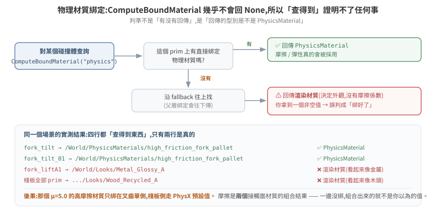
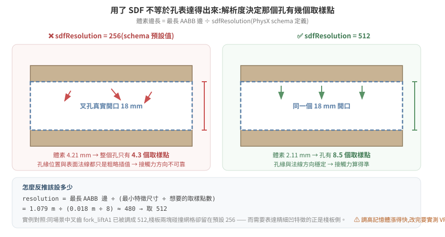

# 16 · 把 5.x 的搬運場景調到 6.0 能跑,而且東西不會亂飛

一個在 Isaac Sim 5.1 上跑得好好的搬運場景,搬到 6.0 之後開始出怪事:棧板抬不起來、抬起來又滑掉、或者一碰到就彈飛。畫面上看起來像是「物理壞了」,但模擬器**從頭到尾不會報任何錯**。

這篇從零講起:一個「會被搬動的箱子」在 USD 裡究竟由哪些東西組成、怎麼在不開 GUI 的情況下看見它們、怎麼用 VS Code 或 gvim 改、以及四個最常見的結構問題各自會表現成什麼症狀。

不需要先熟悉 Isaac Sim。需要的前置只有一個觀念,而且它是這整篇的地基:

> **物理求解器沒有「這個設定不合理」的概念。它永遠算得出一個答案,然後把答案畫給你看。**
> 所以「沒有錯誤訊息」不代表設定是對的——它什麼資訊都沒提供。

延伸閱讀:[13 接觸與抓握的第一性原理](../13-contact-and-grasp-first-principles/README.md)(為什麼調摩擦常是錯的第一步)、[10 場景資產的物理結構](../10-scene-physics-authoring/README.md)、[15 5.1 → 6.0 的物理層變動](../15-physics-backend-5.1-to-6.0/README.md)。

本篇的結構與數值來自一個真實場景(倉儲 AMR 叉取棧板),全部標了是實測還是推論。

---

## 1. 一個「會被搬走的箱子」由什麼組成

USD 場景是一棵樹,樹上每個節點叫 **prim**。prim 本身只是個位置(`Xform`)或一塊網格(`Mesh`),**它預設完全沒有物理**——你看得到它,但它不會掉、不會擋路、不會被推。

物理是靠**貼標籤**加上去的。這些標籤叫 API schema,像貼紙一樣貼在某個 prim 上:

| 標籤 | 貼上去之後 | 沒貼會怎樣 |
|---|---|---|
| `RigidBodyAPI` | 這個 prim 成為一個**剛體**:會受重力、有速度、會被推 | 它是靜止的背景,不會動 |
| `CollisionAPI` | 這塊網格會**參與碰撞偵測**:別的東西撞得到它 | 別人**直接穿過去** |
| `MassAPI` | 顯式指定質量、質心、慣性 | 由**密度 × 碰撞體體積**自動推算 |
| `MeshCollisionAPI` | 指定碰撞用什麼形狀近似(`convexHull` / `sdf` / …) | 吃預設近似 |

這四張貼紙**可以貼在不同的 prim 上**,而它們貼在哪裡,決定了物理對不對。這就是本篇後半所有問題的來源。

### 1.1 真實案例:一顆棧板

實際從場景檔讀出來的結構(讀法見 §2):

```
/target_pallet                              Xform      ← 沒有任何物理標籤
  └─ target_pallet                          Xform      [RigidBody]           ← 剛體在這層
       ├─ SM_RecycledWoodPallet_A04_01      Mesh       [Collision, Mass=20, approx=sdf]
       │    ├─ M_..._Body                   GeomSubset
       │    └─ M_..._Bolts                  GeomSubset
       ├─ Looks/Wood_Recycled_A             Material   ← 渲染材質(木頭外觀)
       └─ Cube                              Mesh       [Collision, Mass=20, approx=sdf]

bbox 最長邊 = 1.079 m
```

讀出來的事實:

- **剛體**貼在中間那層 `target_pallet`;
- **碰撞**貼在再下一層的兩塊網格上(棧板本體 + 上面那箱貨);
- **質量**也貼在那兩塊網格上,各 20 kg,而剛體那層自己沒有 `MassAPI`;
- 兩塊碰撞網格都用 `sdf` 近似。

先記住這個形狀。§4 會說明它的每一項各自埋了什麼。

---

## 2. 怎麼看見這些(不開 GUI)

場景檔動輒上百 MB、跑在遠端 GPU 機器上,開 GUI 拖來拖去不現實。有三條路。

### 2.1 為什麼 VS Code 直接打不開

先看檔案的前 16 個位元組:

```bash
$ head -c 16 AISHOW_isaac60.usd | xxd
00000000: 5058 522d 5553 4443 0008 0000 0000 0000  PXR-USDC........
```

`PXR-USDC` 是 **crate 格式**的檔頭——USD 的**二進位**序列化格式。副檔名雖然是 `.usd`,內容不是文字。用編輯器打開只會看到亂碼。

USD 其實有兩種存法,是同一份資料的兩種寫法:

| 格式 | 副檔名慣例 | 內容 | 編輯器 |
|---|---|---|---|
| **crate** | `.usd` / `.usdc` | 二進位,體積小、載入快 | ❌ 打不開 |
| **ASCII** | `.usda` | 純文字,人看得懂 | ✅ VS Code / gvim 都行 |

所以流程是:**crate → 轉成 .usda → 用編輯器改 → 轉回 crate**。

### 2.2 離線讀:把關心的那一小塊轉成文字

標準做法是 `usdcat` 這支命令列工具。⚠ **但 Isaac Sim 的容器裡沒有附 `usdcat`**(實測 `find /isaac-sim -name "usdcat*"` 回空),而 USD 的 Python 套件 `pxr` 藏在 extension 快取裡、不在預設路徑上。

要接起來,得同時設兩個環境變數:

```bash
# 在 Isaac Sim 容器內
USDLIB=$(ls -d /isaac-sim/extscache/omni.usd.libs-*/ | head -1)
export PYTHONPATH=${USDLIB}:$PYTHONPATH
export LD_LIBRARY_PATH=${USDLIB}bin:$LD_LIBRARY_PATH    # ← 少這行會 ImportError: libusd_tf.so

/isaac-sim/kit/python/bin/python3 -c "from pxr import Usd; print('pxr OK')"
```

> 只設 `PYTHONPATH` 會失敗在 `ImportError: libusd_tf.so: cannot open shared object file`——Python 模組找得到了,但它背後的 C++ 動態庫找不到。**兩個都要設。**

接起來之後就能唯讀檢視。關鍵是 `Usd.Stage.LoadNone`:

```python
from pxr import Usd, UsdGeom, UsdPhysics

# LoadNone:只讀場景結構,不把幾何資料載進記憶體 —— 126 MB 的場景才開得動
stage = Usd.Stage.Open(scene_path, load=Usd.Stage.LoadNone)
prim = stage.GetPrimAtPath("/target_pallet")
prim.Load()          # 只把這一支的內容載進來

print(prim.HasAPI(UsdPhysics.RigidBodyAPI))    # 有沒有貼剛體貼紙
print(prim.HasAPI(UsdPhysics.CollisionAPI))    # 有沒有貼碰撞貼紙

# 量 bounding box —— 算 SDF 體素大小要用它(§4.4)
cache = UsdGeom.BBoxCache(Usd.TimeCode.Default(), [UsdGeom.Tokens.default_])
size = cache.ComputeWorldBound(prim).ComputeAlignedRange().GetSize()
print("最長邊 %.3f m" % max(size))
```

> ⚠ **絕對不要對大場景用 `stage.Flatten()`。** 它把所有 layer 攤平成一份完整資料,126 MB 的 crate 攤平後是數 GB 的文字,會把磁碟塞爆。要匯出局部,用 `Sdf.CopySpec` 只複製你關心的那棵子樹。

### 2.3 線上讀:對跑著的模擬發探針

離線讀的是**檔案裡寫死的值**(authored value)。模擬跑起來之後,東西的位置每一格都在變,那個「現在在哪」不在檔案裡。

要看即時值,得對跑著的進程發查詢指令,讓它自己印出來。做法是在啟動腳本裡開一個命令通道(UDP / MQTT 都行),收到指令就查、查完 `print`。

**兩者回答的是不同問題,不能互相取代:**

| | 離線讀檔 | 線上探針 |
|---|---|---|
| 看到的 | 檔案寫死的初始值 | 模擬當下的即時值 |
| 適合問 | 結構對不對、標籤貼在哪、參數設多少 | 東西現在在哪、有沒有在動、抬起來幾公分 |
| 需要 | 停機也能讀 | 模擬必須在跑 |

---

## 3. 用 VS Code / gvim 改 USD

### 3.1 轉成文字、改、轉回去

```bash
# crate → 文字
usdcat scene.usd -o scene.usda
# (沒有 usdcat 時,用 §2.2 的 python:layer.Export("scene.usda"))

# 用你習慣的編輯器改
code scene.usda      # VS Code
gvim scene.usda

# 文字 → crate
usdcat scene.usda -o scene_new.usd
```

`.usda` 的內容長這樣,是給人看的:

```usda
def Xform "target_pallet" (
    prepend apiSchemas = ["PhysicsRigidBodyAPI"]
)
{
    def Mesh "SM_RecycledWoodPallet_A04_01" (
        prepend apiSchemas = ["PhysicsCollisionAPI", "PhysicsMassAPI",
                              "PhysxSDFMeshCollisionAPI"]
    )
    {
        float physics:mass = 20
        uniform token physics:approximation = "sdf"
        uniform int physxSDFMeshCollision:sdfResolution = 256
    }
}
```

`apiSchemas` 那一行就是 §1 講的「貼紙清單」。要讓某個 prim 變成剛體,就是把 `"PhysicsRigidBodyAPI"` 加進它的 `apiSchemas`。

**VS Code 建議裝 USD 語法高亮擴充**(搜尋 "USD" 或 "usda"),沒有的話設成 Python 或 C 的語法著色也堪用——`.usda` 的括號結構跟它們像。gvim 可以 `:set syntax=cpp` 應急。

### 3.2 但多數時候,不該改檔案

直接改 USD 有三個現實問題:

1. **場景檔通常是別人給的**,下次對方更新一版,你的修改全沒了;
2. **同一份場景要餵給兩台不同版本的機器**(5.1 一台、6.0 一台),改死在檔案裡就沒辦法兩邊通吃;
3. **crate ↔ 文字來回轉換有風險**,大檔案尤其。

替代做法是**在啟動腳本裡於載入後套用修改**(runtime patch)。Isaac Sim 支援用 `--exec script.py` 指定啟動時執行的腳本:

```python
# 啟動腳本裡,場景載入之後
from pxr import UsdPhysics, PhysxSchema

prim = stage.GetPrimAtPath("/target_pallet/target_pallet/SM_RecycledWoodPallet_A04_01")
sdf_api = PhysxSchema.PhysxSDFMeshCollisionAPI.Apply(prim)
sdf_api.CreateSdfResolutionAttr().Set(512)      # 原檔不動,啟動時才改
```

| | 直接改 USD | 啟動腳本 runtime 套用 |
|---|---|---|
| 原始場景檔 | 被改掉 | 不動 |
| 版本控制 | 二進位,diff 看不出改了什麼 | 腳本是文字,能 review、能回溯 |
| 兩台不同版本 | 要維護兩份場景 | 一份場景 + 腳本內做版本判斷 |
| 上游更新場景 | 修改遺失 | 照樣套用 |
| 缺點 | — | 每次啟動多幾秒;腳本本身要維護 |

**建議:結構性的錯誤(貼紙貼錯層)在源頭修;調參性質的(解析度、offset、摩擦)用啟動腳本。**

> ⚠ 用啟動腳本要注意一個坑:如果容器掛載的是啟動時**複製的快照**,改了來源檔不重啟不會生效。改完務必確認你改的那份就是跑起來的那份。

---

## 4. 四個讓物理「看起來壞掉」的結構問題

以下四項都符合同一個模式:**設定得進去、不報錯、但行為錯**。

### 4.1 剛體與碰撞貼在不同層

官方對這件事的規則很硬:

> **Rule:** `RigidBodyAPI` + `CollisionAPI` on the **same prim**. Splitting them across parent/child causes intermittent collision failures.
>
> — 官方 `skills/physics-simulation/SKILL.md`

回頭看 §1.1 那顆棧板:剛體在 `target_pallet`,碰撞在它底下兩塊 `Mesh`。**分層了。**

分層的兩種壞法方向相反:

| 貼法 | 後果 | 症狀 |
|---|---|---|
| 剛體貼在**每個葉節點** | 每塊網格各自是獨立剛體,彼此沒有剛性約束 | **一受力就散架、零件各自飛走** |
| 碰撞只貼在**剛體那層**,子網格沒有 | 子網格沒有碰撞代理 | 別的東西直接穿過去 |
| 剛體在父、碰撞在子(本案例) | PhysX 仍會把子層碰撞聚合給父剛體,但**質量與慣性的來源變得不明確**(見 4.2) | 間歇性的接觸失效、抬起來的姿態不對 |

概念圖見 [`img/rigidbody-collision-layering.svg`](../../img/rigidbody-collision-layering.svg)。

**怎麼查**:對每個 prim 印 `HasAPI(RigidBodyAPI)` 與 `HasAPI(CollisionAPI)`,看兩者是不是落在同一層。

### 4.2 質量貼在碰撞子層,而不是剛體層

本案例:

```
target_pallet                        [RigidBody]              ← 剛體,但沒有 MassAPI
  ├─ SM_RecycledWoodPallet_A04_01    [Collision, Mass=20]     ← 質量在這
  └─ Cube                            [Collision, Mass=20]     ← 這也有
```

剛體那層沒有 `MassAPI`,兩個子網格各宣告 20 kg。於是「這顆棧板到底幾公斤」變成一個**要靠聚合規則推導**的問題,而不是一個寫死的事實。

為什麼這件事會讓東西亂飛:**慣性張量**(物體對旋轉的「阻力」)是由質量分布算出來的。如果聚合出來的慣性張量異常小,一個很小的力矩就會產生巨大的角加速度——畫面上就是**一碰到就開始瘋狂旋轉、然後飛出去**。

而 6.0 讓這件事更需要留意:官方 release notes 明講 `MassAPI` 的授權規則改了——**只在設定了非預設密度時才套用**。也就是說,同一個資產流程在 5.x 與 6.0 產出的質量可能不同,而且不會有任何警告。

**建議**:跨版本搬場景時,質量屬於「要重新量、不能假設沿用」的那一類。最穩的做法是在剛體那層顯式寫死 `MassAPI`,不要依賴推算。

### 4.3 材質綁定:查得到 ≠ 綁上了

物理材質(摩擦、彈性)是獨立的 prim,要**綁定**到碰撞體上才有作用。查綁定的 API 是 `ComputeBoundMaterial`。

陷阱在於:**它幾乎不會回 `None`。** 找不到物理材質時,它會沿 fallback 把**渲染材質**回給你。

本案例實測(`purpose="physics"`):

```
fork_tilt        → /World/PhysicsMaterials/high_friction_fork_pallet   ✅ 這是 PhysicsMaterial
fork_tilt_01     → /World/PhysicsMaterials/high_friction_fork_pallet   ✅
fork_liftA1      → /World/Looks/Metal_Glossy_A                         ❌ 這是渲染材質
棧板全部 prim    → .../Looks/Wood_Recycled_A                            ❌ 這是渲染材質
```

四行都「查得到東西」。但後兩行拿到的是外觀用的材質——`Metal_Glossy_A`、`Wood_Recycled_A` 是**決定它看起來像金屬 / 像木頭**的,裡面根本沒有摩擦係數。

**所以那個 μ=5.0 的高摩擦材質只綁在叉齒單側,棧板那側走的是 PhysX 預設值。** 摩擦是兩個接觸面材質的組合結果,一邊沒綁 = 組合出來的不是你以為的值。



> **判準:不是「有沒有回傳」,是「回傳的型別是不是 PhysicsMaterial」。**
> 只看有沒有回傳,會得到「都綁好了」的錯誤結論。

順帶一提,`μ = 5.0` 這個值本身就是個訊號。日常工程材料的靜摩擦大致落在 0.3–1.0:

| 材質配對 | 靜摩擦 μ |
|---|---|
| 紙板 / 鋼 | 0.4 |
| 木 / 木 | 0.5 |
| 混凝土 / 混凝土 | 0.6 |
| 鋼 / 鋼 | 0.74 |
| 橡膠 / 混凝土 | 1.0 |

**看到場景裡掛著 μ=5,那通常不代表「這裡摩擦很大」,而代表「有人往摩擦方向調過,而且沒有解決問題」。** 這種數值是排查證據,不是設定。

### 4.4 SDF 解析度不足以表達那個孔

要讓叉齒插進棧板的叉孔,碰撞近似必須**表達得出那個孔**。凸包(`convexHull`)在定義上做不到——孔內每一點都是孔周頂點的凸組合,必然被填實(推導見 [13 篇](../13-contact-and-grasp-first-principles/README.md))。所以要用 `sdf`。

本案例已經用了 `sdf`。但**用了 SDF 不等於孔就表達得出來**,還要看解析度。

PhysX schema 對 `sdfResolution` 的定義是權威的:

> The spacing of the uniformly sampled SDF is equal to the **largest AABB extent of the mesh, divided by the resolution**.
>
> — `PhysxSchema/resources/schema.usda`,`physxSDFMeshCollision:sdfResolution`(預設值 **256**)

也就是:

```
體素邊長 = 最長的 bounding box 邊 ÷ sdfResolution
```

代入本案例的實測值:

```
棧板最長邊    1.079 m
sdfResolution 256                    ← schema 預設值
─────────────────────────────────
體素邊長      1.079 / 256 = 4.21 mm

叉孔高度      18 mm(實測 z = 1.205 ~ 1.223)
─────────────────────────────────
整個孔只有    18 / 4.21 ≈ 4.3 個體素
```

**用 4 個取樣點去描述一個孔洞。** 孔的邊緣在哪、表面法線朝哪個方向,在這個解析度下都只是粗略的插值結果。而接觸力的**方向**就是由法線決定的——法線不準,力的方向就不準,棧板就會被往意料之外的方向推。



PhysX 官方文件對這個機制的說法:

> A too low SDF resolution can lead to situations where **very thin parts of the mesh don't collide** since the SDF cannot represent/capture them. However, a too high SDF resolution might lead to increased memory consumption and a bit slower collision detection performance.

同一個場景裡的對照很說明問題:

| 物件 | sdfResolution | 是誰設的 |
|---|---|---|
| 叉齒 `fork_liftA1` | **512** | 有人特意調過 |
| 叉齒 `fork_tilt_01` | 256 | 預設值 |
| **棧板(兩塊碰撞網格)** | **256** | **預設值,沒人動過** |

叉齒被調高了,棧板留在預設。而需要表達精細凹特徵的,恰恰是**棧板**那一側。

**怎麼選解析度**:先算出你要表達的最小特徵尺寸,反推需要的體素數。

```
想讓叉孔有 N 個體素     →  resolution = 最長邊 ÷ (孔高 ÷ N)
要 8 個體素:  1.079 / (0.018 / 8) ≈ 480   →  取 512
要 10 個體素: 1.079 / (0.018 / 10) ≈ 600  →  取 1024(下一個常用檔位)
```

代價是記憶體。SDF 的記憶體隨解析度成長很快(稀疏 SDF 只存表面附近,但仍隨解析度顯著上升),**調高之後要實際量 VRAM,不要假設沒事**。

> ⚠ 還有一個容易漏掉的細節:本案例裡 `fork_tilt` 這個 prim 設了 `sdfres=256`,但它**沒有 `CollisionAPI`**(碰撞在子層的 `fork_tilt_01`)。**一個貼在沒有碰撞體的 prim 上的碰撞參數,是個孤兒設定,完全不生效。** 它不會報錯,你 grep 得到它,但它什麼也沒做。

---

## 5. 「東西亂飛」的成因排序

剛體被賦予異常大的速度,通常出自這幾個來源。按**檢查成本由低到高**排列(不是按可能性):

| # | 成因 | 機制 | 怎麼確認 |
|---|---|---|---|
| 1 | **初始就穿透** | 起始狀態兩物體重疊(`g < 0`),solver 第一步就要把它們推開,產生巨大衝量 | 模擬啟動瞬間就飛 → 幾乎必然是這個 |
| 2 | **慣性張量異常** | 質量分布算錯(§4.2),小力矩 → 巨大角加速度 | 先瘋狂旋轉才飛出去 |
| 3 | **接觸法線方向錯** | SDF 解析度不足(§4.4),法線是粗糙插值的結果 | 接觸瞬間往奇怪方向彈 |
| 4 | **質量比失衡** | 重物推輕物,輕的那個拿到巨大加速度 | 查兩邊 mass 的比值 |
| 5 | **kinematic 用錯方式移動** | 用 teleport 直接覆寫位姿而非 `setKinematicTarget`,穿過去之後才被偵測到 | 查控制路徑 |
| 6 | **timestep 太大** | 一步移動太遠,離散取樣漏抓碰撞 | 提高 Hz 或開 CCD 會改善 |

本案例已測得的:質量比是棧板 20~40 kg vs 叉齒 100 kg(**2.5~5:1,不算極端**),所以第 4 項不是主嫌;第 2、3 項都有結構性證據。

### 5.1 診斷順序

```
東西飛走 / 抬不起來 / 滑掉
│
├─ 0. 先確認物理後端是 PhysX 還是 Newton(6.0 起,見 15 篇)
│     └─ 後端不同,以下參數語意全部不同
│
├─ 1. 結構檢查(離線讀檔就能做,不必跑模擬)
│     ├─ RigidBody 與 Collision 在同一層嗎?          → §4.1
│     ├─ 質量寫在剛體層還是子層?值合理嗎?           → §4.2
│     ├─ 物理材質綁定回傳的是 PhysicsMaterial 嗎?    → §4.3
│     └─ 碰撞參數有沒有貼在「沒有碰撞體」的 prim 上?  → §4.4 註
│
├─ 2. 幾何檢查(要量,不能猜)
│     ├─ 兩物體初始有沒有重疊?
│     └─ 要表達的最小特徵 ÷ 體素邊長 = 幾個體素?     → §4.4
│
└─ 3. 這一步之前,不要碰摩擦係數
      理由:g > 0 ⟹ λₙ = 0 ⟹ ‖f_t‖ ≤ μ·0 = 0
      沒有接觸點時,μ 設多大都是零(見 13 篇)
```

**最重要的一條**:1 和 2 全部是**靜態檢查**,離線讀檔就能做,不需要跑模擬、不需要派任務。跑一次完整搬運要好幾分鐘,靜態檢查是秒級的。**能靜態量的就別派任務。**

---

## 6. 修法與驗收

### 6.1 修的順序

| 順序 | 動作 | 為什麼排這裡 |
|---|---|---|
| 1 | 把碰撞參數從沒有碰撞體的 prim 上移除或補上 `CollisionAPI` | 孤兒設定,先清掉才不會誤導後面的判斷 |
| 2 | 在剛體層顯式寫 `MassAPI` | 讓質量從「推算結果」變成「已知事實」 |
| 3 | 補上物理材質綁定(兩側都要) | 摩擦是**兩個**接觸面的組合 |
| 4 | 依最小特徵反推 SDF 解析度 | 有明確算式,不是試誤 |
| 5 | 剛體與碰撞收攏到同一層 | 動到結構,風險最高,放最後 |

**一次只動一個。** 同時改兩項,無論結果好壞都無法歸因,等於這一輪白跑。

### 6.2 驗收

| 層級 | 憑據 | 可信度 |
|---|---|---|
| 流程回報「完成」 | 控制器說做完了 | ❌ **零**。開環控制器動作跑完就報成功 |
| 畫面看起來對 | 截圖 | ⚠ 只能排除明顯錯誤 |
| **物件的實際世界座標** | 搬運前後各量一次,算位移 | ✅ **唯一算數的** |

量的是**位移多少公分**,不是「有沒有動」。「動了」和「動了 1.9 cm 但需要 5 cm」是完全不同的結論,而後者才能指導下一步。

---

## 7. 一頁摘要

| 問題 | 一句話 |
|---|---|
| `.usd` 為什麼編輯器打不開 | 它是 crate 二進位(檔頭 `PXR-USDC`),要先轉 `.usda` 文字 |
| Isaac Sim 容器裡有 usdcat 嗎 | **沒有**。要自己接 `PYTHONPATH` + `LD_LIBRARY_PATH` 用 `pxr` |
| 讀大場景會爆記憶體嗎 | 用 `Usd.Stage.LoadNone` 只讀結構;**絕不要 `Flatten()`** |
| 該改檔還是改啟動腳本 | 結構錯誤改源頭;調參用啟動腳本(可版控、兩版本通吃) |
| 剛體和碰撞可以分層嗎 | 官方規則是**同一個 prim**;分層造成間歇性碰撞失效 |
| 材質綁定怎麼確認 | 看回傳**型別是不是 PhysicsMaterial**,不是看有沒有回傳 |
| SDF 體素多大 | **最長 AABB 邊 ÷ resolution**(預設 256) |
| 東西亂飛先查什麼 | 初始穿透 → 慣性張量 → 接觸法線 → 質量比 |
| 什麼時候才調摩擦 | 東西**抬得起來但會滑**的時候。抬不起來調摩擦是無效的 |

---

## 參考

官方:

- `PhysxSchema/resources/schema.usda`,`physxSDFMeshCollision:sdfResolution` — 體素間距的權威定義
- `skills/physics-simulation/SKILL.md` @ v6.0.1 — RigidBody/Collision 同 prim 規則、摩擦參考值表
- PhysX 5.6 Rigid Body Collision 文件 — SDF 解析度過低導致薄結構不碰撞
- Isaac Sim 6.0.0 release notes — `MassAPI` 授權規則變更

實測:一台 `nvcr.io/nvidia/isaac-sim:6.0.1`,2026-07-29。棧板結構樹、bbox 1.079 m、材質綁定解算結果、`sdfResolution` 實際值均為該機讀出。叉孔高度 18 mm 來自同專案的頂點掃描實測。
