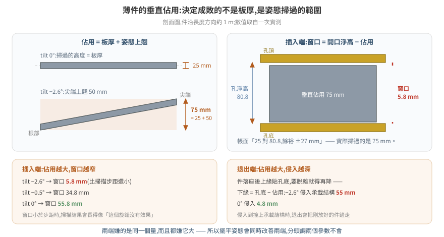
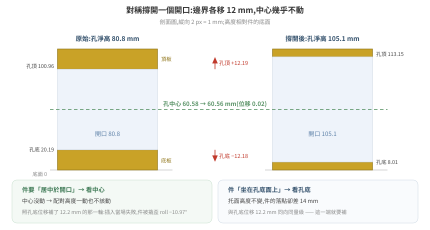
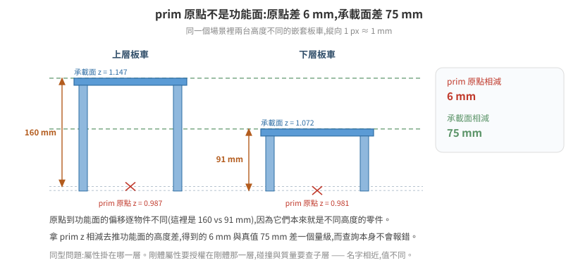

# 幾何的量測紀律:尺寸都對,件還是插不進去

一片 25 mm 厚的叉齒,要插進 80.8 mm 高的叉孔。帳面餘裕 55 mm,看起來綽綽有餘。
實測可插入的高度窗口只有 **5.8 mm** —— 比高度掃描的步距還小,所以連續四輪掃描
「毫無變化」,而每一輪都被讀成「這個旋鈕沒有效果」。

差距不在物理引擎,也不在參數,在對幾何的讀法。件的厚度不是它掃過的空間;
開口的邊界不是它的配對基準;prim 的原點不是它的功能面;而查詢腳本印出一個
數量級明顯不合理的值時,它不會報錯。

這篇把一段 6.0 場景調校裡「量錯 → 推錯 → 燒掉機時」的實例整理成可複用的判準。
素材是叉車取放棧板,但每一條的形狀在任何「薄件進窄縫」「配對高度」「讀資產尺寸」
的場景都一樣。

---

## 1. 姿態決定包絡,件的厚度不決定

叉齒是一片薄板,齒板厚 25 mm。但它有傾角,齒尖上翹 —— **它在垂直方向掃過的範圍
是板厚加上翹量**,而不是板厚。

<p align="center"></p>

同一支叉齒,三種傾角下的實測(齒長約 1 m):

| `tilt` | 齒尖上翹 | **垂直佔用** | 插進 80.8 mm 孔的高度窗口 |
|---|---|---|---|
| −2.6° | 50 mm | **75 mm** | **5.8 mm** |
| −0.5° | 21 mm | **46 mm** | 34.8 mm |
| 0° | 0 | **25 mm**(只剩板厚) | 55.8 mm |

**誤判的典型形式是拿件的厚度去對縫的高度**:25 對 80.8,得到「餘裕 ±27 mm,
幾何上進得去」。這個結論在該專案裡活了很久,期間還衍生出一個更糟的變體 ——
早期文件把齒板厚記成 **45 mm**,那是把一部分上翹量算進了板厚,
等於承認了「它比 25 厚」卻仍然用單一厚度去描述一個隨姿態變化的量。

### 1.1 同一個量在兩端都吃,而且方向相同

垂直佔用不只影響插入。件插進去、承載、再退出來,兩端都受它支配:

| 端 | 約束 | 佔用變大時 |
|---|---|---|
| 插入 | 可插入的高度窗口 = 孔淨高 − 垂直佔用 | 窗口變窄 |
| 退出 | 齒面下緣 = 孔底 − 垂直佔用 | 侵入承載結構越深 |

退出端的算術:棧板落座之後齒面上緣貼著孔底,要脫離接觸就得繼續下降,
而下降到哪裡由佔用決定。實測 −2.6° 時齒面下緣會落到承載面下方 **55 mm** ——
那個位置有板車本體,叉齒降不下去,於是退出時齒面維持高位,把剛放好的棧板鏟走。
0° 時侵入只有 4.8 mm。

**兩端嫌的是同一個量,而且都嫌它大。** 這一點決定了處置方向:
把姿態擺平會同時改善兩端,而「插入調一個參數、退出調另一個參數」是走不通的
—— 該專案先前正是照後者的框架在調,結論寫成「插入與退出的最佳傾角本來就不同」。

### 1.2 改姿態就要重校配對高度,兩者是耦合參數

把傾角從 −2.6° 改到 −0.5°,齒尖上翹少了 29 mm,**齒面在孔內的相對位置整個變了**。
只改傾角、沿用為舊傾角校出來的高度,實測結果是齒底比孔底還低 1.1 mm,
車前進時提早 450 mm 就把棧板推走 —— 看起來像「傾角改錯方向」,實際是配對值沒跟著動。

耦合參數要一起動的通則見 [19 調參實驗方法論 §2](../19-tuning-experiment-methodology/README.md)。
在幾何這一層,判斷哪些值耦合有個現成的問法:**這個值當初是在什麼姿態、什麼碰撞
近似、什麼開口尺寸下校出來的?** 那些前提裡任何一項變了,它就要重校。

---

## 2. 開口變大時,配對高度跟著中心走還是跟著邊界走

把叉孔從 80.8 mm 撐到 105.1 mm,是**以孔中心對稱撐開**的(上下板各削薄),
棧板外表面完全不動。四個數字:

| | 孔淨高 | 孔底(相對棧板底面) | 孔頂 | **孔中心** |
|---|---|---|---|---|
| 原始 | 80.8 mm | 20.19 mm | 100.96 mm | **60.58 mm** |
| 撐開後 | 105.1 mm | 8.01 mm | 113.15 mm | **60.56 mm** |
| 位移 | +24.3 | **−12.18** | +12.19 | **−0.02** |

<p align="center"></p>

**邊界移了 12 mm,中心移了 0.02 mm。** 而齒面要做的事是「居中於孔」,
所以配對高度一動也不該動。

實際發生的是反過來:把孔烘回 80.8 mm 那一輪,順手照「孔底上移 12.2 mm」
把齒面高度也上調 12.2 mm。取貨當場失敗 —— 十幾輪來第一次連取貨都不過:
棧板被撬歪 `roll −10.97°`、離槽位 −1.006 m。下一輪把高度改回原值,取貨立刻通過。

### 2.1 但另一端確實跟著孔底走

同一次幾何變更,對「棧板坐在齒上的高度」的影響完全不同:

    同一個放貨指令(齒面高度相同)
      孔 105.1 mm → 棧板插入時 z = 1.110
      孔  80.8 mm → 棧板插入時 z = 1.096
                         ↑ 差 14 mm,與孔底位移 12.2 mm 同向同量級

因為這時候管事的接觸是**棧板的孔底面壓在齒面上**:孔底相對棧板底面越高,
同一個齒面高度就把棧板托得越低 —— 孔底 20.19 mm 那一版比 8.01 mm 那一版低 14 mm。
所以放貨的落點高度要跟著孔底補,而取貨的居中高度不用。

> **一次幾何變更,對不同的配對關係有不同的參考特徵。**
> 動手補償之前先問:這個高度是要讓誰對上誰?
> 是「件要居中於開口」就看中心;是「件坐在某個面上」就看那個面。

這也是為什麼「改一個幾何、掃一遍所有相關參數」通常比「照位移量統一補」可靠:
統一補的前提是所有配對關係共用同一個參考特徵,而那個前提很少成立。

---

## 3. prim 原點不是功能面

同一個場景裡兩台嵌套板車,它們的 prim 原點 z 幾乎一樣,承載面差了 75 mm:

| | prim 原點 z | **承載面 z** | 原點 → 檯面的偏移 |
|---|---|---|---|
| 上層板車 | 0.987 | **1.147** | 160 mm |
| 下層板車 | 0.981 | **1.072** | 91 mm |
| 差 | **6 mm** | **75 mm** | — |

<p align="center"></p>

兩台是不同高度的板車,原點到檯面的偏移本來就不同。**拿 prim z 相減去推承載面高度差,
會得到 6 mm,而真值是 75 mm。** 在需要 mm 級對位的場景,這個誤差直接讓件放到
一個不存在的高度上。

同一類問題在物理屬性上的形狀是「屬性掛在哪一層」:

```
/target_pallet/target_pallet          Rigid=True   Coll=False   ← 剛體屬性授權在這層
  ├─ …/SM_RecycledWoodPallet_A04_01   Rigid=False  Coll=True    mass=20  ← 碰撞屬性查這層
  └─ …/Cube(貨物)                    Rigid=False  Coll=True    mass=20
```

這個剛體的總質量是 **40 kg**(兩個子 collider 相加),不是 20 kg ——
而「20 kg」被文件引用了很久,因為當初只 dump 到其中一個子層。
分層結構本身見 [10 場景資產的物理結構](../10-scene-physics-authoring/README.md);
這裡要記的是同一條判準的另一種說法:**「這個名字指的是哪一層」要先確定,再讀值。**

---

## 4. 量測方法本身會給出「看起來合理」的錯值

以下每一種都不會報錯,輸出也都是格式正確的數字。

| 查法 | 錯的長相 | 正解 |
|---|---|---|
| 數某區域內的頂點,`0 命中` 判為空腔 | **孔、實心區域內部、剛好沒頂點,三者輸出完全相同** —— 據此量到的「孔淨高 18 mm」低估真值 4.4 倍 | 射線與三角形求交:交點沿軸排序,成對的區間是實體,實體之間才是空腔 |
| 用三角形的座標 extent 近似佔用 | 一個跨全寬的斜三角把整條帶標成「佔滿」,兩個 z 帶都得到「實心」的假結果 | 點內外測試(point-in-mesh)逐點判 |
| `stage.Traverse()` 數 mesh | CAD 轉出的資產回 **0**,被讀成「轉換失敗、空殼」 | 先問 `stage.GetPrototypes()`,非 0 就換讀法(見 [21 篇 §3](../21-cad-asset-reading-and-conversion/README.md)) |
| 用 prototype 的**索引**排除非零件幾何 | `GetPrototypes()` 的順序跨 `Stage.Open` 不穩定 —— 同一份檔第二次執行,寫死的索引把 9 個零件一起排除,輸出看起來完全正常 | 用內容特徵識別(mesh 數 / 三角形數 / 尺寸),見 [21 篇 §3.1a](../21-cad-asset-reading-and-conversion/README.md) |
| 讀 world AABB 當尺寸 | 有傾角的物件被撐大:真高 121 mm 的棧板量到 **168.8 mm** | 讀局部座標或 `ComputeUntransformedBound`(見 [21 篇 §6.1](../21-cad-asset-reading-and-conversion/README.md)) |
| 拿不同截面的上下緣相減 | 孔底取自 x=5.10、孔頂取自 x=4.61 → 「淨高 57 mm」。**沒有任何一支叉齒需要同時滿足這兩個數字** | 每個截面只跟它自己位置的上下緣比 |
| 離線讀 USD 推 runtime 位置 | 讀到的是 authored 姿態 | 見 §4.3 |

### 4.1 單位與軸向要逐物件自推,不能寫死

同一份 stage 裡,不同子樹的局部座標單位可以不同 —— 實測棧板是公分、板車是公釐,
因為父節點 xform 的 scale 不同。高度軸也不保證是索引 2:同一支腳本裡,
棧板的最薄軸是索引 2、板車是索引 1。

兩者疊加的實測後果是印出 `1120000.0 mm` 這種值。它明顯錯,但**前提是你把它印出來看**;
而換一組數字它就不明顯了 —— 把局部單位當成公尺去換算,80.77 mm 的叉孔會印成
**8077 mm**,同樣不會報錯。

穩健的寫法是從資料本身推,並且用一個已知真值做範圍檢查:

```python
hz = min(range(3), key=lambda k: ext[k])   # 最薄的那軸 = 板件的高度軸
PALLET_MM = 121.0                          # 這顆資產的已知總高
unit_mm = PALLET_MM / ext[hz]              # 逐顆自推,不寫死
if not (8.0 < unit_mm < 12.0):
    raise RuntimeError("單位換算異常:ext=%.4f → unit_mm=%.2f(預期 ~10)"
                       % (ext[hz], unit_mm))
```

那個 `raise` 是重點。沒有它的版本會照樣往下跑,而且**輸出訊息長得像成功** ——
「孔撐到標準:80.8 → 100.0 mm」這行照印,實際寫進 USD 的是換算錯的局部尺寸。

⚠ 最薄軸法只對明顯扁平的物件有效,長寬比接近 1 的物件會判錯,而且判錯不報錯。

### 4.2 傾角撐大 AABB:知道這條規則不會讓你想起它

「有傾角的物件不能用 world AABB 讀尺寸」這條在該專案寫進通用知識庫之後,
**兩小時內又踩了一次**:算齒尖有沒有超出孔頂時,把棧板的局部孔高直接加到它的
世界 z 上,忽略了棧板沿滑軌約 2.5° 的 pitch。孔沿長度方向 1.05 m,
pitch 讓孔頂在前後緣差 **45.8 mm**,而齒尖所在位置的孔頂比棧板中心低約 22 mm。
據此算出的「齒尖超出孔頂 2.3 mm」是虛構的。

同源的第三種形狀:用世界座標畫某個面的高度圖判平整度,−2.62° 的安裝傾角會
顯示成 43 mm 的「階梯」(斜率 × 跨距 ≈ 2.62° × 0.93 m)。判凹凸前要先扣掉斜率。

> 知道規則不等於會在對的時刻想起它。**把檢查做進腳本**:
> 讀尺寸的函式一律走局部座標,要用世界座標時先印出物件的旋轉量,
> 讓「這東西是斜的」出現在輸出裡,而不是留在記憶裡。

### 4.3 authored 姿態不等於 runtime 姿態

離線開 USD 拿到的是資產被 author 的姿態。對於**被關節驅動的部件**,
它相對父節點的偏移在不同關節角度下不同:

    authored 姿態(fork_tilt z = −0.026)   齒最低點 0.060   → 偏移 +0.086
    抬升後    (fork_tilt z = +1.282)      齒最低點 1.336   → 偏移 +0.054

差 32 mm —— 比整個餘裕還大。**所以不能用離線幾何推算 runtime 的齒面位置。**
要拿到動作瞬間的幾何,只有把機構停在那個姿態、等靜止再量;
而且要真的靜止:件在動時掃出來的位置與靜止後差 1.4 m(掃到 x=2.87,靜止後 4.29)。

離線量測適合的是**與姿態無關的量**:件本身的尺寸、孔的淨高、零件間的相對配置。

### 4.4 正對照要挑同類的樣本

查詢回空時先用一個你確定存在的對象跑同一個查法 —— 這條大家都知道。
比較少被注意的是**對照組要能區分「方法有效」與「方法無效」**。

實例:用 `stage.Traverse()` 數 mesh 得到 0,做了對照 —— 換一份美術資產跑同一段程式,
三角形數與另一份文件記錄的值完全吻合,對照通過。但**美術資產沒有 instancing**,
CAD 資產全部有。對照組落在方法有效的那一側,於是驗證了一個並不成立的推廣,
接著整條推論鏈(「轉換失敗」→「原始檔有問題」→「這條管線不產幾何」)全部作廢。

> 對照組與待測對象要在**你懷疑的那個維度上同類**。
> 拿沒有 instancing 的檔驗證「我數得到 mesh」,不能保證對有 instancing 的檔成立。

---

## 5. 驗證用行為,不用回讀

寫進去、讀回來、值對了 —— 這個迴路完全不觸及物理引擎有沒有採用。
`set_phys_attr` / `get_phys_attr` 這類介面**兩端都只碰 USD 層**。

實測:把 `maxLinearVelocity = 0.01` 烘進 USD(48 個剛體)、靠場景重載生效,
回讀 `0.00999… authored=True`,再跑一趟真正的取貨 ——
棧板 21.6 秒移動 1.177 m = **0.054 m/s,是上限的 5.4 倍**。

runtime 授權那條路徑更早就試過,正對照用的是彈道:給棧板 `physics:velocity = (0,0,10)`,
1.5 秒後應該上升約 4 m(扣掉重力),實測 **Δz = +0.0000**。連初速都沒被採用。
彈道比取貨乾淨,因為它是純速度積分 —— 沒有接觸、沒有穿透修正,
不會混進「位移是被接觸推的」這種解釋。

| 授權路徑 | PhysX 採用 |
|---|---|
| runtime 寫**剛體**屬性(`physxRigidBody:*` / `physics:velocity`) | ❌ 這個場景實測不採用 |
| 載入時 author 進 USD 的剛體速度上限 | ❌ 也沒有被強制執行 |
| runtime 寫**關節** drive(`drive:*:physics:maxForce`) | ✅ 門檻掃描,行為在 1000→2000 之間翻轉 |

⚠ 這兩次測試用的都是速度相關屬性,所以分不開「整類剛體屬性不被採用」與
「只有速度屬性不被採用」。對結論的影響相同:**這個旋鈕沒有被證實有效過**,
而它曾經被當成已測過的變因。

**同一支工具、同一條 runtime 路徑,關節生效而剛體不生效。** 所以不能從一個推另一個
—— 關節 drive 每步被讀,剛體的這些屬性看來只在載入時讀一次。
參數無聲失效的完整清單見 [17 篇](../17-physics-parameter-tuning-6.0/README.md)。

代價很具體:在查明之前,已經有 40 輪實驗把「限速」當成有效變因在比較。
那 40 輪裡這個變因**從來沒有被施加過**,所有「限速無效」的結論都是空的。

### 5.1 怎麼設計那個可觀測量

判準是「若生效則某個量必然改變」,而且改變幅度要大於該量本身的雜訊。

質量的例子:把棧板剛體從 40 kg 改成 150 kg,**用同一個舉升動作的關節下垂量驗**:

| | `z1` | `z2` |
|---|---|---|
| 40 kg | 0.074 | 1.110 |
| 150 kg | **0.063** | **1.095** |
| 多下垂 | 11 mm | 15 mm |

下垂是 PD drive 在負載下的穩態誤差,質量若沒被採用它不會變。
這個量同時滿足三件事:在生效路徑上、幅度遠大於逐輪浮動、而且**每一輪都會產生**,
不需要專門跑一輪驗證。

⚠ 設計可觀測量時最容易漏掉的是**無效輪判定**。同一個驗證失敗過兩次,
兩次都輸出了「看起來像答案」的數字:一次是錄製窗口太短,停在件還沒接觸的階段,
輸出「位移 0.000」;一次是高度沒設對,件是被推的而不是被承載的,
而推移走的是位置層修正,本來就不歸速度上限管。
**腳本要自己印出有效性判定**(「有沒有進入帶貨階段」),不要讓無效輪次輸出數字。
正對照的完整設計原則見 [19 篇 §1](../19-tuning-experiment-methodology/README.md)。

---

## 6. 離線讀 USD 的實務

量幾何不需要動到執行中的模擬。開一個唯讀 stage 讀 authored 值,
比在跑的場景裡用視窗式點雲掃描精確 —— 讀的是值本身,不是點雲推算。
實測在剩餘記憶體充裕(109 GB)的機器上,對執行中的模擬沒有可觀測干擾。

### 6.1 讓 `pxr` 在容器裡可用

Isaac Sim 容器沒有 `usdcat`,而 `python.sh` 不帶 kit 的 `PYTHONPATH`。
核心 USD 庫在 extension 快取裡:

```bash
U=$(ls -d /isaac-sim/extscache/omni.usd.libs-*/ | head -1)
export PYTHONPATH=$U
export LD_LIBRARY_PATH=$U:$U/lib:$U/bin
/isaac-sim/kit/python/bin/python3 -c "from pxr import Usd; print('pxr OK')"
```

⚠ 只設 `PYTHONPATH` 會失敗在 `ImportError: libusd_tf.so: cannot open shared object file`
—— Python 模組找得到了,它背後的 C++ 動態庫還沒有。**兩個都要設。**

### 6.2 要寫入時:臨時容器、`rw`、`--user 0:0`

資產目錄在正式容器裡多半是唯讀掛載(`docker inspect` 看得到 `rw=false`)。
要改就另開一個 `--rm` 的臨時容器把同一個目錄掛成 `rw`,**而且要 `--user 0:0`**
—— image 的預設 user 不是 root,不加會得到「Unable to open file for writing」。

掛載路徑要與正式容器**一模一樣**,原因見下一條。

### 6.3 USD 必須在原位改

USD 用相對路徑引用其他檔。把場景複製到 `/tmp` 再編輯,引用會解析不到,
而**它不會報錯**:

    在原位開      prim 總數 4546   目標剛體找得到
    複製到 /tmp   prim 總數 4186   目標剛體 = 0

腳本裡放一行正對照就能擋住:開檔之後先數 prim 總數,不等於已知值就中止。
`4186` 這個數字本身很合理,沒有這道檢查會一路跑到底,產出一個「改過但什麼都沒改到」
的檔案。

### 6.4 讀 authored 值,不要推點雲

要量 box collider 的尺寸,直接讀 `UsdGeom.Cube` 的 `xformOp:translate` 與
`xformOp:scale`(配 `extent`)。該專案一度把這件事記為「取不到」,
改用執行期的視窗掃描推算,得到帶 ±5 mm 誤差的值;
改讀 authored 值之後,那一版的叉孔淨高是 **100.00 mm 整**(先前推算的是 99.87 mm),
而 13.25 mm 這種零件內縮量也一次讀得出來。

⚠ 這顆棧板的碰撞孔在不同版本之間換過幾次值(原始網格 80.8 → box 化 100 →
撐到 105.1 → 烘回 80.8),§2 用的是其中兩版。這裡要記的是讀法,不是那個數字 ——
**每次重烘之後都要重讀,不能沿用上一版的量測值。**

⚠ 反過來也成立:**authored 值只描述資產,不描述現場。**
件被推到哪、關節停在哪、接觸有沒有讓它陷進去,這些只有 runtime 量得到(§4.3)。

---

## 7. 檢查清單

量幾何之前:

- [ ] 要進去的是「件的厚度」還是「件掃過的包絡」?件有傾角嗎(§1)
- [ ] 這個配對高度是「居中於開口」還是「坐在某個面上」?參考特徵是中心還是邊界(§2)
- [ ] 讀的是 prim 原點還是功能面?兩者的偏移逐物件不同(§3)
- [ ] 用的是點/頂點統計還是射線求交 / 點內外測試(§4)
- [ ] `stage.GetPrototypes()` 有幾個?非 0 就換讀法(§4)
- [ ] 高度軸與單位是從資料推的,還是假設的?有沒有用已知真值做範圍檢查(§4.1)
- [ ] 物件有傾角嗎?讀的是 world AABB 還是局部座標(§4.2)
- [ ] 相減的兩個值來自同一個截面嗎(§4)
- [ ] 這個量與姿態有關嗎?有 → 要在 runtime、靜止狀態下量(§4.3)
- [ ] 查詢回空時的正對照,與待測對象在懷疑的維度上同類嗎(§4.4)

改幾何或改屬性之後:

- [ ] 驗的是行為,不是回讀(§5)
- [ ] 那個可觀測量在生效路徑上、幅度大於雜訊、每輪都會產生(§5.1)
- [ ] 腳本會自己判「這一輪有沒有資格產生量測」(§5.1)
- [ ] 這個值當初是在什麼前提下校出來的?前提變了的都要重校(§1.2)
- [ ] 寫入 USD 是在原位改的嗎?prim 總數對得上嗎(§6.3)

---

## 8. 延伸閱讀

- [13 接觸與抓握的第一性原理](../13-contact-and-grasp-first-principles/README.md) —— 為什麼調參順序是幾何→質量→offset→摩擦,幾何錯了後面全部白調
- [21 CAD 資產的判讀與轉換](../21-cad-asset-reading-and-conversion/README.md) —— instancing、單位、world AABB 三個陷阱的完整機制與轉換管線
- [10 場景資產的物理結構](../10-scene-physics-authoring/README.md) —— 剛體/碰撞/質量各屬於哪一層
- [17 6.0 的物理調參](../17-physics-parameter-tuning-6.0/README.md) —— 參數無聲失效的五個條件
- [19 調參實驗方法論](../19-tuning-experiment-methodology/README.md) —— 正對照、耦合參數、二元判準的檢定力
- [18 物理參數要去哪裡找](../18-finding-physical-parameters/README.md) —— 未授權質量會被算成「網格體積 × 水的密度」

---

*來源:[isaac-sim-60-tuning](https://github.com/wicanr2/isaac-sim-60-tuning) docs 136(叉孔真實幾何)、
142(場景物理快照)、149(runtime 剛體授權不被採用)、160(離線網格量測)、
168(instancing 與 box 幾何)、169(box 時代參數紀錄)、170(垂直佔用與高度推導)。
數值取自單一場景的實測,方法可複用、數值不可照搬。*
