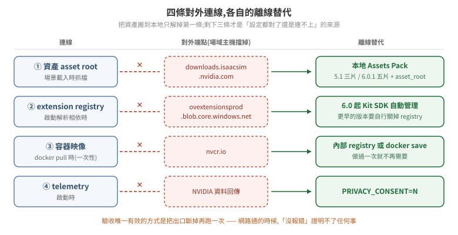

# 25 · 官方資產的預先下載與離線佈署:讓場域主機不必對外

一個引用了官方資產的場景,在執行期會去 asset root 抓檔。這件事在開發機上看不出來——網路是通的,慢一點而已;搬到場域主機才會暴露:防火牆擋掉出口之後,場景載到一半停住,或是 `get_assets_root_path()` 回 `None`,而錯誤訊息不會告訴你缺的是網路。

把資產搬到本地不難,難的是**資產只是對外連線裡的一條**。把資產包放好、發現還是連不上,通常是撞到另外三條。這篇先把四條列清楚,再逐條給離線替代方案。

<p align="center"></p>

> **驗證狀態**:本篇每一條都標出處,來源是 NVIDIA 官方文件(Isaac Sim 5.1.0 / 6.0.1)與一則公開論壇回報。**本 repo 尚未在實際 air-gapped 環境驗證整套流程**;凡是「官方文件這樣寫」與「我們實測過」的區別,文中逐條標明。§6 給的是自己驗證的方法。

## 1. 四條對外連線

| # | 連線 | 什麼時候發生 | 離線替代 |
|---|---|---|---|
| 1 | **資產** asset root | 場景載入、`get_assets_root_path()` 被呼叫時 | 下載 Local Assets Pack,設 asset root 指到本地(§2–§4) |
| 2 | **Kit extension registry** | 啟動解析 extension 相依時 | 6.0 起由 Kit SDK 自動管理;更早的版本要關 registry(§5) |
| 3 | **容器映像** `nvcr.io` | `docker pull` 時 | 一次性:在有網路的機器 pull 後 `docker save` / 推進內部 registry |
| 4 | **telemetry** | 啟動時 | 容器環境變數 `PRIVACY_CONSENT` 設 `N` |

第 3 條是一次性的,做過就沒事;第 4 條一個環境變數解決。真正會反覆卡人的是 1 和 2,底下分開講。

## 2. 資產包:下載與驗證

官方把整包資產切成多個 zip 分片放在 `downloads.isaacsim.nvidia.com`。**分片數量隨版本不同**:

| 版本 | 分片數 | 檔名 |
|---|---|---|
| 5.1.0 | 3 | `isaac-sim-assets-complete-5.1.0.001.zip` … `.003.zip` |
| 6.0.1 | 5 | `isaac-sim-assets-complete-6.0.1.001.zip` … `.005.zip` |

官方文件對這兩版都明寫 Local Assets Packs「are available to be used locally and in an air-gapped environment」。

下載動輒數十 GB,而**斷線重下一次的代價遠高於一開始就用支援續傳的工具**。官方文件給的例子是 aria2,順便驗 MD5:

```bash
aria2c -c --checksum=md5=92149a1f50a21c0f04cca6507ab00653 \
  "https://downloads.isaacsim.nvidia.com/isaac-sim-assets-complete-6.0.1.001.zip"
```

`-c` 是續傳,`--checksum` 在下載完成後比對。**每一片的 MD5 不同,列在官方下載頁上**,要逐片對;跳過這一步的話,壞掉的分片會在解壓時才發作,而那時已經花掉整個下載時間。

分片必須**全部到齊才能合併**——它們不是各自獨立的 zip,是一個 zip 被切開,少一片就解不出來。

## 3. 目錄長相:檔名與路徑不一致

這裡有一個會讓人白花時間的陷阱:**資產包的檔名帶修訂號,解出來的目錄名不帶**。

| 版本 | 下載檔名裡的版本 | 解壓後的目標路徑 |
|---|---|---|
| 5.1.0 | `5.1.0` | `~/isaacsim_assets/Assets/Isaac/**5.1**` |
| 6.0.1 | `6.0.1` | `~/isaacsim_assets/Assets/Isaac/**6.0**` |

也就是說,6.0.1 的資產包要落在 `Isaac/6.0` 底下,不是 `Isaac/6.0.1`。照著檔名建目錄的話,路徑設對了、資產也在那台機器上,場景還是找不到東西。

官方文件另外明寫一條驗收條件:**這個根目錄底下必須同時有 `NVIDIA` 與 `Isaac` 兩個子目錄**。解壓完先 `ls` 一次確認這兩個都在,比之後在 Isaac Sim 裡追「為什麼材質是紫色的」便宜得多。

```bash
$ ls ~/isaacsim_assets/Assets/Isaac/6.0
Isaac  NVIDIA
```

## 4. 把 asset root 指到本地

設定名是 `persistent.isaac.asset_root.default`,有四個入口,而**優先序不是直覺的順序**:

| 優先 | 入口 | 形式 |
|---|---|---|
| 1(最高) | 環境變數 | `ISAACSIM_ASSET_ROOT` |
| 2 | 命令列參數 | `--/persistent/isaac/asset_root/default=<路徑>` |
| 3 | experience(`.kit`)檔 | `[settings]` 段的 `persistent.isaac.asset_root.default = "<路徑>"` |
| 4 | extension 預設 | 官方雲端位址 |

官方文件對第一條的敘述是:啟動時 `isaacsim.storage.native` extension 讀 `ISAACSIM_ASSET_ROOT`,**若有設就覆寫該設定,不管 `.kit` 檔或命令列給了什麼值**。

⚠ **環境變數蓋過命令列,這一條要記住**。排查「我明明在啟動參數寫了本地路徑,它還是往外連」的時候,第一個該看的是 `env | grep ISAACSIM_ASSET_ROOT`,而不是去改啟動腳本。這是本 repo [17 篇](../../6.0.1/17-physics-parameter-tuning-6.0/README.md)講的同一類問題:設定得進去不等於生效,而覆寫者不會通知你。

命令列的寫法:

```bash
./isaac-sim.sh --/persistent/isaac/asset_root/default="/home/<user>/isaacsim_assets/Assets/Isaac/6.0"
```

要固定下來,寫進 experience 檔(官方例子用 `isaacsim.exp.base.kit`):

```
[settings]
persistent.isaac.asset_root.default = "/home/<user>/isaacsim_assets/Assets/Isaac/6.0"
```

**三種入口該選哪一個**,取決於這台機器有幾種跑法:單一用途的場域主機用 `.kit` 檔最省事(每次啟動都對,不依賴呼叫端記得帶參數);同一台要跑多個場景或多個版本的,用命令列參數,讓啟動腳本自己帶;容器化部署用環境變數最直接,因為它本來就是 `docker run -e` 的形狀,而且優先序最高、不會被映像內建的 `.kit` 檔蓋掉。

## 5. Extension registry:第二條連線

資產設對之後仍然連不上外面的話,下一個嫌疑是 Kit 的 extension registry。

官方文件對 6.0 的說法是:**「As of Isaac Sim 6.0, Kit extension registries are now managed automatically by the Kit SDK.」** ——照這個敘述,6.0 的離線環境不需要另外設定 registry。**這一條本 repo 未實測**,而它剛好是「照文件做應該沒事」與「實際跑起來沒事」差距最容易出現的地方,佈署前值得自己驗一次(§6)。

更早的版本沒有這個保證。一則 4.5.0 的公開回報記錄了完整的失敗形狀:在離線叢集裡把 registry 相關設定全部關掉——

```
registryEnabled  = false
syncRegistry     = false
skipSyncOutdated = true
registries       = []
```

——它仍然去連 `https://ovextensionsprod.blob.core.windows.net/exts/kit/prod/106/shared/v2`,失敗後噴的是相依解析錯誤而不是網路錯誤:

```
Failed to resolve extension dependencies. Failure hints:
  [omnigibson_4_5_0-1.5.0] dependency: 'omni.flowusd' = { version='^' } can't be satisfied
ModuleNotFoundError: No module named 'omni.kit.usd'
```

⚠ 這個案例值得記住的不是那幾個設定鍵,是**症狀的形狀**:離線環境下拿不到 extension,表現成「某個模組找不到」,而那個模組名跟網路一點關係都沒有。看到 `ModuleNotFoundError` 就往 Python 環境去查,會查很久。

該串由 NVIDIA 版主建議在設定檔加 `[settings.exts] registryEnabled = false`,**但原提問者沒有回報結果,串在兩週後關閉**——所以這是一則未確認的處置,不是解法。列在這裡是為了讓你認得症狀,不是照抄設定。

## 6. 怎麼證明它真的離線了

「跑起來沒報錯」證明不了離線成立——資產可能還在從外面抓,只是網路通所以你看不見。這是本 repo [12 篇](../12-long-run-operations/README.md)與 [19 篇](../19-tuning-experiment-methodology/README.md)反覆講的同一件事:**沉默相容於太多個世界,其中一半是壞的**。

唯一的正對照是**把出口斷掉再跑一次**:

```bash
# 容器層:起一個沒有對外路由的網路
docker network create --internal isaac-offline
docker run --rm --network isaac-offline ... nvcr.io/nvidia/isaac-sim:6.0.1 ...
```

驗收要看的是**行為**,不是設定值回讀:

1. 場景載得完,而且**材質正常**——紫色/白色的面代表材質沒抓到,那是資產缺失最直接的訊號。
2. `get_assets_root_path()` 回傳的是本地路徑,不是 `https://...`。回 `None` 代表 asset root 整個沒解析成功(見 [07 篇](../../5.1/07-minimal-example/README.md) §2 的檢查寫法)。
3. 啟動 log 裡沒有連線逾時的重試。

第 1 條比第 2 條強:設定回讀成功而實際行為不對,是這個系統反覆出現的模式。

## 7. 資產在本地,不等於資產能用

把官方資產搬到本地解決的是**取得**,不是**可用性**。本 repo 實測過 NVIDIA Warehouse 資產包(24 GB):`WingPallet_A01`、`HeavyDutyPalletTruck_A01`、`Rack_E02` 這些場景元件,**RigidBody、authored mass、Collision 全部是 0**——純幾何加材質的視覺資產,不帶任何物理。詳見 [18 篇](../18-finding-physical-parameters/README.md) §2。

所以離線佈署做完之後,物理參數還是要自己補,而「去哪裡找」是另一個問題。機器人類資產(`Isaac/Robots/…`)通常有完整物理,場景佈置類的沒有——**資產包的用途決定它有沒有物理**。

## 8. 佈署檢查清單

- [ ] 分片全部下載完,**逐片**比對官方頁上的 MD5
- [ ] 解壓後的根目錄底下有 `NVIDIA` 與 `Isaac` 兩個子目錄
- [ ] 目錄名用的是 `Isaac/6.0`(或 `Isaac/5.1`),不是照著檔名建的 `6.0.1`
- [ ] `env | grep ISAACSIM_ASSET_ROOT` 確認沒有殘留的環境變數蓋掉你的設定
- [ ] 容器環境變數:`ACCEPT_EULA=Y`,`PRIVACY_CONSENT=N`(不回傳 telemetry)
- [ ] 容器映像已在內部 registry 或以 `docker save` 的形式備妥,不依賴 `nvcr.io`
- [ ] **斷網跑過一次**,場景載得完、材質不是紫色、`get_assets_root_path()` 回本地路徑
- [ ] 場景實際用到的資產有沒有物理,已另外確認(見 [18 篇](../18-finding-physical-parameters/README.md))

## 版本對照

| | 5.1 | 6.0.1 |
|---|---|---|
| 資產包分片數 | 3 | 5 |
| 解壓後路徑 | `Assets/Isaac/5.1` | `Assets/Isaac/6.0` |
| extension registry | 需自行處理 | 官方文件稱由 Kit SDK 自動管理 |

設定名 `persistent.isaac.asset_root.default`、環境變數 `ISAACSIM_ASSET_ROOT`、以及四層優先序,兩版相同。

---

延伸閱讀:[01 安裝與執行模式](../01-install-and-run-modes/README.md)(啟動參數與 Python 環境隔離)、[03 模型格式與匯入](../03-model-import/README.md) §2(官方資產的授權面)、[18 建場域時物理參數要去哪裡找](../18-finding-physical-parameters/README.md)。

出處:[Isaac Sim 6.0.1 Setup Tips](https://docs.isaacsim.omniverse.nvidia.com/6.0.1/installation/install_faq.html)、[6.0.1 Download](https://docs.isaacsim.omniverse.nvidia.com/6.0.1/installation/download.html)、[5.1.0 Setup Tips](https://docs.isaacsim.omniverse.nvidia.com/5.1.0/installation/install_faq.html)、[6.0.1 Container Installation](https://docs.isaacsim.omniverse.nvidia.com/6.0.1/installation/install_container.html)、[air-gapped 佈署的公開回報(4.5.0,未結案)](https://forums.developer.nvidia.com/t/air-gapped-deployment-app-exits-due-to-dependency-solver-failure-omni-flowusd-despite-disabling-registry-sync-in-offline-l20-cluster/365085)。
