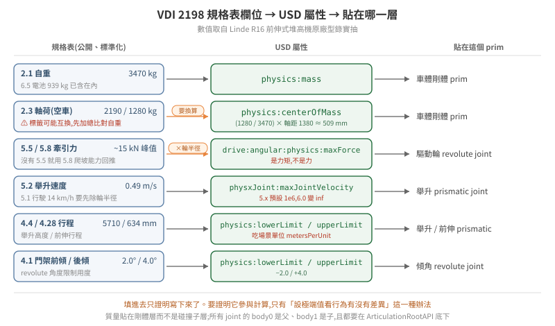

# 26 · 從規格表到會動的叉車:物理參數與 articulation 的非 GUI 建法

一台從資產庫或 CAD 來的叉車,進到 USD 裡通常只有幾何——沒有質量、沒有關節、沒有馬達。要讓它變成能被模擬的車,中間有兩件事要做:**把真實世界的數字填進去**,以及**把零件之間的運動關係建起來**。

這兩件事都可以完全不開 GUI。而且不開 GUI 反而比較好——設定值進了版控、能 review、能對不同版本重跑,GUI 拖出來的東西則只存在於那個檔案裡。

本篇把[18 篇](../18-finding-physical-parameters/README.md)找到的參數與[10 篇](../10-scene-physics-authoring/README.md)的分層原則接起來,走一遍完整流程:規格表欄位 → USD 屬性 → 貼在 prim 樹的哪一層 → 怎麼確認它真的生效。數值取自 [VDI 2198 子頁](../18-finding-physical-parameters/vdi2198-forklift-datasheets.md)實抽的 Linde R16 前伸式堆高機。

<p align="center"></p>

> **驗證狀態**:屬性名稱與預設值取自 [17 篇](../../6.0.1/17-physics-parameter-tuning-6.0/README.md)的 6.0.1 實機 schema 抽取,數值取自原廠 VDI 2198 型錄。**本篇的程式碼未在本 repo 環境實機跑過**,寫法依 OpenUSD 與 PhysX schema;凡是牽涉單位慣例的地方,文中都指出要用 §5 的方法自己驗一次,不要照抄。

## 1. 一台叉車在 USD 裡是什麼

先把「車」這個字拆掉。物理引擎不認識車,它認識的是**一組剛體,用關節連起來,其中一些關節帶馬達**。

一台前伸式堆高機至少是這幾個剛體:

```
/Forklift                     ← ArticulationRootAPI 貼這裡
├── chassis                   ← RigidBody:自重的大部分
│   └── collision/            ← CollisionAPI 貼子層(見 10 篇 §1)
├── drive_wheel               ← RigidBody + revolute joint(驅動,帶 drive)
├── steer_link                ← RigidBody + revolute joint(轉向,帶 drive)
├── load_wheel_l / _r         ← RigidBody + revolute joint(從動,不帶 drive)
├── reach_carriage            ← RigidBody + prismatic joint(前伸)
│   └── mast_tilt             ← RigidBody + revolute joint(門架傾角)
│       └── fork_carriage     ← RigidBody + prismatic joint(舉升)
│           └── fork_l / _r   ← 叉齒,通常跟著 carriage 不另設關節
```

這棵樹決定了後面所有事情。**分層錯了,參數怎麼調都不會對**——質量掛在碰撞子層而不是剛體層,慣性張量會算出異常小的值,微小力矩就造成巨大角加速度,症狀是物件先瘋狂旋轉再飛走([10 篇](../10-scene-physics-authoring/README.md) §1、§2)。

⚠ **閉合運動鏈的陷阱在這裡**。真實叉車的門架傾角常由油壓缸推動,油壓缸兩端各自鉸接在車體與門架上——那是一個閉鏈。PhysX 容忍度較高,但 Newton 後端**明確不支援閉合運動鏈**(見 [15 篇](../../6.0.1/15-physics-backend-5.1-to-6.0/README.md) §3.1 官方限制 #2)。模擬用的建模應該把油壓缸拿掉,直接用一個帶 drive 的 revolute 關節表達傾角,而不是把真實機構照搬。

## 2. 規格表欄位 → USD 屬性

VDI 2198 的好處是欄位編號標準化,每家廠商的型錄長得一樣([18 篇子頁](../18-finding-physical-parameters/vdi2198-forklift-datasheets.md))。下表把編號直接對到 USD:

| VDI | 欄位 | R16 實抽值 | USD 屬性 | 貼在哪 |
|---|---|---|---|---|
| **2.1** | 自重 | **3470 kg** | `physics:mass` | 車體剛體 prim |
| 6.5 | 電池重量 | 939 kg | *併入 2.1,不另外加* | — |
| 2.3 | 軸荷(空車) | 2190 / 1280 kg | `physics:centerOfMass` | 車體剛體 prim |
| 1.9 | 軸距 | 1380 mm | 輪子 prim 的位置 | 幾何 |
| 5.5 / 5.8 | 牽引力 | ~5 kN 持續、~15 kN 峰值 | `drive:angular:physics:maxForce` | 驅動輪 revolute joint |
| 5.1 | 行駛速度 | 14 km/h = 3.889 m/s | 驅動關節速度上限 | 驅動輪 revolute joint |
| — | 舉升力(推導) | ~25 kN | `drive:linear:physics:maxForce` | 舉升 prismatic joint |
| 5.2 | 舉升速度(載重) | 0.49 m/s | 舉升關節速度上限 | 舉升 prismatic joint |
| 4.4 | 舉升高度 | 5710 mm | `physics:lowerLimit` / `upperLimit` | 舉升 prismatic joint |
| 4.1 | 門架前傾 / 後傾 | 2.0° / 4.0° | `physics:lowerLimit` / `upperLimit` | 傾角 revolute joint |
| 4.28 | 前伸行程 | 634 mm | `physics:lowerLimit` / `upperLimit` | 前伸 prismatic joint |
| 5.4 | 前伸速度 | 0.2 m/s | 前伸關節速度上限 | 前伸 prismatic joint |
| 4.22 | 叉齒 厚×寬×長 | 45×100×1150 mm | 幾何 | 叉齒 mesh |

三個需要換算而不是直接填的欄位,底下分開講。

### 2.1 軸荷 → 質心

規格表不給質心,但給了軸荷,而**兩個軸荷加上軸距就唯一決定質心的縱向位置**。對驅動軸取力矩:

```
質心離驅動軸的距離 = (另一軸的軸荷 / 總重) × 軸距
                   = (1280 / 3470) × 1380 mm
                   ≈ 509 mm        ← 從驅動軸往承載輪方向
```

⚠ **這一步最容易被規格表本身騙**。R16 那份型錄的 2.3 / 2.4 兩行,`with load` 與 `without load` 的標籤是**互換的**——照字面用會讓驅動輪附著力算錯 3.6 倍。判別方法是拿算術對:標 "with load" 那行加起來等於 2.1 的自重,所以它其實是空車([18 篇子頁](../18-finding-physical-parameters/vdi2198-forklift-datasheets.md))。**填任何一組軸荷之前,先把它加起來跟自重比一次。**

質心設錯不會報錯,症狀是車在轉彎或載重時的翻覆行為不合理——而那個症狀不會指向質心。

### 2.2 牽引力 → 驅動關節的 maxForce

revolute joint 的 drive `maxForce` 是**力矩**,而規格表給的是**力**。中間差一個輪半徑:

```
驅動力矩上限 = 牽引力 × 輪半徑
```

輪半徑不在上表——它在型錄的輪胎/車輪那一段,這次沒抽。**沒有輪半徑就沒有這個數字**,不要用「差不多 0.3 公尺」湊,因為它直接線性放大或縮小你給馬達的力。

該填持續值(~5 kN)還是峰值(~15 kN),取決於你在模擬什麼:要重現「爬不上去」「推不動」這類飽和行為,填持續值;只是不想讓馬達變成無限力來源,填峰值。

⚠ **填之前先算一次數量級,確認你調的是不是限制因素**。[23 篇](../23-no-shortcuts-in-physics-sim/README.md)記過一個實例:需要的角加速度是 3.3 rad/s² 而關節可達 1100,差 330 倍——那種情況下調摩擦調到四倍真實值也只是杯水車薪,因為限制根本不在那裡。[24 篇](../24-nonholonomic-vehicle-control/README.md) §2 走過完整的「馬達扭力 vs 抓地力誰先飽和」比較。

### 2.3 速度 → 關節速度上限

行駛速度 14 km/h 是**車速**,驅動關節要的是角速度,同樣要除輪半徑(`ω = v / r`)。舉升與前伸是 prismatic,速度就是線速度,不用換算。

⚠ **單位慣例要自己驗,不要照抄**。UsdPhysics 的 revolute 角度限制用度、prismatic 用場景單位,而關節速度上限的單位在不同版本、不同後端可能不同。判別方法是 §5 的第 4 級:**設一個極端值,看行為有沒有可觀察的差異**。填了一個數字然後回讀成功,證明不了它參與計算。

還有一個版本差異要注意:`physxJoint:maxJointVelocity` 在 5.x 的預設是 `1000000`,6.0 改成 `inf`(見[版本速查表](../../version-matrix.md))。也就是 5.x 時代所有 articulation 關節都有一道隱含的速度上限,6.0 拿掉了。**升上 6.0 之後叉齒開始把東西彈飛,先把這個屬性顯式設回有限值再談其他調參。**

### 2.4 單位:填數字之前先問 metersPerUnit

上表的規格全是 mm,而場景的單位不一定是公尺。NVIDIA Warehouse 資產包實測是 `metersPerUnit = 0.01`(公分制),放進公尺制場景時父層會有 0.01 縮放([18 篇](../18-finding-physical-parameters/README.md) §2)。**關節行程、質心偏移、輪半徑全部吃這個單位**,而填錯的症狀是行程差 1000 倍——大到會被當成「關節壞了」而不是「單位錯了」。

## 3. 三條寫進去的路

| 做法 | 適合 | 代價 |
|---|---|---|
| 改 `.usda` 文字 | 少量、一次性的修正 | `.usd` 是二進位 crate,要先轉文字;大檔難管 |
| **Python USD API 離線寫檔** | **批次、可重跑、進版控** | 要寫腳本 |
| 啟動時 runtime patch(`--exec`) | 原檔不能動、同一份場景要餵不同版本 | 啟動慢幾秒;⚠ **不是所有屬性都吃** |

第三條有一個會讓人白花時間的邊界:**runtime 寫入不一定被採用,而且剛體與關節的行為不一樣**([17 篇](../../6.0.1/17-physics-parameter-tuning-6.0/README.md) §2.5)。[22 篇](../22-geometry-and-measurement-discipline/README.md)記過一個代價很高的實例——剛體屬性回讀成功但 PhysX 不採用,連帶讓 40 輪實驗的變因**從未被施加**,而每一輪都跑完了、都有結果、都被拿去分析。

所以建場域的預設應該是第二條:**離線把值寫進檔案**,runtime patch 留給診斷用。

離線寫檔的骨架(未實機驗證):

```python
from pxr import Usd, UsdGeom, UsdPhysics, PhysxSchema, Gf

stage = Usd.Stage.Open("forklift.usd")
chassis = stage.GetPrimAtPath("/Forklift/chassis")

# 剛體 + 質量。質量貼在剛體層,不是碰撞子層(10 篇 §1)
UsdPhysics.RigidBodyAPI.Apply(chassis)
mass_api = UsdPhysics.MassAPI.Apply(chassis)
mass_api.CreateMassAttr(3470.0)                       # VDI 2.1 自重
mass_api.CreateCenterOfMassAttr(Gf.Vec3f(0.0, -0.509, 0.0))   # §2.1 推導,單位看 metersPerUnit

stage.GetRootLayer().Save()
```

⚠ **不要用 grep 判斷 crate 檔裡有沒有某個屬性**。`.usd` 的字串 token 表會讓 schema 名稱出現在檔案裡,即使沒有任何 prim 真的貼了它——grep 得到不代表 authored([18 篇](../18-finding-physical-parameters/README.md) §5)。要判斷就用 USD API 問 `HasAuthoredValue()`。

## 4. Articulation 怎麼建

### 4.1 在已匯入的 USD 上補(最常見)

CAD 轉出來的 USD 只有視覺幾何([03 篇](../03-model-import/README.md) §2、[21 篇](../21-cad-asset-reading-and-conversion/README.md))。補的順序是固定的,因為後一步依賴前一步:

1. **確定 prim 樹**,決定哪些節點是 link。⚠ CAD 轉換器預設開 instancing,`stage.Traverse()` 對 instanced 資產會回 0 mesh——數之前先問 `GetPrototypes()`([21 篇](../21-cad-asset-reading-and-conversion/README.md))。
2. **貼 `RigidBodyAPI`**,每個 link 一個。碰撞體貼在子層,不要跟剛體貼同一個 prim。
3. **貼質量**。動態剛體必須有非零質量與慣量,否則 Newton 後端初始化會失敗([15 篇](../../6.0.1/15-physics-backend-5.1-to-6.0/README.md) §3.1 限制 #3)。沒授權質量時 PhysX 用「網格體積 × 1000 kg/m³」當預設,鋼構件因此輕 7.9 倍且**不會有任何警告**([18 篇](../18-finding-physical-parameters/README.md) §0)。
4. **建 joint prim**,設 `body0` / `body1`。
5. **貼 `ArticulationRootAPI`** 在包含整棵關節樹的 prim 上。⚠ 所有 joint 都必須屬於某個 articulation root,散裝 joint 在 Newton 後端不行(限制 #5)。

### 4.2 body0 / body1 的順序

這一條單獨拉出來講,因為它是**兩版行為不同、而錯了不會報錯**的那種:

> `body0` 要是父、`body1` 要是子。**PhysX 不在乎順序**,只影響回傳值正負;**Newton 硬性要求**。而 PhysX 時代的資產常常反著寫。

出處是 [15 篇](../../6.0.1/15-physics-backend-5.1-to-6.0/README.md) §3.1 的官方限制 #1。從 5.x 搬上來的叉車資產,這一項值得整批掃一次——PhysX 下跑得好好的東西,切到 Newton 會以「關節方向相反」或「初始化失敗」的形式出現,而症狀不會指向 body 順序。

### 4.3 從零建(最小可跑的骨架)

```python
from pxr import Usd, UsdGeom, UsdPhysics, PhysxSchema, Gf

stage = Usd.Stage.CreateNew("forklift.usda")
UsdGeom.SetStageMetersPerUnit(stage, 1.0)          # 先把單位釘死(§2.4)
UsdGeom.SetStageUpAxis(stage, UsdGeom.Tokens.z)

root = UsdGeom.Xform.Define(stage, "/Forklift")
UsdPhysics.ArticulationRootAPI.Apply(root.GetPrim())

# --- 驅動輪:revolute + 角度 drive ---
wheel = UsdGeom.Xform.Define(stage, "/Forklift/drive_wheel")
UsdPhysics.RigidBodyAPI.Apply(wheel.GetPrim())

j = UsdPhysics.RevoluteJoint.Define(stage, "/Forklift/joints/drive")
j.CreateBody0Rel().SetTargets(["/Forklift/chassis"])      # 父
j.CreateBody1Rel().SetTargets(["/Forklift/drive_wheel"])  # 子(§4.2)
j.CreateAxisAttr("Y")

drive = UsdPhysics.DriveAPI.Apply(j.GetPrim(), "angular")
drive.CreateTypeAttr("force")
drive.CreateMaxForceAttr(TRACTION_N * WHEEL_RADIUS_M)     # §2.2:力矩,不是力
drive.CreateDampingAttr(...)                              # 速度控制靠 damping
drive.CreateStiffnessAttr(0.0)                            # 0 = 純速度控制

# --- 舉升:prismatic + 線性 drive + 行程限制 ---
lift = UsdPhysics.PrismaticJoint.Define(stage, "/Forklift/joints/lift")
lift.CreateAxisAttr("Z")
lift.CreateLowerLimitAttr(0.0)
lift.CreateUpperLimitAttr(5.710)                          # VDI 4.4,場景單位
lift_drive = UsdPhysics.DriveAPI.Apply(lift.GetPrim(), "linear")
lift_drive.CreateMaxForceAttr(25000.0)                    # ~25 kN

stage.GetRootLayer().Save()
```

**drive 的 stiffness / damping 決定控制語意**:`stiffness` 大是位置控制(PD 把關節拉向目標角度/位置),`stiffness = 0` 而 `damping` 大是速度控制。驅動輪要的是速度控制,舉升要的是位置控制。PD 公式與增益怎麼取見 [09 篇](../09-physics-simulation-fundamentals/README.md);⚠ **drive 力與增益要等比例動**,只放大其中一個等於改了控制器的行為。

兩個容易漏的 articulation 參數([17 篇](../../6.0.1/17-physics-parameter-tuning-6.0/README.md) §3.6):

- `physxArticulation:solverVelocityIterationCount` 預設 **1**,而官方對複雜關節建議 **16**。叉車這種多關節帶負載的樹,預設值偏低。
- `physxJoint:armature` 預設 0,是致動器的等效慣性,可以穩定高增益驅動。叉齒抖動時這是比調摩擦更該先試的旋鈕。

### 4.4 要不要走 URDF

ROS 生態來的機器人已經有 URDF 的話,用官方 importer(`isaacsim.asset.importer.urdf`)把 link/joint 結構直接轉成 articulation 最省事([03 篇](../03-model-import/README.md) §2)。

但叉車這類「資產庫或 CAD 來的 USD,幾何已經在了、只缺物理」的情形,繞去寫 URDF 再轉回來是多一次轉換與一次資訊損失。**直接在 USD 上補比較短**,而且改的東西跟最後跑的東西是同一份。

## 5. 怎麼確認它真的生效

沿用 [17 篇](../../6.0.1/17-physics-parameter-tuning-6.0/README.md) §5 的四級可信度——**只有第 4 級能證明參數參與計算**:

| # | 方法 | 能證明 |
|---|---|---|
| 1 | 在場景檔裡 grep 得到 | 只證明寫下來了(而且對 crate 檔連這個都不成立) |
| 2 | 離線讀出 authored value | 值正確、格式沒錯 |
| 3 | 對跑著的模擬用探針讀回 | 載入後仍是這個值 |
| 4 | **設極端值,行為有可觀察的差異** | **它真的參與計算** |

叉車專屬的三個行為檢查:

1. **質量對不對** → 讓它自由落到地面,量沉陷量與接觸力。質量差一個數量級時沉陷行為明顯不同。
2. **質心對不對** → 用叉齒舉起額定載重,看有沒有翻覆傾向。質心設在幾何中心的車,載重時的行為會比真車穩得多。
3. **驅動力上限有沒有生效** → 給一個爬坡或推重物的情境,確認它在預期的地方**推不動**。推得動代表上限沒生效或設太大——而「一直都推得動」在功能測試裡看起來像成功。

第 3 條是最容易被跳過的:飽和行為要**故意去撞上限**才驗得到,而正常的功能測試從不會走到那裡。這跟 [12 篇](../12-long-run-operations/README.md)講的是同一件事——沉默相容於太多個世界。

## 6. 檢查清單

- [ ] prim 樹畫出來了,剛體層與碰撞層分開
- [ ] 每個 link 有 `RigidBodyAPI`,質量貼在剛體層而不是碰撞子層
- [ ] 自重用 VDI 2.1,而且**確認電池重量(6.5)已包含在內**
- [ ] 填軸荷之前,先把兩軸加起來跟自重比對一次(標籤可能互換)
- [ ] 質心由軸荷推導,不是放在幾何中心
- [ ] 場景 `metersPerUnit` 確認過,所有行程/偏移/半徑用同一個單位
- [ ] 驅動 `maxForce` 是**力矩**(牽引力 × 輪半徑),不是直接填牽引力
- [ ] 所有 joint 的 `body0` 是父、`body1` 是子
- [ ] 所有 joint 都在某個 `ArticulationRootAPI` 底下
- [ ] 沒有閉合運動鏈(油壓缸用單一 drive 關節取代)
- [ ] `solverVelocityIterationCount` 從預設 1 提高
- [ ] 升 6.0 的話,`physxJoint:maxJointVelocity` 顯式設回有限值
- [ ] 每個關鍵參數都用「設極端值看行為差異」驗過,不是只回讀

---

延伸閱讀:[18 建場域時物理參數要去哪裡找](../18-finding-physical-parameters/README.md)(來源優先序與估算法)、[10 場景資產的物理結構](../10-scene-physics-authoring/README.md)(分層與材質綁定)、[24 把「會瞬移的底盤」換成「真的有輪子的車」](../24-nonholonomic-vehicle-control/README.md)(輪系底盤的前提鏈與控制)、[17 6.0 的物理調參](../../6.0.1/17-physics-parameter-tuning-6.0/README.md)(完整參數表與生效條件)。
