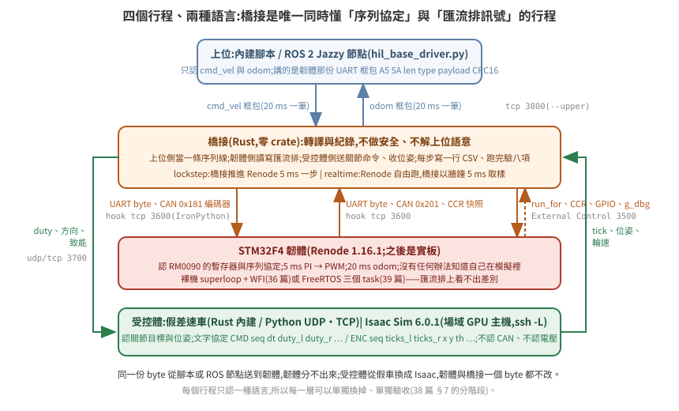
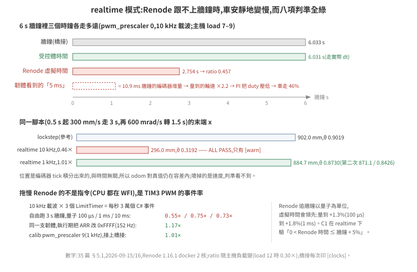

# 35 · HIL 是什麼,為什麼硬體要放在下位

把 Isaac Sim 裡的車開起來,最省事的做法是一段 Python:收 `cmd_vel`,算差速運動學,直接設兩個輪關節的速度。這在做場景、路網、多車調度時夠用。但它把一整層東西理想化掉了——真實車上,`cmd_vel` 到輪子之間有一顆 MCU:它解析協定、驗 CRC、限幅、跑 PI、發 PWM、讀編碼器、在沒命令 500 ms 後自己停車。這一層的錯誤,純運動學版本永遠不會遇到。

HIL(hardware-in-the-loop)就是把那顆 MCU 放回迴路裡:它跑真的韌體、講真的匯流排協定;Isaac Sim 只負責「馬達轉了會怎樣」。這一篇講它是什麼、跟 NVIDIA 課程裡的 HIL 差在哪、以及一旦迴路裡有三個時鐘,什麼事會變得不一樣。

> **驗證狀態**:本篇的拓撲、時鐘與規則來自 [36](../36-stm32-firmware-on-renode/README.md)–[39](../39-freertos-firmware-in-the-loop/README.md) 篇實測的那套系統(Renode 1.16.1 上的 STM32F4 韌體 + Rust 橋接 + 假受控體,docker,2026-09-15/16)。§5 的數字是實跑值。Isaac Sim 6.0.1 受控體在場域 GPU 主機實測,數字在 [38 篇](../38-acceptance-and-failure-modes/README.md) §6;ROS 2 Jazzy 上位在 38 篇 §6.1。

## 1. 三個詞:MIL、SIL、HIL

| 縮寫 | 迴路裡的「控制器」是什麼 | 迴路裡的「受控體」是什麼 |
|---|---|---|
| MIL(model-in-the-loop) | 控制律的數學模型(方塊圖) | 受控體模型 |
| SIL(software-in-the-loop) | 編譯出來的控制程式,跑在開發機上 | 受控體模型 |
| HIL(hardware-in-the-loop) | **目標硬體上的真韌體** | 受控體模型(即時的) |

三者的差別只在「控制器那一格放什麼」。HIL 的價值是控制器那一格**跟上車的是同一個東西**:同一份二進位、同一個時序、同一組週邊暫存器。

這一區的做法是 HIL 的純軟體變體:STM32F4 跑在 Renode 模擬器裡。跟 SIL 的差別在於韌體沒有重新編譯給開發機——Renode 執行的是給 Cortex-M4 的同一份 ELF,週邊也是同一組暫存器位址。跟真 HIL 的差別在於週邊是模型不是矽,而模型的深度要自己驗([36 篇](../36-stm32-firmware-on-renode/README.md) §3);時序也不算數(§7)。

## 2. 跟 NVIDIA 課程那個 HIL 的差別

NVIDIA 的 [Leveraging ROS 2 and HIL in Isaac Sim](https://docs.nvidia.com/learning/physical-ai/getting-started-with-isaac-sim/latest/leveraging-ros-2-and-hil-in-isaac-sim/index.html)(Getting Started with Isaac Sim 系列)講的是:工作站跑 Isaac Sim(場景、車、車上相機),**Jetson 跑 Isaac ROS 的影像分割**,兩邊靠乙太網路 + ROS 2 對接。迴路裡的硬體是運算平台,沒有 MCU。

| | NVIDIA 課程 | 這一區 |
|---|---|---|
| 迴路裡的實體 | Jetson(上位運算平台) | STM32(下位控制器) |
| 硬體跑什麼 | 感知(分割網路) | 底盤韌體:協定、限幅、安全迴路、輪速控制 |
| 硬體 ↔ Isaac 的介面 | 一個:ROS 2 topic(影像進、結果出) | 兩個:上位側 ROS 2 或序列協定;**受控體側是匯流排訊號**(CAN / GPIO / PWM),要經橋接轉成關節命令 |
| 時鐘 | 全部牆鐘 | 三個時鐘域(§5) |
| 借用 | ROS 2 當膠、Isaac 當受控體與感測器來源 | 同 |
| 不借用 | — | 感知堆疊、Jetson |

兩者不衝突,是同一輛車的兩層。課程沒涵蓋 MCU 這一層,匯流排層的橋接是自己的事——這一區就是那件事。

## 3. 為什麼值得:純運動學版本看不到的東西

下位機韌體裡有五類邏輯,Python 運動學一條都沒有:

1. **協定與 CRC**:壞框包要被拒、不能半解析。[38 篇](../38-acceptance-and-failure-modes/README.md) §2 的負對照就是把每個命令的 CRC 弄壞,看韌體擋不擋。
2. **安全閘門**:沒命令 500 ms 要停、急停腳拉高要停、驅動器報錯要停、輪子卡住要停、撞到東西要拒絕前進、上位心跳斷了要降速,韌體自己死了要有看門狗把整顆重置——而且停的動作要**發生在 PWM 與致能腳上**,不是只改一個旗標。每一道閘都有一個能讓它失效的負對照([38 篇](../38-acceptance-and-failure-modes/README.md) §1.2):韌體死掉而看門狗沒開時,馬達用最後的 duty 轉了 4 s,車跑出 1.6 m。
3. **閉環控制**:PI 的積分要在停車時清空,否則下次起步會衝。
4. **動態限制**:上位發的 `cmd_vel` 是階躍,把它變成斜坡是下位的事。沒有斜坡時 PI 把 duty 一步拉滿,車的加速度只剩馬達層在限——假受控體量到 9300 mm/s²,Isaac 的 `DriveAPI` 直接吃 duty 時 91400、超調 60%;加了斜坡與馬達層之後兩者都在 1900 以下、超調 3%(38 篇 §1.1)。
5. **時序**:5 ms 控制、20 ms 回報、1 ms tick——這些在真 MCU 上互相搶 CPU。

這五類的失敗形狀都是「上層看起來正常,車的行為不對」。放進迴路之後,它們會在 Isaac 裡以車的動作表現出來,而不是要等到實車。

## 4. 拓撲:每個行程只認一種語言

<p align="center"></p>

| 行程 | 認什麼 | 不認什麼 |
|---|---|---|
| 上位 | `cmd_vel`、`odom`、`/scan`(雷射接上位不接底盤板) | CAN、PWM、關節 |
| 韌體 | 序列協定;CAN / GPIO / PWM 暫存器 | **「自己在模擬裡」——它沒有任何辦法知道** |
| 橋接 | 匯流排上的 byte 與腳位;受控體的關節命令與狀態 | 上位的語意、車的動力學細節 |
| 受控體 | 關節目標、關節狀態、位姿 | CAN、電壓、任何車體協定 |

橋接是唯一同時懂兩邊的行程,所以它是這一區的主要新工件([37 篇](../37-bus-signal-bridging/README.md))。它的責任刻意窄:轉譯與紀錄。上位換過三次——腳本、ROS 2 方形 client、Nav2——韌體與橋接的位元組一個都沒改([38 篇](../38-acceptance-and-failure-modes/README.md) §6.1、§6.2)。

## 5. 三個時鐘域

| 時鐘 | 誰的 | 特性 |
|---|---|---|
| 牆鐘 | 上位、橋接、作業系統 | 真實時間 |
| Renode 虛擬時間 | 韌體 | 由指令數換算(`PerformanceInMips`),主機忙時落後牆鐘;**可以被外部推進** |
| Isaac 模擬時間 | 物理 | 手動步進,每步固定 dt;real-time factor 看 GPU 與渲染 |

[29 篇](../../common/29-long-run-error-budget-and-clock-drift/README.md) §2 講的是後兩者之間的分歧;HIL 多了第一個。三個時鐘各自跑的話,「韌體 5 ms 控制一次」與「Isaac 5 ms 物理一步」之間沒有任何東西保證對齊。

兩種運作模式,同一套橋接:

| 模式 | 做法 | 用在 |
|---|---|---|
| `realtime` | 三個時鐘各自跑,橋接只做轉譯:每 5 ms 牆鐘取樣一次、注入一次(§5.1) | 實板 HIL、Nav2 在迴路裡 |
| `lockstep` | 橋接當節拍器:推進 Renode Δt → 交換匯流排訊號 → 受控體走 Δt → 回填感測器 → 重複 | CI:同一份輸入跑兩次要一模一樣 |

`lockstep` 這一區實測做到了,數字如下(Renode 1.16.1,`PerformanceInMips=100` + 韌體 WFI,假受控體,docker 2 核):

- 6 s 腳本 = 1200 步 × 5 ms:主機另有負載(load ≈ 4/14)時牆鐘 35.5 s,**每步 29.6 ms,0.17× 實時**;主機閒時每步 8–13 ms
- Renode 虛擬時間結束於 6,000,000 µs 整,與 1200 × 5000 分毫不差
- 同一腳本跑兩次,1201 行 CSV **逐 byte 相同**
- 受控體換成 Isaac Sim 6.0.1(在另一台 GPU 主機,經 `ssh -L`):每步 52 ms,0.10× 實時;odom 對真值 3.4 mm / 0.028 rad;兩次 CSV 同樣逐 byte 相同(CPU 求解)

前提是所有注入都要等到「確實進了週邊」才推進時間——沒有這個 ack,同一份輸入會因為執行緒排程而落在不同的步,決定性就沒了([37 篇](../37-bus-signal-bridging/README.md) §3)。

`lockstep` 還有一個固有性質:**一步延遲**。第 k 步結束時注入的編碼器訊框,韌體在第 k+1 步的 `run_for` 裡才讀到。這跟真實匯流排的延遲同形,但要寫進判準(38 篇 C8 的 `steps − 1`)。

### 5.1 `realtime` 實測:三個時鐘真的分開時會怎樣

同一套橋接加 `--mode realtime`:橋接先叫 Renode `start`,之後每 5 ms **牆鐘**取樣一次匯流排、注入一次編碼器;受控體走的是「真的過了多久」;Renode 自己按它的節拍追牆鐘。三個時鐘的分歧量在跑完印成一行:

```
[clocks] wall=6.005s renode=6.081s plant=6.003s  renode/wall=1.013  max_lag(wall-renode)=4.0 ms
```

<p align="center"></p>


**Renode 能不能跟上牆鐘,取決於週邊事件率,不是指令數。** 這支韌體 CPU 幾乎都睡在 WFI,拖慢模擬的是 TIM3 的 PWM:平台描述給 TIM3 10 MHz、ARR 999 → 10 kHz 載波,三個 `LimitTimer`(計數器 + 兩個比較通道)每秒 3 萬個 C# 事件。用 [`renode/perf_freerun.resc`](../../../examples/hil-stm32/renode/perf_freerun.resc)(`start` → 主機睡 3 s → 讀虛擬時間)量,沒有橋接:

| PWM 載波 | 同步量子 100 µs(Renode 預設) | 量子 1 ms | 量子 10 ms |
|---|---|---|---|
| 10 kHz(`pwm_prescaler` 0) | 0.55× | 0.75× | 0.73× |
| 152 Hz(執行期把 ARR 改 0xFFFF) | — | 1.17× | — |

接上橋接(每 5 ms 牆鐘 6 個 External Control 讀取 + hook 三次往返)再量。第一版韌體(無斜坡,主機 14 核、當時 load 7–9、Renode 容器 2 核)的數字:10 kHz 載波 0.46×、末端 296.0, −2.1, 0.3192(走了 1/3);1 kHz 五次 1.01–1.02×、x 777–885、θ 0.730–0.873(對 lockstep 的 902.0, −0.9, 0.9019 差 17–125 mm、0.03–0.17 rad)。現行韌體(斜坡 + TIM encoder mode)在主機閒時重量(2026-09-17 00:00,**load 3.6–5.7**,Renode 容器 4 核——2 核會被 CFS 凍住,第 3 點;量子 100 µs,6 s 預設腳本):

| PWM 載波 | load | renode/wall(`max_lag`) | 末端位姿 plant(x, y, θ) | 對 lockstep 900.8, 0.4, 0.8627 的差 | 節拍 | C9 |
|---|---|---|---|---|---|---|
| lockstep(參考) | — | — | 900.8, 0.4, 0.8627 | — | — | 2257 綠 |
| 10 kHz(`pwm_prescaler` 0),一次 | 5.7 | **0.853**(2.1 s) | 448.4, −1.8, 0.6467 | 走了一半 | 平均 4.89 ms、停頓 3 次(最長 34.5 ms) | **紅** 3000 |
| 1 kHz(`pwm_prescaler` 9),五次 | 3.6–4.6 | 1.008–1.015(0.0 ms) | x 900.1–907.9、y −0.1–0.9、θ 0.8524–0.8641 | **0.7–7.1 mm、0.001–0.010 rad** | 平均 4.88 ms(橋接每步 sleep 1.5–1.7 ms)、停頓 1–3 次(最長 11–31 ms) | **五次全紅** 3000 |

三個結論:

1. **模擬器跟不上時,閉環速度會低到 ratio 倍,而一致性判準全部綠。** 第一版韌體 0.46× 那一列 `ALL PASS`(C1–C8;現行韌體 10 kHz 在 4 核閒時到 0.85×,C1–C8 一樣全綠、只有 C9 紅):odom 與 plant 一致(位置是 tick 積分出來的,跟時間無關)、CAN 與 CCR 一致、CRC 全對。壞掉的是速度:韌體每「5 ms」看到的是 11 ms 牆鐘的編碼器增量,量測速度膨脹 2.2 倍,PI 把 duty 壓下去,車就以 46% 的速度走。判準驗的是一致性,抓不到這件事,所以橋接在 ratio < 0.9 時另外印 `[warn]`。§7 說時序只有實板算數;這一列補上另一半:純軟體 HIL 的時序錯的時候,**沒有任何訊號**。
2. **Renode 的實時節拍不是硬的。** 它以量子為單位追牆鐘,虛擬時間可以領先:量到 +1.3%(量子 100 µs)到 +1.8%(1 ms)。C1 在 realtime 模式下改驗「0 < Renode 時間 ≤ 牆鐘 + 5%」,放的就是這個量。
3. **決定性沒了,而且差多少由主機決定。** 同一腳本五次 realtime,末端 x 在 777–885 之間、θ 在 0.730–0.873,CSV 的 `ccr1` 在 995/1200 步不同。差的來源拆開看(每步的牆鐘時刻現在寫進 CSV 的 `wall_ms`):橋接每步要 `ec_read` 1.8 ms + hook 2.4 ms,節拍守不住——驅動段平均步距 4.8–5.3 ms、最長停頓 50 ms、整趟 6.0–6.6 s 牆鐘。那個 50 ms 的停頓後來查到不是主機負載:它每 100 ms 一次、鎖在牆鐘的固定相位、長度上限 50 ms,是 Renode 容器 `--cpus 2` 的 CFS 配額——realtime 下 Renode 行程是模擬執行緒 + hook 執行緒 + External Control 執行緒 + GC 一起跑,超過配額就整個行程被凍到週期結束(同一負載下改 `--cpus 4`:停頓 70 次 × 50 ms → 9–24 次 × ≤ 28 ms,橋接回到平均 4.87 ms 一步、有時間 sleep)。`run_loop.sh` 的 realtime 現在預設給 Renode 4 核。編碼器訊框跟著步走,韌體的速度迴路吃到的是這個節拍:步距 5.3 ms 那一趟平均車速只有 259 mm/s(命令 300),x 777;步距 4.8 ms 那一趟 277 mm/s,x 830。末端差與節拍品質同向,不是隨機。兩件事已經改掉:realtime 的腳本時間軸改用牆鐘(原本用步數,橋接追進度時命令被壓短,轉向段量到 1.459 s 而不是 1.5 s);韌體的輪速改以「收到幾筆訊框」為時間基準而不是「過了幾個控制週期」(某個週期 0 筆或 2 筆時量測不再是 0 或兩倍;lockstep 的數字逐字不變)。最後一項是訊框本身沒有時間戳——韌體只能假設每筆代表 5 ms。收法是把編碼器改成真板的樣子:TIM encoder mode,韌體在自己的 5 ms tick 讀 CNT([36 篇](../36-stm32-firmware-on-renode/README.md) §3.1)。改完之後 realtime 同腳本三次的末端 x = 902 × 驅動段的 Renode/牆鐘比(預測 883 / 771 / 665,實測 876 / 766 / 668),θ 同理——差全部在時鐘比裡:速度迴路活在 Renode 時間,受控體活在牆鐘,閉環速度 = 設定點 × 兩者的比。要決定性就回 `lockstep`;要牆鐘就把 `[clocks]` 的比一起報,而且要分段報(驅動段與轉向段的比不同)。主機閒時、Renode 4 核的現行韌體五次(上表):比值 1.008–1.015、`max_lag` 0——末端與 lockstep 只差 0.7–7.1 mm,五次的散布 8 mm / 0.012 rad;第一版的 17–125 mm 是三件事疊起來的(CFS 凍住、訊框無時間戳、橋接沒守住節拍),三件都收掉之後 realtime 的末端就只剩時鐘比那 1%。
4. **驗物理量的判準抓得到節拍錯拍——而且紅的條件比「停頓」更寬。** 韌體加了斜坡之後多一項 C9「受控體輪加速度 ≤ 斜坡上限 × 1.2」([38 篇](../38-acceptance-and-failure-modes/README.md) §1.1)。同一天稍晚主機 load 9–11(另有兩個 Renode 容器各佔一核)再跑 realtime,10 kHz 與 1 kHz 載波都只到 0.33–0.43×,六次 **C9 全紅**:一次 50 ms 的停頓(第 3 點查到的 CFS 配額,當時以為是負載)讓韌體在一個 5 ms 步裡看到十步份的 tick(量測 153 → 337 mm/s),PI 把 duty 從 248 打到 63,受控體的減速撞到馬達層 3000 mm/s² 的上限。當時的推論是「紅的是停頓不是比值,均勻的慢只會讓車慢」;這兩個變數在主機上分不開,所以拆到 `lockstep` 裡各自量:橋接 `--skew uniform:R`(每步 Renode 只推進 R·dt、受控體照 dt 走——比值 R、零停頓)與 `--skew stall:N:M`(每 N 步一次把 Renode 一口氣推進 M·dt、期間編碼器不注入——比值 1、只有停頓)。決定性、不看主機負載;預設 6 s 腳本、現行韌體(2026-09-16):

| `--skew` | Renode/受控體時間比 | 取樣式注入(`hook`):韌體每個控制週期(5 ms 虛擬)吃到的注入筆數 | 取樣式 max \|dv/dt\| (mm/s²) | C9(上限 2520) | 連續注入(`cont`)τ 5 / 20 / 50 ms 的 max \|dv/dt\| | C9 |
|---|---|---|---|---|---|---|
| none(參考) | 1.000 | 1 | 2257 | 綠 | 2460 / 2356 / 2236 | 綠 |
| uniform:0.5 | 0.500 | 固定 2 | 909 | 綠 | 1056 / 1133 / 1147 | 綠 |
| uniform:0.25 | 0.250 | 固定 4 | 795 | 綠 | 811 / 602 / 807 | 綠 |
| uniform:0.2 | 0.200 | 固定 5 | 3000 | 紅 | 2482 / 757 / 721 | **綠** |
| uniform:0.9 / 0.8 / 0.6 | 0.9 / 0.8 / 0.6 | 1 或 2 | 3000 / 3000 / 3000 | 紅 | 0.9:2054 / 1997 / 2019;0.8:1765 / 1677 / 1944;0.6:1195 / 1307 / 1264 | **綠** |
| uniform:0.4 | 0.400 | 2 或 3 | 2495 | 綠(離上限 1%) | 825 / 1044 / 1028 | 綠 |
| uniform:0.3 | 0.300 | 3 或 4 | 2885 | 紅 | 693 / 726 / 854 | **綠** |
| stall:100:2(每 0.5 s 停 10 ms) | 1.000 | 1,停頓後一個週期 0 | 3000 | 紅 | 2289 / 2400 / 2262 | **綠** |
| stall:100:10(每 0.5 s 停 50 ms) | 1.000 | 1,停頓後九個週期 0 | 3000 | 紅 | 3000 / 3000 / 3000 | 紅 |

量到的規則:**紅的不是比值,也不只是停頓,是「韌體一個控制週期吃到的注入筆數不固定」。** 編碼器 tick 是橋接每步一口氣注入的(取樣式注入,[37 篇](../37-bus-signal-bridging/README.md) §3),韌體在自己的 5 ms tick 讀 CNT。兩個節拍的比是整數(0.5、0.25)時每週期筆數固定,韌體量到的速度只是乘上常數,PI 把 duty 壓低、車以比值倍的速度走(第 1 點的機制),C9 綠;比不是整數時筆數在 n 與 n+1 之間跳,量測速度跟著跳 ±1/n,kp = 1(Q8 256,mm/s → ‰)把它原樣變成 duty 的跳動,受控體撞到馬達層的 3000 mm/s²。停頓是同一件事的極端:一個週期 0 筆 → 量測速度 0 → P 項一次加 300‰,所以 10 ms 的停頓就夠紅。真板沒有這個問題——編碼器邊緣是連續的,均勻的慢在真板上只是慢。

取樣式注入在 realtime 下,由這條規則推論:比值 ≈ 1.01 時相位每秒漂 10 ms,每 0.5 s 就有一個週期吃到 2 筆或 0 筆,所以 **realtime 的 C9 不論負載都會紅**,幅度 3000(馬達層上限)而不是與負載成比例。定因的對照(load 10–12,同一負載下 `--cpus` 2 對 4,只用來定因、不當閒時的表):1 kHz、4 核、比值 1.016–1.017、橋接平均 4.87 ms 一步、末端 902.3 / 1.6 / 0.8516 與 899.0 / −2.2 / 0.8562(離 lockstep 2–8 mm),C9 仍紅 3000;CCR 一步跳超過 150 的 222–225 次裡 **170–188 次前後兩步都沒有停頓**;驅動段 `meas_l` 聚在 0、230–306、352 三群——Renode 每 5 ms 牆鐘推進的虛擬時間在 2–7 ms 之間抖,韌體的控制 tick 對橋接的注入沒有固定相位。閒時量到的(本節開頭的現行韌體表):五次 1 kHz 的 CCR 一步跳超過 150 的次數 75–194,其中 87–97% 前後兩步都沒有停頓;Renode 每 5 ms 牆鐘步推進的虛擬時間 74–79% 的步剛好 5 ms、其餘 2–4 或 6–7 ms;驅動段 `meas_l` 聚在 291 / 306(一筆注入)、184 / 245(半筆)、352–429(一筆半)——**推論成立,C9 在閒時也紅**。一致性判準對時序盲,物理量判準不是;但它紅的時候要回 `wall_ms` 欄看是哪一步錯拍,不是先懷疑斜坡。

表的最後兩欄是**連續注入**(`--enc cont`,[37 篇](../37-bus-signal-bridging/README.md) §5):CNT 在韌體讀的當下由「錨點 + 輪速 × 經過的虛擬時間」算出來,每個控制週期看到的就是那段虛擬時間裡的位置差。非整數比與 10 ms 停頓全部轉綠,三個 τ 都一樣。0.2 也轉綠(τ 20 ms 時 757)——同樣是 5 倍的時鐘比、同樣的增益,取樣式紅、連續式綠,所以那一列紅的不是「迴路增益乘 5」本身,是**乘 5 的增益碰上取樣注入的一步延遲**(取樣式的 CNT 是上一步的位置,連續式外插到當下)。50 ms 的停頓仍紅:Renode 一口氣先跑 50 ms,受控體那 50 ms 還沒走,外插只能照舊速度推;受控體補上時差了 98 tick,在 τ 內補回去就是一段反向的假速度(韌體 `meas` −92 → +122 mm/s)。Renode 跑在受控體前面時,受控體的未來還不存在,注入法補不了。

**realtime 閒時再量**(2026-09-17,1 kHz 載波、Renode 容器 4 核、6 s 預設腳本;每列附開跑時的 load,load ≥ 6 的幾次只用來定因、不在表裡)。連續注入有兩版:v1 的錨點時間是「更新在 Renode 裡被處理的那一刻」;v2 由橋接給「受控體取樣當下的虛擬時間」([37 篇](../37-bus-signal-bridging/README.md) §5,lockstep 下兩版 CSV 逐 byte 相同):

| 注入 | 次數 | load | renode/wall | 末端 x / θ(lockstep `cont` 900.6 / 0.8626) | 橋接停頓(> 10 ms,最長) | C9 |
|---|---|---|---|---|---|---|
| `cnt`(取樣式,負對照) | 2 | 4.31、5.99 | 1.006、1.022 | 896.4、902.0 / 0.8610、0.8494 | 28 次 24.8 ms;—  | **紅** 3000、3000 |
| `cont` v1,τ 20 ms | 3 | 4.35–5.40 | 1.008–1.017 | 898.6–911.9 / 0.8548–0.8585 | 4–11 次,18.6–32.1 ms | 紅 3000 ×3 |
| `cont` v1,τ 50 ms | 1 | 5.76 | 1.014(驅動段 0.909) | 820.3 / 1.0091 | 41 次,42.6 ms | 紅 3000 |
| `cont` v2,τ 20 ms | 5 | 3.41–3.50 | 1.000–1.003 | 899.1–902.3 / 0.8591–0.8625 | 1–6 次,12.0–24.9 ms | **綠 3**(2273、2294、2334)/ 紅 2(3000、3000) |
| `cont` v2,τ 50 ms | 5 | 3.21–5.90 | 1.001–1.015 | 896.4–900.6 / 0.8452–0.8663 | 1–19 次,10.2–19.1 ms | **綠 3**(2258、2340、2410)/ 紅 2(2703、3000) |

**連續注入 v2 在 realtime 下沒有做到「閒時五次 C9 全綠」**:τ 20 與 τ 50 各 3/5。量到的改善是實的——取樣式在同樣的條件下 C9 一次都沒綠過,v2 的末端 x 離 lockstep 在 4.2 mm 以內(表中 v1 τ 20 最多 11.3 mm、τ 50 那次 80 mm)——但紅的那兩成還在。拆紅的那幾次:超限的步不全挨著橋接的停頓(τ 20 第 2 次的 10 步超限,前後 4 步沒有一步超過 10 ms,韌體量到的輪速卻在一個控制週期裡從 306 跳到 414、552 mm/s),所以除了停頓,還有一個沒找到的抖動來源。要定位它,下一步是把韌體讀到的 CNT 與讀的時刻記進 `g_dbg`,跟 `ContinuousEncoder` 算給它的值逐筆對。**realtime 的 C9 在閒時仍會紅,紅的時候照 §5.1 第 4 點的方法回 `wall_ms` 看,不是先懷疑斜坡**——這一條結論不變。

`pwm_prescaler` 進了 `calib.json`,預設 0(10 kHz,與前面所有 lockstep 數字同條件);`lockstep` 的末端位姿在 0 與 9 兩個值下**逐字相同**(duty = CCR/(ARR+1),載波不影響),所以這個旋鈕只改模擬器的負擔。實板上載波要看驅動器,不是看模擬器跑不跑得動——這是兩個不同的理由,不要混。

## 6. 三條規則

這三條是設計決定,不是最佳實務建議。違反任何一條,HIL 的結論就不再是「韌體的行為」。

**韌體沒有「模擬模式」。** 同一個二進位在 Renode、實板、實車上跑,差別只在匯流排另一端接什麼。任何 `#ifdef SIM` 或「偵測到在模擬裡就跳過」都讓 HIL 驗的變成另一支韌體。這一區的韌體([36 篇](../36-stm32-firmware-on-renode/README.md))連鮑率與 CAN 位元時序都照真硬體寫,Renode 不看那些值也照寫。

**橋接不做安全。** 不夾限、不逾時、不幫忙停車。安全是韌體要證明的事;橋接一聰明,韌體的缺陷就被蓋住——[23 篇](../../common/23-no-shortcuts-in-physics-sim/README.md)講的捷徑,換一個位置再出現一次。橋接可以**記錄**一切,不能**干預**。

**每一輪要有生效證明。** 開跑時印一行:Renode 位址、韌體符號位址與 magic、受控體是哪一個、步長、腳本、負對照模式、`ARR` 讀回值對 calib——每個變數都要有一行證明它進了系統。這一區的橋接把它印在 `[effect]` 開頭的四行裡([38 篇](../38-acceptance-and-failure-modes/README.md) §1)。

## 7. 誠實標註:純軟體 HIL 的邊界

- **時序不算數。** Renode 的虛擬時間由指令數換算,中斷延遲、匯流排仲裁、DMA 競爭都不是實測值。最壞往返延遲與安全迴路的抖動只有實板算數。
- **週邊是模型。** 「Renode 有這個型別」與「這個型別對你的韌體夠用」是兩件事,[36 篇](../36-stm32-firmware-on-renode/README.md) §3 有一張逐項驗過的表——包括一個計數週期差 1 的 timer。
- **受控體是模型。** 假受控體是一階馬達 + 精確運動學;Isaac 的接觸力學多出滑移(這一區實測轉向 3.1%、直行 0.5%,[32 篇](../../fleet/32-differential-drive-vehicle-model/README.md)的 2~3% 同量級),容差跟著放。
- **Isaac 側的車是教學用的簡化車。** Mesh 盒底盤 + 球形輪 + 球關節腳輪,不是真車資產;它證明的是「迴路接得通、判準抓得到」,不是某台車的動力學。GPU 求解沒測。

## 8. 檢查清單

- [ ] 說得出迴路裡的「硬體」是上位還是下位,以及它跑的是哪一層邏輯
- [ ] 每個行程只認一種語言;橋接是唯一同時懂兩邊的
- [ ] 三個時鐘各是誰的,以及現在用 `realtime` 還是 `lockstep`
- [ ] `lockstep` 的注入有 ack,決定性用「同一輸入跑兩次逐 byte 比」驗過
- [ ] 韌體裡沒有任何「在模擬裡」的分支
- [ ] 橋接不夾限、不逾時、不停車
- [ ] 每一輪的生效證明印得出來
- [ ] 報告裡標明哪些數字是虛擬時間、哪些要等實板

---

延伸閱讀:[36 STM32F4 韌體在 Renode 上開機](../36-stm32-firmware-on-renode/README.md)、[37 匯流排訊號串接](../37-bus-signal-bridging/README.md)、[38 驗收與失敗形態](../38-acceptance-and-failure-modes/README.md)、[29 長跑才會浮現的兩件事](../../common/29-long-run-error-budget-and-clock-drift/README.md)、[23 物理模擬不可以偷懶](../../common/23-no-shortcuts-in-physics-sim/README.md)。
