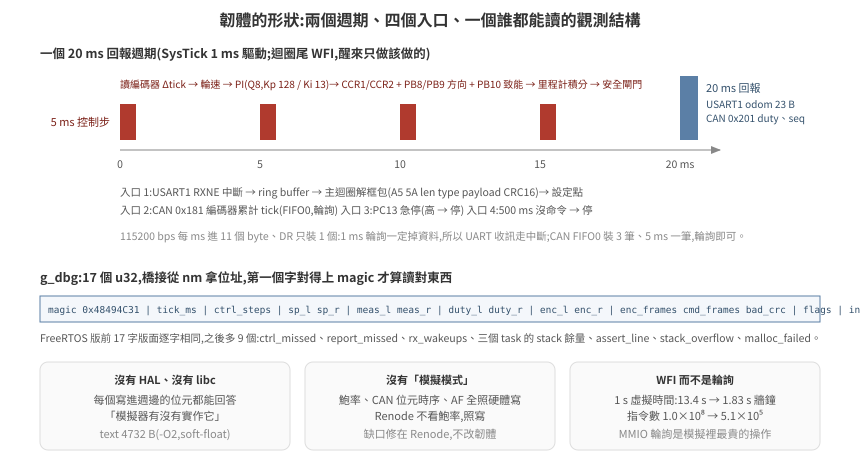
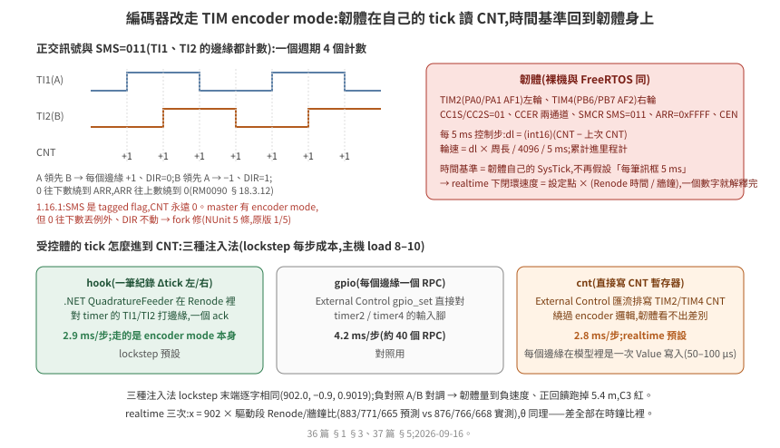

# 36 · STM32F4 韌體在 Renode 上開機:「型別存在」不等於「夠用」

把一支韌體放進 Renode,第一個問題不是「跑不跑得起來」,是**「它跑起來之後,你怎麼知道它在跑」**。第二個問題是,平台描述裡列了 USART、TIM、CAN,這些模型對你的韌體夠不夠用——而這件事只能逐個暫存器驗,型別名稱不會告訴你。

這一篇用一支最小的差速底盤控制器韌體走一遍:它的形狀、平台描述怎麼來、每個週邊怎麼驗、兩條觀測管道、以及一個讓模擬速度差 7 倍的設計選擇。

> **驗證狀態**:全部在本機實測。Renode 1.16.1(`antmicro/renode:latest`,build `d66b0c2a-202602160923`),arm-none-eabi-gcc 12.2,docker 2 核,主機另有負載(load ≈ 4/14),2026-09-15。程式碼在 [`examples/hil-stm32/firmware/`](../../../examples/hil-stm32/firmware/) 與 [`renode/`](../../../examples/hil-stm32/renode/)。「既有內部專案」指另一個在 Renode 1.16.1 上跑量產韌體的專案,其結論匿名化引用。

## 1. 韌體的形狀

[`firmware/main.c`](../../../examples/hil-stm32/firmware/main.c) 約 400 行,做真實下位機做的事:

```
USART1 收 cmd_vel 框包(CRC16)→ v, w
TIM2/TIM4 encoder mode 讀 CNT  → 輪速量測 + 里程計(calib `encoder_source`;舊路 CAN 0x181 訊框仍在)
每 5 ms:v, w 各自過斜坡(accel / alpha)→ 兩輪設定點 → PI + 速度前饋 → TIM3 PWM(CCR1/CCR2)+ 方向腳 PB8/PB9 + 致能腳 PB10
每 20 ms:USART1 回 odom、CAN 0x201 回馬達狀態(flags byte 同一份)
安全:500 ms 沒命令 → 停;PC13 急停 → 停;PC14/15 驅動器故障(低)→ 停;PC0 保險桿斷 → 拒絕前進
      duty ≥ 60% 而輪不動 200 ms → 堵轉鎖住;300 ms 沒 PING → 降速到 0;IWDG 1 s 沒餵 → 整顆重置
```

<p align="center"></p>


三個設計決定,每一個都與「在模擬器裡驗」有關:

**沒有 HAL、沒有 libc。** 暫存器定義自己寫([`regs.h`](../../../examples/hil-stm32/firmware/regs.h),位址與位元出自 RM0090),只連 libgcc(soft-float)。理由:每一個寫進週邊的位元都要能回答「模擬器有沒有實作它」。HAL 會在你看不到的地方碰暫存器——既有內部專案的 `HAL_CAN_Init()` 在 Renode 上凍在 `Error_Handler()`,而那支韌體的作者沒有寫過任何一行 CAN 暫存器。

**沒有「模擬模式」。** 鮑率、CAN 位元時序、GPIO 的 AF 設定全部照真硬體寫。Renode 不看鮑率,照寫。

**觀測結構固定版面。** `g_dbg` 是一個 `volatile` 結構,第一個欄位是 magic `0x48494C31`,後面是 tick、控制步數、設定點、量測、duty、收到的訊框數、壞 CRC 數、旗標、初始化錯誤碼、ring buffer 溢位數。橋接從 `nm` 的輸出拿位址,讀第一個字確認讀對了東西(§4)。同樣的做法反過來用一次:`g_cfg`(magic `0x48494C43`,固定放在 `.data` 開頭 `0x20000000`)放 PI 增益、斜坡、前饋,橋接開機後經 External Control 寫進去——增益掃描(`tools/tune_sweep.sh`)與「關掉斜坡」的負對照都不用重編韌體,而 `[effect]` 讀回來印一行,證明改的是這支韌體正在用的值。

大小:text 5092 B、data 240 B、bss 328 B(`-O2`;斜坡、前饋與 `g_cfg` 加了 360 B)。

## 2. 平台描述:vendor 一份,拿掉一行

Renode 內建的 `platforms/cpus/stm32f4.repl` 對這支韌體夠用——記憶體配置(flash 2 MB @ `0x08000000`、SRAM 256 KB @ `0x20000000`)、USART1/2、TIM3、GPIO A–C、CAN1、NVIC、SysTick 都在。但要**vendor 一份進 repo**([`renode/stm32f4-1.16.1.repl`](../../../examples/hil-stm32/renode/stm32f4-1.16.1.repl)),兩個理由:

1. **它會上網。** 檔尾有一行 `ApplySVD @https://dl.antmicro.com/.../STM32F40x.svd.gz`,`--network none` 下重試五次才放棄。SVD 只影響 log 裡的暫存器名稱,拿掉那行沒有功能損失。
2. **版本要鎖。** 既有內部專案比對過:master 分支的同名檔已與 1.16.1 不同(`i2c1` 的型別就不一樣)。浮動引用會讓「昨天還能跑」變成難查的問題。

[`renode/hilctl.repl`](../../../examples/hil-stm32/renode/hilctl.repl) 只有一行 `using "./stm32f4-1.16.1.repl"`;這支韌體不需要基底檔沒有的週邊。

## 3. 逐項盤點:「有」是什麼意思

判斷一個週邊「內建有沒有」,要查的是**實作深度**,不是型別名存不存在。下表每一列都是用 monitor 直接讀寫暫存器驗的,不載韌體(探針腳本的做法見 §6)。

| 週邊 | 韌體碰的暫存器 | Renode 1.16.1 實測 | 對這支韌體 |
|---|---|---|---|
| `STM32_Timer`(TIM3) | ARR、CCR1/2、CCMR1(OC1M)、CCER、CR1、CNT | 全部寫入後讀得回;**OC1PE / OC2PE 未實作**(warning);PWM 通道輸出是真的 GPIO 線:PWM1 模式下 `timer.Connections[0].IsSet` 在 CNT < CCR 時為 True | 夠用。橋接讀 CCR 算 duty |
| 同上,計數週期 | ARR | **週期是 ARR,硬體是 ARR+1**。兩組量測:ARR=999、10 MHz 跑 1 ms → CNT=10(=10000 mod 999);ARR=99 → CNT=1(=10000 mod 99) | PWM 頻率差 0.1%,無感。已修,見 [37 篇](../37-bus-signal-bridging/README.md) §4 |
| 同上,PWM 腳位初值 | CEN、EGR.UG | 致能後、第一次溢位前腳位不動(CNT=200 < CCR=500 時讀到 False);硬體的 OCxREF 是持續比較 | 5 ms 一步的閉環看不到(第一次溢位在 10 µs 內);已修,同上 |
| 同上,**encoder mode**(TIM2/TIM4) | SMCR.SMS=011、CCMR1 CC1S/CC2S=01、CCER、CNT、CR1.DIR | **1.16.1 沒有**:SMS 是 tagged flag,灌正交脈衝 CNT 永遠 0([`upstream/probe_encoder.resc`](../../../examples/hil-stm32/renode/upstream/probe_encoder.resc))。上游 `master` 有 encoder mode,但 0 往下數會丟 `Value cannot be larger than limit`、DIR 不動;修正版(繞回 0↔ARR、DIR 跟計數方向、週期 ARR+1)NUnit 5/5、原版 1/5 | 執行期載入 master 版 timer 只換 TIM2/TIM4(`upstream/STM32_Timer_Master.cs`、`stm32f4-encoder.repl`);TIM3 仍是原版 |
| 同上,執行成本 | ARR、CCR(事件率) | 10 kHz 載波 × 3 個 `LimitTimer` = 每秒 3 萬個 C# 事件,自由跑只到 0.55×;ARR 拉到 152 Hz 就 1.17×([35 篇](../35-hil-what-and-why/README.md) §5.1) | lockstep 無感;realtime 模式跟不上牆鐘。每個事件 50–100 µs 且與回呼內容無關(§5.1),`calib.json` 的 `pwm_prescaler` 是旋鈕,模型裡沒有不改可觀測行為的修法 |
| `STM32_UART`(USART1/2) | SR(RXNE/TXE/TC)、DR、BRR、CR1 | TXE 恆為 1;RX 有佇列。**TC 在 CPU 寫 DR 後正常設回、TCIE 拉中斷**(本篇探針);既有內部專案在 DMA 傳送下量到「TC 永不重設」,那條路徑本篇沒走,兩者不衝突 | 韌體輪詢 TXE、不等 TC。真硬體同樣正確 |
| `STMCAN`(CAN1) | MCR/MSR、BTR、TSR、TI0R/TDT0R/TDL0R/TDH0R、RF0R、RI0R/RDT0R/RDL0R/RDH0R、FMR/FM1R/FS1R/FFA1R/FA1R/F0R1/F0R2 | MCR.INRQ=1 → MSR 0xC01(INAK=1,SLAK 清);mailbox 寫入 TXRQ 後 `FrameSent` 立刻觸發;`OnFrameReceived()` 注入的訊框進 FIFO0(FMP0=1、RI0R 帶 STID) | 夠用,**但濾波器有一個坑**(下一段) |
| `STM32_GPIOPort` | MODER、AFRL、IDR、ODR、BSRR | 輸出腳在 `Connections[n]`;輸入腳用 `OnGPIO(n, v)`;`State` 是 protected,monitor Python 讀不到 | 夠用 |
| `STM32_IndependentWatchdog`(IWDG) | KR(0x5555/0xCCCC/0xAAAA)、PR、RLR、SR | 照 RM0090 第 21 章的序列:`Reload` 才把 RLR 載入、起動從 0xFFF 起、PR 的 2^(2+PR) 分頻;逾時 `machine.RequestReset()` → 週邊全部重置、監視器的 `macro reset` 重載 ELF。**RCC_CSR 的 IWDGRSTF 不設**(模型裡的 `TODO`),而且 `STM32F4_RCC` 在系統重置時把重置旗標回到上電值(RM0090 §7.3.21:旗標只在 power reset 清);SR 的 PVU/RVU 永遠 0 | 重啟本身夠用:韌體 2.0 s 死掉、2.995 s 重啟。重置來源:原版靠 `.noinit` 計數;修正版(`RCCFIX=1`,`STM32_ResetFlags.patch`)重啟後 `RCC_CSR = 0x20000000`([38 篇](../38-acceptance-and-failure-modes/README.md) §1.2) |
| `STM32_GPIOPort`,輸入腳 | PUPDR、IDR | **不看 PUPDR**:輸入腳預設 0,機器重置後也回 0 | 低有效的腳(nFAULT、保險桿常閉接點)由橋接扮演 pull-up 拉高,重啟後再拉一次 |
| `STM32F4_I2C`(I2C3,IMU 用) | CR1(START/STOP/ACK/PE)、CR2、DR、SR1(SB/ADDR/BTF/RxNE/TxE/AF)、SR2 | 第一筆交易正常(WHO_AM_I_G 讀到 0xD4),**之後每一筆都錯**:模型在 STOP 與 repeated START 都不呼叫從端的 `FinishTransmission()`,`I2CPeripheralBase` 停在「收資料」狀態,下一筆交易的暫存器位址被當成資料寫進上一個暫存器。閉環量到:陀螺儀讀值恆為 −1687 mrad/s、0.545 s 誤報 SLIP | 不夠用。上游 `master` 已換成 `STM32F1_I2C`(F1/F2/F4 同一代 I2C,commit 033ee44 修了這件事);1.16.1 執行期載入它的逐字副本(`IMU=1`,[38 篇](../38-acceptance-and-failure-modes/README.md) §1.3) |
| `LSM330_Gyroscope`(I2C 0x6A) | WHO_AM_I_G、CTRL_REG1..4_G、OUT_Z_L/H_G | **靈敏度錯**:輸出 = 角速度 × (65536/500 − 1) = 130 digit/dps,datasheet(DocID023426 Rev 3)表 3 是 8.75 mdps/digit = 114.3 digit/dps,照 datasheet 寫的韌體讀到的角速度高 14%;超過約 252 dps 會繞回不飽和;**WHO_AM_I_G、CTRL_REG1..3_G 沒定義**(讀 0、寫入丟掉)。另外 `I2CPeripheralBase` 不看子位址 MSb 的自動遞增、`Read(count)` 永遠回 1 byte | 修在模型:[PR #254](https://github.com/renode/renode-infrastructure/pull/254),NUnit 修正版 5/5、原版 0/5;韌體每筆交易只讀一個暫存器(datasheet 允許),多 byte 讀取這條路沒走 |
| NVIC + SysTick | ISER、SysTick CSR/RVR/CVR | SysTick 頻率來自平台描述的 `systickFrequency: 72000000`,**不是 RCC**;USART1 IRQ 37 正常進。**ENABLE 0→1 不從 RELOAD 載入**——先寫 CVR 再寫 LOAD 的順序(FreeRTOS port)第一個週期跑滿 2^24 cycle | 裸機版先寫 LOAD,沒踩到;[39 篇](../39-freertos-firmware-in-the-loop/README.md) §4 踩到,已修 |

CAN 濾波器的坑:`FMR` 的重置值是 `0x2A1C0E01`,其中 `CAN2SB`(bit 13:8)= 14,意思是 bank 0–13 屬於 CAN1。探針一開始寫 `FMR = 1`(只想設 FINIT),把 `CAN2SB` 清成 0——bank 0 從此屬於 CAN2,CAN1 的接收路徑對它 `Where(BelongsToMaster)` 一濾,訊框**靜默丟掉**:`OnFrameReceived()` 呼叫成功、`FrameReceived` 事件照樣觸發,FIFO 就是空的。真硬體的 HAL 用讀-改-寫所以不會踩到;自己寫暫存器的人會。韌體的 `can_init()` 因此全部用 `|=` / `&=`。

另一個與既有紀錄不一致的點要誠實寫:既有內部專案的結論是「`STMCAN` 沒實作 `HAL_CAN_Init()` 要的 MCR/MSR 交握」,本篇探針從匯流排直接寫 INRQ 卻看到 INAK 正確回應。兩者可能都對——HAL 的序列多了 `SLEEP` 清除與逾時計算,那條路徑本篇沒有走。**這裡只能說「自己寫的序列交握有回應」,不能說「既有紀錄錯了」。**

### 3.1 編碼器:從 CAN 訊框改成 TIM encoder mode

第一版的編碼器是受控體每 5 ms 送一筆 CAN 累計 tick——方便,但時間基準在橋接手上:realtime 模式下橋接守不住 5 ms 節拍,韌體每筆訊框都當 5 ms 算,閉環速度就跟著橋接的節拍掉([35 篇](../35-hil-what-and-why/README.md) §5.1)。真板的做法是 **TIM 的 encoder mode**(RM0090 §18.3.12):兩路正交輸入接到 TI1/TI2,硬體自己加減 CNT,韌體在自己的 5 ms tick 讀 CNT 差。改成這樣之後,時間基準是韌體的 SysTick,受控體與橋接的節拍只影響 CNT 在什麼時候跳,不影響「5 ms」是多長。

<p align="center"></p>

韌體(兩版同):TIM2(PA0/PA1 AF1)左輪、TIM4(PB6/PB7 AF2)右輪,`ARR=0xFFFF`、`CC1S/CC2S=01`、`CCER` 兩通道、`SMS=011`、`CEN`;控制步 `dl = (int16)(CNT − 上次)`,累計進里程計。`calib.json` 的 `encoder_source` 切換(`tim` / `can`),`ENC_SOURCE_TIM` 進 `calib.h`;CAN 0x181 收到只計數不採用。

受控體的 tick 進 CNT 有三種注入法(橋接 `--enc`,37 篇 §5):`hook`(一筆紀錄,Renode 裡的 .NET `QuadratureFeeder` 對 TI1/TI2 打邊緣,走 encoder mode 本身)、`gpio`(每個邊緣一個 External Control RPC)、`cnt`(直接寫 CNT)。lockstep 三種末端逐字相同(900.8, 0.4, 0.8627;速度源受控體時量的,扭矩受控體的參考值是 905.1, −1.6, 0.8521),注入那一段每步 2.5 / 4.1 / 2.3 ms(load 7–8);負對照 A/B 對調 → 韌體量到負速度、正回饋跑掉 5.4 m、C3 紅。realtime 下每個邊緣在模型裡是一次 `LimitTimer.Value` 寫入(§5.1 的 50–100 µs),8k 邊緣/s 會把模擬執行緒吃掉,所以 realtime 不走邊緣。取樣式 `cnt` 在閒時 C9 一次都沒綠過,realtime 預設改成第四種 `cont`(CNT 在韌體讀的當下外插,37 篇 §5、35 篇 §5.1)。

以下 realtime 同腳本三次(`cnt`)的末端:x = 902 × 驅動段的 Renode/牆鐘比(預測 883 / 771 / 665,實測 876 / 766 / 668)、θ = 0.9019 × 轉向段的比(0.620 / 0.682 / 0.598 vs 0.611 / 0.689 / 0.598)——**差全部在時鐘比裡**,一個數字解釋完。這就是 35 篇 §5.1 留下的開放項的結論。

### 3.2 IMU:datasheet 給了什麼、韌體要自己補什麼

橋接寫進陀螺儀模型的若是受控體真值,韌體拿到的是一顆不存在的完美感測器;打滑門檻與「沒有接觸不誤報」都在它上面量。真元件的誤差先從 datasheet 抄。LSM330(DocID023426 Rev 3)Table 3,Vdd 3 V、25 °C,表註「Typical specifications are not guaranteed」:

| 項目 | 陀螺儀 | 加速度計 |
|---|---|---|
| 量程 | ±250 / ±500 / ±2000 dps | ±2 / ±4 / ±6 / ±8 / ±16 g |
| 靈敏度 | 8.75 / 17.50 / 70 mdps/digit | 0.061 / 0.122 / 0.183 / 0.244 / 0.732 mg/digit |
| 典型零點 | ±10 / ±15 / ±25 dps(對應三個量程;表註 4:內建高通可以消掉) | ±60 mg(±2 g;§3.2:一批元件零點的標準差) |
| 雜訊密度 | 沒寫 | 沒寫 |
| 靈敏度誤差 | 沒寫 | 沒寫 |
| 零點溫漂 | 沒寫(§3.2 文字:「changes very little over temperature and over time」) | 沒寫(§3.2 文字引用 Table 3 的「zero-g level change vs. temperature」,表中沒有這一列) |

韌體用 ±250 dps 量程,典型零點 **±10 dps = 174.5 mrad/s**,是打滑門檻 45 mrad/s 的 3.9 倍。理想感測器上成立的偵測,換成一顆典型元件就整路誤報——這不是調門檻能收的,韌體要自己估零偏。

**橋接的誤差模型**(`--imu-noise none|datasheet`):`datasheet` = 陀螺儀零偏 +10 dps(一個典型值)、白雜訊 0(datasheet 沒寫雜訊密度,不從別的型號借)。`--gyro-bias-mdps` 覆蓋零偏;`--gyro-noise-mdps` 加高斯白雜訊(σ,每步一個樣本,`--imu-seed` 固定序列)——這一項只拿來掃「雜訊到多大偵測開始誤報」,不代表這顆元件。`none` 保留成理想感測器的對照組。

**韌體估零偏。** 內建高通(CTRL_REG5_G 的 HPen)會連慢速轉彎的真實角速度一起濾掉,而且 Renode 的陀螺儀模型沒有定義 CTRL_REG5_G(`LSM330_Gyroscope_Fixed.cs` 只定義 WHO_AM_I 與 CTRL_REG1..4),所以在韌體做:

- **靜止條件**:斜坡後的 v = w = 0(韌體實際給出去的命令,不是收到的),而且兩輪 CNT 差都是 0,連續滿 `g_cfg.gyro_bias_still_ms`(calib 200 ms)。
- **估計**:靜止期間把原始讀值累加成移動平均(前 256 筆取算術平均,之後每筆 `sum += gz − sum/256`,時間常數 1.28 s);離開靜止就凍結。
- **使用**:打滑殘差改成 |(陀螺儀 − 零偏) − 輪差 yaw rate|。
- **估出來之前**(累計不到 20 筆,100 ms):不做打滑判斷,命令當 0、odom 旗標亮 `IMU_CAL`(第 9 位)——車先靜止校正,估完自己解。加速度計([38 篇](../38-acceptance-and-failure-modes/README.md) §1.4)的零偏用同一個靜止條件、同一個閘門。
- `gyro_bias_still_ms = 0` 關掉估計(零偏固定 0)——負對照 `gyro-bias-uncomp` 用這個。
- `g_dbg` 多一字 `gyro_bias`(mrad/s)。

**量到的**(2026-09-17,lockstep,假受控體;[38 篇](../38-acceptance-and-failure-modes/README.md) §1.3 的 C13):

| 陀螺儀誤差 | 情境 | 韌體估出的零偏(時刻) | 沒有接觸時殘差最大 | C13 |
|---|---|---|---|---|
| 無(理想) | 預設腳本 | 0(0.190 s) | 9 mrad/s | 綠 |
| 零偏 +10 dps(datasheet) | 預設腳本 / 方形 / Nav2 90 s | 174(0.190 s) | 10 / 10 / 9 | 綠 |
| 零偏 +10 dps | 預設腳本,FreeRTOS | 174(0.125 s) | 10 | 綠 |
| 零偏 −10 dps | 預設腳本 | −174(0.190 s) | 9 | 綠 |
| 零偏 +10 dps,Isaac 6.0.1 | 預設腳本 / Nav2 90 s | 174(0.670 s) | 31 / 10 | 綠 |
| 零偏 +10 dps、不估(`gyro-bias-uncomp`) | 預設腳本 | 0 | 184 | **紅**(0.545 s 誤報) |
| 零偏 0、不估 | 預設腳本 | 0 | 9 | 綠——紅的原因只是零偏 |
| 零偏 +10 dps + 白雜訊 σ 1 / 3 dps | 預設腳本 | 175 / 177 | 20 / 48 | 綠(48 只有單步,沒撐滿 50 ms) |
| 零偏 +10 dps + 白雜訊 σ 10 / 30 dps | 預設腳本 | 187 / 213 | 161 / 482 | **紅**(1.185 / 0.650 s 誤報) |

白雜訊那幾列是掃描、不代表這顆元件(datasheet 沒寫雜訊密度):門檻 45 mrad/s、平均 10 步,撐得住每步 σ 3 dps(52 mrad/s),10 dps 撐不住。同 seed 帶雜訊跑兩次,CSV 逐 byte 相同。零偏 −10 dps 與 σ 1–30 dps 那五次量在加速度計與閘門加入之前的韌體上,零偏估計與打滑判斷的邏輯相同;σ 10 dps 在最終韌體上重跑:同樣 1.185 s 誤報,而且 C3 也紅(dθ 0.056 rad)——雜訊讓殘差過門檻的那些步,航向融合([38 篇](../38-acceptance-and-failure-modes/README.md) §1.5)換成了雜訊更大的陀螺儀。

**零偏之後的兩個用途**(判準與量測在 [38 篇](../38-acceptance-and-failure-modes/README.md) §1.4–1.5):

- **加速度計抓平移打滑**:速度殘差 = 漏積分(前進加速度 − 零偏 − 輪速微分),τ 0.5 s,過 90 mm/s 持續 50 ms 亮 `SLIP`;量程 ±16 g(撞擊一步就有約 6 g)。
- **航向融合(gyrodometry)**:每步看陀螺儀殘差的 50 ms 平均,不超過打滑門檻就用輪差,超過才用「陀螺儀 − 零偏」。正常行駛完全不吃陀螺儀漂移,打滑片段航向不跟著錯。距離仍用輪子。`g_cfg.yaw_fusion` 開關,數值照既有里程計用 `float`(裸機版 soft-float、FreeRTOS 版 hard-float,同一份 `control.c`)。

閘門是量出來的需要:ROS 方形閉環的上位在開機後 70 ms 就送命令,車一路沒有靜止滿 200 ms,零偏整趟沒估出來——打滑偵測整趟沒在做,C13 卻照樣綠。所以橋接在掛了 IMU 而零偏始終沒估出來時直接判 C13 紅;韌體則在估出來之前擋住命令。靜止條件看斜坡後的命令,是因為上位持續送非零命令時,「收到的命令為 0」永遠不成立,閘門會自己鎖死。之後每次停車更新零偏。

閘門的代價是起步可能晚。假受控體開機就靜止,0.190 s 估完,早於預設腳本 0.5 s 的第一個命令,末端 900.8 / 0.4 / 0.8627 不變。Isaac 受控體開機前 0.37 s 輪子 CNT 還在 ±1 tick 之間抖,0.670 s 才估完,命令被擋了 0.17 s:預設腳本末端 x 850.0 mm,原本是 901.1——少的 51 mm 就是 300 mm/s × 0.17 s,C3 仍然綠(odom 對真值 1.0 / 1.0 mm)。

### 3.3 馬達層:從速度源改成扭矩模型

到 GOAL 7 為止,三個受控體的馬達層是**速度源**:duty 經死區線性換成目標輪速,再一階趨近,每步的速度變化夾在 `motor_accel_max_mm_s2`(註解寫「電流限制」,但它與負載無關)。撞到東西之後輪子照轉還是凍住,由 `CONTACT=slip|freeze` **指定**。Isaac 那邊是物理求解,但驅動參數沒人量過——量完是「驅動扭矩上限 ÷ 抓地力扭矩 ≈ 15 倍」([38 篇](../38-acceptance-and-failure-modes/README.md) §1.6),所以擋住必打滑。

改成扭矩模型之後,打滑或卡住是算出來的。

**馬達參數**抄一顆具體的減速馬達:[Pololu 50:1 Metal Gearmotor 37Dx54L mm 12V](https://www.pololu.com/product/4743)(產品頁,2026-09-18 讀):

| 項目 | 規格 | 換算 |
|---|---|---|
| 空載轉速 | 200 rpm @ 200 mA | ω_free = 20.94 rad/s(輪半徑 50 mm → 1047 mm/s,與 `wheel_speed_at_full_duty_mm_s` 1000 同級) |
| 失速扭矩 | 21 kg·cm @ 5.5 A | τ_stall = 2.06 N·m |
| 建議上限 | 連續 10 kg·cm、瞬時 25 kg·cm | 連續 0.98 N·m、瞬時 τ_max = 2.45 N·m |

產品頁註明失速扭矩與電流是外插值,實際會更早停轉;這裡照抄,不自己調。

**公式**(三個受控體同一份,改一處要三處一起改):

1. 馬達扭矩(直流馬達的扭矩–轉速直線,PWM 當電壓比例):`τ = duty × τ_stall − (τ_stall / ω_free) × ω`,夾在 ±τ_max。
2. 輪緣力 `F_cmd = τ / r`;抓地力上限 `F_max = μ × N`,每輪 `N = m g / 2`(忽略腳輪分擔與加減速時的載重轉移,寫明是假設)。
3. `|F_cmd| ≤ F_max` → 滾動:輪速 = 車速 / r,施力 = F_cmd。
4. `|F_cmd| > F_max` → **滑動**:施力 = sign(F_cmd) × F_max,輪子自己的動力學 `I_w dω/dt = τ − F_max r`(輪子是球,`I_w = 0.4 m_w r²`)。編碼器數的是 ω,所以打滑時 odom 會多走——這正是 §1.3–1.5 那些判準要抓的東西。
5. 車體:`m dv/dt = F_l + F_r`、`J dω_b/dt = (F_r − F_l) × track / 2`;撞到靜態障礙物時前進方向的加速度歸零(法向力由障礙物承擔),輪子照第 4 條滑。

**Isaac 用同一條直線**:速度驅動的 `damping × (target − ω)` 夾在 `maxForce`,就是上面的第 1 條。所以不改驅動型別,只把參數換成物理值:`damping = τ_stall / ω_free`、`maxForce = τ_max`、`target = duty × ω_free`(角度單位換 deg/s;damping 的單位用 `--probe-physics` 實測確認,不用猜)。抓地力那一半本來就是 PhysX 在算(μ 量到 0.508)。

**`CONTACT` 旗標拿掉**:高摩擦 → 輪緣力打不過抓地力 → 卡住;低摩擦 → 打滑。對應關係與量到的門檻寫在 38 篇 §1.6。

## 4. 兩條觀測管道

**printer**:USART2 接檔案後端(`usart2 CreateFileBackend @path true`;headless 下 `showAnalyzer` 沒用),韌體開機吐三行:

```
hilctl boot fw 0.1
can1 ready
main loop
```

**SRAM 變數**:`sysbus ReadDoubleWord 0x200000F8` 讀 `g_dbg.magic`,位址從 `arm-none-eabi-nm -n` 的輸出來。跑 200 ms 之後:magic `0x48494C31`、`tick_ms` 200、`ctrl_steps` 39、`flags` 4(CMD_STALE)、`init_err` 0。

兩條都要留,因為它們失效的方式不同。printer 一旦卡住(既有內部專案就是 TC 旗標讓它停在第一則),後面每一步都看不見;SRAM 變數不會卡,但要先知道位址、也看不到「順序」。既有內部專案還留了一個分辨法:PC 停在自旋迴圈與時鐘停了,現象一模一樣,分辨的方式是去讀那個被等的變數(`uwTick` 有沒有前進),不是猜。

⚠ **機器還沒跑的時候,SRAM 全零。** `LoadELF` 之後機器是暫停的,`main` 還沒執行;這時讀 `g_dbg` 得到 magic = 0、`ARR` = 65535(重置值)。橋接第一版就在這裡把「韌體不對」誤報了一次——生效證明要在**開機之後**做([38 篇](../38-acceptance-and-failure-modes/README.md) §5)。

## 5. 速度:瓶頸是 MMIO 輪詢,解法是 WFI

第一版主迴圈純輪詢(每圈讀 USART SR、CAN RF0R、GPIO IDR),量出來:

| 設定 | 1 s 虛擬時間的牆鐘 | 40 步 × 5 ms | 每步 | 1 s 執行的指令數 |
|---|---|---|---|---|
| MIPS=100,純輪詢 | 13.4 s | 2.44 s | 61 ms | 1.0 × 10⁸ |
| MIPS=10,純輪詢 | 3.2 s | 0.37 s | 9 ms | 1.0 × 10⁷ |
| **MIPS=100,迴圈尾 WFI** | **1.83 s** | **0.41 s** | **10 ms** | **5.1 × 10⁵** |

40 步與連續 1 s 的速率一樣,所以瓶頸不在 `RunFor` 的切換,是指令執行本身——每次週邊存取都要進 C# 的匯流排分派,一個只做 MMIO 輪詢的迴圈等於把最貴的操作做到滿。

降 MIPS 有效但代價是模擬的 MCU 變慢(真 F4 約 72 MIPS)。WFI 同樣有效而且保留真實速度:CPU 睡到下一個中斷,Renode 直接跳到那個時刻,1 s 只執行 51 萬條指令。

**WFI 的配套**:迴圈醒來的節奏變成 SysTick 的 1 ms。115200 bps 每毫秒進 11 個 byte,而 DR 只裝得下 1 個——1 ms 輪詢一次一定掉資料。所以 USART1 收訊改成中斷 + ring buffer。**Renode 的 UART 模型有佇列,輪詢版在模擬裡「看起來也對」**;這是模擬器比硬體寬容的地方,設計要以硬體為準。CAN 的 FIFO0 裝得下 3 筆、編碼器 5 ms 一筆,輪詢即可。

### 5.1 第二個瓶頸:timer 事件,一個 50–100 µs

WFI 之後 CPU 幾乎不執行指令,但 realtime 模式下 Renode 仍跟不上牆鐘([35 篇](../35-hil-what-and-why/README.md) §5.1)。拆開量([`renode/perf_timer_events.resc`](../../../examples/hil-stm32/renode/perf_timer_events.resc):開機後 `cpu IsHalted true`,從匯流排設 TIM3 的 ARR、CCER、CCR,自由跑 3 s 牆鐘讀虛擬時間;同一批交錯跑三次,量子 1 ms,docker 2 核,主機 14 核 load 8–11):

| TIM3 設定 | 每秒事件數 | 3 s 牆鐘走了多少虛擬時間(三次) | 每個事件 |
|---|---|---|---|
| 10 kHz,兩個比較通道有輸出 | 30,000 | 1.71 / 1.71 / 2.01 s | ≈ 55 µs |
| 10 kHz,比較通道全關(CCER=0) | 10,000 | 2.86 / 3.08 / 3.37 s | ≈ 100 µs |
| 1 kHz,兩通道 | 3,000 | 12.4 / 16.0 s(一次異常值不計) | ≈ 70 µs |
| 152 Hz(ARR=0xFFFF),兩通道 | 456 | 41 / 51 / 59 s | — |

CPU 停住時模擬器只在事件之間跳,152 Hz 能跑到 14–20 倍實時;10 kHz 三個事件就把它壓到 0.6×。**每個 `LimitTimer` 事件 50–100 µs**,與回呼裡做什麼無關:把比較通道回呼裡的 GPIO 操作全部拿掉([`upstream/gen_timer_probes.py`](../../../examples/hil-stm32/renode/upstream/gen_timer_probes.py) 的 `ProbeNoGpio`)速度不變;讓比較通道不排事件(`ProbeNoCc`)才回到只剩主計數器的速度。成本在時間框架處理每一個排程點的路徑上,不在 `STM32_Timer.cs` 的那幾行。

所以這一項**沒有修在模型裡**。PWM 一個週期至少三個事件(上升沿、兩個下降沿),少排事件等於不推腳位的邊緣——接在腳上的 GPIO 埠、External Control 的 `GetState`、任何掛在 `Connections[i]` 上的東西都會讀到舊值。只有「沒人接、沒開中斷、沒開 DMA」的通道可以惰性算,而 vendor 的 `stm32f4.repl` 把 TIM3 的通道接到 `gpioPortA` 6/7,這一區的閉環又靠 External Control 讀 CCR 不讀腳位,要吃到這個省法得先改平台描述。把主計數器也改成惰性(只在暫存器讀寫時從時脈源算 CNT)是另一個規模的改寫,而且事件本身的成本是 Renode 核心的事,不是週邊的事——這裡留 `pwm_prescaler` 當旋鈕,把「每個事件 50–100 µs」這個數字留給上游討論。

主機負載讓同一組設定的數字差三成:同一批交錯跑、看最小值,不拿單次當結論。用容器 cgroup 的 CPU 時間代替牆鐘量過一次,結果對事件數不單調(`RunFor` 期間時間框架的執行緒會空轉),放棄。

## 6. 驗收:十項,一項是負對照

[`renode/io_check.resc`](../../../examples/hil-stm32/renode/io_check.resc)(`tools/io_check.sh` 跑)不經橋接,用 monitor 直接餵資料,把韌體這一層獨立驗到綠。monitor 在這裡扮演板子:先把三個低有效的輸入腳拉高(pull-up),PING 也由它送:

| 項 | 做什麼 | 結果 |
|---|---|---|
| A 壞 CRC | 餵一個最後一 byte 反相的 CMD_VEL | `bad_crc` 1、`cmd_frames` 0 |
| B PING + CMD_VEL v=300 | 30 ms 後讀 | 設定點 35/35(在 1500 mm/s² 的斜坡上)、flags ENABLED、duty 72、**CCR1 = 72**、GPIOB ODR = `0x700`(PB8/9/10 高) |
| C 編碼器 | TIM2/TIM4 CNT 各 +20,兩次間隔 5 ms | `meas_l` 306 mm/s(理論 20 × 314159 / 4096 / 5 = 306.8) |
| C′ 編碼器(TIM) | `probe_encoder.resc`:SMS=011,灌一個正向、兩個反向正交週期 | 原版 CNT 永遠 0;master 修正版 4 → 0 → 0xFFFC、DIR=1 |
| D 急停 | PC13 拉高 | flags ESTOP、duty 0、ODR `0x300`(PB10 低,方向腳不動) |
| F 驅動器故障 | PC14 拉低 10 ms,再拉高 10 ms | DRV_FAULT、duty 0、ODR `0x300`;放開後 ENABLED 回來 |
| G 保險桿 | PC0 拉低 + CMD_VEL v=300 100 ms;再 CMD_VEL v=−200 100 ms | BUMPER、設定點 0;倒車命令的設定點 −133(往 −200 的斜坡上) |
| H 心跳 | CMD_VEL 照送、不送 PING | +350 ms:HB_LOST、設定點 237 往 0 走;+600 ms:0(命令逾時的 500 ms 還沒到) |
| I 堵轉 | PING + CMD_VEL v=300、CNT 不動 | duty +100 ms 297、+200 ms 673(≥ 600 起算);+400 ms STALL、duty 0;CMD_VEL v=0 → ENABLED |
| E 命令逾時 | 600 ms 不送命令 | flags CMD_STALE(HB_LOST 也亮);`rx_overflow` 0 |
| J IWDG | `g_cfg.hang_at_ms` 寫成 tick + 210 → 韌體死掉;跑 1.3 s | `resets` 1、tick 從頭數(91)、flags WDT_RESET(DRV_FAULT、BUMPER 也亮:重置後輸入腳回 0,§3) |

A 是負對照:它證明「B 過了」不是因為韌體什麼都收。閉環層的五個 `*-off` 負對照在 [38 篇](../38-acceptance-and-failure-modes/README.md) §1.2。

餵資料的 monitor 函式在 [`io_check.py`](../../../examples/hil-stm32/renode/io_check.py):`usart1.WriteChar(byte)` 是從外面塞一個收到的 byte,`can1.OnFrameReceived(frame)` 是從匯流排塞一個訊框,`gpioPortC.OnGPIO(n, level)` 是推一個輸入腳。這些方法就是 [37 篇](../37-bus-signal-bridging/README.md)的 hook 在用的。`g_dbg` / `g_cfg` 的位址從 `firmware/build/hilctl.sym` 查——寫死的位址在韌體每改一版就錯一次。

## 7. monitor 與 IronPython 的坑

這些每一個都會產生看起來像別的問題的錯誤訊息:

- **數字型參數會被轉成 int。** `inject 321 11223344` 進到 Python 函式時是 `int`,`len()` 就炸。要字串就加引號:`inject "321" "11223344"`。
- **週邊名字會被解析成物件。** `gpio_state gpioPortA 0` 收到的第一個參數是 `STM32_GPIOPort` 物件,不是字串;`"sysbus." + port` 直接型別錯。
- **`.NET 8` 下要先 `clr.AddReference("System.Net.Primitives")` 與 `"System.Net.Sockets"`**,否則 `from System.Net import IPAddress` 報 `Cannot import name`。
- **事件 handler 的簽章要對。** `can1.FrameReceived` 帶兩個參數 `(int rir, byte[] data)`;寫成一個參數的 handler,例外會從 `OnFrameReceived()` 那一側丟出來,看起來像注入失敗。
- **`gpioPortA.State` 是 protected**,monitor 級 Python 讀不到;要用 `Connections[n].IsSet`(輸出腳)或 External Control 的 GetState。
- 既有內部專案對 `Python.PythonPeripheral` 的三個坑(inline 腳本不能縮排、非 ASCII 會炸、每次暫存器存取重跑整份)是那個機制特有的;本篇用的 monitor 級 `include @file.py` 沒有前兩個問題,但檔案還是全 ASCII 寫,省得日後搬去當 peripheral 時再踩一次。

## 8. 檢查清單

- [ ] 韌體裡沒有 HAL 幫你碰的暫存器(或你知道它碰了哪些)
- [ ] 平台描述 vendor 進 repo,版本鎖死,`ApplySVD` 那行拿掉
- [ ] 每個週邊做過「寫進去讀得回來」與「行為對」兩種驗證,不是只看型別名
- [ ] CAN 的 `FMR` 用讀-改-寫
- [ ] 有 printer 之外的第二條觀測管道(SRAM 變數 + magic)
- [ ] 讀 SRAM 之前機器跑過了
- [ ] 迴圈尾有 WFI,而且收訊改成中斷
- [ ] 驗收裡至少一項是負對照
- [ ] 與既有紀錄不一致時寫「本篇量到什麼」,不寫「既有紀錄錯了」

---

延伸閱讀:[37 匯流排訊號串接](../37-bus-signal-bridging/README.md)、[38 驗收與失敗形態](../38-acceptance-and-failure-modes/README.md)、[35 HIL 是什麼](../35-hil-what-and-why/README.md)。
