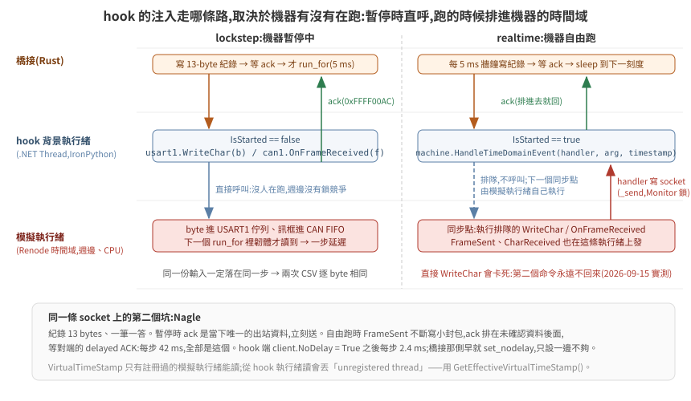
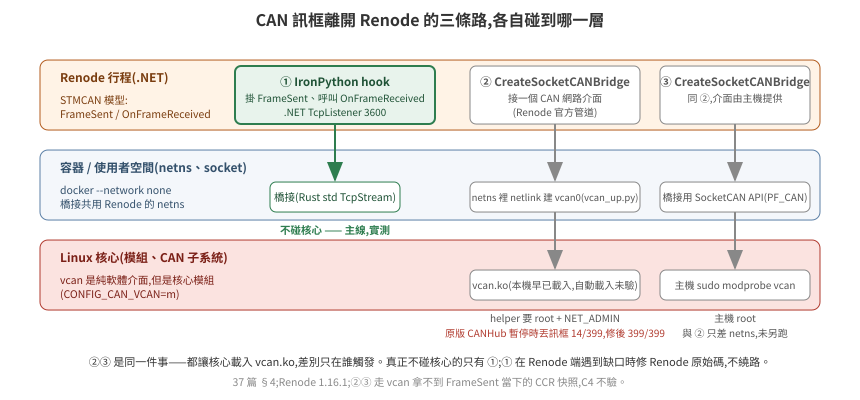

# 37 · 匯流排訊號串接:External Control、hook,與 CAN 的三條出口

韌體在 Renode 裡跑起來之後,它的輸出在模擬器裡面:PWM 是 TIM3 的 CCR 值、方向是 GPIOB 的兩個腳、狀態回報在 CAN1 的 mailbox。要把這些拿到外面給受控體,又要把編碼器塞回去給韌體,Renode 1.16.1 給了兩條路:一個叫 External Control 的 TCP 二進位 API(時間、GPIO、匯流排讀寫),和它自己的 monitor 級 IronPython(可以掛週邊事件、也能開 socket)。CAN 還有第三條路,要碰主機核心。

這一篇把每種訊號走哪條路、協定長什麼樣、以及 lockstep 迴圈怎麼靠 ack 做到決定性,寫清楚。

> **驗證狀態**:全部在本機實測(Renode 1.16.1,Rust 1.98 std-only 橋接,docker,2026-09-15)。External Control 的線路協定是從官方 C client(`tools/external_control_client/lib/renode_api.c`,943 行)逐 byte 讀出來的,官方沒有文件;server 端對照 `renode` repo v1.16.1 的 `src/Renode/Network/ExternalControl/*.cs`。§4 的 SocketCAN 路線在容器 netns 裡實測(2026-09-16,路 ②);路 ③ 只差主機權限,沒有另外跑。程式碼在 [`examples/hil-stm32/bridge-rs/`](../../../examples/hil-stm32/bridge-rs/) 與 [`renode/hil_hook.py`](../../../examples/hil-stm32/renode/hil_hook.py)。

## 1. 每種訊號走哪裡

| 訊號 | 方向 | 出口 | 為什麼 |
|---|---|---|---|
| 時間推進、目前時間 | 橋接 → Renode | External Control `run_for` / `get_time` | lockstep 的節拍 |
| PWM duty | MCU → 受控體 | External Control `sysbus_read` TIM3 `CCR1/CCR2/ARR` | CCR 讀得回([36 篇](../36-stm32-firmware-on-renode/README.md) §3);訂閱 PWM 腳的邊緣事件每秒會有上萬筆 |
| 方向、致能 | MCU → 受控體 | External Control `gpio_get` gpioPortB 8/9/10 | 讀的是**輸出腳**(`Connections[n].IsSet`) |
| 急停 | 受控體 → MCU | External Control `gpio_set` gpioPortC 13 | 寫的是**輸入腳**(`OnGPIO(n, v)`) |
| 驅動器故障、保險桿 | 板子 → MCU | External Control `gpio_set` gpioPortC 14/15、0(低有效) | 橋接扮演 pull-up:開機前拉高、IWDG 重啟後再拉一次;故障注入把它拉低([38 篇](../38-acceptance-and-failure-modes/README.md) §1.2) |
| 雷射 | 受控體 → 上位(不經 MCU) | 受控體文字協定的 `SCAN` 行 → 橋接 3801 原樣轉 → driver 發 `/scan` | 橋接只加行首與 seq,不解語意;負對照 `blind-scan` 在這裡把距離全改成 range_max([38 篇](../38-acceptance-and-failure-modes/README.md) §6.2) |
| 心跳 | 上位 → MCU | UART `PING`(0x03)每 100 ms,韌體回 `PONG` | 橋接腳本模式自己送;ROS driver 也送;300 ms 沒收到韌體降速到 0 |
| 陀螺儀角速度 | 受控體 → MCU(經 I2C 感測器) | 橋接每步用受控體真值位姿差分算 yaw rate → hook 一筆 `0xFFFF0024`(milli-dps)→ .NET `AngularRateFeeder` 寫 `sysbus.i2c3.gyro` 的 `AngularRateZ`;韌體自己經 I2C3 讀 OUT_Z | 三個受控體同一份公式(橋接算,不經受控體協定);韌體走真板的 I2C 路徑([38 篇](../38-acceptance-and-failure-modes/README.md) §1.3) |
| 韌體內部狀態 | MCU → 橋接 | External Control `sysbus_read` `g_dbg`(23 個字一次讀) | 生效證明與驗收用 |
| 增益、斜坡、安全遮罩 | 橋接 → MCU | External Control `sysbus_write` 到 flash 裡 `.data` 初始值的 LMA(**開機前**),開機後從 SRAM 讀回印 `[effect]` | `--cfg kp=..,ki=..,accel=..` 掃參數、`--negative no-ramp` 關斜坡、`*-off` 關一項安全功能、`--fault hang` 排一個死機時刻,都不重編韌體([38 篇](../38-acceptance-and-failure-modes/README.md) §1.1、§1.2) |
| UART(上位協定) | 雙向 | IronPython hook(`usart1.WriteChar` / `CharReceived`) | 要 ack(§3);Renode 內建的 socket terminal 也能用但沒有 ack |
| CAN | 雙向 | IronPython hook(`can1.OnFrameReceived` / `FrameSent`) | 不碰核心;三條路的取捨在 §4 |
| 編碼器 tick | 受控體 → MCU | hook 一筆 `0xFFFF0020`(Δtick 左/右)→ Renode 裡的 .NET `QuadratureFeeder` 對 TIM2/TIM4 的 TI1/TI2 打正交邊緣;或 External Control 寫 CNT | lockstep 走邊緣(驗 encoder mode),realtime 寫 CNT(每個邊緣 50–100 µs);36 篇 §3.1 |

兩個 TCP 埠:3500(External Control)、3600(hook)。3456 的 socket terminal 留著當對照。

## 2. External Control API

`emulation CreateExternalControlServer "ec" 3500` 起 server。Rust client 在 [`bridge-rs/src/ec.rs`](../../../examples/hil-stm32/bridge-rs/src/ec.rs),只用 std。線路全部 little-endian:

**握手**:client 送 `u16 count` + count 組 `(cmd u8, ver u8)`。1.16.1 的表是 `(1,0) (2,0) (3,0) (4,0) (5,1) (6,0)`——GPIO 是 v1,其餘 v0。server 回 1 byte:`5` 成功;`1` 是 FATAL,後面接 `u32 len` + 訊息。

**命令框**:`'R' 'E' cmd:u8 len:u32 data`。命令碼:1 RunFor、2 GetTime、3 GetMachine、4 ADC、5 GPIO、6 SystemBus。

**回應**:第 1 byte 是 return code,之後的形狀依 code 而定:

| code | 意思 | 後面接什麼 |
|---|---|---|
| 0 | COMMAND_FAILED | cmd u8、len u32、訊息 |
| 1 | FATAL_ERROR | len u32、訊息(**沒有 cmd**) |
| 2 | INVALID_COMMAND | cmd u8 |
| 3 | SUCCESS_WITH_DATA | cmd u8、len u32、data |
| 4 | SUCCESS_WITHOUT_DATA | cmd u8 |
| 5 | SUCCESS_HANDSHAKE | — |
| 6 | ASYNC_EVENT | cmd u8、ed u32、len u32、data |

`RunFor` 的回應可能被 ASYNC_EVENT 插隊,client 要吃掉事件再等自己的 4。GPIO 事件的 data 是 **16 bytes**:`u64 timestamp_us` + `bool` + 7 bytes 填充——C 版用 `sizeof(struct)` 帶過,Rust 端要自己算。

**實例描述子**:GPIO 與 SystemBus 命令先用 `id=-1, md, name_len, name` 拿一個 `i32 id`,之後的命令都帶那個 id。名字用 `sysbus.gpioPortB` 或 `gpioPortB` 都解得到;sysbus 本身用 `"sysbus"`。

**GPIO 語意**(server 端 `GPIOPort.cs`):`GetState(id, pin)` 回 `peripheral.Connections[pin].IsSet`——**輸出腳**;`timer3` 也是 `INumberedGPIOOutput`,所以 PWM 通道用同一個命令讀得到。`SetState(id, pin, v)` 呼叫 `OnGPIO(pin, v)`——**輸入腳**。`RegisterEvent` 掛在輸出腳的狀態變化上。

**SystemBus**:`id i32, op u8(0 讀/1 寫), width u8(1/2/4/8), addr u64, count u32, data[]`。`count` 是「幾個 width」不是幾 byte;讀 17 個 u32 一個 RPC 就好。

一個踩過的坑:**探埠會污染握手**。`run_loop.sh` 第一版用 bash 的 `echo >/dev/tcp/127.0.0.1/3500` 等埠開,那個換行字元被 server 當成握手的第一個 byte,狀態機從此錯位,client 收到 `Encountered unknown command 0x00`。解法是不用會送資料的探測,橋接自己重試連線。

## 3. hook:IronPython 一條 TCP,每筆注入回 ack

[`renode/hil_hook.py`](../../../examples/hil-stm32/renode/hil_hook.py) 由 `.resc` 的 `include @hil_hook.py` 載入,跑在 Renode 的 monitor IronPython 裡。它掛兩個事件、開一個 `TcpListener`、起一條背景執行緒收注入:

```
can1.FrameSent      += 每個 MCU 送出的 CAN 訊框 → 寫到 socket
usart1.CharReceived += 每個 MCU 送出的 UART byte → 湊 8 個寫到 socket
socket 收到 CAN 紀錄  → can1.OnFrameReceived(frame) → 回 ack
socket 收到 UART 紀錄 → usart1.WriteChar(b) ×n      → 回 ack
```

紀錄固定 13 bytes:`u32 id | u8 len | u8[8] data`。`id < 0xFFFF0000` 是 CAN;`0xFFFF0001` UART 進 MCU、`0xFFFF0002` UART 出 MCU、`0xFFFF0003` 匯流排快照、`0xFFFF00AC` ack。

**為什麼要 ack。** `WriteChar` 與 `OnFrameReceived` 都是從主機執行緒呼叫進週邊的——Renode 內建的 socket terminal 也是這樣做。橋接寫完 socket 就 `run_for` 的話,那些 byte 是在這一步之前還是之後進到週邊,由執行緒排程決定。有 ack,橋接等到「注入完成」才推進時間,同一份輸入就一定落在同一步。[38 篇](../38-acceptance-and-failure-modes/README.md) §3 的「兩次 CSV 逐 byte 相同」靠的就是這個。

**匯流排快照。** `FrameSent` handler 在送出 CAN 紀錄之後,立刻在同一個模擬時刻讀 `TIM3 CCR1/CCR2`,附一筆 `0xFFFF0003`。橋接拿它跟 CAN 訊框裡韌體自己回報的 duty 比——兩條獨立管道在**同一個時刻**比。為什麼不能拿步邊界讀到的 CCR 比,[38 篇](../38-acceptance-and-failure-modes/README.md) §4 有 2/305 筆的實例。

**機器在跑的時候,注入不能直接呼叫週邊。** `lockstep` 下注入時機器是暫停的,從背景執行緒直接 `WriteChar` 沒事。`realtime` 下機器在跑,同一行會卡死——第一個命令進得去,第二個 `WriteChar` 永遠不回來(模擬執行緒與注入執行緒搶週邊的鎖)。Renode 自己的外部裝置(socket terminal 的 `UARTBackend`、`CANHub`)走的是 `machine.HandleTimeDomainEvent(handler, arg, timestamp)`:把呼叫排進機器的時間域,在下一個同步點由模擬執行緒執行。hook 的 `_deliver` 照這條:`IsStarted` 為真就排隊,否則直呼。時間戳要用 `TimeDomainsManager.Instance.GetEffectiveVirtualTimeStamp()`——`VirtualTimeStamp` 只有註冊過的模擬執行緒能讀,從 hook 的執行緒讀會丟 `Tried to obtain a virtual time stamp of an unregistered thread`。

**關掉 Nagle。** 紀錄 13 bytes、一筆一答。`lockstep` 下 ack 是當時唯一的出站資料,立刻送;`realtime` 下 `FrameSent` 不斷從模擬執行緒寫小封包,ack 排在未確認資料後面,等對端的 delayed ACK——每步 42 ms,全部是這個。`client.NoDelay = True` 之後 hook 每步 2.4 ms。橋接那一側從一開始就 `set_nodelay(true)`,只設一邊不夠。

<p align="center"></p>


限制:一次一個 client;IronPython 的執行緒是 .NET 執行緒,`_send` 用 `Monitor.Enter` 保護;檔案全 ASCII。

## 4. CAN 送出模擬器的三條路,各碰到哪一層

Renode 1.16.1 把 CAN 訊框送到模擬器外面的**官方**管道只有 `CreateSocketCANBridge`,它接的是一個 Linux CAN 網路介面。沒有實體卡時那個介面是 `vcan`——名字容易誤會,它是純軟體的虛擬介面(像 `lo`),但它是核心模組(這台 `CONFIG_CAN_VCAN=m`),載入要 root。

| 路 | 碰核心嗎 | 原理 | 權限 | lockstep 注入到韌體 | 決定性 |
|---|---|---|---|---|---|
| **① monitor 級 IronPython hook → TCP** | 不碰 | 掛 `FrameSent`、呼叫 `OnFrameReceived()`;IronPython 用 .NET socket。整條在 Renode 行程內 | 無 | 每筆 ack,下一步一定讀到(1199/1199) | 有 ack 保證;兩次 CSV 逐 byte 相同 |
| ② 容器 netns 裡建 `vcan0` + `SocketCANBridge` | 碰(`vcan.ko`) | [`tools/vcan_up.py`](../../../examples/hil-stm32/tools/vcan_up.py) 用 netlink 建 link(不需要 iproute2);Renode 官方的 `CreateSocketCANBridge` bind 上去;橋接用 `PF_CAN` raw socket([`src/socketcan.rs`](../../../examples/hil-stm32/bridge-rs/src/socketcan.rs),零 crate,`extern "C"` 宣告 6 個 libc 符號) | helper 容器要 **root + `NET_ADMIN`**(非 root 行程拿不到 ambient capability);Renode 與橋接本身不用 | **1.16.1 原版:14/399**——`CANHub` 在暫停時把主機來的訊框丟掉;修過的 hub 399/399 | 沒有 ack;修過的 hub 兩次 CSV 逐 byte 相同,但那是「訊框都在 `run_for` 開始前就進了佇列」的經驗事實,不是保證 |
| ③ 主機 `modprobe vcan` + `ip link add` | 碰 | 同 ②,介面在主機 netns;Renode 要 `--network host` 或把介面搬進容器 | 主機 root | 同 ② | 同 ② |

②③ 是同一件事——都讓核心載入 `vcan.ko`,差別只在誰觸發、在哪個 netns。真正不碰核心的只有 ①。這台主機的 `vcan` 早就載著,「核心自動 `request_module`」這一句沒有機會驗;`vcan_up.py` 的 docstring 照核心的 rtnetlink 行為寫,標推測。

**② 踩到的第四個 Renode 缺口:`CANHub` 暫停時丟訊框。** `emulation RunFor` 是 `StartAll → RunFor → PauseAll`,hub 的 `Pause()` 把 `started` 清掉,之後 `Transmit()` 直接 return。`SocketCANBridge` 的讀執行緒不管暫停照樣 read socket,所以 lockstep 下兩次 `run_for` 之間注入的訊框全部靜默消失(Debug log 一行「Received from」,沒有 warning),只有剛好落在 `run_for` 期間的 14 筆進得去;realtime 模式下 599/600。修法:暫停時把主機來的訊框排隊,`Resume()` 時送——機器暫停時不可能有機器來的訊框,佇列裡只會有主機的。NUnit 三條(跑中轉發、暫停排隊 Resume 送且只送一次、不回送給發送者):原版 1/3、修正版 3/3;閉環 `CAN=socketcan CANHUBFIX=1 ./run_loop.sh` ALL PASS、末端位姿與 hook 路逐字相同(900.8, 0.4, 0.8627)、每步 11.8 ms(hook 路 11.5 ms,同一時段量)。fork 第三個 commit(`b89bc9d`),`renode/upstream/CANHub.patch`。`UARTHub` 有同一個樣式,沒動。

哪條路適合哪個階段:**lockstep 與 CI 用 ①**——要 ack、要事件時刻快照、不要權限;**realtime 與接實體 CAN 卡的階段用 ②③**——`SocketCANBridge` 換成實體介面時橋接一行不改,原版 hub 在自由跑下也收得齊(599/600),lockstep 下要修過的 hub 才行。

另一個要在 ② 上放棄的東西:**C4 的事件時刻快照**。hook 掛在 `FrameSent` 上才拿得到「同一個模擬時刻的 CCR」;走 vcan 時 hook 不碰 CAN,C4 印成「不驗」而不是綠——這條路拿不到那個量,不能假裝驗過。

<p align="center"></p>


①在 Renode 端遇到缺口時的處理原則:**不繞路,修 Renode 原始碼**。1.16.1 對應的 `renode-infrastructure` commit 是 `add012af003a0f620d3da52828262676f374d121`;修週邊模型可以 `i @file.cs` 執行期編譯載入,不必自建 Renode——改一行、跑一次探針是秒級迴圈。

這一區用 ① 這條路修了 `STM32_Timer` 的三個缺口([`renode/upstream/`](../../../examples/hil-stm32/renode/upstream/)):計數週期 ARR+1、OCxPE 預載、致能時就驅動 PWM 腳。每一項有一支探針(原版紅、修正版綠)與一條上游樣式的 Robot 測試(原版 3 紅、修正版 3 綠);修正版接進閉環 `TIMERFIX=1 ./run_loop.sh` 仍 ALL PASS,而且 `.resc` 印出 timer 的型別名當生效證明——沒有這一行,「修正版也綠」與「根本沒載入」看起來一樣。第四個候選 `STM32_UART` 的 TC 閂鎖在 1.16.1 上**無法重現**(CPU 寫 DR 後 TC 正常設回、TCIE 拉中斷);既有內部紀錄的條件是 DMA 傳送,這裡沒走那條路,不下結論。

`NVIC` 的 SysTick 在 ENABLE 0→1 時不從 RELOAD 載入是 FreeRTOS 版才踩到的([39 篇](../39-freertos-firmware-in-the-loop/README.md) §4),NUnit 原版 1/2 紅、修正版 2/2 綠;`CANHub` 暫停時丟訊框是走 vcan 才踩到的(上面)。四個週邊、三個 commit,全部在同一個 fork 分支。

修正以上游樣式放在 fork(`wicanr2/renode-infrastructure`,分支 `stm32-timer-period-preload-fixes`,基於 1.16.1 的 commit),三個 commit(訊息全英文):`STM32_Timer.cs` + `STM32_TimerTests.cs`、`NVIC.cs` + `NVIC_SysTickTests.cs`、`CANHub.cs` + `CANHubTests.cs`。驗證到哪裡:上游版檔案對 1.16.1 組件編譯 0 warning、NUnit 修正版 9/9 綠、原版 2/9、Robot 3/3、閉環迴歸 ALL PASS;**沒做**完整 Renode 建置與上游全部測試。

上游(2026-09-16):`master` 在 1.16.1 之後把 `STM32_Timer.cs` 與 `NVIC.cs` 重寫過,三項 timer 缺口與 SysTick 缺口讀原始碼確認**還在**,但 1.16.1 的 patch 貼不上去,而對 `master` 的修正要完整建 Renode 才驗得了;`CANHub` 只多了 `CANTester` 分支。所以:`CANHub` 修正 rebase 到 `master` 送 [PR #250](https://github.com/renode/renode-infrastructure/pull/250)(對 `master` 的編譯與測試由上游 CI 跑,本機只驗了同一份邏輯對 1.16.1 組件 NUnit 3/3);timer 與 SysTick 開 issue 附 1.16.1 的 patch 與量測:[renode#1003](https://github.com/renode/renode/issues/1003)、[renode#1004](https://github.com/renode/renode/issues/1004)。 encoder mode 的三項修正(0↔ARR 繞回、DIR、週期 ARR+1;[36 篇](../36-stm32-firmware-on-renode/README.md) §3.1)是對 `master` 改的,所以另開分支 [`stm32-timer-encoder-wrap`](https://github.com/wicanr2/renode-infrastructure/tree/stm32-timer-encoder-wrap)(commit `a8e98b0`,2026-09-17 rebase 到當天的 `master`,`STM32_TimerEncoderTests` 五條 NUnit 原版 1/5、修正版 5/5),送 [PR #252](https://github.com/renode/renode-infrastructure/pull/252);它的週期項(ARR+1)就是 #1003 的週期那一半。`RCC_CSR` 的重置旗標(系統重置保留、看門狗設 IWDGRSTF;[38 篇](../38-acceptance-and-failure-modes/README.md) §1.2)在 `STM32F4_RCC.cs` 與 `STM32_IndependentWatchdog.cs` 上,這兩個檔 1.16.1 與 `master` 逐 byte 相同,所以同一份修正對兩邊都成立:分支 [`stm32-rcc-reset-flags`](https://github.com/wicanr2/renode-infrastructure/tree/stm32-rcc-reset-flags)(基於 `master` 0ab5d08,NUnit 修正版 5/5、原版 1/5),閉環用執行期載入版 `RCCFIX=1`。

## 5. lockstep 迴圈

[`bridge-rs/src/main.rs`](../../../examples/hil-stm32/bridge-rs/src/main.rs) 每一步(5 ms):

```
1. 上位腳本 → cmd_vel 框包 → hook UART 注入 → 等 ack        (每 20 ms 一次)
2. External Control run_for(5 ms)
3. 讀匯流排:CCR1/CCR2(相鄰,1 RPC)、PB8/9/10(3 RPC)、g_dbg(1 RPC)、時間(1 RPC)
4. 收 MCU 這一步吐出的 UART(odom)與 CAN(狀態 + 快照):flush → ack → drain 1 ms
5. 受控體走 5 ms → 編碼器 tick → hook CAN 注入 → 等 ack
6. 寫一行 CSV
```

**一步延遲**:第 5 步注入的訊框,韌體在下一步的 `run_for` 裡才讀。6 s 跑完 `enc_frames` = 1199 = steps − 1。

**步邊界要跟韌體的控制 tick 錯開。** 橋接開機先 `run_for boot_ms`,之後每步 5 ms;韌體的控制步跑在 SysTick 的 5k ms 上。`boot_ms` 若是 5 的倍數,每個邊界都落在韌體正要跑控制步的那幾微秒裡:橋接在那裡暫停、注入 CNT、讀 CCR 與 `g_dbg`,而韌體的「讀 CNT」「寫 CCR」「寫 g_dbg」哪些在暫停前、哪些在暫停後,由**指令數**決定。量到的:原版韌體 `boot_ms=100` 時有一步 `ccr1 ≠ duty_l`(邊界切在 `motor_apply` 與 `g_dbg.duty_l =` 之間);控制步開頭多 200 圈 NOP(邏輯不變)→ 8639 個欄位不同、四步被切、C9 紅(CNT 讀在注入前、下一步吃到兩步的 tick,PI 把 duty 打上去);把兩版韌體的共用碼抽成 `control.c`(GOAL 5)→ 429 個欄位不同、被切的那一步從 336 移到 341。`boot_ms=102`(邊界在控制步後 2 ms)之後三個版本**逐 byte 相同**、沒有一步被切,末端位姿不變。現在裸機預設 102、FreeRTOS 402;lockstep 的「同一輸入逐 byte 相同」只在這個前提下對**不同建置**也成立。

**每步成本**:主機閒時 8–13 ms(分段:`run_for` 9.3 ms、hook 2.2 ms、`ec_read` 1.0 ms),主機另有負載時 29.6 ms——橋接每步印 `[run] per-step wall: ec_read/hook/plant/run_for` 四段,看數字不用猜。要更快的話,順序是:把 drain 換成「等一個明確的 end-of-step 紀錄」(省 1 ms)、把 GPIO 三次讀合併成一次 `ODR` 匯流排讀(省 2 RPC)、最後才是把 `run_for` 拉長。

`--mode realtime` 用同一個迴圈,只換第 2 步:開跑前經 hook 送 `START`(`0xFFFF0010`,hook 呼叫 `StartAll()` 後 ack),每步不再 `run_for`,改 sleep 到下一個 5 ms 牆鐘刻度;受控體的 dt 用實際過了多久;跑完送 `PAUSE`(`0xFFFF0011`)。每步 5.0–5.2 ms(`ec_read` 1.8 + hook 2.4 + sleep 0.4),三個時鐘的分歧與後果量在 [35 篇](../35-hil-what-and-why/README.md) §5.1。

**編碼器注入 `--enc hook|gpio|cnt|can`**(`auto`:calib `tim` 時 lockstep → `hook`、realtime → `cont`,見下一段;`can` 是第一版的訊框路):`hook` 一筆紀錄帶左右 Δtick,hook 端交給 [`renode/hil_quadrature.cs`](../../../examples/hil-stm32/renode/hil_quadrature.cs)——一個 .NET 類,把 Δtick 走成 A/B 相位序列、對 timer 的 `OnGPIO(0/1)` 打邊緣。為什麼是 .NET 不是 Python:機器在跑時這段工作要排進時間域、在模擬執行緒上執行,用 Python lambda 排進去會在 hook 執行緒還在 Python 裡時把模擬卡死(Renode 時間停在 0.535 s,量到的);.NET 方法沒有這個問題。`i @file.cs` 動態編譯的型別 IronPython `import` 不到,要從 `AppDomain` 的組件用反射拿。每步成本 lockstep:hook 2.9 ms、gpio 4.2 ms(約 40 個 RPC)、cnt 2.8 ms。C8 在 TIM 模式改驗兩個等式:`CNT == 受控體 tick mod 2^16`(注入沒掉)、韌體累計 == 前一步的 tick(一步延遲)。

**連續注入 `--enc cont`。** 上面三種都是**取樣式**:受控體走完一步,橋接把這一步的 tick 一口氣塞進 CNT,韌體在自己的 5 ms tick 讀。兩個節拍對不齊時,韌體一個控制週期吃到的筆數會在 n 與 n+1 之間跳,量測速度跟著跳,C9 紅([35 篇](../35-hil-what-and-why/README.md) §5.1 第 4 點)。真板沒有這件事:編碼器的邊緣是連續的,CNT 在韌體讀的那一刻就是那一刻的位置。候選有兩個:

| | 做法 | lockstep | realtime |
|---|---|---|---|
| (a) 攤平 | 這一步的 Δtick 平均攤在這一步 `run_for` 的虛擬時間上 | 成立:步長已知 | 不成立:橋接事先不知道 Renode 這一步會推進多少(量到 2–7 ms 在抖) |
| (b) 外插 | CNT 在**被讀的當下**算:`錨點 + 輪速 × (t − t錨) + 誤差 × min(1, (t − t錨)/τ)`;橋接每步送一次受控體累計 tick 與輪速,更新錨點 | 成立 | 成立:不需要知道步長,時間用 Renode 自己的虛擬時鐘 |

做的是 (b)。實作是 [`hil_quadrature.cs`](../../../examples/hil-stm32/renode/hil_quadrature.cs) 的 `ContinuousEncoder`:在 TIM2/TIM4 的 CNT 位址掛 `SetHookAfterPeripheralRead`(回傳算出來的值)與 `SetHookBeforePeripheralWrite`(韌體寫 CNT = 0 時重定偏移——開機與 IWDG 重啟後的 `encoder_tim_init` 都寫),時間取 `cpu.SyncTime()` 之後的 `machine.ElapsedVirtualTime`,所以是當下那條指令的時間,不是上一個量子邊界。hook 紀錄 `0xFFFF0021`(裝上,帶 τ)、`0xFFFF0022/23`(左/右:tick、輪速 milli-tick/s);機器在跑時更新排進時間域。三個取捨:

- **不打邊緣。** 8k 邊緣/s 在 realtime 付不起([36 篇](../36-stm32-firmware-on-renode/README.md) §5.1 的事件成本);代價是 encoder mode 的計數邏輯沒被這條路驗到——那是 `hook` 注入在 lockstep 驗的事。
- **誤差分 τ 攤還,不跳。** 錨點更新時外插與受控體實際 tick 的差,在 τ 內線性補上;下一筆更新來晚了也不會超補。τ 小,追得緊;τ 大,更新時刻抖動造成的假速度小。
- **錨點的時間由橋接給,不用「更新在 Renode 裡被處理的那一刻」。** realtime 下機器在跑,更新紀錄從橋接送出到被模擬執行緒處理要幾 ms,而且每步不同;受控體的位置卻是在另一個時刻取樣的。錨點若掛在處理的那一刻,兩個時刻的差每步抖動,誤差項在 τ 內補回去就成了假速度(量到韌體的輪速在轉向段一步跳 ±100 mm/s)。現在橋接每步多送一筆 `0xFFFF0025`:受控體取樣當下 Renode 的虛擬時間(讀 `t_us` 那一刻的虛擬時間 + 從那之後過的牆鐘)。lockstep 下機器是停的,兩個時刻相同——CSV 與不帶時間的版本逐 byte 相同。
- **外插必然落後於「受控體還沒走的那一段」。** lockstep `--skew stall:100:10` 讓 Renode 一口氣先跑 50 ms、受控體之後才補那 50 ms:外插照舊速度推,受控體實際在減速,補上時差 98 tick,在 τ 內補完就是一段反向的假速度(韌體 `meas` −92 → +122 mm/s),C9 照樣紅。這不是注入法能補的——Renode 跑在受控體前面時,受控體的未來還不存在。

C8 在 `cont` 下換定義:**步邊界讀到的 CNT 對同一時刻受控體 tick 的差 ≤ 一步的最大 tick 數 + 1,而且車停下後逐字相等**(沒有「一步延遲」這件事,CNT 外插到當下)。`--skew` 時只驗後半——時鐘被刻意拉開,步內追蹤的上界本來就不成立(均勻比值 R 下穩態落後 ≈ 輪速 × τ × (1−R)/R)。realtime 下這個上界常常不成立:[35 篇](../35-hil-what-and-why/README.md) §5.1 的閒時 14 次裡 8 次超過(最多 110 對 87 tick),「車停下後逐字相等」14 次全部成立——步邊界的 CNT 是 External Control 在牆鐘上讀的,讀的那一刻與受控體取樣差幾 ms,這個上界在 realtime 量到的是兩個時刻的差,不只是外插誤差。

lockstep 預設腳本(2026-09-17,現行韌體,取樣式參考 900.8 / 0.4 / 0.8627):

| τ | 末端 (x, y, θ) | 步邊界最大 \|CNT − tick\| | C9 max \|dv/dt\| | 兩次 CSV |
|---|---|---|---|---|
| 5 ms | 900.5, 0.5, 0.8635 | 1 tick | 2460 | — |
| 20 ms | 900.6, 0.5, 0.8626 | 3 tick | 2356 | 逐 byte 相同 |
| 50 ms | 900.6, 0.5, 0.8620 | 6 tick | 2236 | — |

末端與取樣式差 0.3 mm / 0.9 mrad 以內,量級是一筆 odom;**參考值不換**:lockstep 的預設注入仍是 `hook`(驗 encoder mode 本身),900.8 / 0.4 / 0.8627 仍是那條路的參考,`cont` 的末端另列。`--enc-tau-ms` 預設 20。

**上位出口 `--upper tcp-listen:ADDR`**([`src/upper.rs`](../../../examples/hil-stm32/bridge-rs/src/upper.rs)):外部上位(ROS 2 節點)連進來,橋接在這一側只當序列線——每步開頭把收到的 byte 全部注入 USART1、等 ack;MCU 吐出的 byte 原樣送回。它不解語意,只用同一個 `Parser` 數框包(C7)、記最後一個命令進 CSV。內建腳本與外部上位送到韌體的 byte 完全相同,韌體分不出來——這是拓撲那張表「每個行程只認一種語言」的實作。

## 6. 受控體介面

橋接對受控體只暴露兩個結構:

```
MotorCmd { duty_l, duty_r: 0..1;  fwd_l, fwd_r, enabled: bool }
PlantOut { ticks_l, ticks_r: i32 (累計,繞回);  x_mm, y_mm, th_rad (真值);  vl, vr }
```

三種後端,同一個 trait:`Fake`(Rust 內建,一階馬達 + 精確差速運動學)、`Udp` 與 `Tcp`(另一個行程;TCP 是給 `ssh -L` 隧道用的,ssh 只轉 TCP)。文字協定一行一筆,受控體要以相同 `seq` 回覆,橋接等到才推進:

```
橋接 → 受控體:CMD <seq> <dt_ms> <duty_l 0..1000> <duty_r> <fwd_l> <fwd_r> <en>
受控體 → 橋接:ENC <seq> <ticks_l> <ticks_r> <x_mm> <y_mm> <th_rad> <vl> <vr>
```

[`plant/fake_plant.py`](../../../examples/hil-stm32/plant/fake_plant.py) 用 Python 實作同一個模型(UDP / TCP,實測 ALL PASS);[`plant/isaac_plant.py`](../../../examples/hil-stm32/plant/isaac_plant.py) 是 Isaac Sim 6.0.1 版,在場域 GPU 主機實測 ALL PASS,七件事的結論在 [38 篇](../38-acceptance-and-failure-modes/README.md) §6。

受控體在另一台主機時,`run_loop.sh` 的 `PLANT=remote` 讓 Renode 容器改掛 docker 的 bridge 網路,`ssh -L` 綁在 bridge 的閘道位址上——隧道只有容器看得到,Renode 的埠也沒有 publish 到主機。隧道的 stdout 要導到檔案、ssh 要用 `exec` 起,否則腳本收不掉(38 篇 §5)。實測隧道讓每步從 29.6 ms 變 48.6 ms(假受控體)/ 52 ms(Isaac)。

橋接不做安全:`MotorCmd` 直接來自匯流排讀值,不夾限、不逾時。韌體停了車,`enabled` 就是 false,受控體自己會停。

## 7. 檢查清單

- [ ] 每種訊號說得出走哪條出口、讀的是輸出腳還是輸入腳
- [ ] External Control 的握手版本表對上 server(GPIO v1)
- [ ] 沒有任何探測會往 3500 埠送資料
- [ ] 每筆注入等到 ack 才 `run_for`
- [ ] 兩條獨立管道的比對用同一時刻的快照,不用步邊界的讀值
- [ ] CAN 走哪條路、碰不碰核心,寫在 README
- [ ] Renode 缺口:修原始碼並記 commit,不繞路
- [ ] 一步延遲寫進判準

---

延伸閱讀:[36 STM32F4 韌體在 Renode 上開機](../36-stm32-firmware-on-renode/README.md)、[38 驗收與失敗形態](../38-acceptance-and-failure-modes/README.md)、[05 ROS2 橋接](../../common/05-ros2-bridge/README.md)(Isaac 那一側的 UDP 解耦做法同源)。
