# 38 · 驗收與失敗形態:先閉環,再換 Isaac

閉環跑完印出 `ALL PASS`,問題才開始:這八個綠燈各證明了什麼?哪一個在系統壞掉時**一定會**變紅?兩次跑的結果一樣是「決定性」還是「剛好」?這一篇把判準、負對照、決定性、以及這次踩到的每一種失敗形態攤開,最後是把受控體換成 Isaac Sim 6.0.1 時七件事各量到什麼。

> **驗證狀態**:§1–§5 在本機實測(Renode 1.16.1 + Rust 橋接 + 假受控體,docker 2 核,主機另有負載 load ≈ 4/14,2026-09-15)。§6 在場域 GPU 主機實測(Isaac Sim 6.0.1 pip 版,PhysX、CPU 求解、TGS;Renode 與橋接留在本機,受控體經 `ssh -L` 隧道,同日)。

## 1. 十四項判準,在開跑前寫死

[`run_loop.sh`](../../../examples/hil-stm32/run_loop.sh) 一條指令:起 Renode 容器(`--network none`)、橋接容器共用它的 netns、跑完只停自己起的那一個。橋接開頭先印生效證明:

```
[effect] encoder: calib=tim inject=hook
[effect] renode ec=127.0.0.1:3500 hook=127.0.0.1:3600 machine=hilctl boot_ms=102 t0_us=102000
[effect] g_dbg@0x2000011c magic=0x48494c31 (ok) init_err=0
[effect] mode=lockstep plant=fake dt_ms=5 steps=1200 report_every=4 script="0:0,0;0.5:300,0;3.5:0,600;5:0,0" negative=none slip=0
[effect] tim3 ARR=999 (calib pwm_arr=999) track=300 circ_um=314159 tpr=4096
[effect] g_cfg@0x20000000 kp_q8=256 ki_q8=6 accel_mm_s2=1500 ff_q8=256 alpha_mrad_s2=4000 (calib 預設)
```

每一行都是「這個變數進了系統」的證據:magic 對表示讀的是這支韌體、`ARR` 讀回值對上 calib 表示韌體吃的是同一份參數、`g_cfg` 那行是從 SRAM **讀回來**的增益與斜坡(`--cfg` 覆蓋之後也是讀回值,不是命令列的值)。

預設腳本:0.5 s 起 v = 300 mm/s 走 3 s,再 w = 600 mrad/s 轉 1.5 s,然後停;共 6 s = 1200 步。十二項判準(2026-09-16,現行 calib:斜坡 1500 mm/s² / 4000 mrad/s²、kp 256、ki 6、前饋 100%、馬達層 τ 50 ms):

| # | 判準 | 抓什麼失敗 | 實測 |
|---|---|---|---|
| C1 | Renode 時間 == steps × dt | `run_for` 少跑或多跑、時鐘漂移 | 6,000,000 vs 6,000,000 |
| C2 | 腳本有命令時車有動(路徑長 > 100 mm) | 整條命令鏈斷掉 | 901.9 mm |
| C3 | 韌體 odom 對受控體真值 | 編碼器方向、換算、里程計 | dx 0.8、dy 0.4 mm、dθ 0.7 mrad(容差 25 mm + 2% 路徑長 / 30 mrad) |
| C4 | 每筆 CAN 狀態框的 duty == 同一時刻的 CCR 快照 | 兩條獨立管道不一致 | 305 筆,0 不符 |
| C5 | odom 回報數 ≥ 90% 期望 | UART 出口掉資料 | 305 / 300 |
| C6 | 韌體 `bad_crc` == 橋接送壞的數 | CRC 檢查沒在跑 | 0 vs 0 |
| C7 | 韌體收到的 cmd == 送出且未壞的數 | UART 入口掉資料 | 300 vs 300 |
| C8 | TIM 模式:CNT == 受控體 tick(mod 2^16)且韌體累計 == 前一步 tick;連續注入(`--enc cont`,37 篇 §5):步邊界 \|CNT − tick\| ≤ 一步最大 tick 數 + 1 且車停下後逐字相等(`--skew` 時只驗後者);CAN 模式:收到的訊框 == steps − 1 | 編碼器注入掉資料;一步延遲 | CNT 10057/13431 == plant;fw == 前一步 |
| C9 | 受控體的輪加速度 ≤ (accel + alpha × 輪距/2) × 1.2 | 斜坡沒生效(韌體沒讀 `g_cfg`、算錯單位) | 2257 vs 2520 mm/s² |
| C10 | 安全 I/O:`--fault` 注入的那一項在時限內反應(§1.2 的表) | 看門狗沒餵/沒起動、故障腳沒接、保險桿不擋、堵轉不鎖、心跳沒驗 | 沒注入時不驗;五項各自綠、五個 `*-off` 各自紅 |
| C11 | Nav2:受控體真值到達 `world.goal` 0.1 m 內、途中沒撞(§6.2) | 規劃器沒避開雷射才看得到的方塊 | 只在 `UPPER=nav2` 驗;46 mm、碰撞 0;`blind-scan` 紅 |
| C12 | 上位對 `WDT_RESET` 的反應:重啟 0.5 s 後車不再動;有重定位時(`RELOC=1`)只驗到解鎖為止(§6.3) | 上位不知道底盤重啟過、照送命令 | 只在 hang + 外部上位驗;`no-latch` 紅 |
| C13 | 打滑(IMU 預設開;`IMU=0` 不驗):沒有接觸 → SLIP 不得亮;轉角打滑(輪差轉角比車體多 0.02 rad)開始後 500 ms 內 SLIP,外部上位時亮起 0.5 s 後輪子停;只有平移打滑 → 只報延遲不判(§1.3) | 車頂著障礙物打滑、上位以為到了 | 誤報 0(四種情境);`slip-off` 紅 |
| C14 | 重啟後重定位(`RELOC=1`):解鎖 ≥ 重啟 + 1 s、最後真值到 goal 0.1 m 內、碰撞 0(§6.3) | 重啟後 odom 歸零、`map → odom` 仍是 identity | `static-map-odom` 紅 |

任何一項 FAIL,橋接以非零碼離開。判準寫在程式裡而不是事後看 log 決定,理由同 [30 篇](../../common/30-acceptance-probes-and-preregistration/README.md)。末端位姿 x 900.8、y 0.4、θ 0.8627 是這份 calib 下的參考值,裸機與 FreeRTOS 兩版韌體、三種編碼器注入法、UDP 受控體、vcan 路都要對上它(§3、[36 篇](../36-stm32-firmware-on-renode/README.md) §3.1、[39 篇](../39-freertos-firmware-in-the-loop/README.md) §3)。

負對照有十一個,每一個只差一個旗標:`--negative bad-crc`(§2)、`--negative enc-swap`(編碼器 A/B 對調:韌體量到負速度,PI 正回饋把車推到 5.3 m,C3、C8、C9 紅)、`--negative no-ramp`(§1.1)、五個安全 I/O 的 `*-off` 與 `noinit-off`(§1.2)、`slip-off`(§1.3)、`static-map-odom`(§6.3)。上位側的 `no-latch`、`blind-scan` 另計。

### 1.1 加減速:斜坡在韌體、馬達層在受控體

第一版韌體的 PI 直接追上位的階躍,受控體的馬達是「duty 乘滿速再一階趨近」——沒有死區、沒有扭矩上限。300 mm/s 的步階在假受控體上升 40 ms、超調 15%、最大加速度 9300 mm/s²;在 Isaac 上 `DriveAPI` 直接吃 duty,超調 60%、最大加速度 91400 mm/s²,在 ±2% 帶外晃了 525 ms。這兩個數字都不是「車」的行為,是「沒有動態限制的控制器 + 沒有物理上限的馬達」的行為。改了三件事,每一件放在它該在的那一層:

<p align="center">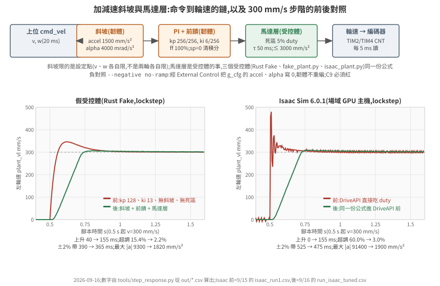</p>

1. **斜坡在韌體。** `cmd_vel` 進來先存,每個控制步 v 與 w **各自**往命令走一步(`accel × 5 ms`、`alpha × 5 ms`),再拆成兩輪設定點。一開始寫成「兩輪各自限」,方形閉環的每一段直線偏航 +0.16 rad——從原地轉切到直走時左輪要從 −90 加到 300、右輪從 +90 加到 300,各自限速的話兩輪不同時到,車在過渡期畫弧。v/w 各限就沒有這個問題:w 的斜坡把兩輪的差同步收掉。另外設定點歸零時清積分——不清的話下一段起步時上一段留下的積分會先推一下(方形閉合 126 → 63 mm,§6.1)。
2. **前饋在韌體。** PI 之前加 `sp × 滿 duty / 滿速`;PI 只補模型誤差,kp 從 128 → 256、ki 13 → 6(`tools/tune_sweep.sh` 掃 kp × ki 網格,每一格經 External Control 寫 `g_cfg`,不重編)。
3. **馬達層在受控體,三份實作同一組公式。** 死區(|duty| < 5% 不動,之後線性到滿速)、一階趨近(τ 50 ms)、每步速度變化 ≤ 3000 mm/s² × dt(電流限制)。Rust `Fake`、`fake_plant.py`、`isaac_plant.py` 各自實作一次,Isaac 那份放在算 `DriveAPI` 目標速度之前——PhysX 的關節驅動本身沒有這些限制,它會把任何目標在一步內追到。參數在 `calib.json`(`motor_tau_s`、`motor_accel_max_mm_s2`、`motor_deadband_duty`),改公式要三處一起改。

前後(`tools/step_response.py`,`plant_vl` 對 0.5 s 的 300 mm/s 步階看 3 s):

| | 假受控體 前 → 後 | Isaac 6.0.1 前 → 後 |
|---|---|---|
| 上升時間 10→90% | 40 → 155 ms | 0 → 155 ms |
| 超調 | 15.4% → 2.2% | 60.0% → 3.0% |
| 進入 ±2% 帶 | 390 → 365 ms | 525 → 475 ms |
| 最大 \|加速度\| | 9300 → 1820 mm/s² | 91400 → 1900 mm/s² |
| 6 s 腳本 C3(dx / dy / dθ) | 0.0 / 0.9 mm / 0.9 mrad → 0.8 / 0.4 / 0.7 | 3.4 / 2.0 mm / 27.6 mrad → 0.8 / 1.0 / 0.8 |

上升 155 ms 是斜坡的值(300 / 1500 = 200 ms 到頂,10→90% 是其中 160 ms),不是 PI 的值;兩個受控體一樣,因為限制在韌體。Isaac 的 dθ 從 27.6 mrad 掉到 0.8:它的里程計誤差原本主要是轉向段的加速度撞擊——輪子在 5 ms 內從 0 到滿速,球形輪對地面打滑,而假受控體沒有這件事,所以兩者原本差 30 倍、現在同一級。

**C9 與負對照。** 判準是「受控體的輪加速度 ≤ (accel + alpha × 輪距/2) × 1.2」:v 與 w 同時起坡時一個輪子吃到兩者的和(1500 + 4000 × 0.15 = 2100),PI 追斜坡的瞬態量到 +7%,留 20%。`--negative no-ramp` 經 External Control 把 `g_cfg` 的 accel 與 alpha 寫 0(`[effect]` 那行讀回 0,韌體同一支),C9 按 calib 的 2100 驗:max 3000 vs 2520,紅——3000 是馬達層的上限,斜坡關掉時受控體撞到的是它。容差不能是 1.5:2100 × 1.5 = 3150 > 3000,負對照會綠。這是 §2 那條規則的另一個用法:負對照不只驗「測試有效」,還會**卡住容差**。

`--mode realtime` 下三項換成一致性版本:C1「0 < Renode 時間 ≤ 牆鐘 + 5%」(Renode 追牆鐘的節拍以量子為單位,量到領先最多 +1.8%)、C5 的期望值用 Renode 時間除以 20 ms(odom 是韌體按它的時間送的)、C8「≥ 90% steps」(沒有 `run_for`,一步延遲的等式不成立)。realtime 下一致性判準全綠**不代表**車走對了——Renode 跑不到實時時,閉環速度會安靜地低到 ratio 倍,判準抓不到,見 [35 篇](../35-hil-what-and-why/README.md) §5.1。

C3 的容差寫成三項相加:韌體數值誤差(25 mm / 0.03 rad;0.9 mm 是韌體用 5 項 Taylor 的 sin/cos、以 float 積分 1200 步的誤差)+ 里程計對真值的系統性差(2% 距離)+ 受控體的接觸滑移(`--slip` × 距離、`--slip` × |θ|)。假受控體 slip = 0;Isaac 實測轉向滑移 3.1%、直行 0.5%,用 0.05——這個數字是先在 §6 量到、再寫回判準的,不是看結果調的。

### 1.2 安全 I/O:五項,每項一個故障注入、一個負對照

第一版只有兩道閘:急停腳與 500 ms 命令逾時。真車底盤至少還要五道,每一道的失敗形狀都是「上位看起來正常,車在動」:韌體死掉(PWM 週邊照跑,馬達用最後的 duty 一直轉)、驅動器報錯沒人理、撞到東西還在推、輪子卡住還在灌電流、上位死了只剩命令逾時那 500 ms。五項都進了韌體(兩版同改),每一項的**故障由橋接注入**(它扮演板子:pull-up、驅動器的 nFAULT、保險桿接點、上位的心跳),**判準寫在 C10**,**負對照用 `g_cfg.safety_mask` 關掉那一項的防護**——同一支韌體、同一個故障、同一條判準,必須紅。

<p align="center">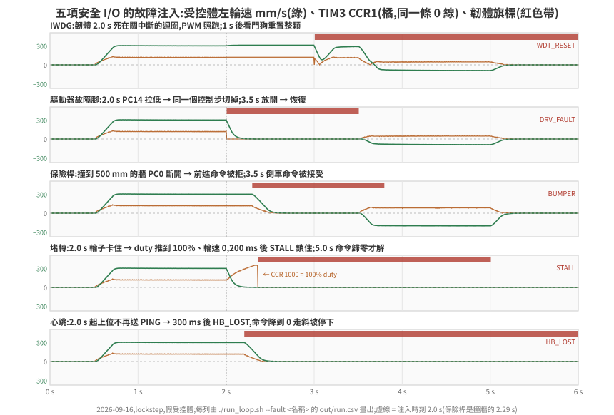</p>

| 項 | 韌體(RM0090) | 橋接注入(`--fault`) | C10 判準 | 實測 | 負對照(`--negative`) |
|---|---|---|---|---|---|
| IWDG | `KR=0x5555 → PR=3(/32 → 1 kHz)→ RLR=999 → KR=0xCCCC → KR=0xAAAA`;每個控制步餵(FreeRTOS 版由最低優先的 report_task 餵) | `hang`:`g_cfg.hang_at_ms` 到時關中斷死迴圈 | 死掉後 1.2 s 內重啟(`.noinit` 計數 +1、tick 從頭)、重啟那步 CCR 0、**重啟後韌體亮 `WDT_RESET`**(上位的鎖靠它,§6.3) | 1.995 s 死掉(`ctrl_steps` 停在 420)→ **2.995 s 重啟**(+1000 ms);死掉期間 CCR 停在 345(34.5% duty 轉了 1 s);重啟那步 CCR 0,5 ms 後上位的 cmd_vel 又進來,車又走 | `iwdg-off`:不起動 IWDG → 沒重啟,CCR 345 轉到結束,車跑到 1.6 m,**紅**;`noinit-off`:韌體只信 `RCC_CSR.IWDGRSTF` 判斷暖重置 → 原版 Renode 紅、修正版綠(下面第三點) |
| 驅動器故障腳 | PC14/PC15 輸入 + pull-up,低有效 → 致能關、duty 0、積分清 | `drv-fault`:2.0–3.5 s `gpio_set` PC14 低 | 拉低後 10 ms 內 DRV_FAULT、EN 低、CCR 0;放開後恢復 | 旗標 **+0 ms**(同一個控制步);故障期間 300 步 CCR/EN 全 0;放開後恢復 | `drv-fault-off`:旗標不出現,299 步 CCR≠0,**紅** |
| 保險桿 | PC0 輸入 + pull-up,常閉接點斷開 = 撞到 → 前進命令改 0 走斜坡,倒車放行 | `bumper`:受控體 x ≥ 500 mm 就把 PC0 拉低(腳本 3.5 s 改倒車) | 撞牆後 60 mm 內停、旗標亮、倒車後 x 少 100 mm 以上 | 500.5 mm 撞到,最遠 **537.2**(+37.2:斜坡 30 mm + 一個控制步);倒車到 239.7 | `bumper-off`:穿牆到 900.2,**紅** |
| 堵轉 | 上一步 \|duty\| ≥ 60% 且 \|輪速\| < 20 mm/s 持續 200 ms → 鎖住(致能關),上位命令歸零才解 | `stall`:2.0–3.5 s 受控體不動、編碼器不動 | 卡住後 500 ms 內 STALL 且 CCR 0;命令歸零後解 | 旗標 **+355 ms**(輪速衰減 ~150 ms + 200 ms);之後 3.5 s 的轉向命令被擋,5.0 s 歸零解鎖 | `stall-off`:旗標不出現,duty 100% 灌到 3.5 s,**紅** |
| 心跳 | 上位每 100 ms 送 PING;300 ms 沒收到 → 命令改 0 走斜坡(與 500 ms 命令逾時分開) | `no-ping`:2.0 s 起不送 PING(cmd_vel 照送) | PING 停後 320 ms 內 HB_LOST、700 ms 內車停 | 旗標 **+200 ms**(最後一筆 PING 在 1.9 s);車停 +495 ms | `hb-off`:旗標不出現,車照跑到 900.8,**紅** |

三個細節是做了才知道的:

- **堵轉的速度門檻要高於感測器的量子。** 一個 tick = 76.7 µm,5 ms 一個控制步,所以最小的非零速度是 15 mm/s;門檻 5 mm/s 的話,輪子還在慢慢滑的那幾百毫秒裡每偶爾一個 tick 就把計時清零,量到 +525 ms 才鎖。門檻改 20 → +355 ms。
- **Renode 的 GPIO 輸入腳預設是 0,而且機器重置後回到 0。** 低有效的腳在真板上靠 pull-up,Renode 不看 `PUPDR`;橋接開機前把三腳拉高,IWDG 重啟後也要再拉一次(重啟後那一步 DRV_FAULT 與 BUMPER 會亮一下)。這是「橋接扮演板子」的一部分,不是韌體的事——韌體照 RM0090 寫 `PUPDR = 01`。
- **暖重置的證據:`RCC_CSR.IWDGRSTF`,修在 Renode。** 真板讀 `RCC_CSR` 的重置旗標。RM0090 Rev 22 §7.3.21 寫的是「Reset value: 0x0E00 0000, reset by system reset, except reset flags by power reset only」:七個重置旗標跨**系統**重置保留(IWDG 重置是系統重置,§7.1.1),寫 RMVF 才清。Renode 1.16.1 的 `STM32F4_RCC`(上游 `master` 同一份)把旗標與 RMVF 做成 tag、放在暫存器集合裡,而看門狗逾時的 `machine.RequestReset()` 會重置所有週邊——RCC 也回到上電值,RMVF 寫了沒作用;看門狗本身也不通知 RCC(`STM32_IndependentWatchdog` 裡的 `TODO: Use RCC to set restart cause`)。修正([`renode/upstream/STM32_ResetFlags.patch`](../../../examples/hil-stm32/renode/upstream/)):旗標移出暫存器集合,`Reset()` 不動它、RMVF 清、上電值仍是 `0x0E000000`;看門狗在要求重置前發 `ResetTriggered` 事件,RCC 收到就設 IWDGRSTF。NUnit 五條修正版 5/5、原版 1/5(只有「上電旗標」本來就對)。閉環 `RCCFIX=1 ./run_loop.sh --fault hang`:上電 `boot_csr = 0x0E000000`,重啟後 `0x20000000`(只有 IWDGRSTF;開機時韌體已用 RMVF 清過上電旗標)。
  韌體另有第二條證據:`.noinit` 區段的計數(`LoadELF` 只寫檔案裡有的區段,`NOLOAD` 的 SRAM 跨 reset 保留),原版 Renode 上 `WDT_RESET` 靠的是它。負對照 **`--negative noinit-off`**(橋接每步把 `.noinit` 的 magic 清成 0,韌體只剩 `RCC_CSR` 這條證據):原版 Renode 上 C10 **紅**(重啟了,但 `WDT_RESET` 沒亮、`boot_csr` 仍是 `0x0E000000`),修正版**綠**(`boot_csr = 0x20000000`、`WDT_RESET` 亮)——四次 lockstep,2026-09-17。
  看門狗模型本身照 RM0090 第 21 章的序列反應:`Reload()` 才把 RLR 載入計數器、起動時從 0xFFF 起、逾時 `machine.RequestReset()`;監視器的 `macro reset` 接著重載 ELF,韌體從 `Reset_Handler` 重來。
- **開機前寫進 flash 的 `g_cfg`,IWDG 重啟後回到預設。** `macro reset` 重跑 `LoadELF`,把 flash 裡 `.data` 的初始值寫回 ELF 的版本——真板的 flash 不會因為 reset 改變,這是模擬器重置流程與真板不同的地方。量到的:`--fault hang` 開機前寫 `hang_at_ms = 2102`,跑完從 SRAM 讀回 `hang_at_ms = 0`(`[fault] 跑完讀回 g_cfg` 那一行)。`hang` 只死一次就是因為這樣;反過來,**要在重啟之後才生效的負對照不能走 `g_cfg`**:開機時關掉的遮罩,在重啟那一刻就被蓋回全開,負對照會安靜地變成正對照。`noinit-off` 因此由橋接每步清 `.noinit`,不改韌體。

負對照關掉防護的方法是改 `g_cfg.safety_mask`,而 IWDG 在 `main()` 初始化時就要決定開不開——所以 `g_cfg` 的寫入時機從「開機後寫 SRAM」改成「**開機前寫 flash 裡 `.data` 的初始值**」(LMA = `_sidata + (g_cfg − _sdata)`,startup 照常複製),`[effect]` 開機後從 SRAM 讀回來印。等於燒錄前改了參數區,`--cfg`、`--negative no-ramp` 也一併改走這條路,lockstep 數字逐字不變。

重啟後韌體只把 `WDT_RESET` 亮在 flags 裡(到下次上電為止),上位的命令照收——要不要因為一次看門狗重啟就拒絕命令是**上位的政策**,做在 driver(§6.3),不在韌體。

### 1.3 打滑:陀螺儀 yaw rate 對輪差 yaw rate(C13)

§6.4 第 4 列是 Isaac 上的失敗形態:車頂著方塊、輪子打滑、編碼器照數,韌體 odom 一路走到 goal,Nav2 回 `succeeded`,真值離 goal 2.2 m。看真值的 C11 抓得到,系統裡沒有任何一方知道。假受控體撞到就凍結編碼器,重現不了。

**先離線選訊號。** 用那一次的 Isaac CSV(90 s)在打滑段與正常段(Isaac Nav2 正對照、Isaac 預設腳本、假受控體方形)算三個候選的分離度,門檻取正常段最大值 × 1.5,理想感測器(真值差分,沒有雜訊):

| 訊號 | 正常段最大 | 打滑段最大 | 打滑開始後第一次超過門檻 | 打滑期間超過門檻的比例 |
|---|---|---|---|---|
| (a) 陀螺儀:\|輪差 yaw rate − 真值 yaw rate\|,50 ms 窗 | 0.030 rad/s | 0.506 rad/s | +165 ms | 7.0%(200 ms 窗 13.3%) |
| (b) 加速度計:\|真值前進加速度 − 輪速微分\|,50 ms 窗 | 856 mm/s² | 5108 mm/s² | +170 ms | 0.1% |
| (c) 雷射對地圖:真值位姿的掃描 vs odom 位姿在只有牆的地圖上的預期掃描,逐束差中位數 | 7 mm | 1.318 m | +250 ms | 99.8% |

兩件事從表上讀得出來。一,(c) 最好,但 **blind-scan 這個場景把雷射全改成最大距離**——系統裡拿不到它;這個場景下能用的只有 (a) 與 (b)。二,(a) 只在車體與輪子的**轉角**分開時看得到:打滑 10 s 之後車頂住方塊不再轉(真值 θ 停在 1.571),輪子照轉、兩輪等速,陀螺儀與輪差都是 0。(b) 只抓得到撞上那一下。選 (a) 做在韌體;車體不轉的打滑留著當陀螺儀的盲區,表上寫明。

**韌體。** I2C3(PA8/PC9)接 LSM330 陀螺儀(7-bit 0x6A),暫存器與靈敏度照 datasheet(DocID023426 Rev 3):開機讀 WHO_AM_I_G = 0xD4、寫 CTRL_REG1_G = 0x0F;每個控制步讀 OUT_Z_L/H_G(每筆交易一個暫存器)。殘差 = \|陀螺儀 − (右輪速 − 左輪速)/輪距\| 的 10 步(50 ms)平均——輪速的量子是 1 tick / 5 ms = 15 mm/s,換成輪差 yaw rate 是 50 mrad/s,不平均就淹在量化裡。殘差 > 45 mrad/s(離線表的 30 × 1.5)持續 50 ms → `SLIP`(flags 第 8 位,odom 框包末尾加 1 byte `flags_hi`)。韌體**只回報不切**:要停、要退是上位的事;driver 把 `SLIP` 與 `STALL`、`WDT_RESET` 同樣鎖住(§6.3)。命令歸零才解。沒有 IMU 的平台上 I2C 位址沒人回應(AF),韌體記下 `imu_whoami = 0x104`、不做打滑偵測;預設閉環的 CSV 與加 IMU 程式碼之前**逐 byte 相同**。

**橋接扮演陀螺儀的機械部分。** 每步用受控體真值位姿差分算 yaw rate,經 hook 寫進 Renode 裡感測器模型的 `AngularRateZ`——三個受控體同一份公式,不經受控體協定。韌體讀到的值對真值:落後一步,最大差 20 mrad/s、平均 2.1(轉向段 582 vs 580 mrad/s)。陀螺儀要活在韌體的時鐘:韌體量到的輪速是「受控體位移 ÷ Renode 時間」,只用受控體的 dt 的話,兩個時鐘一分開,時鐘比就被當成打滑。所以寫進去的是**受控體角速度 × 最近 200 ms 的時鐘比**(受控體時間 ÷ Renode 時間,每步讀回 `t_us`)。不用單步的 Renode 時間當分母:realtime 下一步可能只走 0.02 ms,dθ 被放大上百倍。lockstep 沒有偏斜時比值恰為 1,預設腳本的 CSV 改前改後逐 byte 相同;`--skew`(35 篇 §5.1)下只用受控體 dt 時,沒有接觸也亮 SLIP——uniform:0.5 殘差最大 288 mrad/s、uniform:0.8 147——乘上時鐘比後 11 與 35,不亮;stall:100:2 停頓那一步殘差 71,未達 50 ms,不亮;**stall:100:10 仍亮**(殘差 1123):Renode 先跑 50 ms、這段時間編碼器不動而受控體還在轉,與同一列 C9 紅是同一件事——受控體的未來還不存在,感測器怎麼算都補不了。

**Renode 的兩個缺口,都在閉環裡量到。** 陀螺儀的模型與 I2C 主控端都不夠用([36 篇](../36-stm32-firmware-on-renode/README.md) §3):

- 1.16.1 的 `STM32F4_I2C` 在 STOP 與 repeated START 都不呼叫從端的 `FinishTransmission()`。閉環量到:WHO_AM_I_G(開機第一筆交易)讀得對,之後陀螺儀恆為 −1687 mrad/s,0.545 s 誤報 SLIP。上游 `master` 已換成 `STM32F1_I2C`,執行期載入它的逐字副本。
- `LSM330_Gyroscope` 的靈敏度是 130 digit/dps(datasheet 114.3),WHO_AM_I_G 讀 0。修在模型([PR #254](https://github.com/renode/renode-infrastructure/pull/254));原版陀螺儀上韌體讀到 WHO_AM_I_G = 0,當成沒有 IMU。

**假受控體要能打滑。** `CONTACT=slip`:碰撞時車體停在原地,輪子照馬達層轉、編碼器照數(Rust `Fake` 與 `fake_plant.py` 同一份)。預設 `freeze` 不變——凍結時是 `STALL` 接手。

**C13 的判準分兩部分,依陀螺儀看得到什麼來分。** **轉角打滑**(輪差轉角比車體轉角累計多 0.02 rad 起算)要求 500 ms 內 SLIP(離線表 +165 ms 的 3 倍);**只有平移打滑**(輪行程比車體多 20 mm 起算,但轉角沒分開)只報延遲、不判——車正面頂住時陀螺儀要等 Nav2 開始修正方向、輪差出現才看得到,量到的延遲是 +750 ms 與 +1280 ms(下表兩次),這段時間 odom 多走 280–441 mm。沒有接觸的場景 SLIP 不得亮。負對照 `--negative slip-off` = 同一個 blind-scan 場景、`g_cfg` 關掉打滑偵測(不涉及重啟,`g_cfg` 的改動留得住)。

| 場景(IMU 開) | 受控體 | 沒接觸時 yaw 殘差最大 | SLIP | 延遲(對轉角打滑 / 對平移打滑) | Nav2 結果 | C13 |
|---|---|---|---|---|---|---|
| 預設 6 s 腳本 | 假 | 9 mrad/s | 沒亮 | — | — | 綠 |
| 預設 6 s 腳本,FreeRTOS | 假 | 9 | 沒亮 | — | — | 綠 |
| 方形(`UPPER=ros`) | 假 | 11 | 沒亮 | — | — | 綠 |
| Nav2 90 s | 假 | 10 | 沒亮 | — | `succeeded`,46 mm | 綠 |
| blind-scan,`CONTACT=freeze` | 假 | 8 | 沒亮(輪子凍結,`STALL` 鎖住) | — | `canceled` | 不要求 |
| blind-scan,`CONTACT=slip`(兩次) | 假 | 8–9 | 亮 | 第二次 **+115 ms** / +750 ms;第一次 — / +1280 ms | `canceled` | 綠(第二次) |
| `slip-off` | 假 | 8 | **沒亮** | — | **`succeeded`,真值離 goal 2278 mm** | **紅** |
| 預設 6 s 腳本 | Isaac 6.0.1 | 27 | 沒亮 | — | — | 綠 |
| Nav2 90 s | Isaac 6.0.1 | 10 | 沒亮 | — | `succeeded`,46 mm | 綠 |
| blind-scan | Isaac 6.0.1 | 11 | 亮(碰撞後 215 ms) | **+10 ms** / −30 ms(轉角先分開) | `canceled`;odom 對真值 31 / 37 mm | 綠 |
| `slip-off` | Isaac 6.0.1 | 10 | **沒亮** | — | **`succeeded`,真值離 goal 2154 mm**;odom 對真值 1643 / 1334 mm | **紅** |

Isaac 上的打滑是沿著方塊側滑、車體跟著轉,轉角在碰撞後 205 ms 就分開,SLIP 晚 10 ms 亮;driver 鎖住之後輪子不再推,odom 對真值只差 31 / 37 mm(§6.4 第 4 列的同一個場景沒有偵測時是 1631 / 1353 mm)。假受控體的 `slip-off` 重現了 Isaac 上的假成功——Nav2 以為到了、車頂在 1.16 m 外。打滑偵測開著時同一個場景 `canceled`:上位不知道車在哪,但至少知道自己不知道。

**陀螺儀預設掛上**(`run_loop.sh` 在 `encoder_source=tim` 時,`IMU=0` 拔掉;`RCCFIX` 與它獨立,四種組合各一份平台描述)。掛上之後全部重跑一輪(2026-09-17,lockstep,假受控體):預設腳本、FreeRTOS、`CAN=socketcan`、方形、Nav2 90 s、五個故障注入全綠,末端 900.8 / 0.4 / 0.8627 不變、兩次 CSV 逐 byte 相同;十一個負對照與 `blind-scan`、`no-latch` 照舊紅,`noinit-off` 原版 RCC 紅、`RCCFIX=1` 綠;C14 綠(末端 21 mm)、`static-map-odom` 紅(1502 mm)。`IMU=0` 的預設腳本末端與掛上時相同——陀螺儀只進打滑偵測,不進控制。**realtime 下的 C13 還沒在閒時量過**:realtime 的輪速量測在控制週期之間會跳([35 篇](../35-hil-what-and-why/README.md) §5.1 的閒時 C9),50 ms 平均的輪差 yaw rate 跟著跳,這條判準在 realtime 會不會誤報要在閒時量,定因的紀錄在 [issue #7](https://github.com/wicanr2/isaac-sim-study/issues/7)。

## 2. 負對照:全綠證明不了測試在驗東西

`./run_loop.sh --negative bad-crc` 把每個 cmd_vel 的最後一個 byte 反相:

```
[run] fw ... cmd_frames=0 enc_frames=1199 bad_crc=300 rx_overflow=0
[run] plant  x=0.0 y=0.0 th=0.0000
[FAIL] C2 車有動(腳本有命令時) — plant 位移 0.0 mm
[PASS] C6 韌體 bad_crc == 橋接送壞的數 — 300 vs 300
[PASS] C7 韌體收到的 cmd == 送出且未壞的數 — 0 vs 0
[result] SOME FAIL
```

紅在對的地方(C2),而且 C6 說明了**為什麼**紅:300 個壞框包全部被韌體擋下,一個都沒漏。沒有 C6 的話,「車不動」與「UART 根本沒接上」在 C2 上長得一樣。

負對照要跟正對照用同一條指令、同一份腳本,只差一個旗標。它不是額外的測試,是「這套測試有效」的證據。

## 3. 決定性:逐 byte 比,而且是每個實作各自成立

同一腳本跑兩次,1201 行 CSV(每步 32 個欄位,掛陀螺儀時多 `gyro_z`、`yaw_resid` 兩欄;realtime 多一欄 `wall_ms`:設定點、量測、CCR、腳位、旗標、受控體位姿、tick、odom、CAN duty)**逐 byte 相同**。靠的是 [37 篇](../37-bus-signal-bridging/README.md) §3 的 ack:每筆注入確認進了週邊才推進時間。

但換一個「同一個模型」的實作就不一樣了。`plant/fake_plant.py`(Python,走 UDP)與橋接內建的 Rust `Fake` 是同一組公式、同一份 calib:

- 末端位姿 x 900.8、y 0.4、θ 0.8627 相同
- 1200 步 × 8 個欄位裡有 **568 個不同**,第一個在第 270 步:`ticks_l` 2856 vs 2855

差在 `floor(s / 周長 × 4096)` 的邊界——兩種語言的浮點運算在最後一位偶爾不同,落在整數邊界上就差 1 tick;馬達層的死區與限幅多了幾次乘除,邊界撞到的次數也跟著多。**決定性是每個實作各自成立的性質**;要跨實作比對,用容差,不用相等。

## 4. 步邊界取樣的盲點

C4 第一版拿「這一步結束時讀到的 CCR」跟 CAN 訊框裡的 duty 比,305 筆有 2 筆不符。看那兩筆:

```
step 376: 前一步 CCR=297,這一步 CCR=298,下一步 CCR=306;CAN 框說 305
```

<p align="center">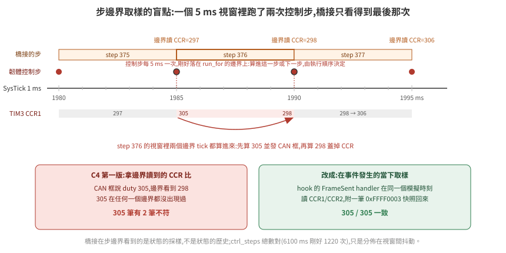</p>


305 這個值在任何一個步邊界都沒出現過。原因:韌體的控制步由 SysTick 的 1 ms 中斷驅動,5 ms 一次;`run_for` 的邊界剛好落在 1985 ms 這種整數 tick 上時,那個 tick 的控制步這次算進本步、下次算進下一步。於是某個 5 ms 視窗裡跑了**兩次**控制步,第一次算出 305 並發了 CAN 框,第二次算出 298 蓋掉 CCR,橋接在邊界只看得到 298。`ctrl_steps` 總數對(6100 ms 剛好 1220 次),只是分佈在視窗之間有抖動。

這是 [35 篇](../35-hil-what-and-why/README.md) §5「三個時鐘」的具體實例:韌體的 tick 與橋接的步是兩個時鐘,對齊只在平均意義上成立。解法不是放寬判準,是**在事件發生的當下取樣**——hook 的 `FrameSent` handler 在同一個模擬時刻讀 CCR 附回來,C4 改用它之後 305/305 一致。

一般化:橋接在步邊界看到的是狀態的採樣,不是狀態的歷史。要比「同一時刻」的兩個量,取樣要發生在模擬器裡面。

## 5. 這次踩到的失敗形態

每一條:症狀 → 真因 → 什麼判準抓得到。

| 症狀 | 真因 | 抓到它的 |
|---|---|---|
| 握手回 FATAL `Encountered unknown command 0x00` | 腳本用 `echo >/dev/tcp/...` 探埠,換行字元被 server 當握手第一 byte | 握手錯誤要讀出 server 的訊息,不能只看 code |
| `magic=0x00000000`、`ARR=65535` | `LoadELF` 後機器暫停,`main` 沒跑,SRAM 全零、暫存器是重置值 | 生效證明;修法是先 `run_for` 開機 100 ms |
| CAN 注入「成功」但 FIFO 空 | `FMR` 寫 `1` 把 `CAN2SB` 清成 0,bank 0 歸 CAN2,訊框被靜默濾掉 | 探針讀 `RF0R.FMP0`;log 開 Debug 看 `dropped by filter` |
| 注入呼叫丟例外 | `FrameReceived` 事件帶兩個參數,handler 只收一個 | 例外訊息本身;事件簽章先 `print dir()` 查 |
| monitor 函式型別錯 | 數字參數被轉 int、週邊名被轉物件 | 字串加引號;函式收物件 |
| C4 2/305 不符 | 一個視窗兩次控制步,中間值在邊界看不到 | 事件時刻快照(§4) |
| 1 s 虛擬時間要 13.4 s | MMIO 輪詢是 Renode 最貴的操作 | 量指令數;WFI + 中斷收訊([36 篇](../36-stm32-firmware-on-renode/README.md) §5) |
| Isaac 受控體第一步就 `AttributeError` | 6.0.1 的 PhysX 介面沒有 `update` | 列 `dir()` 找到 `simulate/fetch_results`,不猜 |
| 車在 5 ms 內以 2.9 m/s 往上飛(32 篇「被彈飛」的形狀) | 地面的 `xformOpOrder` 寫成 [scale, translate]:USD 第一個列的是最外層,-0.05 的平移被 z 的 0.1 縮成 -0.005,**地面頂面在 +45 mm**,輪子起始陷入 45 mm | 探針印地面 bbox 頂面與靜止後的 z(所有東西都停在 +45 mm 就是線索) |
| 位置對到 3 mm、航向差一個正負號 | Gf 矩陣是 row-vector 慣例,yaw 用了 column-vector 的索引 | 右輪 tick 比左輪多 → 左轉為正;韌體對、受控體錯 |
| 閉環跑完 `run_loop.sh` 收不掉 | 背景 `ssh -L` 繼承了腳本的 stdout 管線,kill 到包裝 shell 而不是 ssh | 隧道輸出導檔案、`exec` 起 ssh 讓 PID 就是它 |
| CAN 走 vcan 時 `enc_frames` 14/399,無任何 warning | `CANHub` 在 `RunFor` 之間的暫停期把主機來的訊框丟掉 | C8 紅;Debug log 數「Received from」與韌體收到的差;修在 hub([37 篇](../37-bus-signal-bridging/README.md) §4) |
| 同上,修了 hub 還是 331/399 | `i @CANHub_Fixed.cs` 執行期編譯要幾秒,External Control 已經開、橋接已經在推進,前幾十步的訊框沒人收 | 出口全部就位**之後**才開 External Control(`hilctl-common.resc` 的順序) |

| realtime 下同一腳本末端差 lockstep 8–14%,五次各不同 | 橋接守不住 5 ms 牆鐘節拍(步距 4.8–5.3 ms、停頓到 50 ms),編碼器訊框跟著步走,韌體假設每筆 = 5 ms | `wall_ms` 欄對 `plant_x`;差與步距同向。收法:編碼器改 TIM encoder mode,韌體在自己的 tick 讀 CNT([35 篇](../35-hil-what-and-why/README.md) §5.1) |
| 方形閉環加了斜坡後閉合從 35 變 277 mm | 斜坡對兩輪各自限,轉→直時兩輪從不同速度起步、不同時到,每段直線畫弧 +0.16 rad | 每段結束的位姿;改成 v/w 各限(§1.1) |
| 堵轉旗標晚了 525 ms 才亮 | 速度門檻 5 mm/s 低於感測器量子(一個 tick / 5 ms = 15 mm/s),輪子慢慢滑時偶爾一個 tick 就把計時清零 | 門檻 ≥ 量子(§1.2) |
| IWDG 重啟後 DRV_FAULT、BUMPER 亮一步 | 機器重置把 GPIO 埠也重置,低有效的輸入腳回到 0;真板的 pull-up 在板子上 | 橋接偵測到 tick 倒退就重新拉高(§1.2) |
| 韌體死掉了,車還在走 | 這不是 bug,是沒有看門狗時的必然:CPU 停了,TIM3 的 PWM 沒停 | `--negative iwdg-off`:CCR 停在 345、車跑 1.6 m;正對照 IWDG 1 s 後整顆重置 |
| 只搬不改的重構讓 CSV 有 429 個欄位不同;原版加 200 圈 NOP 更差(8639 個、C9 紅) | 橋接的步邊界(`boot_ms` 100 + 5k)與韌體的控制 tick(5k)重合,暫停切在控制步中間;哪些存取在邊界前後由指令數決定 | `ccr1 ≠ duty_l` 的那一步就是被切的證據;邊界錯開 2 ms(`boot_ms` 102)後三個版本逐 byte 相同([37 篇](../37-bus-signal-bridging/README.md) §5) |
| realtime 下 C9 紅(受控體加速度撞到馬達層 3000),配額放寬、比值 1.017 時也紅 | 不是比值也不只是停頓:編碼器 tick 是橋接每步一口氣注入的,韌體一個 5 ms 控制週期吃到的注入筆數不固定(n 或 n+1;停頓時 0),kp = 1 把量測速度的跳動原樣變成 duty 跳動 | lockstep `--skew uniform:R` / `stall:N:M` 把比值與停頓拆開量:0.5、0.25 綠,0.9/0.8/0.6/0.3 紅,10 ms 停頓就紅([35 篇](../35-hil-what-and-why/README.md) §5.1 第 4 點的表)。真板沒有這個問題(邊緣連續);要在 realtime 消掉得改成連續注入或帶時間戳,未做 |
| realtime 每 100 ms 停 50 ms,相位鎖在牆鐘,不隨主機負載變 | Renode 容器 `--cpus 2` 的 CFS 配額:realtime 下模擬執行緒 + hook + External Control + GC 超過 2 核,整個行程被凍到 100 ms 週期結束;lockstep 不受影響(慢只是慢) | 停頓步的 `wall_ms mod 100` 全落在同一相位;同一負載下 `--cpus 4` 停頓 70 → 9–24 次。第一眼像「主機忙」 |

共同點:**每一個的第一眼症狀都指向別的地方**——握手失敗像版本不合、SRAM 全零像位址錯、FIFO 空像模型缺口、C4 不符像韌體回報錯、彈飛像腳輪或質量。每一個都是先讀原始碼或加一個更近的觀測點才看到真因;彈飛那一個,近一點的觀測點是「靜止後停在哪個高度」。

## 6. 換成 Isaac Sim 6.0.1:七件事各量到什麼

[`plant/isaac_plant.py`](../../../examples/hil-stm32/plant/isaac_plant.py) 實作同一個受控體協定(TCP 版,因為 `ssh -L` 只轉 TCP):用 `pxr` / `UsdPhysics` 直接建一台差速車(Mesh 盒底盤 + 兩個球形輪 + 球關節腳輪),`DriveAPI` 的 angular 速度目標當馬達,`omni.physx` 手動步進,物理步長綁 calib 的 5 ms。它刻意不用 OmniGraph([31 篇](../../fleet/31-omnigraph-and-ros2-bridge-truth/README.md) §5:headless 下 `world.step(render=False)` 不 tick action graph)、也不依賴 `isaacsim.core.api` 或 `isaacsim.core.experimental` 任一邊([01 篇](../../common/01-install-and-run-modes/README.md) §3 的命名空間搬家)。

拓撲:Renode 與橋接留在本機 docker,只有受控體在 GPU 主機,`run_loop.sh` 的 `PLANT=remote` 自動開隧道。每一輪都重啟受控體——它的位姿與 tick 跨連線累積,重啟才是同一個起點。

| # | 要驗的 | 量到的(2026-09-15,`--probe` 模式) |
|---|---|---|
| 1 | 手動步進介面 | 6.0.1 的 PhysX 介面**沒有 `update`**(第一次跑就 `AttributeError`)。正確路徑:`IPhysxSimulation.attach_stage(stage_id)` → `simulate(dt, t)` → `fetch_results()`;timeline 不 play,否則 Kit 每個 update 自己再步一次 |
| 2 | 關節角讀法 | `state:angular:physics:position` **不會被寫回**,步進前後都不存在。改從 `fetch_results` 寫回的 xform 算輪子相對底盤繞 Y 的角、跨步展開——那是物理輸出,滑移都在裡面 |
| 3 | 物理步長 | `timeStepsPerSecond=200` 讀回 200,`SimulationManager.get_physics_dt()` = 0.005。標 Deprecated 但生效 |
| 4 | 彈飛 | 修正後靜止 1 s 底盤 z = 50.0 mm(建模 50.0)。**曾經彈飛**,真因見 §5 |
| 5 | `targetVelocity` 單位 | 設 360 跑 1 s → 輪角 6.235 rad(99.2%,drive 有落後);底盤前進 302.1 mm 對輪周 311.8 mm → **滑移 3.1%**,與 [32 篇](../../fleet/32-differential-drive-vehicle-model/README.md)的 2~3% 同量級 |
| 6 | C1–C10 | **ALL PASS**:C3 dx 0.8 / dy 1.0 mm、dθ 0.0008 rad(容差 87.8 mm / 0.0737 rad,slip 0.05);步階超調 3.0%、最大加速度 1900 mm/s²;負對照位移 0、C2 紅。每步 52 ms 牆鐘(隧道約 +19 ms、Isaac 步進約 +3 ms)。馬達層加入前是 3.4 / 2.0 mm、0.0276 rad,超調 60%、加速度 91400——差在轉向段輪子瞬間到滿速時的打滑(§1.1) |
| 7 | 決定性 | 兩次跑 CSV **全部欄位逐 byte 相同**。`is_gpu_dynamics_enabled()` = True 而 `get_physics_sim_device()` = cpu——兩個值都記,決定性在這個組合下成立;GPU 求解沒測 |

### 6.1 上位換成 ROS 2 Jazzy:方形閉環

ROS 2 在這個拓撲裡的位置是**上位**。[`ros/hil_base_driver.py`](../../../examples/hil-stm32/ros/hil_base_driver.py)(rclpy 7.1.11,`ros:jazzy-ros-base`)訂 `/cmd_vel`、每 20 ms 送一個 cmd_vel 框包;收 odom 框包發 `/odom` 與 `/tf`(odom → base_link)。它對橋接講的是韌體那份序列協定([`ros/hilproto.py`](../../../examples/hil-stm32/ros/hilproto.py),與 Rust 側同一組已知答案),橋接開 `--upper tcp-listen:0.0.0.0:3800` 之後在上位側只當一條序列線:byte 原樣進 USART1、原樣送回。Isaac 那側不需要 ros2 bridge——受控體介面是 TCP/UDP 文字協定,不是 topic。

閉環用 [`ros/square_client.py`](../../../examples/hil-stm32/ros/square_client.py):訂 `/odom`、發 `/cmd_vel`,四條 0.6 m 的邊、四個 +90° 的角,**每一段的結束由里程計判斷,不是計時**——所以它不在乎 Renode 跑幾倍實時,慢只是等久一點。第一版韌體(無斜坡)下 `UPPER=ros ./run_loop.sh --seconds 40`:

| | lockstep | realtime |
|---|---|---|
| C1–C8 | ALL PASS | ALL PASS |
| 上位送出 / 韌體收到的 cmd 框包 | 1733 / 1733 | 1257 / 1257 |
| 回到起點的閉合誤差(odom) | 35 mm、0.075 rad | 70–86 mm、0.14–0.15 rad(兩次) |
| 受控體真值末端 (x, y, θ) | 28.2, −23.2, 6.359 | 49.1, −50.5, 6.425 / 67.0, −55.2, 6.429 |
| odom 末端 | 24, −26, 6.358 | 45, −53, 6.424 / 63, −58, 6.429 |
| 牆鐘(方形本身) | 36.5 s(Renode 20 s) | 28.1 / 21.4 s |

<p align="center">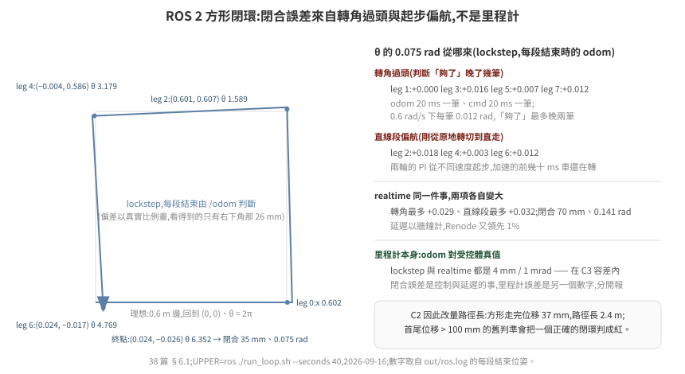</p>


閉合誤差來自兩個地方,從每段結束時印的位姿可以拆開看(lockstep):轉角**過頭** 0.000 / 0.016 / 0.007 / 0.012 rad——里程計 20 ms 一筆、命令 20 ms 一筆,0.6 rad/s 下每一筆就是 0.012 rad,「夠了」的判斷最多晚兩筆;直線段**偏航** +0.018 / +0.003 / +0.012 rad——剛從原地轉切到直走,兩輪的 PI 從不同的速度起步,車在加速的前幾十毫秒還在轉。realtime 下同樣兩項各自變大(轉角最多 0.029、直線段最多 0.032):延遲以牆鐘計,Renode 又領先 1%。odom 對真值(4 mm、1 mrad)兩者都在 C3 容差內——閉合誤差是**控制與延遲**的事,不是里程計的事,兩個數字要分開看。

**加了斜坡之後閉合先變差再變好。** 下位有了加減速,「命令歸零」到「車停住」之間多了一段距離;上位不知道這件事就會過頭。每一步改了什麼、閉合怎麼變(lockstep,`--seconds 45`;每一列只比上一列多一件事):

| 版本 | 閉合(odom) | 每個轉角(轉 + 停,對 π/2) |
|---|---|---|
| 無斜坡(上表) | 35 mm、+0.075 rad | 過頭 0.000–0.016 |
| 斜坡,兩輪各自限 | 277 mm | 每段直線偏航 +0.16:兩輪從不同速度起步、各自限速就不同時到 |
| 斜坡改 v/w 各自限 | 228 mm | 轉→直的過渡不再畫弧;但上位仍在 odom 到 0.6 m 才停,車再滑 v²/2a |
| 上位提前 v²/2a、w²/2α 煞車,段間等 odom 速度歸零 | 126 mm | |
| 韌體設定點歸零時清積分 | 63 mm、+0.145 rad | 過頭 +0.028–0.040:煞車模型少了馬達 τ 與 odom/cmd 各一筆的延遲 |
| 上位煞車距離加 v × lag(`lag_s` 0.08 = τ 50 ms + 兩筆 20 ms 量級) | **24 mm、−0.062 rad**(第二次 18 mm、−0.050:ROS 端的節拍是牆鐘,兩次不同) | 不足 0.011–0.026,散布 0.015 ≈ 一筆 odom(0.012) |

末端真值 (x, y, θ) = (−18.0, 16.4, 6.222)、odom (−13, 20, 6.221),odom 對真值 5 mm / 1 mrad,C1–C10 全綠。最後一列的殘差**到此為止**:同一天再跑四次是 9.5 / 18 / 24 / 28 mm、−0.035 ~ −0.062 rad;把 odom 週期從 20 ms 改成 10 ms 再跑兩次是 17 / 32 mm、−0.047 / −0.076 rad——沒有變好,散布跟 20 ms 一樣。殘差的來源是 ROS 端用牆鐘送命令(50 Hz)、Renode 只跑 0.4–0.5×,命令落到韌體的時刻在 Renode 時間上抖動 20–25 ms,不是 odom 的量化;要收它得把上位也鎖進 lockstep(用模擬時間驅動 ROS 的 timer),那是另一個架構。這一段的教訓是**上位的煞車模型要包含下位的動態**——斜坡加速度、馬達時間常數、回報週期——這些在真車上是驅動器手冊與底盤韌體的參數,上位的人拿不到就會在方形上看到 +0.03 rad/角。

C2 因為這個場景改成量**路徑長**而不是首尾位移:方形走完位移 37 mm,路徑長 2.4 m;C3 的容差也改用路徑長(里程計誤差跟著走過的距離累積)。預設腳本下兩者只差 15 mm(轉彎過渡的弧),數字不變。

### 6.2 上位換成 Nav2:規劃器、costmap、假雷射

方形閉環的上位是自己寫的 client;換成 Nav2 才是拓撲那張表的真正考驗——上位有規劃器、costmap、行為樹,韌體與橋接一個 byte 不改。純軟體的前提下少了一樣東西:雷射。它由**受控體**產生(不經 MCU——真車的雷射也是接上位,不是接底盤板):[`world.json`](../../../examples/hil-stm32/world.json) 一個 4 × 3 m 的房間、兩個 0.4 m 方塊、車半徑 0.2 m、goal (3, 2);Rust `Fake` 與 `fake_plant.py` 用同一份射線投射(360 束、5 m、10 Hz)與碰撞判斷(撞到就停在原地、編碼器不動;Isaac 版的牆是真的碰撞體,§6.4),橋接把 `SCAN` 行**原樣**轉到 3801,driver 發 `/scan` 與 `base_link → laser` 靜態 TF。地圖([`tools/gen_map.py`](../../../examples/hil-stm32/tools/gen_map.py) 從同一份 JSON 產)**只畫牆**:方塊是地圖上沒有、雷射才看得到的東西,Nav2 得靠 costmap 的 obstacle layer 避開——負對照才有東西可關。

Nav2 用最小組合(`ros/Dockerfile.nav2`:map_server、NavFn、DWB、bt_navigator、behaviors、lifecycle_manager、simple_commander;從 `ros:jazzy-ros-base` 建,+520 MB,不裝 nav2_bringup / rviz),沒有 AMCL——里程計對真值在 mm 級,`map → odom` 是靜態 identity。[`ros/run_nav.sh`](../../../examples/hil-stm32/ros/run_nav.sh) 起 driver + 六個節點,[`ros/nav_client.py`](../../../examples/hil-stm32/ros/nav_client.py) 用 `BasicNavigator.goToPose` 到 goal。`UPPER=nav2 ./run_loop.sh --seconds 90`:

<p align="center">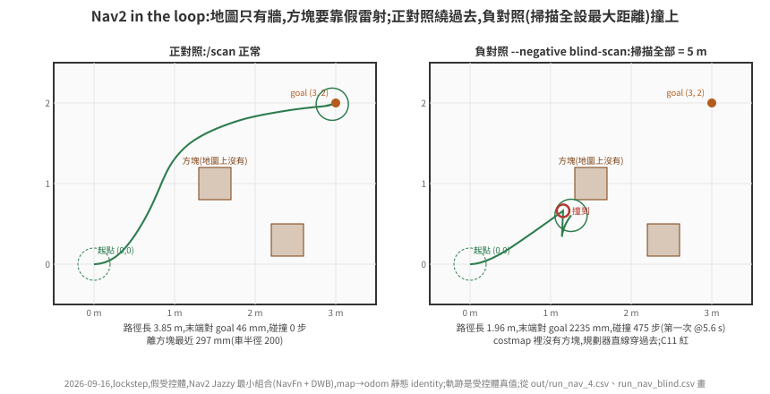</p>

| | 正對照 | 負對照 `--negative blind-scan`(掃描全設 5 m) |
|---|---|---|
| Nav2 結果 | `succeeded`(36.6 s 牆鐘),odom 末端對 goal 47 mm | 沒到:GOAL 4 時頂在方塊上 recovery 來回(碰撞 475 步);§6.3 的鎖加上之後,頂住 = 輪子凍結、duty 高 → 韌體 **STALL** → driver 取消 goal,碰撞 41 步、`canceled`(§6.5 的影片) |
| C11:真值到達 goal 0.1 m 內、沒撞 | **46 mm、碰撞 0 步** | 碰撞 475 步(第一次 @5.5 s)、末端差 2235 mm,**紅** |
| 路徑長 / 離方塊最近 | 3.85 m / 297 mm(車半徑 200) | 1.96 m / 0 |
| C1–C10 | 全綠(C3 dx 1.2 / dy 0.9 mm、0.6 mrad;C9 2510 vs 2520——DWB 的加速度設成與韌體斜坡同值,瞬態剛好貼線) | C9 也紅(頂住時 PI 積分堆滿、鬆開那步撞到馬達層 3000);其餘綠 |
| 牆鐘(整趟 90 s Renode) | 187 s(Renode 0.48×) | 148 s(60 s Renode) |

realtime 也跑了一次(`UPPER=nav2 ./run_loop.sh --mode realtime --seconds 90`,1 kHz 載波、Renode 4 核、主機 load 4.5,2026-09-17;lockstep 那欄是同一天 load 12 的重跑):

| | lockstep | realtime |
|---|---|---|
| `[clocks]` | — | wall 90.006 s、renode 90.107 s、plant 90.002 s,**renode/wall 1.001**,`max_lag` 0 |
| 節拍(18000 步) | — | 平均 4.99 ms,停頓 26 次(最長 23.2 ms) |
| Nav2 結果 / 牆鐘 | `succeeded`,53.4 s | `succeeded`,**16.9 s**(車以真速度走) |
| C11:真值到 goal / 碰撞 | 46 mm / 0 步 | **42 mm / 0 步** |
| 路徑長 / 離方塊最近 / 車停下的時刻 | 3.853 m / 302 mm / 18.8 s(Renode 時間) | 3.858 m / 312 mm / 21.5 s(牆鐘) |
| C9 | 2510 綠(貼線) | **紅** 3000(CCR 跳 183 次、150 次不在停頓旁;[35 篇](../35-hil-what-and-why/README.md) §5.1 第 4 點) |

路徑差 5 mm、到達差 4 mm:Nav2 這一層在 realtime 下沒有多出什麼——它本來就活在牆鐘上,lockstep 才是它的異常環境(每個逾時都在跟 Renode 的步速比)。差別全在下位:C9 紅的是韌體速度迴路對取樣式注入的錯拍,與上位無關。

三件做了才知道的事:

- **`default_server_timeout` 的單位是毫秒,預設 20。** 主機 load 15 時 planner 回 ack 超過 20 ms,行為樹報「Timed out while waiting for action server to acknowledge goal request」、整個 goal 失敗——症狀像規劃失敗,真因是一個等待時間。放到 1000 才過。這是 lockstep 下 Nav2 的計時器全走牆鐘、Renode 走步的第一個具體後果:Nav2 的每一個逾時都在跟主機負載比,而不是跟車比。
- **序列線有線速。** 上位在牆鐘上每 20 ms 送一個 cmd_vel、每 100 ms 一個 PING;橋接一停頓(load 15 下常有),上位的 byte 堆起來,一次全灌進 USART1 的話 Renode 的 UART 不分 baud 節拍、ISR 一個接一個,主迴圈搶不到 128 B 的 ring buffer 就溢位——量到 `rx_overflow=114`、4 個壞 CRC、C6/C7 紅。真線路 115200 bps 每 5 ms 最多 57 byte,橋接現在按這個線速分批注入(`calib.json` 的 `uart_baud`)。這一條是 §5 表裡「第一眼像韌體 CRC 有問題」的又一個。
- **撞牆那一步不能算進 C9。** 受控體撞到方塊時速度直接歸零(73039 mm/s²),那是牆的事不是韌體斜坡的事;負對照原本 C9、C11 一起紅,現在只有 C11。

**MPPI 對 DWB**(`CONTROLLER=mppi`)。映像裡本來就有 `nav2-mppi-controller`;參數用 Nav2 Jazzy `nav2_bringup/params/nav2_params.yaml` 的 FollowPath 段([`nav2_params_mppi.yaml`](../../../examples/hil-stm32/ros/nav2_params_mppi.yaml) 疊在 controller_server 上),只把速度與加速度上限改成和 DWB、韌體斜坡一致(vx 0–0.3 m/s、wz 0.6 rad/s、ax ±1.5、az 4.0),**其他不調**。假受控體、lockstep、`UPPER=nav2 --seconds 90`,時間都是受控體時間(2026-09-17,主機 load 11–12):

| | DWB | MPPI |
|---|---|---|
| 進 goal 0.1 m 內 | 15.5 s | 16.2 s |
| 最後一次在動 | **17.8 s** | 42.1 s(在 goal 附近來回修到 xy 0.05 m / yaw 0.3 rad 的容差) |
| 末端離 goal | 43 mm | 34 mm |
| 路徑長 | 3849 mm | 3904 mm |
| 車緣離方塊最近 | 96 mm | 161 mm |
| C9 max \|dv/dt\| | 2382 mm/s² | 1418 mm/s² |
| 每步牆鐘 | 9.3 ms(Renode 0.54×) | 13.0 ms(0.39×,MPPI 在 2 核的 ROS 容器裡吃 CPU) |

MPPI 離障礙物遠、加速度小,但預設參數下收尾要多 24 s。這一區留 DWB:到達時間相當,停得乾淨;Isaac 上的 Nav2 數字(§6.4)都是 DWB,沒有另跑 MPPI。MPPI 的收尾不是它的上限——那是參數的事,這裡刻意不調。

### 6.3 上位對安全旗標的反應:C12

韌體重啟(IWDG)之後有兩件事上位非知道不可:`WDT_RESET` 亮了,而且**里程計歸零了**——odom 是韌體算的,重啟後 `x, y, θ` 從 (0, 0, 0) 重來,`map → odom` 那個靜態 identity 從這一刻起是錯的。上位如果只是繼續送 `cmd_vel`,車會從一個它以為在原點的位置開走。[`hil_base_driver.py`](../../../examples/hil-stm32/ros/hil_base_driver.py) 的反應:看到 `WDT_RESET` 或 `STALL` 就**鎖住**——`cmd_vel` 一律送 0、對 `navigate_to_pose` 的 `cancel_goal` 服務送「全部取消」(goal_id 全 0),直到操作者呼叫 `/hil/fault_ack`(std_srvs/Trigger)才放開;`DRV_FAULT`、`ESTOP`、`HB_LOST` 不鎖,韌體自己會切、解除就恢復。負對照是 driver 的參數 `fault_latch:=false`(`--negative no-latch`):什麼都不做。

場景 `UPPER=nav2 ./run_loop.sh --seconds 60 --fault hang --fault-at 8`:車在往 goal 的路上 8.0 s 死掉、9.0 s 看門狗重啟;`nav_client` 的行為是「goal 失敗就重送一次」——上位不知道底盤重啟過時會做的事。

| | driver 鎖住(預設) | `--negative no-latch` |
|---|---|---|
| driver | `fault latched: flags 0xc1 ENABLED\|HB_LOST\|WDT_RESET → cmd_vel=0, cancel goal` | 沒反應 |
| Nav2 | `Goal canceled`(`bt_navigator` 收到 cancel),`[nav] result canceled, attempts 1` | 第一次 goal 因 odom 跳回原點而 `failed`,重送一次,從「原點」規劃 |
| C12:重啟 0.5 s 後車不再動 | **0 步在動、最遠再走 16 mm**(重啟到旗標抵達上位那一筆 odom 之間) | **1170 步在動**,車原地轉了 3 rad(規劃的起點錯了,路徑也錯),**紅** |
| C10 IWDG | +1000 ms 重啟 | 同 |

沒鎖住的那一欄,車沒有直直撞出去是 Nav2 的 progress checker 先把第一次 goal 判失敗——這是運氣不是設計,第二次 goal 就開走了。C12 的判準只看受控體真值(重啟 0.5 s 後 `|v| ≥ 5 mm/s` 的步數),不看 Nav2 的回覆:「上位該停」要用車的行為驗,不用上位的自述。

#### 解鎖之後:AMCL 重定位(C14)

C12 只證明「上位知道要停」。停完還要能繼續:重啟後 odom 從 (0, 0, 0) 重來,靜態 identity 的 `map → odom` 從那一刻起是錯的。這一段換成 AMCL(`LOCALIZER=amcl`,映像多裝 `ros-jazzy-nav2-amcl`,一個套件、安裝 1.9 MB),流程在 [`nav_client.py`](../../../examples/hil-stm32/ros/nav_client.py)(`RELOC=1`):重啟 → driver 鎖住、取消 goal → 重定位 → 收斂才呼叫 `/hil/fault_ack` 解鎖 → 重送 goal。

**先量對稱。** 房間 4 × 3 m、地圖只畫牆,對中心 (1.5, 1.0) 旋轉 180° 不變——起點 (0, 0) 的鏡像剛好是 goal (3, 2)。沿 Nav2 正對照的真值路徑每 0.5 s 取位姿 p 與鏡像 p′,算雷射實際量到的(含方塊)對兩張地圖預期掃描的逐束差(> 5 cm 的比例):

| 地圖 | 真位姿 | 鏡像位姿 |
|---|---|---|
| 只有牆(現行) | 0.07–0.18 | **逐列與真位姿相同** |
| 牆 + 方塊(`gen_map.py --boxes`) | 0.00 | 0.07–0.15 |

只有牆的地圖上,真位姿與鏡像在數學上分不開,**全域定位不可用**;方塊畫進地圖可以分開,但那會拿掉 blind-scan 的前提(方塊是雷射才看得到、地圖上沒有的東西)。所以地圖不改,重定位只做「從重啟前最後一個位姿接著追」:`/initialpose` = WDT_RESET 出現前 0.3 s 的最後一筆 AMCL 位姿,σ 0.5 m / 0.5 rad(死機那 1 s 車還在走),等協方差 σxy ≤ 0.05 m、σyaw ≤ 0.05 rad。

三件做了才知道的:

- **車停著,Nav2 的 AMCL 不更新。** 濾波只在里程計變化**嚴格大於** `update_min_d` / `update_min_a` 時跑,設 0 也一樣。不處理的話量到:發了 `/initialpose` 之後 60 s 沒有任何一筆 `amcl_pose`,等待逾時才解鎖;解鎖後車一動 AMCL 才修正,C14 照樣綠(21 mm)——**「收斂才解鎖」這道閘形同虛設,判準卻看不出來**。等待期間 5 Hz 呼叫 AMCL 的 `request_nomotion_update` 之後正常收斂。
- **driver 的鎖要看新出現的位元,不看位準。** `WDT_RESET` 在韌體裡亮到下次上電;只看位準的 driver 在 ack 之後下一筆 odom 又鎖住,重送的 goal 被取消,車永遠不走。改成記住 ack 過的位元,熄掉再亮才算新的一次。C12 驗不到這件事——它只看解鎖之前。
- **C12 的「重啟 0.5 s 後車不動」在有重定位時只算到解鎖為止**;解鎖的定義是重啟後上位先送了連續 0.5 s 的零命令、之後第一個非零命令——重啟那一刻還在路上的舊命令不算。

`UPPER=nav2 --seconds 150 --fault hang --fault-at 8`(假受控體,2026-09-17):

| | `LOCALIZER=amcl RELOC=1` | `--negative static-map-odom`(同樣解鎖重送,`map → odom` 仍是 identity) |
|---|---|---|
| 重定位 | 初始猜測 (0.925, 1.176, 1.056),離重啟後停住的真值 (1.158, 1.461, 0.619) 366 mm / 0.44 rad;`request_nomotion_update` 16 次、**3.3 s(牆鐘)收斂**到 (1.149, 1.486, 0.620):對真值 **27 mm / 0.001 rad**,σ 0.033 m / 0.043 rad | 等 3 s |
| 解鎖 | 重啟後 2.26 s(Renode 時間) | 重啟後 3.15 s |
| C12(解鎖前) | 綠,再走 18 mm | 綠,再走 13 mm |
| Nav2 | `succeeded`(重啟時手上的 goal 由 nav_client 取消、重定位後重送) | `failed`(從「原點」規劃、原地轉) |
| C14 | **綠**:末端離 goal 27 mm、碰撞 0 | **紅**:末端離 goal 1544 mm |

同一流程另兩次(nav_client 重啟時還沒主動取消 goal、而是等它自己失敗的版本):收斂到離真值 16.5 mm / 0.059 rad(5.9 s),解鎖拖到重啟後 27.3 s,C14 綠 13 mm;沒呼叫 `request_nomotion_update` 那次見上面第一點。

沒有故障的 AMCL 導航(`LOCALIZER=amcl --seconds 90`)到達 23 mm、碰撞 0,與靜態 identity 的 46 mm 同一級。

### 6.4 Isaac 受控體補齊:雷射、碰撞、五個故障、Nav2

§6 的七件事之後,Isaac 版與兩個假受控體差三樣:沒有雷射、沒有牆、五個故障注入沒在它上面跑過。補齊的原則是**同一份 `world.json`、同一份判準**;做法上只有一處必須不同——假受控體的牆是公式(撞到就凍結),Isaac 的牆是 PhysX 碰撞體,車真的會被頂住。

- **牆與方塊**:`--world` 把房間四面牆(內側面對齊房間邊線、厚 0.1 m、高 0.5 m)與方塊建成靜態碰撞體(只掛 `CollisionAPI`,沒有 `RigidBodyAPI`)。
- **雷射**:`omni.physx` 的 scene query。介面名稱不猜,`--probe` 把 `get_physx_scene_query_interface()` 的 `dir()` 印出來:`raycast_closest / raycast_any / raycast_all`、`overlap_*`、`sweep_*`;`raycast_closest(origin, dir, distance)` 回 dict,鍵 `hit, position, normal, distance, faceIndex, collision, rigidBody, material, protoIndex`。雷射高 0.15 m(輪頂 0.10、底盤頂 0.08,射線打不到自己)。**360 束 1.2 ms;對 `plant/world.py` 解析解逐束 max|Δ| = 0.0 mm**(手動步進下 `fetch_results()` 之後 scene query 就是最新的,不用另外 update)。
- **`collided` 旗標**用與另外兩個受控體同一份公式(0.2 m 圓碰到牆線),物理接觸在那之後——`--probe` 第 9 項:滿速往 +x,旗標在 x = 2028 mm 亮(公式算的圓碰方塊 2 的角 2027),底盤接著被方塊角頂歪、末端 θ ≈ ±90°;**頂住之後左輪角從 43.0 轉到 104.3 rad**——球輪對方塊打滑,編碼器繼續數。

六件事各量到什麼(2026-09-16;本機 load 11–15,lockstep 所以只影響牆鐘;每輪重啟受控體):

| # | 場景 | 假受控體(§6.2 / §1.2) | Isaac 6.0.1 |
|---|---|---|---|
| 1 | 預設 6 s 腳本,`WORLD=1 PLANT=remote` | 900.8, 0.4, 0.8627 | **901.1, −1.0, 0.8603**;C1–C12 全綠,C3 dx 0.1 / dy 1.0 mm、0.7 mrad;C9 2347;60 筆掃描;36.5 ms/步(受控體 + 隧道 22.4 ms) |
| 2 | 滑移(馬達層 + 斜坡之後,從閉環 CSV 算:真值對輪行程) | 0 / 0 | 直行段 0.5–3.6 s **−0.08%**(890.9 vs 890.2 mm)、轉向段 3.6–5.2 s **+0.12%**(Δθ 0.8422 vs 0.8432 rad),轉向段真值側移 10.4 mm(假受控體 6.5);`--probe` 等速一步到滿速時是 3.1% / 0.5%——滑移是加速度的函數,斜坡把它拿掉了。`run_loop.sh` 的 `--slip` 從 0.05 改 0.01 |
| 3 | `UPPER=nav2 --seconds 90` | `succeeded`,真值到 goal 46 mm、碰撞 0 | `succeeded`(1 次),**真值 47 mm、碰撞 0 步**;C3 0.6 / 0.6 mm;C9 2450;整趟 523 s 牆鐘(0.17×,load 13) |
| 4 | `--negative blind-scan` | 碰撞 475 步、末端差 2235 mm,C11 紅;Nav2 沒到 | 5.25 s 在 (1165, 655) 亮旗標,之後**沿方塊再走 175 mm** 被角頂住(1336, 620),碰撞 16718 步、末端差 2162 mm,C11 紅;**但 Nav2 回 `succeeded`、odom 末端離 goal 42 mm**——輪子頂著方塊打滑,韌體 odom 一路走到 goal(C3 紅:odom 對真值差 1631 / 1353 mm、0.75 rad) |
| 5 | 五個 `--fault` | 表在 §1.2 | 全部綠:hang 1.995 → 2.995 s 重啟(+1000,死掉期間 CCR 停 330);drv-fault 旗標 +0 ms、300 步 CCR/EN 全 0、放開恢復;bumper 500.4 撞、最遠 **544.8**(假受控體 537.2)、倒車到 239.2;stall 旗標 **+390 ms**(假 +355:輪子是被 drive 的 damping 煞住,不是凍結);no-ping +200 / +495 ms(同) |
| 6 | 決定性 | 逐 byte | **兩次 CSV 逐 byte 相同**(2026-09-17 重驗:`WORLD=1 PLANT=remote` 預設 6 s 腳本,每輪重啟受控體、受控體綁 2 核;末端 901.1, −1.0, 0.8603 與 #1 列同;CPU 求解) |

第 4 列是這一節的重點,也是假受控體做不出來的失敗形態:**撞上去之後車不動、編碼器照數,上位以為到了。** 假受控體撞到就凍結編碼器,odom 跟著停,Nav2 看得出來沒到;Isaac 的球輪對方塊打滑(drive 的 `maxForce` 20 N·m 換到輪緣是 400 N,9 kg 的車摩擦力上限只有幾十 N),韌體的堵轉判斷(§1.2:|duty| ≥ 60% 且輪速 < 20 mm/s)**永遠不會觸發**——輪速是編碼器量的,輪子在轉。真車撞牆是哪一種(馬達堵轉、還是輪子打滑)看馬達扭矩對摩擦,兩種都會發生;純軟體 HIL 到這裡才第一次能把「打滑」這一支做出來,而它的後果是上位的自述(`succeeded`、`dist_to_goal 0.042`)與真值(差 2.2 m)完全脫鉤。要抓它得靠外部真值(場域的定位系統、或這裡的受控體真值——C11 看的是真值不是 odom),不是靠底盤回報。

另外兩個 Isaac 特有的數字:保險桿的超出量 44.8 mm 比假受控體多 7.6——馬達層之後車的減速由 PhysX 接觸與 drive damping 決定,不是公式;堵轉旗標晚 35 ms,同一個原因。

**Isaac 上的 Nav2 realtime**(`WORLD=1 PLANT=remote UPPER=nav2 --mode realtime --seconds 90`,1 kHz 載波、連續注入,2026-09-17;本機 load 7.1、場域主機 load 1.2、受控體綁 2 核)。結論先說:**這台 Isaac 受控體跑不了 realtime。** 它每步要 21 ms(PhysX 步進 + 隧道),5 ms 的節拍守不住:橋接平均步距 25.0 ms、最長 325 ms,受控體等於 40 Hz 取樣、每步的 dt 是牆鐘的 25 ms;18000 步跑了 450 s 牆鐘。Renode 照樣 1.000× 實時,所以韌體 5 ms 一個控制週期,中間四個週期看到的是同一個受控體狀態。

| | lockstep(§6.4 第 3 列) | realtime |
|---|---|---|
| Nav2 | `succeeded` | `succeeded` |
| 真值離 goal / 碰撞 | 47 mm / 0 | **137 mm** / 0(C11 紅) |
| odom 對真值 | 0.6 / 0.6 mm | 50 / 109 mm、0.046 rad(C3 紅) |
| C9 | 2450 | 3029(紅) |

realtime 下要讓 Isaac 當受控體,受控體的一步得壓到 5 ms 以內(或把控制週期拉長到受控體跟得上);在那之前 Isaac 只用 lockstep。

### 6.5 每個實驗一支俯視圖錄影

數字表說「末端差 2162 mm、碰撞 16718 步」,看不出車是怎麼卡在方塊上的;§6.4 那一列要用看的。每一輪閉環現在都能多產一支俯視圖錄影([issue #6](https://github.com/wicanr2/isaac-sim-study/issues/6)):`RECORD=1 ./run_loop.sh …` 跑完叫 [`tools/topview.py`](../../../examples/hil-stm32/tools/topview.py)(uv 容器裡的 matplotlib + imageio-ffmpeg),從**同一份 CSV** 畫:真值車體與軌跡、odom 幽靈車(虛線)、雷射打到的點、碰撞步的紅叉、右欄的命令 / 輪速、CCR duty、旗標條(七個 bit 各一列 + 碰撞),底下一列狀態文字。雷射畫的是上位看到的那份——橋接多了 `--scan-log`,把送去 3801 的 `SCAN` 行原樣存檔(`blind-scan` 負對照存的就是全 5 m);沒有紀錄時才從 `world.json` 重算,畫面上會標「重算」。兩個不變量:**動畫末幀的位姿就是 CSV 末列**(工具印出來對照,不另外算);開了錄影的 CSV 與沒開的逐 byte 相同(錄影是跑完才做的,不碰迴圈)。產物在 `out/`(`.mp4` 全部、`.gif` 挑選版進 `docs/img/`,每支 ≤ 2 MB)。

四支挑選版(每支左邊是俯視圖:真值車體、odom 幽靈車、雷射點、碰撞叉;右邊是輪速、CCR、旗標條):

| | |
|---|---|
| 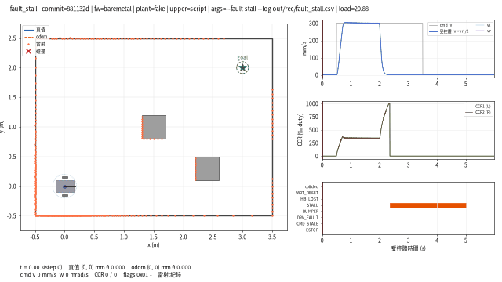 | 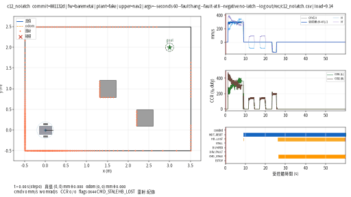 |
| `--fault stall`:2.0 s 輪子卡住,duty 灌到 1000‰、輪速 0,**+390 ms STALL**、CCR 歸零;5.0 s 命令歸零才解鎖 | `UPPER=nav2 --fault hang --fault-at 8 --negative no-latch`:重啟後 odom 幽靈車跳回原點,Nav2 從那裡重規劃,真值車又走了 333 mm(§6.3) |
| 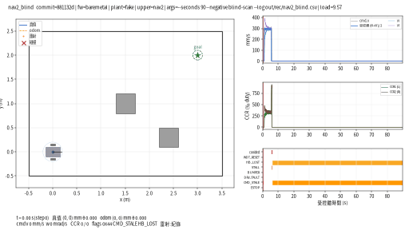 | 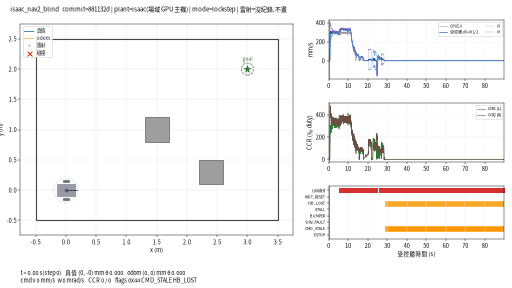 |
| `blind-scan`,假受控體:5.7 s 撞方塊、輪子凍結 → **STALL** → driver 鎖住、goal `canceled`(§6.3 的鎖在這裡順便起了作用) | `blind-scan`,Isaac:同一個方塊,輪子打滑、沒有 STALL,**odom 幽靈車一路走到 goal、真值車停在方塊上**(§6.4) |

Isaac 版另有**真實俯視相機**(`isaac_plant.py --topview DIR`,`tools/isaac_plant_ctl.sh` 的 `TOPVIEW=1`):場景裡掛一台正交相機(5 m 高、看 −Z、畫面 +y 朝上,與上面的圖同向;USD 的 aperture 單位是場景單位的十分之一,視野 4.8 m 就寫 48)、一盞 DomeLight(headless 沒燈會全黑)、幾何用 `displayColor` 上色,`omni.replicator` 的 render product + `rgb` annotator 每 20 個 CMD(100 ms)抓一幀 PNG,跑完 `tools/isaac_plant_ctl.sh fetch` 抓回、[`tools/topcam_check.py`](../../../examples/hil-stm32/tools/topcam_check.py) 對照並編成 mp4。三件做了才知道的事(2026-09-16,場域 GPU 主機):

- **timeline 沒 play 時 `app.update()` 不會讓 annotator 有資料**——20 個 update 之後仍是空的,要 `rep.orchestrator.step()` 才渲染(與 [31 篇](../../fleet/31-omnigraph-and-ros2-bridge-truth/README.md) headless 下 graph 不 tick 是同一件事)。
- **`orchestrator.step()` 的 `delta_time` 預設 `None` 會讓 timeline 走一格,物理跟著多走一步**:開機 settle 從第 1 步就不同(`ticks_r` 0 → −1),整份 CSV 600 多個欄位不同、末端 901.2 / −1.1 / 0.8601。改 `delta_time=0.0, rt_subframes=1` 之後**開相機的 CSV 與沒開的逐 byte 相同**,每幀 62 ms(10 fps 模擬時間 → 6 s 的跑多 3.7 s)。「靜止時連抓 5 幀位姿逐 bit 相同」這個測試抓不到它——睡著的剛體本來就不動,要拿整份 CSV 比。
- 相機幀裡底盤藍色像素的重心對 CSV 真值:**60 幀最大 9 mm**(判準 < 200 mm);`--probe` 第 10 項印同一個數字。

同一個 `blind-scan` 場景的相機版(`UPPER=nav2 PLANT=remote`,`TOPVIEW=1`;900 幀對 CSV 真值最大 8 mm;每幀 72 ms):

<p align="center">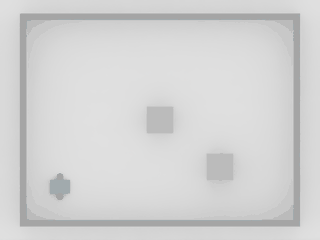</p>


**Nav2 的 `/plan` 也畫進去**(issue #6 的最後一項)。driver 的 `plan_log` 參數把每一條 `/plan` 寫成一行,附上收到當下最新的 odom 序號;俯視圖用 CSV 的 `odom_seq` 欄對齊——不必把 ROS 的牆鐘換算成 Renode 時間。`UPPER=nav2` 自動記(`${LOG%.csv}.plan`),`RECORD=1` 時自動疊上。下面是 §6.3 的 C14:8 s 死機、9 s 重啟,odom 幽靈車跳回原點;重定位之後的新路徑(綠色點劃線)從**真值車**的位置出發,不是從幽靈車——`map → odom` 由 AMCL 接回來了。

<p align="center">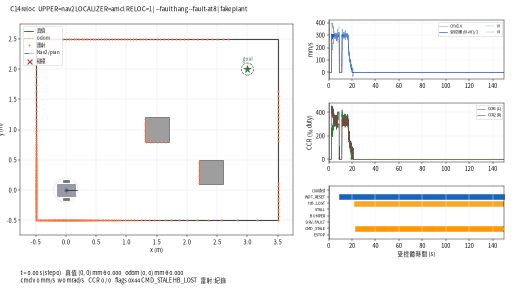</p>


## 7. 建議的分階段

不要一開始就接 Isaac。順序:

| 階段 | 迴路裡有什麼 | 判準 |
|---|---|---|
| 骨架 | 橋接 ↔ 假受控體,**沒有韌體**(橋接自己灌固定 duty) | 同一輸入跑兩次逐 byte 相同 |
| 韌體 | 加 Renode 裡的韌體 | C1–C10 全綠;八個負對照各自轉紅 |
| 受控體換 UDP | 假受控體改另一個行程 | 與內建版末端一致、途中容差內 |
| Isaac | 受控體換 `isaac_plant.py` | §6 七項;C3 容差重定 |
| ROS 2 上位 | 上位換 rclpy 節點,閉環由里程計判斷 | C1–C10 全綠;閉合誤差與 odom 誤差分開報;上位的煞車模型要含下位的斜坡與馬達延遲 |
| Nav2 | 受控體加假雷射與碰撞,上位換 Nav2 | C11:到達 goal 0.1 m 內、沒撞;`blind-scan` 負對照紅;C12:底盤重啟後上位要鎖住,`no-latch` 負對照紅 |
| 實板 | Renode 換實體 STM32,橋接換實板後端 | 全部重跑;**時序與最壞延遲在這裡才算數** |

每一階段結束才往下一階段,每一階段都留下可重跑的指令與 CSV。這一區做到第六階段;實板是第七。

## 8. 檢查清單

- [ ] 判準寫在程式裡,開跑前定好,任一 FAIL 非零碼離開
- [ ] 生效證明每個變數一行
- [ ] 有一個負對照,跟正對照只差一個旗標,而且紅在對的地方
- [ ] 決定性用逐 byte 比驗過;跨實作用容差
- [ ] 要比「同一時刻」的兩個量,取樣在模擬器裡做
- [ ] 每個失敗形態記下「第一眼像什麼」與「真因是什麼」
- [ ] 換受控體之前,容差重新寫好
- [ ] 報告裡分清楚哪些階段做到了、哪些數字要等實板

---

延伸閱讀:[35 HIL 是什麼](../35-hil-what-and-why/README.md)、[36 STM32F4 韌體在 Renode 上開機](../36-stm32-firmware-on-renode/README.md)、[37 匯流排訊號串接](../37-bus-signal-bridging/README.md)、[30 驗收探針與實驗預先登記](../../common/30-acceptance-probes-and-preregistration/README.md)、[27 失效模式分類學](../../common/27-failure-mode-taxonomy/README.md)。
