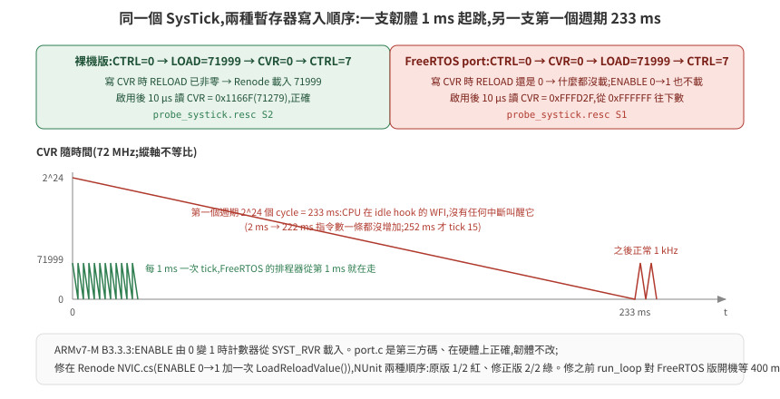

# 39 · 同一台車換 FreeRTOS:RTOS 韌體放進 HIL 迴路差在哪

[36 篇](../36-stm32-firmware-on-renode/README.md)的韌體是裸機 superloop:一個 `for(;;)` 輪詢 UART、CAN、時間,尾端 WFI。真實的下位機大多不長這樣——它跑 RTOS,收訊、控制、回報各是一個 task,由排程器決定誰先跑。這一篇把同一台車、同一份協定、同一個橋接,韌體換成 FreeRTOS V11.3.1,看 HIL 迴路裡什麼變了、什麼沒變,以及 RTOS 才會踩到的一個 Renode 缺口。

> **驗證狀態**:全部在本機實測(Renode 1.16.1、arm-none-eabi-gcc 12.2、FreeRTOS-Kernel V11.3.1、docker 2 核,2026-09-15)。程式碼在 [`examples/hil-stm32/firmware-freertos/`](../../../examples/hil-stm32/firmware-freertos/);跑法 `FW=freertos ./run_loop.sh`。受控體是假受控體;Isaac 那一側的接法與 [38 篇](../38-acceptance-and-failure-modes/README.md) §6 相同,本篇沒有再跑一次。

## 1. STM32F4 跑 FreeRTOS 要什麼

Cortex-M4F 是 FreeRTOS 的官方 port(`portable/GCC/ARM_CM4F`),核心只靠三個例外:**SVC**(啟動第一個 task)、**PendSV**(context switch)、**SysTick**(tick)。Renode 的 `CortexM` 模型三個都有,官方測試裡就有 FreeRTOS demo。實際要準備的:

| 項目 | 這一區的做法 | 為什麼 |
|---|---|---|
| kernel 原始碼 | vendor V11.3.1 的最小子集進 repo(`tasks.c` `queue.c` `list.c`、`include/`、ARM_CM4F port、`heap_4.c`,1.5 MB,MIT) | 版本鎖;建置維持 `--network none` |
| libc | 工具鏈映像沒有 newlib。kernel 只呼叫 `memcpy` `memset` `strcpy` `strlen`,自己給 4 個函式與 2 個標頭([`libc-min/`](../../../examples/hil-stm32/firmware-freertos/libc-min/)) | 每一個連進來的符號都知道是誰 |
| 浮點 ABI | `-mfloat-abi=hard -mfpu=fpv4-sp-d16` | ARM_CM4F port 會開 FPU、存 FP 暫存器;裸機版是 soft-float,兩者不能混連 |
| 向量表 | SVC / PendSV / SysTick 三格指到 port 的處理函式(`FreeRTOSConfig.h` 用 `#define` 對名字) | 其餘與裸機版相同 |
| 中斷優先權 | `configPRIO_BITS 4`、核心 15(最低)、`MAX_SYSCALL` 5;USART1 IRQ 設 6 | 呼叫 `FromISR` API 的中斷,數值要 ≥ MAX_SYSCALL(較不緊急);Renode 的 `nvic priorityMask: 0xF0` 就是 4 位元 |
| tick | 1 kHz,`configCPU_CLOCK_HZ 72000000` | 與平台描述的 `systickFrequency` 一致;Renode 不看 RCC |

大小:text 9496 B、bss 12.9 KB(12 KB 是 heap:三個 task + idle 的 TCB 與 stack;抽共用 `control.c` 前 9864 B)。

## 2. 三個 task,一條 ISR

```
rx_task     優先權 2   ulTaskNotifyTake 睡到 USART1 ISR 通知 → ring buffer 解框包 → 更新設定點
ctrl_task   優先權 3   xTaskDelayUntil 每 5 ms:收 CAN 編碼器、量測、PI、PWM、安全閘門
report_task 優先權 1   xTaskDelayUntil 每 20 ms:odom(USART1)、馬達狀態(CAN)
idle hook              WFI
USART1 ISR             收 byte 進 ring,vTaskNotifyGiveFromISR + portYIELD_FROM_ISR
```

設計上跟裸機版**刻意只差「誰排程」**。第一版是把裸機版的協定、暫存器序列、控制律逐行複製過來(理由:兩支韌體各自完整、可獨立閱讀);GOAL 4 改了四次、每次改兩份之後,這一版把它們抽成兩版共用的 [`firmware/control.c`](../../../examples/hil-stm32/firmware/control.c)(協定收發、GPIO/編碼器/PWM/CAN/IWDG 的暫存器序列、安全閘門、斜坡與 PI、里程計、回報、`g_dbg`/`g_cfg` 版面),兩個 `main` 只剩平台的事:

| | 裸機 `firmware/main.c` | FreeRTOS `firmware-freertos/main-rtos.c` |
|---|---|---|
| 時間 | SysTick ISR 數的 `s_tick_ms` | `xTaskGetTickCount()`(1 kHz) |
| USART1 收訊 | ISR 進 ring buffer,主迴圈每 1 ms 醒來解 | ISR 進 ring buffer + `vTaskNotifyGiveFromISR`,`rx_task` 被叫醒才解 |
| 控制步 | 主迴圈看 `now − next_ctrl` | `ctrl_task` 的 `xTaskDelayUntil`,晚了記 `ctrl_missed` |
| CAN FIFO 收乾 | 主迴圈每次醒來 | `ctrl_task` 每步開頭 |
| 餵狗 | 控制步真的跑了才餵 | 最低優先的 `report_task` 餵(高優先 task 把 CPU 吃光時它餵不到 = 該重置) |
| 死機注入 | 主迴圈 | `ctrl_task`(最高優先,關中斷後全部餓死) |
| CAN 交握逾時 | 給 `now_ms`(SysTick 已在走,10 ms) | 給 `NULL`(tick 要 scheduler 起來才走,用迭代數) |
| `g_dbg` | 就是 `dbg_common_t`(23 字) | `dbg_common_t` 當第一個成員,後面接 RTOS 欄位;`ctl_bind_dbg(&g_dbg.c)` |

`control.c` 不知道時間怎麼來:每個要看時間的函式都收 `now_ms` 參數。判準是重構前後**每一個 lockstep CSV 逐 byte 相同**——裸機版第一次比對差了 429 個欄位,追下去是橋接步邊界與韌體控制 tick 重合的問題,不是搬錯([37 篇](../37-bus-signal-bridging/README.md) §5);邊界錯開之後兩版都逐字相同。text:裸機 5716 → 6196 B(指令間接與函式呼叫),FreeRTOS 9864 → 9496。

原本的三個差異點:

- **收訊不再輪詢。** ISR 塞 ring buffer 後用 task notification 叫醒 `rx_task`;沒資料時它睡著,不佔 CPU。裸機版是每 1 ms 醒來看一眼。
- **週期由 `xTaskDelayUntil` 保證。** 它回 `pdFALSE` 表示「這一輪已經晚了,沒有真的睡」——那就是錯過週期,記進 `g_dbg.ctrl_missed`。裸機版的 `next_ctrl += 5` 會默默追趕,看不出來。
- **`proto_send` 包在 critical section 裡。** USART1 只有一條 TX 線,`rx_task` 回 PONG 與 `report_task` 送 odom 可能交錯——裸機版沒有這個問題,因為只有一條執行流。

`g_dbg` 第 23 字之後多了 RTOS 才有的觀測:`ctrl_missed`、`report_missed`、`rx_wakeups`、三個 task 的 stack high-water mark、`assert_line`、`stack_overflow`、`malloc_failed`。橋接用 `--dbg-extra 9` 跑完印出。

## 3. 閉環結果:跟裸機版比

同一條指令、同一份腳本(0.5 s 起 300 mm/s 走 3 s → 600 mrad/s 轉 1.5 s → 停),假受控體:

| | 裸機 | FreeRTOS |
|---|---|---|
| C1–C10 | ALL PASS | ALL PASS |
| 末端位姿 plant / odom | 900.8, 0.4, 0.8627 / 900, 0, 0.8620 | **相同** |
| 每步牆鐘 | 10.5 ms(load 7–8) | 9.7 ms |
| 兩次跑 CSV | 逐 byte 相同 | 逐 byte 相同 |
| 負對照 `--negative bad-crc` | `bad_crc=300`、位移 0、C2 紅 | 同 |
| `ctrl_missed` / `report_missed` | —(量不到) | **0 / 0** |
| `rx_wakeups` | — | 300(= 300 個框包,每個一次喚醒:10 bytes 在同一個 ISR 進來) |
| stack 餘量 ctrl / rx / report(word,配 256) | — | 189 / 197 / 179 |
| `ctrl_steps`(6 s + 開機) | 1220 | 1233 |

兩份 CSV 逐步比對:末端相同,`ccr1` 也 1200 步全部相同,只有 `odom_seq` 全部不同。`ccr1` 相同是因為兩版現在共用 `control.c`、而且橋接的步邊界對兩版的控制 tick 都錯開 2 ms(裸機 `boot_ms` 102、RTOS 402;[37 篇](../37-bus-signal-bridging/README.md) §5)——邊界還跟 tick 重合時,同一份控制律在兩版量到 297/1200 步的 `ccr1` 不同,差在被切的那幾步。`odom_seq` 不同是**相位**:RTOS 版開機晚了 235 ms(§4),20 ms 的回報週期對到不同的 tick。這是 [38 篇](../38-acceptance-and-failure-modes/README.md) §4「步邊界取樣」的另一個面向——同一個系統換一個相位,逐步的數字就不同,末端才是該比的量。

`ctrl_missed = 0` 是這一篇最重要的一個數字:在 Renode 的虛擬時間裡,5 ms 的控制週期一次都沒錯過。但它**只證明虛擬時間下沒錯過**——[35 篇](../35-hil-what-and-why/README.md) §7 講過,時序只有實板算數。這個欄位的價值是在實板上會變成真的量測。

## 4. RTOS 才會踩到的 Renode 缺口:SysTick 的第一個週期

第一次跑 FreeRTOS 版,500 ms 只走了 265 個 tick。逐段量:

```
   2 ms  PC 在 idle hook 的 WFI,執行 25,333 條指令,tick 0
 222 ms  PC 同一處,指令數一條都沒增加,tick 0
 252 ms  tick 15,之後以 1 kHz 走
```

CPU 從 2 ms 起就睡在 WFI,235 ms 內沒有任何中斷叫醒它。2^24 個 72 MHz 週期 = 233 ms——SysTick 是 24 位元計數器,第一個週期跑了滿量程。

用兩支探針對照([`renode/upstream/probe_systick.resc`](../../../examples/hil-stm32/renode/upstream/probe_systick.resc)):

| 暫存器寫入順序 | 啟用後 10 µs 讀 CVR | 意思 |
|---|---|---|
| FreeRTOS port:CTRL=0 → **CVR=0 → LOAD=71999** → CTRL=7 | `0xFFFD2F` | 從 0xFFFFFF 起跑 |
| 裸機版:CTRL=0 → **LOAD=71999 → CVR=0** → CTRL=7 | `0x1166F` | 從 71999 起跑,正確 |

<p align="center"></p>


ARMv7-M(B3.3.3)規定 `ENABLE` 由 0 變 1 時計數器從 `SYST_RVR` 載入。Renode 1.16.1 的 `NVIC.SysTick` 只在寫 CVR 時載入,而且只在 RELOAD 已經非零時——port 的順序下 RELOAD 還是 0,什麼都沒發生,啟用時也不載入,計數器就從重置值起跑。

裸機版永遠不會踩到,因為它先寫 LOAD。FreeRTOS 的 `port.c` 是第三方碼、在硬體上也正確,**韌體不改**;修在 Renode:`NVIC.cs` 的 ENABLE 0→1 加一次 `LoadReloadValue()`,NUnit 兩條(兩種順序)——原版 1/2 紅、修正版 2/2 綠,進 fork 的第二個 commit([37 篇](../37-bus-signal-bridging/README.md) §4);上游 `master` 的 NVIC 已重寫但同一個缺口還在,開了 [renode#1004](https://github.com/renode/renode/issues/1004)。修正版的 NVIC 進不了 1.16.1 的平台描述(CPU 模型對 `nvic` 參數型別檢查,改名的類掛不上),所以閉環仍在原版上跑,`run_loop.sh` 對 FreeRTOS 版把開機等待從 100 ms 拉到 400 ms;NVIC 修了之後可以回 100。

這個缺口的形狀值得記:**同一個週邊,兩支韌體用不同順序寫暫存器,一支正常、一支慢 233 ms**,而慢的那支沒有任何錯誤——它只是「開機比較久」。[36 篇](../36-stm32-firmware-on-renode/README.md) §3 的盤點是拿裸機韌體的存取樣式去驗的,換一支韌體就有新的樣式要驗。

## 5. 什麼沒變

- 橋接、hook、External Control、受控體、十二項判準:一個 byte 都沒改。RTOS 是韌體內部的事,匯流排上看不出來——這正是 HIL 該有的性質。
- `g_dbg` 前 23 字的版面(`dbg_common_t`)。橋接靠 `magic` 確認讀對東西,靠符號表找位址;兩版的 `g_dbg` 位址不同,`--sym` 換一份就好。
- 三條規則(35 篇 §6):沒有模擬模式、橋接不做安全、生效證明。`[effect]` 那幾行多印了 `g_dbg` 位址與 magic。

## 6. 檢查清單

- [ ] kernel 版本鎖死、vendor 進 repo,LICENSE 一起
- [ ] 每個連進來的 libc 符號知道是誰提供的
- [ ] 浮點 ABI 與 port 一致(CM4F = hard)
- [ ] 中斷優先權:能用 `FromISR` 的中斷數值 ≥ `configMAX_SYSCALL_INTERRUPT_PRIORITY`
- [ ] 週期性 task 用 `xTaskDelayUntil`,回傳值記成「錯過週期」計數
- [ ] 共用的輸出裝置(UART TX)有互斥
- [ ] stack high-water mark 進觀測結構
- [ ] 換韌體之後重新盤點週邊——存取樣式變了,模型的缺口也會變
- [ ] 跨韌體比對用末端位姿,不用逐步

---

延伸閱讀:[36 STM32F4 韌體在 Renode 上開機](../36-stm32-firmware-on-renode/README.md)、[37 匯流排訊號串接](../37-bus-signal-bridging/README.md)、[38 驗收與失敗形態](../38-acceptance-and-failure-modes/README.md)、[35 HIL 是什麼](../35-hil-what-and-why/README.md)。
